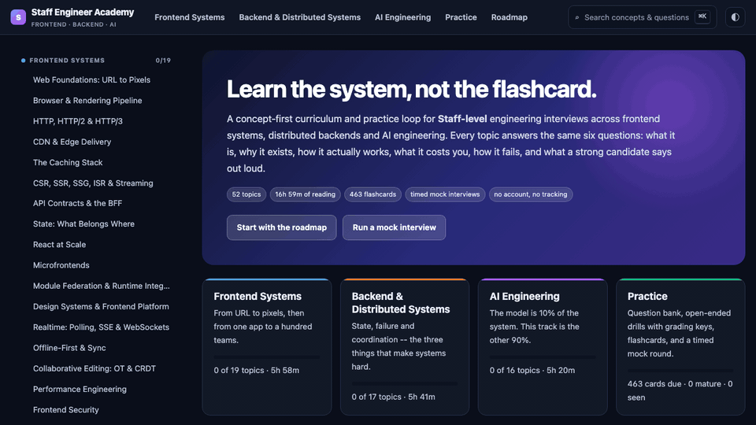

# Staff Engineer Academy

[](https://deepeshk1204.github.io/staff-engineer-academy/)
[](LICENSE)

**[Open the academy](https://deepeshk1204.github.io/staff-engineer-academy/)** · Frontend systems · Distributed backends · AI engineering

A static, zero-build study platform for **Staff-level** interviews and upskilling. Not a link dump: every topic is a concept, a failure table, a Staff-level spoken answer, a drill with a grading key, and flashcards. Then you sit a timed mock.

No accounts. No tracking. Progress lives in your browser.

[](https://deepeshk1204.github.io/staff-engineer-academy/)

| | |
|---|---|
| **52 topics** | 19 frontend · 17 backend · 16 AI · [markdown export](docs/README.md) |
| **Practice** | [Staff 66](docs/practice/STAFF-66.md) · 101 drills · [463 Anki cards](docs/practice/anki.tsv) |
| **Simulate** | 45-minute, 6-phase mock · 16-line rubric · copyable scorecard |
| **Run** | Pages above, or `python3 -m http.server 8080` |

## Why this exists

[system-design-primer](https://github.com/donnemartin/system-design-primer) taught a generation the vocabulary. This is the next loop: **Staff-shaped answers, three tracks including AI systems, and a practice engine** that markdown alone cannot run.

Reading without recall does not move interview performance. The loop here is: read once → answer a drill out loud → get tested a week later when you have forgotten it → sit a clocked mock → study the rubric dimensions you keep missing.

## 12-week Staff loop

Check these off in GitHub or in the app. Order is teaching order, not difficulty vanity.

**Weeks 1–2 — Frontend foundations**
- [ ] [Web foundations](https://deepeshk1204.github.io/staff-engineer-academy/#/topic/frontend/web-foundations)
- [ ] [Browser rendering](https://deepeshk1204.github.io/staff-engineer-academy/#/topic/frontend/browser-rendering)
- [ ] [HTTP/2 & HTTP/3](https://deepeshk1204.github.io/staff-engineer-academy/#/topic/frontend/http-and-networking)
- [ ] [CDN & edge](https://deepeshk1204.github.io/staff-engineer-academy/#/topic/frontend/cdn-and-edge)
- [ ] [Caching stack](https://deepeshk1204.github.io/staff-engineer-academy/#/topic/frontend/caching-layers)
- [ ] [Rendering strategies](https://deepeshk1204.github.io/staff-engineer-academy/#/topic/frontend/rendering-strategies)
- [ ] Drill each topic out loud. 10 minutes of cards a day.

**Weeks 3–4 — Frontend at Staff**
- [ ] BFF, state, React at scale, microfrontends (when to say no), module federation, design systems
- [ ] Realtime, offline sync, CRDTs, performance, security, observability, rollout
- [ ] Mock: [collaborative editor](https://deepeshk1204.github.io/staff-engineer-academy/#/practice/mock/collaborative-document-editor) or [design-system platform](https://deepeshk1204.github.io/staff-engineer-academy/#/practice/mock/design-system-platform-40-teams)

**Weeks 5–7 — Backend core**
- [ ] Request lifecycle → APIs → indexes → isolation → modelling → Redis → queues → capacity → resilience
- [ ] Mock: [rate limiter](https://deepeshk1204.github.io/staff-engineer-academy/#/practice/mock/distributed-rate-limiter), then [message queue](https://deepeshk1204.github.io/staff-engineer-academy/#/practice/mock/message-queue)

**Weeks 8–9 — Distributed Staff**
- [ ] Sharding, replication, consensus, sagas, tenancy, SLOs, identity, Kubernetes deploys
- [ ] Mock: [payments ledger](https://deepeshk1204.github.io/staff-engineer-academy/#/practice/mock/payment-system-with-ledger) or [multi-region](https://deepeshk1204.github.io/staff-engineer-academy/#/practice/mock/multi-region-active-active)

**Weeks 10–11 — AI engineering**
- [ ] Tokens → RAG → retrieval → context → tools → agents → evals → serving → cost → security → platform capstone
- [ ] Mock: [permissioned RAG](https://deepeshk1204.github.io/staff-engineer-academy/#/practice/mock/enterprise-rag-permissioned-docs) or [inference platform](https://deepeshk1204.github.io/staff-engineer-academy/#/practice/mock/llm-inference-serving-platform)

**Week 12 — Diagnose**
- [ ] Three timed mocks (one per track). Export the scorecard. The missed rubric lines are the study list, not another topic.

Spoken-answer cheatsheets: [frontend](docs/cheatsheets/frontend.md) · [backend](docs/cheatsheets/backend.md) · [AI](docs/cheatsheets/ai.md)

## Staff 66

Full list with live mock links: **[docs/practice/STAFF-66.md](docs/practice/STAFF-66.md)** (20 frontend, 26 backend, 20 AI).

Anki: import [`docs/practice/anki.tsv`](docs/practice/anki.tsv) (File → Import). The in-app deck uses SM-2; Anki is for people who already live there.

## Curriculum

GitHub-readable copies of every topic live under [`docs/`](docs/README.md). The interactive versions:

### Frontend systems

1. [Web Foundations](https://deepeshk1204.github.io/staff-engineer-academy/#/topic/frontend/web-foundations)
2. [Browser & Rendering Pipeline](https://deepeshk1204.github.io/staff-engineer-academy/#/topic/frontend/browser-rendering)
3. [HTTP, HTTP/2 & HTTP/3](https://deepeshk1204.github.io/staff-engineer-academy/#/topic/frontend/http-and-networking)
4. [CDN & Edge Delivery](https://deepeshk1204.github.io/staff-engineer-academy/#/topic/frontend/cdn-and-edge)
5. [The Caching Stack](https://deepeshk1204.github.io/staff-engineer-academy/#/topic/frontend/caching-layers)
6. [CSR, SSR, SSG, ISR & Streaming](https://deepeshk1204.github.io/staff-engineer-academy/#/topic/frontend/rendering-strategies)
7. [API Contracts & the BFF](https://deepeshk1204.github.io/staff-engineer-academy/#/topic/frontend/api-and-bff)
8. [State: What Belongs Where](https://deepeshk1204.github.io/staff-engineer-academy/#/topic/frontend/state-management)
9. [React at Scale](https://deepeshk1204.github.io/staff-engineer-academy/#/topic/frontend/react-at-scale)
10. [Microfrontends](https://deepeshk1204.github.io/staff-engineer-academy/#/topic/frontend/microfrontends) — when to say no
11. [Module Federation](https://deepeshk1204.github.io/staff-engineer-academy/#/topic/frontend/module-federation)
12. [Design Systems & Frontend Platform](https://deepeshk1204.github.io/staff-engineer-academy/#/topic/frontend/design-systems)
13. [Realtime: Polling, SSE & WebSockets](https://deepeshk1204.github.io/staff-engineer-academy/#/topic/frontend/realtime-frontend)
14. [Offline-First & Sync](https://deepeshk1204.github.io/staff-engineer-academy/#/topic/frontend/offline-and-sync)
15. [Collaborative Editing: OT & CRDT](https://deepeshk1204.github.io/staff-engineer-academy/#/topic/frontend/collaborative-editing)
16. [Performance Engineering](https://deepeshk1204.github.io/staff-engineer-academy/#/topic/frontend/web-performance)
17. [Frontend Security](https://deepeshk1204.github.io/staff-engineer-academy/#/topic/frontend/frontend-security)
18. [Frontend Observability](https://deepeshk1204.github.io/staff-engineer-academy/#/topic/frontend/frontend-observability)
19. [Deployment, Rollout & Migration](https://deepeshk1204.github.io/staff-engineer-academy/#/topic/frontend/deployment-and-rollout)

### Backend & distributed systems

1. [Anatomy of a Backend Request](https://deepeshk1204.github.io/staff-engineer-academy/#/topic/backend/request-lifecycle)
2. [API Design & Contracts](https://deepeshk1204.github.io/staff-engineer-academy/#/topic/backend/api-design-backend)
3. [Databases, Indexes & Query Plans](https://deepeshk1204.github.io/staff-engineer-academy/#/topic/backend/databases-and-indexes)
4. [Transactions & Isolation Levels](https://deepeshk1204.github.io/staff-engineer-academy/#/topic/backend/transactions-and-isolation)
5. [Data Modelling](https://deepeshk1204.github.io/staff-engineer-academy/#/topic/backend/data-modeling)
6. [Server-Side Caching & Redis](https://deepeshk1204.github.io/staff-engineer-academy/#/topic/backend/server-side-caching)
7. [Sharding & Partitioning](https://deepeshk1204.github.io/staff-engineer-academy/#/topic/backend/sharding-and-partitioning)
8. [Replication & Consistency](https://deepeshk1204.github.io/staff-engineer-academy/#/topic/backend/replication-and-consistency)
9. [Consensus, Leases & Distributed Locks](https://deepeshk1204.github.io/staff-engineer-academy/#/topic/backend/consensus-and-coordination)
10. [Queues & Event Streaming](https://deepeshk1204.github.io/staff-engineer-academy/#/topic/backend/queues-and-streaming)
11. [Event-Driven Architecture, Sagas & CQRS](https://deepeshk1204.github.io/staff-engineer-academy/#/topic/backend/event-driven-architecture)
12. [Scalability & Capacity Planning](https://deepeshk1204.github.io/staff-engineer-academy/#/topic/backend/scalability-and-capacity)
13. [Resilience: Timeouts, Retries & Backpressure](https://deepeshk1204.github.io/staff-engineer-academy/#/topic/backend/resilience-patterns)
14. [Rate Limiting & Multi-Tenancy](https://deepeshk1204.github.io/staff-engineer-academy/#/topic/backend/rate-limiting-and-tenancy)
15. [Observability, SLOs & Error Budgets](https://deepeshk1204.github.io/staff-engineer-academy/#/topic/backend/backend-observability)
16. [Backend Security & Identity](https://deepeshk1204.github.io/staff-engineer-academy/#/topic/backend/backend-security)
17. [Containers, Kubernetes & Safe Deploys](https://deepeshk1204.github.io/staff-engineer-academy/#/topic/backend/infra-and-deployment)

### AI engineering

1. [LLM Fundamentals](https://deepeshk1204.github.io/staff-engineer-academy/#/topic/ai/llm-fundamentals)
2. [Prompting & Structured Output](https://deepeshk1204.github.io/staff-engineer-academy/#/topic/ai/prompting-and-structured-output)
3. [Embeddings & Vector Search](https://deepeshk1204.github.io/staff-engineer-academy/#/topic/ai/embeddings-and-vector-search)
4. [RAG: The Reference Architecture](https://deepeshk1204.github.io/staff-engineer-academy/#/topic/ai/rag-architecture)
5. [Advanced Retrieval](https://deepeshk1204.github.io/staff-engineer-academy/#/topic/ai/advanced-retrieval)
6. [Context Engineering](https://deepeshk1204.github.io/staff-engineer-academy/#/topic/ai/context-engineering)
7. [Tool Calling & Typed Actions](https://deepeshk1204.github.io/staff-engineer-academy/#/topic/ai/tool-calling)
8. [Agent Architecture](https://deepeshk1204.github.io/staff-engineer-academy/#/topic/ai/agent-architecture)
9. [Evaluation & Quality Regression](https://deepeshk1204.github.io/staff-engineer-academy/#/topic/ai/evaluation)
10. [AI Observability & Tracing](https://deepeshk1204.github.io/staff-engineer-academy/#/topic/ai/ai-observability)
11. [Inference Serving](https://deepeshk1204.github.io/staff-engineer-academy/#/topic/ai/inference-serving)
12. [Model Routing, Caching & Cost](https://deepeshk1204.github.io/staff-engineer-academy/#/topic/ai/model-routing-and-cost)
13. [Fine-Tuning, LoRA & Distillation](https://deepeshk1204.github.io/staff-engineer-academy/#/topic/ai/finetuning-and-adaptation)
14. [AI Security & Guardrails](https://deepeshk1204.github.io/staff-engineer-academy/#/topic/ai/ai-security)
15. [AI Product & UX](https://deepeshk1204.github.io/staff-engineer-academy/#/topic/ai/ai-product-ux)
16. [Capstone: An AI Platform](https://deepeshk1204.github.io/staff-engineer-academy/#/topic/ai/ai-platform-architecture)

Keyboard: `⌘K` search · `j`/`k` next/previous topic · `space` reveal card · `1`–`4` grade · `?` help

## Run locally

ES modules are blocked on `file://`:

```bash
python3 -m http.server 8080    # http://localhost:8080
```

```bash
node tools/validate.mjs        # schema + mermaid + bank refs
npm run export                 # refresh docs/ and Anki TSV
```

## Accuracy and contributing

Figures are order-of-magnitude guides for interview reasoning, not benchmarks. **Corrections beat new topics.** See [CONTRIBUTING.md](CONTRIBUTING.md), [ERRATA.md](ERRATA.md), and [CITATIONS.md](CITATIONS.md).

Progress is stored in `localStorage` (`sea.v2`). The only optional network request is Mermaid from jsDelivr when a diagram scrolls into view; if that fails, the diagram source is shown and nothing else breaks.

## License

MIT.
