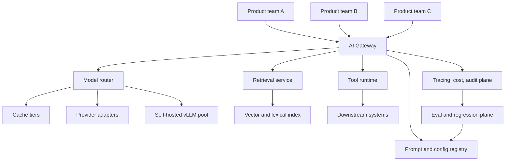

# Capstone: An AI Platform

> Gateway, router, retrieval, tool runtime, evals and governance for many teams and tenants.

- Track: **AI Engineering** · Level: **staff** · ~24 min
- [Open in the academy](https://deepeshk1204.github.io/staff-engineer-academy/#/topic/ai/ai-platform-architecture)

An AI platform is the shared layer that sits between your product teams and the models
they call. It handles the concerns every team would otherwise solve badly and differently:
authentication, tenant identity, quotas, routing, retries, caching, redaction, tracing, cost
attribution, evaluation and audit.

The reason it exists is not elegance. It is that those concerns are **cross-cutting and
correctness-critical**, and a company with eight teams shipping AI features independently ends up
with eight different answers to "which model are we allowed to send this customer's data to" --
seven of which nobody has reviewed.

This topic pulls the whole track together. Treat it as a design review: we will build the
platform component by component, decide build versus buy for each, stage a realistic migration
from three teams calling an API directly, settle who owns what, and then be honest about how the
platform itself fails.

## Why it exists

Watch how this happens, because it is the same story everywhere.

Team A ships a support assistant in three weeks by calling a provider SDK directly. It works and
everyone is delighted. Team B ships a document summariser, copying Team A's code, including their
retry logic and their bug where a 429 is retried immediately. Team C ships a code assistant with
a different provider because someone had credits. Now:

Finance receives one invoice with no breakdown, so nobody can tell which feature or which
customer generated the spend. Security discovers three different data-handling postures and one
team sending customer content to a provider that is not on the approved list. A model deprecation
notice arrives and nobody knows which code paths reference it. A provider incident takes down two
features because neither has a fallback. Legal asks whether the EU tenants' data stayed in the
EU and there is no way to answer. The API key is in three places, one of which is a frontend
environment variable.

None of those are AI problems. They are the ordinary consequences of a cross-cutting concern with
no shared implementation -- exactly the argument that produced service meshes, API gateways and
identity providers. The difference is that here the marginal cost per request is large and the
security failure modes are novel, so the pain arrives faster.

The platform's job is to make the safe, observable, attributable path also the *easiest* path.
If using the platform is harder than calling the provider directly, teams will go around it, and
a gateway that 60% of traffic bypasses provides 0% of the governance.

## The architecture



*One ingress for policy, then specialised services behind it. The eval plane feeds the registry, which is what makes staged rollout possible.*

Everything a product team sends goes through one ingress, which is the only way to
guarantee that policy is applied uniformly. Behind it, the specialised services exist because
they have genuinely different scaling and ownership characteristics. Let us take them in order.

## The gateway, and why it is non-negotiable

The gateway is the only component that is not optional. It is where every control that
must never be forgotten lives, and "must never be forgotten" is the whole argument: a control
implemented in each application is a control that the next team to ship will omit.

What it does, in request order. **Authentication and tenant resolution** -- establish the calling
service, the end user and the tenant, because every downstream decision depends on them.
**Policy evaluation** -- is this tenant allowed to use this model, is their data allowed in this
region, does this feature have approval for this data class. **Quota and rate limiting** against
a shared atomic counter, per tenant and per user, with the staged degradation from **Model
Routing, Caching & Cost Control** rather than a bare 429. **PII detection and redaction** before
anything leaves your boundary, with reversible tokenisation where the model needs to reference an
entity. **Routing** to the model or pool that policy and cost allow. **Retries and circuit
breaking** with jittered backoff and `Retry-After` respected, implemented once and correctly.
**Response-side controls** -- schema validation, stripping markdown images and external links,
output guardrails. **Telemetry emission** -- the span attributes from **AI Observability &
Tracing**, with tenant, feature, prompt version and resolved model always present. And **audit
logging** of the fact of the call, retained longer than the payload.

Two design decisions matter more than the feature list.

**Make it the OpenAI-compatible shape.** Not because that API is beautiful, but because every
SDK, framework, eval tool and local development flow already speaks it. Adoption cost drops to
changing a base URL and a key, which is the difference between a platform teams use and a
platform teams route around.

**Keep it thin and stateless on the request path.** Every millisecond and every failure mode you
add lands on every AI feature in the company. Policy decisions should be evaluated from cached
configuration, not a synchronous database read. Anything that can be asynchronous -- telemetry
export, cost aggregation, eval sampling -- must be asynchronous, and must fail open so a
telemetry outage cannot take down inference.

**Gateway policy -- declarative, versioned, reviewed**

```yaml
# Policy is data in git, not code in the gateway. Reviewable by security,
# diffable, and the same file drives staging and production.
tenants:
  acme-corp:
    tier: enterprise
    data_residency: eu                # hard constraint; overrides all cost routing
    allowed_providers: [azure-openai-eu, self-hosted-eu]
    monthly_budget_usd: 12000
    degradation:
      at_0.85: { force_tier: small, max_retrieval_k: 4 }
      at_1.00: { cache_only: true, defer_batch: true }
    pii_policy: redact_before_egress   # reversible tokenisation, mapped back after
    payload_capture: metrics_only      # DPA forbids payload retention

features:
  support_assistant:
    owner: team-support
    approved_data_classes: [customer_pii, internal]
    default_route: cascade_small_first
    prompt_id: support_reply
    rollout: { stable: v17, canary: v18, canary_pct: 5 }
    tools: [search_tickets, get_account]      # read-only; no send, no write
    max_tokens_per_request: 8000              # cost-exhaustion ceiling
    eval_gate: support_assistant_v3           # must pass before a prompt promotes

  code_assistant:
    owner: team-devex
    approved_data_classes: [source_code]
    default_route: code_tuned
    tools: []
    egress: none                              # no trifecta third leg, by policy
```

## Router, provider abstraction and caching tiers

The **router** turns a logical request -- "the support assistant needs a reply" -- into a
concrete call. It applies the routing logic from earlier in the track: task class first, then
difficulty or cascade tier, with latency class and residency as hard constraints that override
cost. It owns the provider health state, the circuit breakers and the failover table.

The critical discipline is that routing is **configuration, not code**. When a model is
deprecated you change a config value and roll it out through the same staged mechanism as a
prompt change, gated by evals. If model identifiers are hardcoded in eight repositories, a
deprecation becomes an eight-team coordination project, which is precisely the failure the
platform exists to prevent. So the gateway rejects requests that name a raw provider model and
accepts only logical names the registry resolves.

The **provider abstraction** carries the honest caveat from **Model Routing, Caching & Cost
Control**: the API surface is portable and the prompts are not. So the platform's job is not to
pretend models are interchangeable. It is to make the *non-portability explicit* -- the registry
stores a tuned prompt variant per model for the paths intended to fail over, each gated by the
same eval suite, and failover to a model without a validated variant is a declared degradation
that shows up in telemetry and in the UI rather than a silent quality drop.

**Caching tiers** belong in the platform because the risky one must not be left to each team.
Prefix caching is free and enabled everywhere. Exact-match response caching is keyed on the full
prompt hash plus tenant, model, prompt version and retrieved document IDs. Semantic caching is
**opt-in per feature, scoped to tenant and permissions, restricted to a whitelist of stable
intents, with a short TTL and every hit logged with the original and matched query.** That last
sentence is a platform-level control precisely because an individual team under deadline pressure
will implement a global semantic cache and create a cross-tenant leak.

**Build versus buy, component by component**

| Component | Default | Reasoning |
| --- | --- | --- |
| **Gateway** | **Build thin** (or wrap LiteLLM / an existing API gateway) | It encodes *your* tenancy, policy and residency model. That logic is yours and changes often. Buy the proxy mechanics, own the policy layer. |
| **Provider adapters** | **Buy** -- LiteLLM or equivalent | Pure translation work that changes whenever a provider ships an API. Zero differentiation in maintaining it yourself. |
| **Prompt / config registry** | **Build small** | It is a versioned key-value store with staged rollout and an eval gate. A day or two of work, tightly coupled to your deploy and approval process. |
| **Tracing and spans** | **Buy** -- OpenTelemetry plus a backend (Langfuse, Phoenix, Datadog) | Solved problem with a standard. Emit conventional GenAI attributes and stay portable. |
| **Cost attribution** | **Build** | Depends entirely on your tenancy model, pricing and chargeback rules. Vendors cannot know your tenant hierarchy. |
| **Eval harness** | **Buy the runner, build the datasets** | Runners are commoditised (Braintrust, Langfuse, Ragas). The datasets *are* the value and are unavoidably yours. |
| **Retrieval service** | **Buy the index, build the service** | Use pgvector, Elasticsearch or a managed vector DB. The ACL model, chunking and hybrid fusion are yours. |
| **Tool runtime / sandbox** | **Buy the sandbox, build authorisation** | Container or microVM isolation is infrastructure. Identity propagation and per-call policy are yours. |
| **Guardrail classifiers** | **Buy** | Commodity models, and remember they are mitigation and telemetry, not prevention. |
| **Self-hosted inference** | **Buy the engine** -- vLLM or TensorRT-LLM | Never write your own serving engine. Capacity planning and tuning are the work. |

## Shared retrieval with tenant isolation

Retrieval is the component teams most often want to build themselves and most often get
wrong in the same two ways: they treat permissions as a filtering nicety, and they discover the
hard problems -- chunking strategy, hybrid fusion, permission propagation, re-indexing without
downtime -- only after the demo has shipped.

The platform provides retrieval as a service with **ACL-aware search as a security boundary**,
which means document permissions stored alongside the vectors and applied as a filter *inside*
the query, never as a post-filter. Post-filtering means unauthorised content already transited
the process and probably the logs, and it makes effective k unpredictable.

The isolation decision is the architectural one. **Namespace-per-tenant** in a shared index is
cheap and operationally simple, and it depends on a filter being correct on every single query --
one missing predicate is a cross-tenant leak. **Index-per-tenant** gives a structural boundary
that survives a code bug, at the cost of per-index overhead that becomes painful in the hundreds
and unworkable in the thousands. **Separate infrastructure** is for the handful of tenants whose
contract demands it.

The defensible answer is usually tiered: namespaces for the long tail with the filter enforced in
a single shared query-builder that applications cannot bypass, dedicated indexes for large
enterprise tenants, and separate infrastructure where residency or contract requires it. Whatever
you choose, add a continuous verification job that samples retrieved document IDs from the audit
log and confirms each one was within the caller's entitlements. That is how you find the missing
filter before a customer does.

Two operational requirements teams forget. **Permission changes must propagate into the index**;
a stale ACL in a vector store is an access-control bug that no prompt care will catch, and
revocation latency is a number you should be able to state. And **re-indexing must be
non-disruptive**: build the new index alongside, gate the switch on recall@k from the labelled
retrieval set, and keep the old one until the new one has served traffic. An embedding-model
change is the most expensive change in the whole platform and deserves the heaviest gate.

## Tool runtime and the prompt registry

The **tool runtime** is where the security model from **AI Security & Guardrails**
becomes infrastructure. It holds the tool catalogue with schemas and policies, performs
per-call authorisation against the **end user's** short-lived scoped credential rather than a
service account, enforces confirmation gates on irreversible actions in code, executes anything
sandboxed with a default-deny egress allowlist, and writes the audit record. Centralising it means
a new feature inherits a correct authorisation model instead of reinventing one, and it gives you
one place to answer "which tools can reach production data, and who approved that?"

The **prompt and config registry** is smaller than it sounds and more valuable than it sounds. It
stores prompt templates, model choices, routing rules and feature flags as versioned artefacts
addressed by ID and version. Three properties earn their keep.

**Versioning with immutability**: `support_reply@v17` always means the same bytes, so a trace
recording v17 can be replayed exactly and a regression can be attributed to a specific change.
**Staged rollout**: stable and canary versions with a traffic percentage, so a prompt change
reaches 5% of traffic, gets compared on implicit signals, and promotes or reverts -- a prompt
change is a production change and deserves the same rollout machinery as code. **Eval gating**:
promotion from canary to stable requires passing the feature's eval suite, which is what connects
the eval plane to the deployment path and makes "we measure our prompts" true rather than
aspirational.

A deliberate anti-feature: do not let prompts be edited in a UI by non-engineers without review.
The appeal is obvious and the outcome is an unreviewed production change to a
correctness-critical artefact. Draft in a UI if you like; ship through a pull request.

## Cost attribution and chargeback

Because the gateway sees every call, it can compute cost per request at write time and
attribute it along every axis: tenant, feature, team, prompt version, model, route reason, cache
status, and whether the spend was a retry or an abandoned run. That turns the monthly invoice
from a mystery into a report.

What that unlocks is worth being explicit about. Product teams get a cost per active user per
feature, which is the number that determines whether a feature is viable. Finance gets
attribution to cost centres without a modelling exercise. Sales gets defensible per-tenant unit
economics for pricing. And platform gets the data to find the pathological tenant -- the one
pasting 200-page documents, or the one whose integration retries in a loop -- before it shows up
as a budget overrun.

Chargeback, meaning actually billing internal teams for their consumption, is a stronger version
and it changes behaviour fast. Costs that a team can see and is accountable for get optimised;
costs on a central line item do not. Two cautions. First, do it only once attribution is
trustworthy, because a disputed chargeback destroys trust in the platform. Second, showback --
reporting cost without transferring budget -- captures most of the behavioural benefit with far
less political friction, and is the right place to start.

The gateway is also where cost-exhaustion defence lives, and that is a security control as much
as a financial one. A per-request token ceiling, a per-user rate limit and a per-tenant budget
together bound what an attacker with a script can spend. The cost of an AI feature is
attacker-controllable in a way an ordinary endpoint's is not.

**Platform figures worth planning against**

- **5-15 ms** — Acceptable gateway overhead budget (Trivial next to a model call; keep policy reads cached)
- **99.95%+** — Gateway availability target (It is in the path of every AI feature you own)
- **2-4** — Engineers to run a platform like this (Beyond ~5 consuming teams it pays for itself)
- **3-6 months** — Realistic time to stage the migration (Gateway first, retrieval last)
- **100%** — Traffic that must go through the gateway (A bypassed gateway provides zero governance)
- **1-5%** — Production sampling into the eval plane (Plus all errors and negative-feedback traces)
- **<1 day** — Target for a model-deprecation config change (The test of whether routing is really configuration)

## Governance that is not a bottleneck

Every organisation past a certain size grows an AI review process, and most of them
become the thing teams route around. The design goal is to make the review proportional to risk
and to automate the parts that can be automated.

**Model approval** is a catalogue, not a meeting. Security and legal review each model and
provider once, per data class and per region, and the result is a row in the registry that the
gateway enforces. A team using an approved model for an approved data class needs no review at
all -- the policy file already says yes. Reviews happen when someone wants something not in the
catalogue.

**Risk tiering** is what keeps the process alive. Most AI features are low risk: internal,
read-only, human-in-the-loop, no PII. Those should self-serve against the platform with automated
checks and no human gate. Reserve real review for the features that earn it -- customer-facing
autonomous action, regulated workflows, new data classes, new providers, anything with write
access to production systems. A single process applied to everything means either the risky
things get waved through or the harmless things get blocked; usually both.

**Automate the checks.** Prompts must come from the registry. Egress-capable tools require an
approval record. PII policy must be declared per feature. Eval suites must exist and pass before
promotion. Data-class declarations must match the routing policy. Every one of those is a CI check
or a gateway rejection, not a conversation -- which means the governance scales with traffic
rather than with reviewer headcount.

**Red-teaming** needs to be a recurring exercise with a growing corpus, not a launch checkbox.
Maintain an adversarial suite -- injection payloads, exfiltration attempts, jailbreaks, ACL-bypass
attempts -- run it in CI against every feature, and add every new finding permanently. Run a
periodic human exercise against the highest-risk features, because humans find the categories the
corpus does not yet contain.

**Data residency and retention** are policy-file entries the gateway enforces: which providers and
regions per tenant, what payload capture is permitted, how long anything is retained. Enforcing
them in the gateway rather than per application is the difference between a compliance claim you
can evidence and one you hope is true.

## The migration: three teams to a platform

You do not get to build this greenfield. You get three teams already in production with
direct provider calls, and a mandate that arrived after someone asked an uncomfortable question.
The order below is chosen so that each stage delivers value on its own and none requires a
flag day.

The governing principle: **the first version of the platform must be strictly easier to adopt
than the status quo.** If migration means rewriting prompts or losing local development ergonomics,
it will not happen. So stage one is a proxy that changes a base URL and gives teams something
they want.

**Migration stages**

1. **Stage 0 -- inventory (1-2 weeks).** Find every place a model is called: repos, notebooks, cron jobs, that one Lambda. Record model, provider, key, data class, traffic and owner. You will find at least one thing nobody remembered. Produce the list and get agreement that it is complete.
2. **Stage 1 -- transparent gateway (3-4 weeks).** Ship an OpenAI-compatible proxy that does auth, tenant tagging, telemetry, cost attribution and retries, and nothing else opinionated. Migration is a base URL and a key. Sell it on what teams get for free: a cost dashboard, traces, correct retry behaviour, and no API keys in their code. Aim for 100% of traffic before adding a single restriction.
3. **Stage 2 -- quotas, policy and redaction (3-4 weeks).** Now that you see everything, add per-tenant budgets with staged degradation, provider and region policy per data class, and PII redaction before egress. This is where the compliance question gets a real answer. Roll out in report-only mode first, so you find out what you would have blocked before you block it.
4. **Stage 3 -- prompt and config registry (2-3 weeks).** Move prompts and model identifiers out of application code into versioned registry entries with staged rollout. The immediate payoff that makes teams want it: a prompt change no longer needs a deploy, and it can be canaried and reverted in minutes.
5. **Stage 4 -- eval plane (4-6 weeks).** Sample production traffic into datasets, wire the eval runner into CI, and gate registry promotion on passing suites. Start with the one team that has the most quality pain; make their life visibly better and the others will ask to join. Do not mandate this early -- eval suites built under duress are worthless.
6. **Stage 5 -- router and caching (3-4 weeks).** With evals in place you can safely introduce cascades, prefix-cache-friendly prompt assembly and exact-match caching, because you can now *prove* a routing change did not regress quality. Doing this before stage 4 is how you ship a silent quality regression.
7. **Stage 6 -- shared retrieval and tool runtime (ongoing).** Last, because it is the most invasive and the most tenant-sensitive. Migrate one team’s corpus at a time, dual-run the old and new retrieval paths, and compare recall@k on a labelled set before switching. Bring tools under the runtime as each team needs a new one, rather than rewriting all of them at once.

> **Why this order and not the obvious one**  
> The instinct is to build the impressive parts first -- the router, the shared retrieval
> service, the eval platform. That order fails, for a consistent reason: without the gateway you
> have no visibility, so you cannot prove any of it helped, and without proof you cannot get the
> third team to migrate. Visibility first, then control, then optimisation. It is the same reason
> you instrument before you tune.
> 
> The secondary reason is political. Stages 1 and 3 give teams something they *want* -- free
> dashboards, prompt changes without a deploy. That buys the credit you will spend in stage 2 when
> you start saying no.

## Who owns what

The org question determines whether the platform survives, and the failure mode is
predictable: the platform team becomes the bottleneck for every AI feature in the company, and
then becomes the team everyone resents.

The split that works is the standard platform-engineering one, applied honestly. **The platform
team owns the mechanism and the defaults**: the gateway, router, registry, tracing, cost
attribution, retrieval and tool infrastructure, the eval *runner*, and the golden path. They own
availability and latency of the platform, and they own making the safe path the easy path.

**Product teams own their features end to end**: prompts, their eval datasets and thresholds,
their quality and their cost. This is the part organisations get wrong most often. Prompts and
eval sets are product decisions requiring domain knowledge -- a support team knows what a good
support reply is and the platform team does not. Centralising prompt authorship creates a queue
and produces worse prompts.

**Security and legal own the catalogue**: which models, providers, regions and data classes are
approved, and the risk tiering. They own policy, not per-feature review, which is what lets them
scale.

The healthy test is whether a product team can ship a new AI feature, in a low-risk tier, without
talking to the platform team at all. If yes, the platform is working. If every feature needs a
platform ticket, you have built a bottleneck with a dashboard.

Two practices keep it honest. Publish platform SLOs and report against them, because a platform
that degrades product latency loses its mandate regardless of its governance value. And keep an
escape hatch: a documented, reviewed process for a team with a genuine need the platform cannot
meet. Without one, they will build a shadow path and you will not know about it.

**Centralising AI infrastructure**

What you gain:
- Policy, residency and redaction are enforced once and cannot be forgotten by the next team.
- Cost is attributable per tenant, feature and team, which makes pricing and quotas possible.
- A model deprecation becomes a config change rather than an eight-team project.
- Every feature inherits tracing, retries, caching and a correct authorisation model for free.
- Provider failover, prefix caching and cascades are implemented once and correctly.
- Governance scales through automated checks instead of reviewer headcount.

What it costs you:
- The gateway is a single point of failure in the path of every AI feature.
- Platform latency is added to every request and is highly visible.
- The platform team can become a bottleneck, and the incentive to bypass it is real.
- Shared infrastructure creates noisy-neighbour contention across tenants and teams.
- Abstractions leak -- a team will eventually need a provider feature the platform does not expose.
- Version skew between platform and consumers becomes an ongoing coordination cost.
- It only pays off past roughly five consuming teams; before that it is overhead.

**How the platform itself fails**

| Failure mode | What the user sees | Mitigation |
| --- | --- | --- |
| Gateway as single point of failure | Every AI feature in the company is down simultaneously. | Stateless multi-region deployment, policy evaluated from cached config with a stale-if-error path, asynchronous telemetry that fails open, and a documented direct-provider break-glass with audit. |
| Teams bypassing the gateway | Governance coverage silently drops; the compliance claim becomes false while the dashboard still looks complete. | Provider keys held only by the platform and rotated, egress restricted at the network layer to platform paths, and -- most importantly -- make the platform the easiest path. |
| Noisy neighbour | One tenant’s batch job consumes the shared rate-limit pool and every other tenant sees latency and 429s. | Per-tenant quotas and concurrency limits, a separate queue class for batch work, fair-share scheduling, and per-tenant capacity reservation for enterprise tiers. |
| Version skew | A gateway change breaks one team’s integration mid-incident; nobody can say which version any consumer is on. | Versioned platform API with a deprecation window, contract tests run against consumers in CI, and consumer version recorded on every span. |
| Platform team as bottleneck | AI delivery across the company slows to the platform team’s throughput; teams start building shadow paths. | Self-serve for low-risk tiers, product teams own prompts and eval sets, automated governance checks instead of human review, and a documented escape hatch. |
| Config change rolled out globally | A routing or prompt change hits 100% of every feature at once and degrades several products. | Treat config as code: canary percentage, eval gate before promotion, instant revert, and a config change log visible in the same dashboard as deploys. |
| Cost attribution wrong or disputed | Chargeback is contested, teams stop trusting the platform, and the numbers get ignored. | Compute cost at write time on the span with the price-table version recorded; reconcile monthly against provider invoices; start with showback before chargeback. |
| Shared semantic cache without tenant scoping | Cross-tenant answer leakage -- a security incident originating in a cost optimisation. | Tenant and permission scope mandatory in every cache key, semantic caching opt-in per feature and restricted to whitelisted intents, every hit logged for audit. |
| Retrieval ACL filter omitted on one code path | Cross-tenant document exposure through a single missing predicate. | A single shared query-builder applications cannot bypass, filters applied inside the query, and a continuous job verifying retrieved doc IDs against caller entitlements. |
| Eval plane treated as optional | Routing, prompt and model changes ship unmeasured; quality drifts with nobody accountable. | Eval gate wired into registry promotion, so the only way to ship a prompt or model change is through a passing suite. |

> **Staff-level angle**  
> This is the question that decides a Staff or Senior Staff loop, because it is
> simultaneously technical, organisational and commercial. The failure mode is drawing every box on
> the diagram and never saying what you would do first or who owns it.
> 
> - "The reason a gateway is non-negotiable is not elegance. It is that auth, tenancy, quota,
>   residency, redaction and audit are cross-cutting and correctness-critical, and a control
>   implemented per application is a control the next team will forget. I want one place where the
>   answer to 'can this customer's data go to this provider' is enforced."
> - "My first version is a transparent OpenAI-compatible proxy that does auth, tenant tagging,
>   telemetry, cost attribution and retries -- and nothing opinionated. Migration is a base URL and
>   a key. I want 100% of traffic through it before I add a single restriction, because a gateway
>   that 60% of traffic bypasses provides 0% of the governance."
> - "Order matters: visibility, then control, then optimisation. If I build the router and the
>   shared retrieval service first I cannot prove anything helped, and I will not get the third
>   team to migrate. Stages one and three also give teams something they *want* -- free dashboards,
>   prompt changes without a deploy -- which buys the credit I spend in stage two saying no."
> - "Routing is configuration, not code. The test is whether a model deprecation is a one-day
>   config change or an eight-team coordination project. So the gateway refuses raw provider model
>   names and accepts only logical names the registry resolves."
> - "I would keep the gateway thin and stateless with a 5-15 ms overhead budget. Policy comes from
>   cached config with a stale-if-error path, telemetry export is asynchronous and fails open, and
>   there is a documented break-glass direct-provider path with audit -- because this thing is in
>   front of every AI feature we own."
> - "Prompts and eval datasets are owned by product teams, not the platform. A support team knows
>   what a good support reply is; I do not. Centralising prompt authorship creates a queue and
>   produces worse prompts. Platform owns the mechanism and the golden path; security and legal own
>   the model-and-data-class catalogue, not per-feature review."
> - "The health test is whether a product team can ship a low-risk AI feature without talking to
>   me. If every feature needs a platform ticket, I have built a bottleneck with a dashboard."
> - "Governance has to be risk-tiered and automated. Internal, read-only, human-in-the-loop, no PII
>   self-serves with CI checks. Real review is reserved for customer-facing autonomous action,
>   regulated workflows and new data classes. A single process applied to everything waves the risky
>   things through and blocks the harmless ones."
> - "Two controls I would insist on centrally because a team under deadline will get them wrong:
>   semantic caching is opt-in, tenant-and-permission-scoped and intent-whitelisted, because a
>   global one is a cross-tenant leak; and retrieval ACL filters go through one shared query-builder
>   applications cannot bypass, with a continuous job verifying retrieved doc IDs against caller
>   entitlements."
> - "I would build the gateway, registry and cost attribution, and buy the provider adapters,
>   tracing backend, eval runner, index and sandbox. The rule: build what encodes our tenancy and
>   policy model, buy what is translation or commodity infrastructure. And never write a serving
>   engine -- use vLLM or TensorRT-LLM."
> - "I would start with showback rather than chargeback. Most of the behavioural benefit, far less
>   political friction, and it gives me time to reconcile attribution against provider invoices
>   before anyone's budget depends on my numbers."
> 
> The signal is sequencing, ownership and honesty about the platform's own failure modes -- gateway
> as SPOF, noisy neighbour, version skew, platform-as-bottleneck -- volunteered rather than extracted.

**Check**

Three teams call model providers directly. You have been asked to build an AI platform. What is your first deliverable?
- A. A shared retrieval service, since all three teams need RAG.
- B. A transparent OpenAI-compatible gateway doing auth, tenant tagging, telemetry, cost attribution and retries -- migration is a base URL change. **(answer)**
- C. A model router with cascades to cut cost immediately.
- D. A governance review process for all AI features.

  You cannot control or optimise what you cannot see, and you cannot prove any later change helped without a baseline. A transparent proxy is also the only version teams will adopt voluntarily, because it costs them a base URL and gives them dashboards, traces and correct retry behaviour for free. Get to 100% coverage before adding restrictions -- a gateway that 60% of traffic bypasses provides none of the governance you built it for. Retrieval is the most invasive component and belongs last; routing before evals ships silent quality regressions; and governance without visibility is unenforceable.

Which components should you build rather than buy?
- A. Provider adapters and the tracing backend, since they are core to the platform.
- B. The gateway policy layer, the prompt/config registry, cost attribution, and your eval datasets. **(answer)**
- C. Everything -- vendor dependencies are a risk in AI infrastructure.
- D. Nothing -- assemble entirely from off-the-shelf components.

  Build what encodes knowledge only you have: your tenancy and residency policy, your rollout and approval process, your pricing and chargeback rules, and your evaluation datasets -- which are the actual asset and are unavoidably yours. Buy what is translation or commodity: provider adapters (LiteLLM), tracing (OpenTelemetry plus a backend), eval runners, indexes, sandboxes, and above all the serving engine. Writing your own provider adapters is maintenance with zero differentiation; writing your own inference engine is a category error.

Your gateway now handles all AI traffic for twelve teams. What is the most important reliability property to design for?
- A. Horizontal scalability to handle peak token throughput.
- B. That the gateway is stateless and multi-region, policy is evaluated from cached config, and telemetry export fails open -- plus a documented break-glass path. **(answer)**
- C. Detailed logging of every request payload for debugging.
- D. A sophisticated caching layer to reduce provider calls.

  The gateway is now a single point of failure in front of every AI feature in the company, so the design must ensure nothing non-essential can take it down. Cached policy with a stale-if-error path means a config-store outage does not stop inference; asynchronous fail-open telemetry means an observability outage does not either; stateless multi-region means you can lose a region. The break-glass direct-provider path -- documented, audited, rarely used -- is what stops a gateway incident becoming a company-wide AI outage. Full payload logging is actively harmful here: latency on the hot path plus a PII liability.

A product team complains that shipping any AI feature now requires a platform team ticket and takes three weeks. What does this indicate?
- A. The team needs better training on the platform.
- B. The platform has become a bottleneck; low-risk features must self-serve and product teams must own their own prompts and eval sets. **(answer)**
- C. This is the expected cost of governance.
- D. The platform needs more engineers.

  A platform that gates every feature has traded one problem for a worse one, and the predictable outcome is shadow paths you cannot see -- losing the governance that justified the platform. The fix is structural, not staffing: risk-tier the process so internal, read-only, human-in-the-loop features self-serve against automated CI checks, and move prompt and eval-dataset ownership to the teams with the domain knowledge. The health test is whether a team can ship a low-risk AI feature without talking to the platform team at all. Adding engineers to a bottleneck designed as a queue just makes a faster queue.

<details><summary>Related topics and how they connect</summary>

This capstone assembles the whole track. The gateway's quota and degradation logic is
**Model Routing, Caching & Cost Control**; its span attributes and cost attribution are **AI
Observability & Tracing**; its policy, identity propagation and cache scoping are **AI Security &
Guardrails**. The eval plane gating registry promotion is **Evaluation & Quality Regression**. The
retrieval service implements **RAG: The Reference Architecture** and **Advanced Retrieval** with
the ACL model as a boundary. The tool runtime is **Tool Calling & Typed Actions** plus the bounded
authority of **Agent Architecture**. The self-hosted pool is **Inference Serving & Performance**,
and multi-adapter serving is **Fine-Tuning, LoRA & Distillation**.

</details>

## Flashcards

- **Why is a gateway non-negotiable at org scale?** — Auth, tenant resolution, quota, residency policy, PII redaction, retries, telemetry and audit are cross-cutting and correctness-critical. A control implemented per application is one the next team will forget -- and a gateway 60% of traffic bypasses provides 0% of the governance.
- **What is the first deliverable of an AI platform, and why?** — A transparent OpenAI-compatible proxy doing auth, tenant tagging, telemetry, cost attribution and retries -- nothing opinionated. Migration costs a base URL and a key, and you get 100% visibility before adding any restriction. Visibility, then control, then optimisation.
- **Build versus buy, in one rule?** — Build what encodes your tenancy, policy, rollout and pricing model -- gateway policy layer, registry, cost attribution, eval datasets. Buy translation and commodity infrastructure -- provider adapters, tracing backends, eval runners, indexes, sandboxes. Never write a serving engine.
- **Why must routing be configuration rather than code?** — So a model deprecation is a one-day config change with a staged rollout and eval gate, not an eight-team coordination project. The gateway should refuse raw provider model names and accept only logical names the registry resolves.
- **What three properties does a prompt registry need?** — Immutable versioning, so a trace recording v17 can be replayed exactly; staged rollout with a canary percentage, because a prompt change is a production change; and eval gating on promotion, which wires the eval plane into the deployment path.
- **How do you isolate tenants in shared retrieval?** — Tiered: namespaces for the long tail with ACL filters applied inside the query through one shared query-builder applications cannot bypass, dedicated indexes for large enterprise tenants, separate infrastructure where contracts require it -- plus a continuous job verifying retrieved doc IDs against caller entitlements.
- **Who owns prompts and eval datasets?** — Product teams. They require domain knowledge the platform team does not have, and centralising authorship creates a queue and produces worse prompts. Platform owns the mechanism and defaults; security and legal own the model-and-data-class catalogue, not per-feature review.
- **How do you keep AI governance from becoming a bottleneck?** — Risk-tier it. Internal, read-only, human-in-the-loop, no-PII features self-serve against automated CI checks. Reserve human review for customer-facing autonomous action, regulated workflows, new data classes and new providers. Approval is a catalogue entry, not a meeting.
- **Name four ways the platform itself fails, and would you start with showback or chargeback?** — Gateway as SPOF (stateless multi-region, cached policy with stale-if-error, fail-open telemetry, audited break-glass); noisy neighbour (per-tenant quotas, separate batch queue class); version skew (versioned API, contract tests, consumer version on every span); platform-as-bottleneck (self-serve tiers plus a documented escape hatch). Start with showback -- most of the behavioural benefit, far less friction, and time to reconcile attribution against provider invoices before anyone’s budget depends on your numbers.

## Drills

### Drill

You join a 900-person company as the first AI platform engineer. Six product teams ship AI features, all calling providers directly. Spend is ~$180k/month with no breakdown. Legal has asked whether EU customer data has stayed in the EU and nobody can answer. Two teams have had quality incidents they could not explain. You have two engineers and two quarters. Plan it.

Probes:

- What do you ship first, and how do you get six teams to adopt it?
- The legal question is urgent. Can you answer it before the platform exists?
- Which of the six teams do you work with first on evals, and why?
- What do you explicitly not build this year?
- What does success look like at the end of quarter two, in measurable terms?

Strong answer contains:

- Starts with a full inventory of every model call site including notebooks and cron jobs, and states plainly that the legal question is unanswerable retrospectively -- offering a forward-looking answer plus a scoped audit rather than a fabricated one.
- Ships a transparent OpenAI-compatible gateway first with auth, tenant tagging, telemetry, cost attribution and retries, and sells adoption on free dashboards and no keys in application code.
- Insists on 100% traffic coverage before adding restrictions, and names the enforcement mechanism: platform holds and rotates provider keys, network egress restricted to platform paths.
- Adds residency and provider policy in report-only mode before enforcing, so they discover what would break first.
- Picks the eval-plane pilot as the team with the worst quality pain rather than mandating it across all six, and explains that suites built under duress are worthless.
- Defers shared retrieval and the tool runtime explicitly, with reasoning about invasiveness and tenant sensitivity.
- Moves prompts and model identifiers into a registry so deprecations become config changes, with canary and eval gating.
- States measurable success criteria: percentage of traffic through the gateway, cost attributable by tenant and feature, residency enforceable per tenant, time to execute a model deprecation, and at least one team with CI-gated evals.
- Sizes the plan honestly against three engineers and says what falls out if a quarter slips.

Weak answer tells:

- Designs the complete platform diagram with no sequencing or first deliverable.
- Starts with shared retrieval or the router because they are the interesting problems.
- Mandates migration by fiat with no adoption incentive and no thought about bypass.
- Claims the legal question can be answered from provider invoices.
- Builds provider adapters, a tracing backend or a serving engine from scratch.
- No measurable success criteria, so nobody can tell at the end of the year whether it worked.
- Ignores the platform’s own failure modes entirely.

### Drill

Your AI gateway has been running for a year and handles all AI traffic for fourteen teams. Two problems have arrived together. First, a batch enrichment job from one team regularly consumes the shared provider rate limit and causes 429s for interactive features. Second, three teams have asked for a documented exception to call providers directly because the gateway does not expose a provider feature they need. Address both.

Probes:

- How do you fix the noisy-neighbour problem without just raising limits?
- Do you grant the direct-access exceptions? What are you risking either way?
- What does the existence of three simultaneous requests tell you about the platform?
- How would you have detected both problems earlier?

Strong answer contains:

- Separates workload classes: a distinct queue and quota pool for batch and async work, routed to provider batch endpoints where available, with interactive traffic given reserved capacity.
- Adds per-tenant and per-team concurrency limits plus fair-share scheduling rather than raising the global limit, and notes that raising limits just moves the collision.
- Spreads load across multiple provider accounts or regions if rate limits are the binding constraint.
- Treats the three exception requests as a signal that the platform abstraction is leaking, and investigates what feature is missing rather than arguing about compliance.
- Grants a *documented, time-boxed, audited* escape hatch with policy still enforced where possible -- because an undocumented shadow path is strictly worse than a reviewed one.
- Commits to closing the gap: pass-through support for provider-specific parameters so the platform stops being a lowest-common-denominator API.
- Names earlier detection: per-tenant 429 and queue-wait metrics, alerting on rate-limit consumption share by team, and tracking exception requests as a platform health metric.
- Reflects on the ownership lesson -- a platform that blocks legitimate work loses its mandate, so the escape hatch is a feature rather than a failure.

Weak answer tells:

- Raises the provider rate limit as the fix for noisy neighbours.
- Refuses all exceptions on policy grounds without investigating the missing capability.
- Grants direct provider access with no documentation, time box or audit.
- Does not recognise three simultaneous requests as a signal about the platform itself.
- No per-tenant quota or workload-class separation.
- Treats batch and interactive traffic as one pool.
