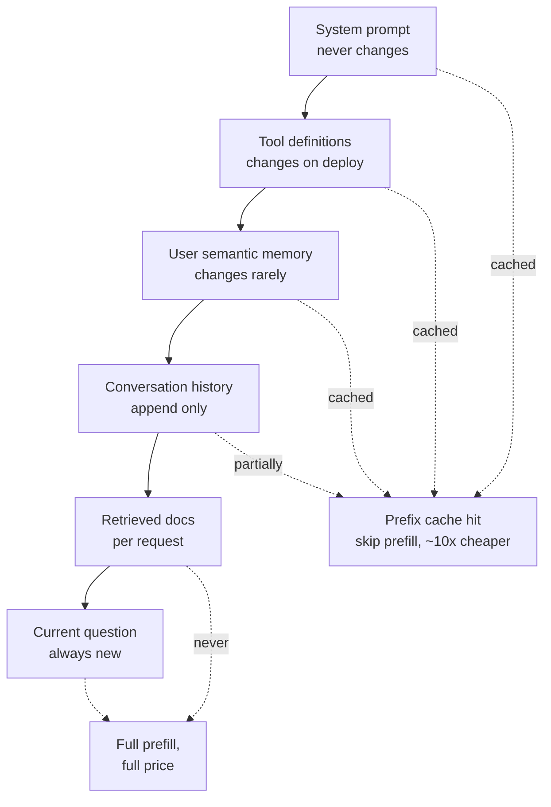

# Context Engineering

> The context window as a scarce, contended resource. Compaction, memory, and lost-in-the-middle.

- Track: **AI Engineering** · Level: **staff** · ~19 min
- [Open in the academy](https://deepeshk1204.github.io/staff-engineer-academy/#/topic/ai/context-engineering)

Context engineering is the discipline of deciding what goes into the model's context
window on each call, in what order, and what gets thrown away to make room. It is the
successor to "prompt engineering" as a job description, because in any real system the prompt
is no longer a string someone wrote -- it is assembled per request from a system prompt, tool
definitions, conversation history, retrieved documents, memory and scratch state, all competing
for the same finite budget.

Treat the window as what it is: a shared, contended, per-request resource with an allocation
policy. Most teams do not have one. They append until something breaks, and then they are
surprised that quality degraded gradually rather than failing loudly.

## Why it exists

Two things happened at once. Context windows grew from a few thousand tokens to
hundreds of thousands, and applications stopped being single-turn. An agent that calls tools,
reads files and carries a conversation accumulates context at a rate that fills even a large
window within a single session.

You might expect the bigger windows to have solved the problem. They moved it. Three costs
scale with what you put in the window, and none of them went away:

**Money.** Input tokens are re-sent on every turn, so a stateless API plus a growing history
means cost grows roughly quadratically over a conversation.
**Latency.** Prefill is compute-bound and scales with input length, so context size is
*directly* your TTFT.
**Quality.** This is the surprising one. Model performance on retrieval and reasoning within a
context does not stay flat as it fills. More context can make answers worse.

So the engineering question is not "does it fit" but "what is the smallest set of tokens that
makes this call correct".

## The budget table

Write this table down for your own application. The act of writing it is most of the
value, because it forces every consumer to justify its allocation against the others.

**Example allocation for an agentic assistant on a 200K window — the budget is what you ENFORCE, not what fits**

| Consumer | Typical | Hard cap | Stable prefix? | Eviction policy |
| --- | --- | --- | --- | --- |
| System prompt + policy | 1,200 | 2,000 | **Yes** — never interpolate anything dynamic | Never evicted. Audit it quarterly; they only grow. |
| Tool definitions | 2,500 | 4,000 | **Yes** | Load dynamically once the count passes ~20 tools. |
| Long-term / user memory | 400 | 1,000 | Partly — changes rarely | Retrieve relevant facts only; never dump the whole store. |
| Conversation history | 6,000 | 20,000 | No — append-only | Compact oldest turns into a summary at the threshold. |
| Retrieved documents | 5,000 | 12,000 | No | Reranked top 4-8 only; drop below a relevance score. |
| Tool results | 4,000 | 10,000 | No | Truncate per result; store full output by reference. |
| **Output reservation** | 2,000 | 4,000 | N/A | **Reserve it first.** Input and output share the window. |
| Headroom | ~10% | — | N/A | Absorbs an unexpectedly large tool result without a hard failure. |

> **Reserve the output budget before you fill the input**  
> Input and output come out of the same window. A request that fits perfectly and then
> truncates mid-JSON at the output limit is the same bug as one that never fit -- except it is
> worse, because it fails after you have paid for prefill. Compute
> `available_input = window - max_output - safety_margin` *first*, then allocate the rest. And
> count with the real tokeniser at the boundary, not a 4-chars-per-token estimate.

## Position effects and context rot

The "lost in the middle" finding (Liu et al., 2023) showed that a model's ability to
use a fact placed in its context depends strongly on *where* that fact sits: performance is
highest when the relevant material is at the beginning or the end, and dips in the middle. The
effect has softened in newer models but it has not disappeared, and you should assume something
like it holds for any model you have not specifically tested.

The related, broader observation is **context rot**: as the window fills, effective performance
degrades even when the window is nowhere near full. Longer contexts mean more tokens competing
for attention, more opportunities for a distractor to look relevant, and more chance that a
superseded statement from twenty turns ago contradicts the current state. A needle-in-a-haystack
benchmark -- find one planted fact in 200K tokens -- is the *easiest* possible long-context
task, because there is exactly one plausible answer and no distractors. Real workloads have
many plausible-looking passages, and performance falls much faster than those benchmarks
suggest.

Three practical consequences. Put the most important material closest to the generation point
-- typically last, immediately before the question. Order retrieved chunks best-first rather
than by document order. And when history grows, remove superseded content rather than letting
it sit there contradicting the present; a stale "the user's account is on the free plan" from
turn three will be used at turn thirty.

## Compaction

Compaction is replacing a span of history with a shorter representation that preserves
what future turns need. The naive alternatives are both bad: keeping everything hits the cost,
latency and rot problems above, and a sliding window that drops the oldest turns loses exactly
the material that established the task -- the user's original goal, the constraints they gave,
the decisions already made.

**Compaction strategies**

| Strategy | How | Keeps | Loses |
| --- | --- | --- | --- |
| **Sliding window** | Keep the last N turns. | Recency. Trivial to implement. | The original goal and constraints — usually the most important tokens in the session. |
| **Window + pinned head** | Always keep the first user turn plus the last N. | The stated goal and recency. | The middle, including decisions made there. |
| **Rolling summary** | At a threshold, summarise the oldest turns into a paragraph and replace them. | Continuity at bounded cost. | Detail. Each summarisation is lossy and errors accumulate. |
| **Recursive summarisation** | Summaries of summaries as the session grows, in tiers. | Very long sessions in a fixed budget. | Compounding drift — a fact mis-stated in tier 1 is never recoverable. |
| **Structured state extraction** | Maintain a typed object — goal, constraints, decisions, open questions, artefacts — updated after each turn. | **The best fidelity per token.** Machine-readable, inspectable, diffable. | Anything the schema did not anticipate. Needs design up front. |
| **Externalise and reference** | Write long content to a file or store; keep a path and a one-line description. | Unlimited effective capacity; the model re-reads on demand. | Requires a read tool and an extra round trip when it is needed. |

The strongest pattern in practice is **structured state plus externalisation**. Rather
than prose summaries that drift, maintain an explicit object the agent updates, and push bulky
artefacts out of the window behind references. The object is inspectable when something goes
wrong, which a prose summary never really is, and it can be validated against a schema.

Whatever you choose, compact **proactively at a threshold**, not reactively at the wall.
Compacting at 85% of budget is a planned operation you can test; compacting after a 400 from
the provider means you are doing surgery on a request that already failed, mid-conversation,
in production.

**Threshold-triggered compaction with a pinned head and structured state**

```js
const WINDOW = 200_000;
const MAX_OUTPUT = 4_000;
const SAFETY = 2_000;
const INPUT_BUDGET = WINDOW - MAX_OUTPUT - SAFETY;   // 194,000
const COMPACT_AT = 0.85;                             // act early, not at the wall

export async function prepareContext(session) {
  // Order matters twice: for cache hits and for position effects.
  const prefix = [session.systemPrompt, session.toolDefs];   // byte-stable
  let used = countTokens(prefix) + countTokens(session.state);

  if (used + countTokens(session.turns) > INPUT_BUDGET * COMPACT_AT) {
    // Keep the first user turn (the goal) and the most recent exchanges.
    const head = session.turns.slice(0, 1);
    const tail = session.turns.slice(-6);
    const middle = session.turns.slice(1, -6);

    // Update structured state rather than writing prose about the middle.
    session.state = await updateState(session.state, middle);
    session.turns = [...head, ...tail];

    metrics.increment('context.compacted');
    trace.event('compaction', {
      turnsRemoved: middle.length,
      tokensBefore: used,
      tokensAfter: countTokens(session.state) + countTokens(session.turns)
    });
  }

  return [
    ...prefix,                       // 1. stable -> prefix cache hit
    renderState(session.state),      // 2. compact, semi-stable
    ...session.turns,                // 3. history
    renderRetrieved(session.docs),   // 4. best-first, nearest the question
    session.currentQuestion          // 5. last = strongest position
  ];
}
```

## Memory architecture

"Memory" gets used for four different things that have different stores, lifetimes and
retrieval patterns. Conflating them produces the system that remembers your dietary preferences
but forgets what it did two steps ago.

**Four kinds of memory**

- **Working memory** — The current context window: this turn's task, recent exchanges, active tool results. Lifetime is the session. It *is* the window — everything else is about what gets promoted into it.
- **Episodic memory** — What happened in past sessions. "Last Tuesday you helped me migrate the billing schema." Stored as summarised session records with timestamps, retrieved by similarity and recency. Users notice its absence immediately.
- **Semantic memory** — Durable facts about the user or organisation: role, timezone, preferred language, product tier, team ownership. Small, high-value, cheap to always include — and it needs an edit and forget path for privacy.
- **Procedural memory** — How to do things here: learned workflows, house style, corrections the user has made repeatedly. Belongs in the system prompt or a skill file, not in a retrieval store, because it must be reliably present rather than probabilistically retrieved.

Two rules keep this honest. **Retrieve memory, do not stuff it.** A user with two
years of history has far more remembered facts than you can afford to include; select what is
relevant to this turn, exactly as you would with document retrieval, and measure it the same
way. And **memory writes need a policy**: what gets promoted from working to long-term, who can
see it (memory in a shared workspace is a permission surface), how it is corrected when wrong,
and how it is deleted on request. A remembered fact that is wrong is worse than no memory,
because it persists, is trusted, and nobody knows where it came from.

## Prompt-prefix caching: the largest cost lever you control

Providers cache the processed state of a prompt prefix. If your next request begins
with a byte-identical sequence, the provider skips re-prefilling those tokens and bills them at
a steep discount -- commonly around an order of magnitude cheaper, with a corresponding TTFT
improvement since prefill is where that time goes. Self-hosted stacks like vLLM do the same
thing with automatic prefix caching over shared KV blocks.

The mechanism has one uncompromising requirement: the match is a **prefix** match on exact
bytes. One changed character anywhere invalidates everything after it. This turns context
ordering from an aesthetic choice into a cost decision.



*Order by volatility. Everything after the first changed byte is re-prefilled and re-billed.*

> **The one-line change that costs six figures**  
> Putting `Current time: 2026-09-13T14:22:07Z` at the top of your system prompt
> invalidates the prefix cache on **every single request**, forever. So does a request ID, a
> randomly shuffled tool list, a user name interpolated into the opening line, or any JSON
> serialisation that does not guarantee stable key order.
> 
> Fixes: move volatile values to the *end* of the prompt or into the user turn; round timestamps
> to the day if the model only needs the date; sort tool definitions deterministically; serialise
> with sorted keys. Then verify -- providers report cached token counts in the response, so log
> `cached_tokens / prompt_tokens` as a monitored ratio. A cache hit rate you do not measure is a
> cache hit rate you do not have.

**What prefix ordering is worth (verify against your provider's current pricing)**

- **~10x** — Typical discount on cached input tokens (Applies only to the byte-identical prefix)
- **>70%** — Achievable cache hit ratio for a chat product (Stable system prompt and tool definitions)
- **Minutes** — Typical cache TTL (Bursty traffic and long user pauses lose the entry)
- **0%** — Hit rate with a timestamp at the top (One interpolated value defeats the whole mechanism)

## Tool results and retrieval on demand

Tool results are the most common way a context window fills unexpectedly, because
their size is determined by an external system rather than by you. One `SELECT *`, one verbose
API response, one file read of a 4 MB log, and the window is gone in a single step -- and the
model, having been handed 60,000 tokens of JSON, is now worse at the task than before it called
the tool.

The pattern that scales is **reference, not inline**. Return a bounded summary plus a handle,
and give the model tools to fetch more of it if needed:

- Truncate every tool result at a declared limit, and say so explicitly in the truncation
  notice, including how to get the rest. `[truncated: 412 of 8,930 rows shown. Use
  query_rows(cursor="c8f2") for more]` is actionable; a silently cut string is not.
- Write large artefacts to a store and return a path. The agent reads what it needs, when it
  needs it, and the window stays small.
- Prefer tools that return the *answer* over tools that return the *data*. A
  `count_open_incidents(team)` tool returning `{count: 14}` is better in every way than a list
  endpoint returning 14 full incident objects for the model to count -- cheaper, faster, and
  correct, because models miscount long lists.
- Pre-filter and project server-side. The tool should not return fields the task does not need.

This is the same idea as retrieval-on-demand versus stuffing: give the model the ability to go
and get things, rather than pre-loading everything it might conceivably want. It costs an extra
round trip when the information is needed and saves the entire budget when it is not.

## Sub-agent context isolation

When a task has a bulky, self-contained sub-problem -- read forty files and find where
this behaviour is implemented; search the web across ten sources and summarise -- running it in
the main context is expensive and pollutes the window with intermediate material nobody needs
afterwards.

Delegating it to a sub-agent with its own fresh context window fixes both. The sub-agent burns
120,000 tokens exploring and returns a 500-token answer; the parent's window grows by 500
tokens, not 120,000. The parent stays clean, focused, and cheap on subsequent turns -- and
because the parent's prefix is undisturbed, its cache stays warm.

The cost is real and worth stating plainly: the sub-agent cannot see the parent's context, so
whatever it needs must be passed explicitly in its brief, and a badly-specified brief produces
a confidently irrelevant result. Sub-agents also cannot easily collaborate, since they share no
state. Use isolation for **read-heavy, well-specified, independently verifiable** sub-tasks;
keep anything requiring negotiation with the main thread inline.

## Observability: what was actually in the window?

When a model produces a bad answer, the first question is always "what did it
actually see?" -- and in most systems nobody can answer it, because the context was assembled
in memory from six sources and discarded.

Make the assembled context a first-class, inspectable artefact. On every generation span record
the token count broken down by section, the IDs of retrieved chunks and their scores, the
compaction generation and what was dropped, the prompt and tool-schema versions, the cached vs
uncached token split, and a content hash of the full prompt. Store the full prompt text where
your privacy rules allow -- sampled if volume forbids keeping all of it, and always for
requests that scored badly or received negative feedback.

The payoff is that "the assistant gave a wrong answer" becomes a debuggable event. You can see
that the right chunk was retrieved at rank 2 but compaction had removed the constraint the user
gave at turn 3 -- which is a specific, fixable defect, and is completely invisible if all you
have is the input and the output.

## Trade-offs

**Trade-offs**

What you gain:
- Cost per conversation becomes bounded rather than quadratic in turn count.
- TTFT improves directly, because prefill scales with input size and prefix caching skips most of it.
- Accuracy improves by removing distractors and superseded state, not just by fitting more in.
- Sessions can run far longer than the window without a hard failure.
- An inspectable assembled context turns quality incidents into debuggable events.

What it costs you:
- Compaction is lossy — every summarisation can drop the detail that mattered.
- Structured state needs a schema designed up front, and it cannot hold what you did not anticipate.
- Retrieval-on-demand adds round trips, so p99 latency grows even as p50 improves.
- Prefix-cache-friendly ordering constrains your prompt structure and is easy to break accidentally.
- Memory stores add privacy, permission, correction and deletion obligations.
- More machinery between the user and the model, and every piece of it is a place a bug can hide.

**Failure modes**

| Failure mode | What the user sees | Mitigation |
| --- | --- | --- |
| Compaction drops the original constraint | The agent silently violates a requirement stated at turn 2 — "only in the staging environment" — thirty turns later. | Pin the first user turn; extract constraints into structured state that is never summarised away; log compaction events with what was removed and diff state before and after. |
| Timestamp or request ID at the top of the system prompt | Prefix cache hit rate is zero; cost and TTFT are several times higher than necessary and nobody notices because nothing errors. | Volatile values go last; round timestamps to the day; monitor `cached_tokens / prompt_tokens` as a dashboard metric with an alert on a drop. |
| Unbounded tool result | One `SELECT *` blows the window, the request fails or truncates mid-thought, and the agent loses the task. | Per-tool output caps with actionable truncation notices; return references to large artefacts; prefer tools that return answers rather than data. |
| No output reservation | Requests fit on input and truncate mid-JSON, failing after prefill has been paid for. | Compute `window - max_output - safety` before allocating input; count with the real tokeniser; keep ~10% headroom. |
| Stale fact from early in the session | The model acts on superseded state — an old plan, an old file version, a value the user already corrected. | Maintain current state explicitly rather than relying on the newest mention winning; remove superseded turns during compaction; put current state near the end. |
| Memory store written to indiscriminately | Wrong or private facts persist across sessions, are trusted, and have no visible provenance. | Explicit write policy with provenance; user-visible memory with edit and delete; scope memory to the principal and never share it across a workspace boundary without an ACL. |
| Retrieved chunks appended in document order | The best passage lands in the middle of a long context and is attended to least. | Order best-first by reranker score, cap at 4-8, and place them adjacent to the question. |
| Assembled prompt never logged | Quality incidents are undiagnosable; every investigation ends in speculation. | Per-section token accounting, retrieved chunk IDs and scores, compaction generation, prompt version and a content hash on every span; retain full prompts for negatively-rated requests. |

> **Staff-level angle**  
> The signal here is treating the window as a resource with an allocation policy and an
> owner, rather than as a size limit to stay under. What that sounds like:
> 
> - "I want a budget table: every consumer of the window has a typical size, a hard cap and an
>   eviction policy, and the output reservation is subtracted first. Without it, whichever
>   subsystem appends last wins, and that is decided by call order rather than by importance."
> - "Ordering is a cost decision, not a style one. System prompt and tool definitions first
>   because they are byte-stable and the provider caches that prefix at roughly a tenth of the
>   price; retrieved documents and the question last, because that is the strongest attention
>   position. Interpolating the current time at the top would cost us the entire cache."
> - "I would monitor `cached_tokens / prompt_tokens` on a dashboard. A cache hit rate you do not
>   measure is one you do not have, and it regresses silently the first time someone adds a
>   dynamic value to the header."
> - "Compaction runs at 85% of budget, not at the wall. Compacting after a 400 means doing
>   surgery on a request that already failed in front of a user. And I pin the first user turn,
>   because a sliding window throws away the goal and keeps the small talk."
> - "Structured state beats a prose summary. A typed object with goal, constraints, decisions and
>   open questions is diffable, validatable and inspectable when something goes wrong -- recursive
>   prose summaries accumulate drift you cannot see or recover from."
> - "Big read-heavy sub-tasks go to a sub-agent with its own window. It burns 100K tokens
>   exploring and hands back 500, so the parent's context stays small and its prefix cache stays
>   warm. The trade is that the brief must be complete, because the sub-agent cannot see anything
>   we did not tell it."
> - "Every generation span records per-section token counts, retrieved chunk IDs with scores, the
>   compaction generation and a prompt hash. Otherwise 'the assistant was wrong' is unfalsifiable."
> 
> The distinguishing moves: quantifying the cache lever, compacting proactively at a threshold,
> and insisting the assembled context is logged.

**Check**

Your chat product's system prompt begins with `Current time: {{iso8601}}`. The team is surprised that input costs are ~4x the estimate. Explain and fix.
- A. Timestamps tokenise poorly; shorten the format.
- B. The interpolated timestamp changes every request, so the prefix cache never matches and the entire prompt is re-prefilled and billed at full rate every time. **(answer)**
- C. Time strings force the provider to disable batching.
- D. The model spends extra reasoning tokens parsing the timestamp.

  Prefix caching matches on exact bytes from the start of the prompt, so one volatile value at the top invalidates everything after it. The tokens themselves are trivial; the cache miss is not — cached input is commonly around a tenth the price, and skipping prefill also improves TTFT. Move the timestamp to the end or into the user turn, round it to the day if only the date matters, and monitor `cached_tokens / prompt_tokens`.

A coding agent works well for 15 turns then begins ignoring a constraint the user gave at turn 2. Most likely cause?
- A. The model's context window was exceeded and requests are failing.
- B. A sliding-window or summarisation step removed or diluted the early turn where the constraint was stated. **(answer)**
- C. Temperature drift over a long session.
- D. The tool schema changed mid-session.

  Constraints are almost always stated early and referenced implicitly thereafter, which is exactly what naive history management discards — a sliding window drops it outright, and a prose summary tends to compress it into something vague. Pin the first user turn, and better, extract constraints into structured state that is never summarised away. Log what each compaction removed so this is diagnosable rather than mysterious.

An agent must analyse 40 source files to answer one architectural question. Best context strategy?
- A. Load all 40 files into the main context — modern windows are large enough.
- B. Delegate to a sub-agent with its own window that reads the files and returns a concise findings summary to the parent. **(answer)**
- C. Summarise each file with a cheap model and inline all 40 summaries.
- D. Retrieve the 5 most similar files by embedding and ignore the rest.

  Isolation is the right tool for a read-heavy, well-specified, independently verifiable sub-task: the exploration cost stays inside the sub-agent, the parent grows by a few hundred tokens, and the parent's stable prefix is undisturbed so its cache stays warm. Loading everything inline both costs the full amount and degrades reasoning through distraction. Option 4 fails because architectural questions are structural, not similarity-shaped — the important file may share no vocabulary with the question.

<details><summary>Related topics and how they connect</summary>

The prefill cost that makes context size a latency problem comes from
**LLM Fundamentals for Engineers**, and prefix caching is developed further in **Inference
Serving & Performance** and **Model Routing, Caching & Cost Control**. What gets retrieved into
the window is **RAG: The Reference Architecture** and **Advanced Retrieval**. Tool-result size
management is shared with **Tool Calling & Typed Actions**, sub-agent isolation with **Agent
Architecture**, and the per-section token spans with **AI Observability & Tracing**.

</details>

## Flashcards

- **Why does a larger context window not remove the need for context engineering?** — Three costs still scale with what you put in it: input tokens are re-sent every turn so cost grows roughly quadratically over a session, prefill is compute-bound so context size is directly your TTFT, and quality degrades with distractors and position effects. The question is the smallest set of tokens that makes the call correct.
- **What is "lost in the middle"?** — Liu et al. (2023) showed retrieval accuracy within a context depends on position — highest at the start and end, lowest in the middle. Softened in newer models, not gone. Consequences: order retrieved chunks best-first and put the most important material adjacent to the question.
- **Why is needle-in-a-haystack an easy benchmark?** — There is exactly one plausible answer and no distractors. Real workloads contain many passages that look relevant, so effective performance degrades far faster than those benchmarks imply. Treat a large advertised window as a budget, not a guarantee.
- **How does prompt-prefix caching work and what breaks it?** — The provider caches processed state for a byte-identical prefix, skipping prefill and billing those tokens at a steep discount — often around 10x cheaper. Any change invalidates everything after it: an interpolated timestamp, a request ID, an unsorted tool list, or non-deterministic JSON key order.
- **What order should you assemble context in, and why?** — Most stable first, most volatile last: system prompt, tool definitions, durable memory, history, retrieved documents, current question. Stability-first maximises prefix cache hits; volatility-last puts the most important material in the strongest attention position. Both effects point the same way.
- **Why compact at a threshold rather than at the limit?** — Compacting at ~85% of budget is a planned operation you can test and monitor. Compacting after the provider rejects the request means doing surgery on a failed request mid-conversation, in production, with a user waiting.
- **Name the four kinds of memory and where each lives.** — Working memory is the context window itself. Episodic is past-session records, retrieved by similarity and recency. Semantic is durable facts about the user or org — small, high-value, usually always included. Procedural is how-to-work-here knowledge, which belongs in the system prompt because it must be reliably present rather than probabilistically retrieved.
- **Why is structured state better than a rolling prose summary?** — A typed object holding goal, constraints, decisions and open questions is diffable, validatable and inspectable, and constraints in it are never summarised away. Recursive prose summarisation accumulates drift silently, and an error introduced in an early tier is unrecoverable.
- **When is a sub-agent with an isolated context the right call?** — For read-heavy, well-specified, independently verifiable sub-tasks. The sub-agent spends 100K tokens exploring and returns 500, so the parent stays small and its prefix cache stays warm. The cost: it cannot see the parent's context, so an incomplete brief yields a confidently irrelevant answer.

## Drills

### Drill

A coding agent handles sessions of 40-80 turns. Average cost per session is $3.20 against a $0.80 target, p95 TTFT is 5.8 s, and quality degrades noticeably after turn 25. Diagnose and design the context strategy.

Probes:

- Where is the cost actually going — input, output, or turn growth?
- What is your prefix cache hit rate and how would you find out?
- What would you compact, and what must never be compacted away?
- How do you verify the quality degradation is a context problem and not a model problem?

Strong answer contains:

- Breaks input tokens down by section per turn before proposing anything, and identifies re-sent history as the growth term.
- Checks `cached_tokens / prompt_tokens` from provider responses and looks for a volatile value at the top of the prompt as the first suspect.
- Reorders the context by volatility — system prompt and tool definitions first and byte-stable, question last — and quantifies the expected saving.
- Introduces threshold-triggered compaction with a pinned first user turn plus structured state holding goal, constraints and decisions.
- Caps tool results with actionable truncation notices and moves large file contents behind references the agent can re-read on demand.
- Routes read-heavy exploration to sub-agents with isolated windows so the parent context and its cache stay intact.
- Verifies the quality claim by logging per-section token counts and compaction events, then checking whether degraded turns correlate with post-compaction sessions rather than assuming.
- Reserves the output budget explicitly and keeps ~10% headroom for oversized tool results.

Weak answer tells:

- Proposes a cheaper model without breaking down where tokens are spent.
- Adds a sliding window that discards the original task description.
- Treats prefix caching as an optimisation to consider later.
- Has no way to see what was in the context when quality dropped.
- Compacts only when the provider returns an error.

### Drill

Product wants the assistant to "remember users across sessions". Design the memory architecture, including what you would refuse to build in v1.

Probes:

- What kinds of memory are actually being asked for?
- What gets written, by whom, and how is a wrong memory corrected?
- What are the privacy and permission implications?
- How does memory get into the context without eating the budget?

Strong answer contains:

- Separates episodic, semantic and procedural memory and notes they have different stores, lifetimes and retrieval patterns.
- Starts with semantic memory only — a small set of durable facts, user-visible and editable — because it is high value, low risk and cheap to include.
- Defines an explicit write policy with provenance on every fact, rather than letting the model write freely to a store.
- Retrieves memory relevant to the current turn rather than stuffing the whole store, and budgets its token allocation.
- Addresses correction and deletion directly: a wrong persistent memory is worse than none because it is trusted and has no visible source.
- Scopes memory to the principal and raises the permission question for shared or workspace-level memory explicitly.
- Defers free-form model-written episodic memory in v1, with the reason: unverifiable writes accumulate errors that are expensive to detect later.
- Proposes measuring memory retrieval like any other retrieval — is the right fact surfaced when needed — rather than assuming it helps.

Weak answer tells:

- Proposes embedding all past conversations and retrieving by similarity as the whole design.
- No policy for what gets written or how it is corrected.
- Ignores deletion and privacy obligations.
- Inlines the full memory store into every prompt.
- No way to evaluate whether memory improved anything.
