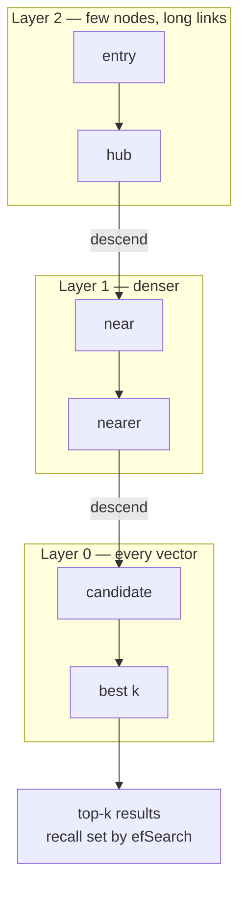

# Embeddings & Vector Search

> What a vector actually encodes, ANN indexes, HNSW vs IVF, recall/latency trade-offs, pgvector.

- Track: **AI Engineering** · Level: **core** · ~20 min
- [Open in the academy](https://deepeshk1204.github.io/staff-engineer-academy/#/topic/ai/embeddings-and-vector-search)

An embedding is a list of numbers -- typically a few hundred to a few thousand
floating-point values -- produced by a model that has been trained so that texts meaning
similar things land near each other in that space. Vector search is the infrastructure that,
given one such list, finds the nearest others among millions without comparing against all of
them.

The idea is simple and the operational consequences are not. The vector is only meaningful
relative to the exact model that produced it, the "nearest" you get back is approximate by
design, and every knob you turn trades recall against latency against memory. This topic is
about those three facts.

## Why it exists

Keyword search matches strings. A user asking "why is my card declining" against a
document titled "Payment authorisation failures" shares no content words with it, so lexical
search returns nothing useful. Decades of query expansion, synonym dictionaries and stemming
were attempts to bridge that gap by hand, and they were brittle, per-language, and endless.

Embeddings replace the hand-built bridge with a learned one. Because the encoder was trained on
enormous amounts of text with objectives that pull paraphrases together, "card declining" and
"authorisation failure" end up close without anyone writing a rule. That generalises across
phrasing, across languages with multilingual encoders, and to modalities where keywords do not
exist at all.

What you give up is precision on exact tokens. This matters enough that hybrid search --
combining lexical and vector retrieval -- is the default in serious systems, and it is the
subject of *Advanced Retrieval*.

## What the numbers actually mean

No individual dimension is interpretable. There is no "formality axis" at index 47.
What the training produces is a *geometry*: the only thing you can rely on is relative
distance, and only between vectors produced by the same model with the same pooling and the
same normalisation.

Modern text encoders are usually transformer encoders that pool token representations into one
vector, trained with a contrastive objective on pairs that should be close and pairs that
should be far. Two consequences worth internalising. First, the model's notion of "similar" is
whatever its training pairs encoded -- often topical similarity, which is not the same as "this
passage answers that question", and is why asymmetric query/document models and instruction
prefixes (`query: ` / `passage: `) exist. Second, a single vector is a lossy summary: a
600-word chunk covering three topics produces one point that sits in the average of all three
and is a strong match for none of them. Chunking quality is upstream of retrieval quality.

## Distance metrics and when normalisation matters

| Metric | Formula intuition | Sensitive to magnitude? | Use when |
| --- | --- | --- | --- |
| **Cosine similarity** | Angle between the two vectors; 1 = same direction. | No — magnitude divides out. | Almost always for text. The default for semantic similarity. |
| **Dot product** | Cosine × both magnitudes. | Yes — longer vectors score higher. | When the model was trained with it (many are), or when magnitude deliberately encodes something like confidence. |
| **Euclidean (L2)** | Straight-line distance. | Yes. | Image and numeric feature spaces more often than text. |
| **Any of them, on L2-normalised vectors** | All three become rank-equivalent. | N/A | The safe operational default: normalise at write time, then the metric choice stops being a source of bugs. |

> **The metric mismatch bug**  
> If you normalise your vectors to unit length at insert time but configure the index
> with the L2 operator, you are not wrong -- on unit vectors, L2 distance and cosine distance
> produce the same *ranking*. If you do **not** normalise and use dot product where the model
> expects cosine, you are wrong in a way that is hard to see: results stay plausible, but long
> documents systematically outrank short relevant ones because their vectors are longer.
> 
> The rule that avoids the whole class: **normalise at write time, use the metric the model card
> specifies, and store which you used in the index metadata.** Quality degradation from a metric
> mismatch never throws an error.

## Why exact search stops working, and the curse of dimensionality

Exact k-nearest-neighbour search is a scan: compute the distance from the query to
every stored vector, keep the top k. The cost is `O(N × D)` multiply-adds. At 1M vectors of
768 dimensions that is ~768M operations per query -- feasible on a modern CPU with SIMD, and
it is genuinely the right answer below roughly 100K vectors. At 100M vectors it is not.

The classical escape from a linear scan is a space-partitioning tree -- kd-trees, ball trees --
and it fails badly in high dimensions. The intuition usually called the curse of dimensionality:
as D grows, the volume of the space grows exponentially while your N points stay fixed, so
points become sparse and the *ratio* between the nearest and farthest distance approaches 1.
Everything is roughly equally far from everything. A tree must then examine most branches to be
sure it has not missed a neighbour, and you are back to a scan with worse constants.

So the field gave up on exactness. **Approximate** nearest neighbour search accepts that you
will sometimes miss a true neighbour in exchange for sub-linear query cost. The quality metric
is **recall@k**: of the k true nearest neighbours, how many did the index return? This is the
single number you must be able to state about your index, and most teams cannot.

**Where the regimes change (rough, CPU, 768-dim)**

- **< ~100K** — Exact scan is fine (Simpler, exact, no index to rebuild)
- **~100K-10M** — HNSW in memory (Millisecond queries, high recall)
- **~10M-1B** — IVF-PQ or DiskANN (Compression or SSD becomes mandatory)
- **95-99%** — Recall@10 you should target (State it, do not assume it)

## HNSW, explained properly

Hierarchical Navigable Small World graphs (Malkov & Yashunin, 2016) are the default
index in Qdrant, Weaviate, Elasticsearch, Lucene, FAISS and pgvector, and understanding the
three knobs is what separates someone who configured a vector DB from someone who tuned one.

The structure is a stack of proximity graphs. Every vector is a node in layer 0. Each node is
also promoted to higher layers with exponentially decaying probability, so layer 1 has a
fraction of the nodes, layer 2 a fraction of those, and the top layer holds a handful. Within
each layer, nodes link to nearby nodes -- plus, crucially, a few long-range links, which is the
"small world" property that keeps path lengths short.

A search enters at the top layer and greedily walks toward the query: at each node it looks at
the neighbours, moves to the closest one, and repeats until no neighbour is closer. Then it
drops to the next layer down and repeats, now in a denser graph. The upper layers act as an
express network that covers distance in a few hops; the bottom layer does the fine-grained
work. Query cost ends up roughly logarithmic in N.



*Coarse hops at the top, fine refinement at the bottom. efSearch controls how wide the layer-0 beam is.*

**The three HNSW parameters that decide everything**

| Parameter | What it controls | Raising it | Typical range |
| --- | --- | --- | --- |
| `M` | Max bidirectional links per node at layer 0 (upper layers use fewer). | Better recall and graph connectivity. **Permanently** more memory — this is the one you cannot change without a rebuild. | 8-64; 16 is a sensible default, 32-48 for high-dimensional or high-recall needs |
| `efConstruction` | Size of the candidate list while *inserting* a vector. | Better graph quality, so better recall at the same `efSearch`. Slower builds. No query-time memory cost. | 100-500. Build once, query forever — be generous here |
| `efSearch` (`ef`) | Size of the candidate list while *querying*. | Higher recall, proportionally higher latency. **Tunable per query at runtime** with no rebuild. | 40-400. Must be ≥ k |
| `m0` / layer-0 degree | Usually `2 × M`, set implicitly. | Dominates memory, since layer 0 holds every vector. | Rarely tuned directly |

> **The one that saves you**  
> `efSearch` is a per-query parameter. That means you can run cheap, low-recall search
> for an autocomplete dropdown and high-recall search for the retrieval step feeding an LLM
> answer -- from the same index, with no rebuild. Most teams set it once globally and never
> discover this. Expose it as a request parameter from day one, and add a shed-load path that
> lowers it under pressure rather than dropping requests.

**Illustrative recall vs latency curve — measure your own, these are shapes not promises**

| `efSearch` | Recall@10 | Relative query latency | Reasonable use |
| --- | --- | --- | --- |
| 16 | ~0.85 | 1x | Candidate generation feeding a reranker that will fix ordering |
| 64 | ~0.95 | ~2x | Interactive search-as-you-type |
| 128 | ~0.98 | ~3.5x | Default for RAG retrieval |
| 256 | ~0.99 | ~6x | High-stakes retrieval; diminishing returns are steep past here |
| Exact scan | 1.00 | 50-1000x at scale | Ground truth for *measuring* the rows above |

> **How to actually measure recall**  
> Sample 1,000 queries from production. Run each against an exact scan -- that is your
> ground truth, and it is why you must retain the raw vectors. Run the same queries against the
> index at each `efSearch` setting and compute the overlap in the top k. Plot recall against p95
> latency and *choose a point on the curve deliberately*. Re-run it after any data-distribution
> shift, because recall on today's corpus tells you nothing about recall after you triple it.

## IVF-PQ and DiskANN: when memory is the constraint

HNSW is fast because the whole graph lives in RAM. Past a few tens of millions of
vectors that becomes the dominant cost, and two families of technique take over.

**IVF** (inverted file) clusters the vectors with k-means into `nlist` cells, each with a
centroid. A query compares against the centroids, picks the `nprobe` closest cells, and scans
only those. If `nlist` is 4,096 and `nprobe` is 32, you touch under 1% of the data. The failure
mode is specific: a true neighbour sitting just across a cell boundary is missed entirely, and
raising `nprobe` is the only cure. IVF also requires a *training* step on a representative
sample before insertion, and the centroids go stale as your data distribution drifts.

**PQ** (product quantisation) compresses each vector by splitting it into m sub-vectors and
replacing each with the ID of the nearest centroid from a small learned codebook. A 768-dim
float32 vector at 3,072 bytes becomes 96 bytes at m=96 -- a 32x reduction. Distances are then
computed approximately from lookup tables. **IVF-PQ** combines both and is how billion-scale
indexes fit in memory, with a real recall cost that is usually recovered by re-ranking the top
few hundred candidates against the full-precision vectors.

**DiskANN** (and its DiskANN-family descendants, including Turbopuffer-style designs and
pgvector's `vector`-on-disk work) takes the other route: keep a compressed representation in
RAM for traversal and the full vectors on NVMe, accepting a handful of SSD reads per query.
It trades a few milliseconds for an order of magnitude less RAM, and on modern NVMe that trade
is usually worth it above ~50M vectors.

## Memory maths: do this before you choose anything

**Worked example — 20M chunks, 1536-dim embeddings**

```js
const N = 20_000_000;       // chunks
const D = 1536;             // dimensions

// 1. Raw float32 vectors
const rawBytes = N * D * 4;                 // = 122.9 GB

// 2. HNSW graph overhead: M links per node at layer 0 (plus upper layers,
//    roughly +10%), 4-8 bytes per link id.
const M = 16, BYTES_PER_LINK = 8;
const graphBytes = N * M * 2 * BYTES_PER_LINK * 1.1;   // = 5.6 GB

// Full-precision HNSW in RAM:  ~128 GB  -> a very large, very expensive node.

// 3. Scalar quantisation to int8 (4x smaller), recall cost typically ~1%
const sqBytes = N * D * 1 + graphBytes;                // = 36.3 GB

// 4. Binary quantisation (32x smaller) + rerank top 200 against full vectors
const bqBytes = N * D / 8 + graphBytes;                // = 9.4 GB
//    ...but you must keep the full vectors SOMEWHERE for the rerank pass.
//    On NVMe that is fine: 123 GB of SSD is cheap, 123 GB of RAM is not.

// 5. Matryoshka truncation: many 2024+ models are trained so a 1536-dim
//    vector can be truncated to 512 and re-normalised with modest loss.
const matBytes = N * 512 * 4 + graphBytes;             // = 46.6 GB

// Decision: BQ in RAM for traversal + full vectors on NVMe for rerank.
// ~10 GB of RAM instead of ~128 GB, at the cost of one extra pass.
```

**Quantisation: storage saved vs recall paid**

| Technique | Size vs float32 | Typical recall impact | Notes |
| --- | --- | --- | --- |
| **float16 / bfloat16** | 2x smaller | Negligible | Free win. Do it by default. |
| **Scalar (int8)** | 4x smaller | Usually ~1-2% recall@10 | Per-dimension min/max calibration. Best effort-to-reward ratio. |
| **Product quantisation** | 8-64x smaller | Noticeable; recoverable by reranking top ~200 with full vectors | Needs a training pass; the standard at billion scale. |
| **Binary (1 bit/dim)** | 32x smaller | Large alone; often near-parity after full-precision rerank | Hamming distance is extremely fast. Works best on high-dimensional models trained for it. |
| **Matryoshka truncation** | Choose your own — e.g. 1536→512 is 3x | Small if the model was MRL-trained; severe if it was not | Check the model card. Truncating a non-MRL model quietly destroys the geometry. |

## Filtering: the recall trap nobody warns you about

Real queries are never "nearest neighbours in the whole corpus". They are "nearest
neighbours among documents this user may read, in this workspace, not archived, from the last
two years". How the engine applies that predicate determines whether your results are correct.

**Post-filtering** retrieves the top k by vector similarity and then drops rows failing the
predicate. It is trivial to implement and it silently returns fewer than k results -- sometimes
zero. If the filter is 1% selective and you fetch 10, you expect 0.1 surviving rows. The
symptom is "search returns nothing for this user", and the naive fix -- fetch 10,000 and filter
-- is a latency disaster.

**Pre-filtering** computes the allowed ID set first and searches only within it. Exact, but if
the set is large, building and intersecting it can cost more than the search.

**Filtered / in-graph search** is what good engines actually do: evaluate the predicate
*during* graph traversal so only permitted nodes are expanded. Qdrant's filterable HNSW builds
additional links so the subgraph stays navigable under a filter; Postgres with pgvector can use
`iterative scan` modes to keep pulling from the index until enough rows pass. The subtlety is
that heavy filtering can disconnect the graph -- the surviving nodes may not be reachable from
each other -- so engines fall back to a brute-force scan below a selectivity threshold, and
that fallback is where your p99 latency lives.

> **Post-filtering plus permissions is a correctness bug, not a perf issue**  
> If your ACL check is applied after retrieval, a user in a small workspace will get
> near-empty results because everything similar belongs to someone else. Teams "fix" this by
> raising k until it looks right, which is both slow and non-deterministic. Permission predicates
> must be pushed into the search -- denormalise the ACL into the index as a filterable field and
> filter during traversal. This is developed at length in *Advanced Retrieval*.

**pgvector: HNSW index, filtered search, and the parameters that matter**

```sql
CREATE EXTENSION IF NOT EXISTS vector;

CREATE TABLE chunk (
  id           bigserial PRIMARY KEY,
  doc_id       bigint NOT NULL,
  workspace_id bigint NOT NULL,
  acl_groups   bigint[] NOT NULL,          -- denormalised for pre-filtering
  updated_at   timestamptz NOT NULL,
  body         text NOT NULL,
  embedding    vector(1536) NOT NULL       -- store L2-normalised
);

-- Build the graph. m is permanent; ef_construction only costs build time.
CREATE INDEX chunk_embedding_hnsw ON chunk
  USING hnsw (embedding vector_cosine_ops)
  WITH (m = 16, ef_construction = 200);

-- Filterable columns need their own indexes so the planner can combine them.
CREATE INDEX chunk_ws  ON chunk (workspace_id);
CREATE INDEX chunk_acl ON chunk USING gin (acl_groups);

-- Per-query recall knob. Session-scoped, not baked into the index.
SET hnsw.ef_search = 128;
-- Keep pulling from the index until enough rows pass the filter,
-- instead of post-filtering a fixed candidate set down to nothing.
SET hnsw.iterative_scan = relaxed_order;

SELECT id, doc_id, body, 1 - (embedding <=> $1) AS score
FROM chunk
WHERE workspace_id = $2
  AND acl_groups && $3::bigint[]
  AND updated_at > now() - interval '2 years'
ORDER BY embedding <=> $1        -- <=> is cosine distance
LIMIT 20;
```

## pgvector or a dedicated vector database?

| Dimension | pgvector (Postgres) | Dedicated (Qdrant, Weaviate, Milvus, managed services) |
| --- | --- | --- |
| Scale where it is comfortable | Up to roughly 10-50M vectors on a well-provisioned instance; past that, index build time and RAM dominate. | Designed for 100M-10B with sharding, replication and disk-backed indexes built in. |
| Transactional consistency | **Its decisive advantage.** The chunk, its metadata and its ACL update in one transaction with your application data. No dual-write, no reconciliation job. | Separate system, so you own the sync. Deletes and permission changes lag, which is a correctness problem, not a tidiness one. |
| Filtering | Full SQL — joins, arrays, time ranges. Planner interaction with the vector index needs care and `iterative_scan`. | Purpose-built payload filtering, often with filter-aware graph traversal that degrades better under selective filters. |
| Index build | Slow and memory-hungry historically; parallel builds and `maintenance_work_mem` tuning help a lot. | Faster builds, online rebuilds, segment merging, quantisation as a first-class feature. |
| Operational surface | One database you already run, back up and monitor. | Another stateful system: its own scaling, backups, upgrades, failure modes and on-call. |
| Honest default | **Start here.** Most products never leave this box, and the ones that do benefit from having measured why. | Move when you have a number — index build exceeds your maintenance window, RAM cost is untenable, or measured recall at acceptable latency is not achievable. |

## The operational facts that bite later

**Changing the embedding model means reindexing everything.** Vectors from two models
are not comparable -- not even two versions of the same model family, and not even the same
model with a different instruction prefix. There is no migration, no partial cutover, no "new
documents use the new model". A mixed index returns nonsense rankings without erroring. Plan
for a blue/green index: build the new one alongside, run both, compare recall on a golden query
set, then flip an alias. For 20M chunks this is hours to days of GPU or API time and a real
money number -- put it in the design document before anyone picks a model, and keep the source
text so you *can* re-embed.

**Index builds are not free and not always online.** HNSW construction is roughly
`O(N log N)` with a large constant and is memory-hungry. Building an index for tens of millions
of vectors can take hours; check whether your engine supports concurrent build and whether
queries are served during it.

**Updates are asymmetric.** Inserts into HNSW are cheap. Deletes are usually *tombstones* --
the node stays in the graph and is filtered from results -- so a high-churn corpus accumulates
dead nodes that consume memory and slow traversal until you compact or rebuild. Track your
tombstone ratio; it is a real operational metric with a real rebuild trigger.

## Trade-offs

**Trade-offs**

What you gain:
- Semantic matching across paraphrase, synonym and language without hand-built rules.
- Sub-linear query cost: millisecond nearest-neighbour search over tens of millions of vectors.
- One retrieval mechanism generalises to code, images and audio with the right encoder.
- `efSearch` gives a per-query recall/latency dial you can adapt to the surface and to load.

What it costs you:
- Results are approximate; you must measure recall or you do not know what you are serving.
- RAM is the dominant cost, and quantising to control it spends recall.
- Poor on exact terms, IDs, product codes and rare words — hybrid search is effectively mandatory.
- The embedding model becomes a hard dependency: changing it forces a full, expensive reindex.
- Filtering interacts badly with graph traversal; naive post-filtering is a silent correctness bug.
- A separate vector store introduces dual-write consistency problems for deletes and permission changes.

**Failure modes**

| Failure mode | What the user sees | Mitigation |
| --- | --- | --- |
| Post-filtering by tenant or ACL | Users in small workspaces get few or zero results; looks like "search is broken for some customers". | Denormalise the filter field into the index and filter during traversal (`iterative_scan` in pgvector, payload filters in Qdrant). Alert on the rate of queries returning fewer than k rows. |
| Embedding model upgraded, index partially re-embedded | Rankings become incoherent across the corpus with no error anywhere. | Blue/green index with a version tag on every vector; refuse queries against a mixed-version index; flip by alias only after a recall comparison. |
| Recall never measured | Retrieval silently degrades as the corpus grows; downstream LLM answers get worse and the vector store looks healthy. | Keep a golden query set with exact-scan ground truth; compute recall@10 in CI and on a schedule; alert on drift. |
| Vectors not normalised, index uses dot product | Long documents systematically outrank short relevant ones. No error, just steadily worse results. | Normalise at write time; use the metric the model card specifies; record the metric in index metadata and assert it at startup. |
| High-churn corpus, never compacted | Tombstoned nodes accumulate; memory grows and latency creeps up over months. | Track deleted-node ratio; schedule rebuild or compaction at a threshold; size capacity for the rebuild, not the steady state. |
| Matryoshka truncation applied to a non-MRL model | Storage drops 3x and quality collapses in a way that looks like a chunking problem. | Only truncate models explicitly trained with Matryoshka representation learning; validate recall before and after on the golden set. |
| Index build exceeds the maintenance window | Reindex cannot complete; team ships with a stale or partial index. | Measure build time at target N early; use concurrent builds and raise `maintenance_work_mem`; shard so builds parallelise. |

> **Staff-level angle**  
> The tell for depth here is whether someone treats the index as a tuned system with a
> measured operating point, or as a black box that "does semantic search". Sentences that land:
> 
> - "What is our recall@10, and at what p95? If we cannot answer that, we do not know what we are
>   serving. I want a golden query set with exact-scan ground truth and that number in CI."
> - "`efSearch` is per-query, so we run `ef=32` for the typeahead and `ef=128` for the RAG
>   retrieval out of the same index -- and we can shed load by lowering it instead of dropping
>   requests. `M` is the one we cannot change without a rebuild, so that is the decision to get
>   right up front."
> - "At 20M by 1536 dimensions, float32 is about 123 GB before graph overhead. That is a
>   memory-cost decision, not a storage decision. I would take binary quantisation in RAM for
>   traversal with a full-precision rerank of the top 200 off NVMe -- roughly 10 GB resident
>   instead of 128."
> - "Permissions get denormalised into the index and filtered during traversal. Post-filtering an
>   ACL is not slow, it is *wrong*: a user in a small workspace gets an empty page and we would
>   read that as a relevance bug for months."
> - "Changing the embedding model is a full reindex with no partial path, because vectors from
>   two models are not comparable and a mixed index fails silently. Blue/green with a version tag
>   per vector, recall comparison on the golden set, then flip the alias."
> - "I would start on pgvector. The chunk, its ACL and the source row update in one transaction,
>   which removes an entire class of dual-write bugs around deletes and permission changes. We
>   move to a dedicated store when we have a number that says we must."
> 
> Two things distinguish the strongest answers: they quote memory arithmetic without being asked,
> and they treat filtering as a correctness problem rather than a performance one.

**Check**

Enterprise customers with small private workspaces report that search "returns almost nothing", while large customers are fine. Most likely cause?
- A. `efSearch` is too high, over-filtering candidates.
- B. The ACL predicate is applied after vector retrieval, so the top-k global neighbours mostly belong to other tenants and get discarded. **(answer)**
- C. Their documents were embedded with a different model.
- D. Cosine distance is the wrong metric for small corpora.

  This is the classic post-filter trap, and it scales inversely with tenant size — which is exactly why it looks like a customer-specific bug rather than an architectural one. Fetching the global top 20 and then dropping anything outside the workspace leaves close to nothing when that workspace is 0.1% of the corpus. Push the predicate into traversal: denormalise `workspace_id` and the ACL into the index and filter during search. Alert on the fraction of queries returning fewer than k rows.

You need to cut vector RAM by ~10x on a 50M-vector index while keeping recall@10 above 0.95. Best first approach?
- A. Halve `efSearch` and `M`.
- B. Binary or product quantisation for the in-memory traversal, then re-rank the top ~200 candidates against full-precision vectors held on NVMe. **(answer)**
- C. Truncate every vector from 1536 to 256 dimensions.
- D. Switch cosine to dot product.

  Quantise-then-rerank is the standard way to buy memory back without giving up ranking quality: the compressed representation only has to get the right candidates into the top 200, and the full-precision pass fixes the ordering. Lowering `M` degrades graph connectivity permanently and saves far less. Blind truncation only works on models trained with Matryoshka representation learning, and the metric choice has no effect on memory at all.

A new embedding model scores meaningfully better on your eval. What does adopting it actually require?
- A. Point new writes at the new model; old vectors remain usable.
- B. Re-embed and rebuild the entire index, because vectors from different models share no geometry and a mixed index degrades silently. **(answer)**
- C. Re-normalise the existing vectors to the new dimensionality.
- D. Nothing, as long as dimensionality matches.

  Two encoders produce unrelated coordinate systems even at identical dimensionality — matching dimensions is a coincidence, not compatibility. A mixed index throws no error; it just ranks incoherently, which is the worst kind of failure. Budget the full re-embedding cost and wall-clock time, build blue/green with a model-version tag on every vector, compare recall on a golden set, and cut over by alias. This is also the argument for always retaining source text.

<details><summary>Related topics and how they connect</summary>

Vector search is one half of retrieval; the lexical half, reranking and
permission-aware filtering are in **Advanced Retrieval**. Chunking decides what you embed in
the first place and is covered in **RAG: The Reference Architecture**. Recall as a measured,
CI-gated number belongs to **Evaluation & Quality Regression**, and per-query `efSearch`
shedding is a lever in **Model Routing, Caching & Cost Control**.

</details>

## Flashcards

- **What is recall@k for an ANN index and how do you measure it?** — The fraction of the true k nearest neighbours that the approximate index returned. Measure it by running a sample of production queries against an exact scan for ground truth, then comparing top-k overlap at each `efSearch`. If you cannot state this number, you do not know what your index is serving.
- **Which HNSW parameter can you change per query, and which is permanent?** — `efSearch` is per-query and trades recall for latency freely. `M` is fixed at build time and determines memory and graph connectivity — changing it requires a full rebuild. `efConstruction` affects build quality and build time only.
- **Why does post-filtering break multi-tenant search?** — It retrieves the global top-k then drops rows failing the predicate. With a highly selective filter — a small workspace, a restrictive ACL — almost nothing survives, so users see empty results. It is a correctness bug, not a latency one; push the predicate into graph traversal.
- **Why does high dimensionality defeat kd-trees?** — As dimensions grow, the ratio between nearest and farthest distances approaches 1, so no branch can be safely pruned. The tree ends up examining most of the space, which is a linear scan with worse constants. Hence approximate graph and clustering methods instead.
- **Rough memory for 10M vectors at 768 dimensions in float32 HNSW?** — Vectors are 10M × 768 × 4 bytes ≈ 30.7 GB, plus graph links of roughly N × M × 2 × 8 bytes (≈2.8 GB at M=16), so about 33-35 GB resident. Always do this arithmetic before choosing an index type.
- **What does product quantisation trade?** — It splits each vector into sub-vectors and replaces each with a codebook centroid ID, giving 8-64x compression at a real recall cost. The cost is usually recovered by re-ranking the top few hundred candidates against full-precision vectors.
- **Why can you not incrementally migrate to a new embedding model?** — Different models produce unrelated geometries even at the same dimensionality, so distances between old and new vectors are meaningless. A mixed index ranks incoherently and never errors. You need a full re-embed, blue/green indexes with version tags, and an alias flip.
- **When is pgvector the right choice over a dedicated vector DB?** — Below roughly 10-50M vectors, and especially when chunks, metadata and ACLs must update transactionally with your application data — that removes dual-write bugs around deletes and permission changes. Move only when you have a measured reason: build time, RAM cost, or unachievable recall at your latency target.
- **Why do HNSW deletes degrade an index over time?** — Deletes are typically tombstones: the node stays in the graph and is filtered from results, so a high-churn corpus accumulates dead nodes that cost memory and lengthen traversal. Track the tombstone ratio and rebuild or compact at a threshold.

## Drills

### Drill

You are designing retrieval for a B2B document product: 30M chunks at 1536 dimensions, 200 queries per second at peak, p95 retrieval budget of 150 ms, strict per-document ACLs, and roughly 2% of documents changing daily. Choose an architecture and defend the numbers.

Probes:

- What does this cost in RAM, and what would you do about it?
- How do ACLs get enforced, and what happens when someone loses access?
- What is your recall target and how would you know you hit it?
- What is the daily churn doing to your index over six months?

Strong answer contains:

- Computes memory unprompted: 30M × 1536 × 4 ≈ 184 GB raw plus graph overhead, and concludes full-precision in-RAM HNSW is not the right default.
- Proposes quantisation for traversal (int8 or binary) plus full-precision rerank of the top 100-200, and states the expected recall cost of each.
- Pushes ACL into the index as a denormalised filterable field with filter-aware traversal, and explicitly rejects post-filtering as a correctness bug.
- Names the ACL staleness problem: permission revocation must invalidate index entries quickly, so it needs an event-driven update path with a measured lag SLO, plus a final authorisation check before anything is shown.
- Sets a recall target (e.g. recall@10 ≥ 0.95) and describes measuring it against exact-scan ground truth on a golden query set, with the number gated in CI.
- Accounts for 2% daily churn: tombstone accumulation, a rebuild or compaction schedule, and capacity headroom sized for the rebuild rather than the steady state.
- Mentions the reindex cost of an embedding-model change as a design constraint and keeps source text to make it possible.

Weak answer tells:

- Picks a vector database by brand with no memory or recall arithmetic.
- Applies permissions after retrieval.
- Says "we will tune efSearch" without a recall target or a measurement method.
- Ignores churn, tombstones and rebuild windows entirely.
- Treats an embedding model swap as a configuration change.

### Drill

Retrieval quality complaints have risen steadily over two quarters. Nothing was deployed to the retrieval service in that time. The corpus grew from 4M to 22M chunks. Diagnose.

Probes:

- What changes about an ANN index when the corpus grows 5x with fixed parameters?
- What would you measure first?
- Which fixes need a rebuild and which do not?

Strong answer contains:

- Recognises that recall is a function of corpus size and density at fixed `efSearch` and `M`, so an unchanged configuration is effectively a degrading one.
- Measures recall@10 against exact-scan ground truth now, and reconstructs the earlier operating point if a historical snapshot exists.
- Separates no-rebuild fixes (raise `efSearch`, add a reranker over a wider candidate set) from rebuild fixes (raise `M`, re-cluster IVF centroids that have drifted from the new distribution).
- Checks tombstone ratio and index bloat from two quarters of churn.
- Considers that the *content mix* changed too, not just the volume — new document types may chunk or embed badly, which is an ingestion problem masquerading as an index problem.

Weak answer tells:

- Concludes the embedding model is bad and proposes swapping it without measurement.
- Has no way to quantify "quality got worse" beyond user complaints.
- Suggests increasing k as the fix without considering context budget or precision.
- Does not connect corpus growth to recall at fixed index parameters.
