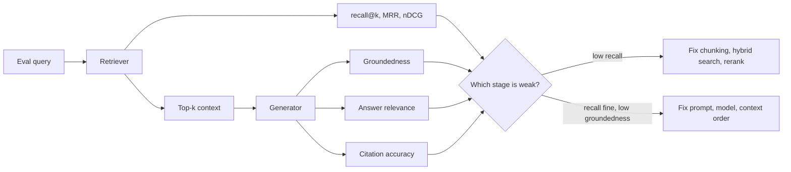

# Evaluation & Quality Regression

> Golden sets, LLM-as-judge and its biases, retrieval vs generation metrics, evals in CI.

- Track: **AI Engineering** · Level: **staff** · ~21 min
- [Open in the academy](https://deepeshk1204.github.io/staff-engineer-academy/#/topic/ai/evaluation)

An eval is a test suite for a system that does not give the same answer twice. You
collect a set of inputs, you define what a good output looks like, you run your system over the
set, and you get a score you can compare across changes.

That sounds mundane. It is the single largest difference between teams that can ship AI changes
weekly and teams that are frightened of their own prompt file. Without evals, every change is a
coin flip you cannot observe, and "we improved the prompt" is a claim nobody in the room can
verify or refute.

## Why it exists

The playground lies to you, and it lies in a specific way: you type inputs you already
have in mind, you read the outputs charitably because you know what you meant, and you stop as
soon as one looks right. That is a demo, not a measurement. It has a sample size of about four,
no held-out data, and an evaluator -- you -- who is maximally biased.

Then the real problem arrives. Someone changes a word in the system prompt to fix one customer
complaint, and it silently breaks a different behaviour that nobody was looking at. The retrieval
index is re-chunked and answer quality drops 8% in a way no user reports as a bug -- they just
trust the feature less. The provider updates the model behind a floating alias and your tool-call
parse rate falls overnight with no deploy on your side.

Every one of those is undetectable without a repeatable measurement. Evals exist because AI
systems have **no compiler and no stack trace**: they fail by getting quietly worse, and the only
alarm you get is the one you built.

> **The test you are actually replacing**  
> In deterministic software the compiler catches type errors, unit tests catch logic
> errors, and an exception tells you where it broke. An LLM feature has none of those. It returns
> a confident, fluent, well-formatted paragraph that is wrong. Evals are not a nice-to-have layer
> on top of your tests -- for the non-deterministic part of your system they *are* the tests.

## The golden dataset

Everything rests on the dataset, and the dataset is where the actual work is. A good
one is smaller than people expect and better curated than people manage.

**Source it from production traffic, not from your imagination.** Inputs you invent cluster
around the cases you already thought about; they miss the empty query, the query in Portuguese,
the 4,000-word pasted email, the question about a feature you deprecated. Pull real requests
from your traces, strip PII, and sample deliberately.

**Stratify.** If 70% of traffic is simple lookups, a randomly sampled set is 70% simple lookups,
and it will report "no regression" while you destroy the hard 5% that generates your support
load. Build explicit slices -- by intent, by difficulty, by language, by tenant shape, by input
length -- and report per-slice scores. An aggregate score that moved 1% is usually hiding one
slice that moved 20%.

**Include the cases you are afraid of.** Adversarial inputs, prompt-injection attempts,
questions whose correct answer is "I do not know", ambiguous requests that should trigger a
clarifying question. Refusal behaviour is a feature and needs test cases like any other.

**Keep a held-out set you never look at.** If you iterate against every example, you have
overfitted your prompt to your test set, and you will not know it. Split roughly 70/30 into a
development set you optimise against and a held-out set you run before release only.

**Version it like code.** The dataset lives in git or in a versioned store, changes arrive by
pull request with a reason, and every eval result records the dataset version. A score is
meaningless without knowing which examples produced it -- scores that "improved" after someone
quietly deleted eight failing cases are a real and common form of self-deception.

**Dataset sizing that works in practice**

- **30-50** — Enough to start and find real bugs (Day one; a bad prompt fails this badly)
- **100-300** — Typical steady-state CI set (Runs in minutes, catches most regressions)
- **~1,000+** — When you need to detect small deltas (Below this, a 2% change is inside the noise)
- **70/30** — Development versus held-out split (Held-out is run pre-release only)
- **5-8** — Slices worth reporting separately (Aggregate scores hide slice regressions)
- **~2 weeks** — Cadence for refreshing from production (Traffic shifts; a stale set stops representing users)

> **Start today, not when it is perfect**  
> Thirty examples in a JSON file with a script that prints a pass rate is worth more
> than a beautifully architected eval platform you will build next quarter. The first thirty cases
> will find real bugs within an hour. Add cases every time a human reports a failure -- that is
> how the set grows into something valuable, and it means every bug is permanently regression-tested.

## The metric hierarchy: use the cheapest sufficient check

New teams reach for LLM-as-judge immediately, which is the expensive, noisy,
hard-to-trust option. Work down this list and stop at the first level that answers your question.

**Four levels of evaluation, cheapest first**

| Level | What it checks | Cost and latency | Trust | Use for |
| --- | --- | --- | --- | --- |
| **Deterministic assertion** | Valid JSON, schema conformance, required field present, citation IDs exist in the index, no banned string, tool name in allowlist | Microseconds, free | Total | Anything expressible as a rule. Surprisingly much of it. |
| **Code-based metric** | Exact match, F1 against a reference, numeric tolerance, unit tests pass, SQL executes and returns the right rows, retrieval recall@k | Milliseconds, near-free | High | Tasks with a checkable ground truth -- code, SQL, extraction, retrieval. |
| **LLM-as-judge** | Groundedness, helpfulness, tone, whether two answers mean the same thing | One or more model calls per example; seconds | Moderate, and needs calibration | Open-ended generation where no reference answer can be written. |
| **Human review** | Everything, including what you forgot to measure | Minutes of expert time per example | Highest, though inter-rater agreement is rarely above ~85% | Calibrating judges, pre-launch sign-off, periodic audit of a sample. |

The under-appreciated move is pushing work *up* the list. "Did the answer cite a real
document?" feels like a judgement call; it is a set-membership test against your index. "Is the
answer grounded?" feels like a judgement call; a large part of it is checking that every factual
sentence has a citation whose retrieved chunk contains the claim -- partly mechanical. Every
check you can promote from level three to level one gets cheaper, faster and more trustworthy at
the same time.

**Deterministic assertions catch more than people expect**

```javascript
// Level 1 -- runs in microseconds, never flaky, no model call.
export const assertions = [
  { name: 'parses_as_json',      fn: o => tryParse(o) !== null },
  { name: 'matches_schema',      fn: o => schema.safeParse(tryParse(o)).success },
  { name: 'has_citations',       fn: o => extractCitations(o).length > 0 },
  { name: 'citations_are_real',  fn: (o, ex) => extractCitations(o)
                                     .every(id => ex.retrievedIds.includes(id)) },
  { name: 'no_placeholder_text', fn: o => !/\b(TODO|lorem ipsum|as an AI)\b/i.test(o) },
  { name: 'within_length',       fn: o => o.length < 4000 },
  { name: 'refuses_when_it_should', fn: (o, ex) =>
      !ex.expectRefusal || /cannot|do not have|not able to find/i.test(o) }
];

// Level 2 -- retrieval quality, measured against labelled relevant IDs.
export function recallAtK(retrievedIds, relevantIds, k) {
  if (relevantIds.length === 0) return null;          // never score 0 for an empty label set
  const top = new Set(retrievedIds.slice(0, k));
  const hits = relevantIds.filter(id => top.has(id)).length;
  return hits / relevantIds.length;
}

export function mrr(retrievedIds, relevantIds) {
  const rank = retrievedIds.findIndex(id => relevantIds.includes(id));
  return rank === -1 ? 0 : 1 / (rank + 1);
}
```

## Evaluate retrieval separately from generation

This is the most common structural mistake in RAG evaluation, and it makes debugging
nearly impossible. A single end-to-end quality score cannot distinguish "we never retrieved the
right document" from "we retrieved it and the model ignored it". Those have completely different
fixes -- chunking and index work versus prompt and model work -- and you will guess wrong.

So measure two stages with two sets of metrics.

**Retrieval**, scored against labelled relevant document IDs per query. *Recall@k* is the one
that matters most for RAG: of the documents that should have been found, what fraction appeared
in the top k you actually pass to the model? If recall@k is 0.6, your generation ceiling is
roughly 0.6 no matter which model you use. *MRR* tells you whether the right document is near the
top, which matters when the model's attention is uneven across a long context. *nDCG* adds graded
relevance and position discounting, useful when relevance is not binary.

**Generation**, conditioned on what was retrieved. *Groundedness* (also called faithfulness):
is every claim supported by the provided context, or did the model add something? *Answer
relevance*: does it address the question asked rather than an adjacent one? *Citation accuracy*:
do the citations point to chunks that actually contain the cited claim -- this is the one users
notice, because a plausible answer attached to the wrong source destroys trust faster than a
wrong answer. `Ragas` implements a reasonable version of these decompositions if you would
rather not write them yourself.



*Two stages, two metric sets, two different fixes. One blended score tells you nothing actionable.*

> **The diagnostic that saves days**  
> Run generation once with your retriever and once with the *known correct* documents
> injected by hand. If quality jumps, your problem is retrieval. If it barely moves, your problem
> is generation. This takes an afternoon to set up and routinely redirects a team that was about
> to spend a sprint on the wrong half of the system.

## LLM-as-judge, done properly

Sometimes there is no reference answer -- "write a release note from these commits"
has thousands of good outputs. That is when you use a model to grade a model, and there are
five rules that separate a usable judge from a random number generator.

**Prefer pairwise to absolute.** "Score this answer 1-10 for helpfulness" produces a judge that
gives 7 and 8 to everything, and a 0.3-point movement you cannot interpret. "Here are answers A
and B; which better satisfies these criteria, or are they equivalent?" produces a comparison
models are far more reliable at, and a win rate you can reason about statistically. Compare
against a frozen baseline -- your current production prompt -- and the metric becomes "does the
candidate beat production, and how often?"

**Know the biases and control for them.** *Position bias*: judges favour one slot, so run every
pair in both orders and only count it a win if the preference survives the swap -- inconsistent
pairs become ties and their rate is itself a useful signal of judge reliability. *Verbosity
bias*: judges reward length independent of quality, so either normalise length or instruct
explicitly that concise complete answers are preferred, and check whether your win rate merely
tracks token count. *Self-preference*: models tend to rate their own generations higher, which
is the direct argument for the next rule.

**Use a different model as judge than the one you are evaluating**, and freeze it. If the judge
is also the system, you are grading with the same blind spots that produced the error. Pin a
dated snapshot, because a judge that silently changes makes your entire score history
incomparable.

**Calibrate against human labels.** This is the step nearly everyone skips and it is what makes
the judge credible. Have humans label 100-200 examples, run the judge on the same examples, and
report the agreement rate. If the judge agrees with humans less often than humans agree with
each other, it is not ready -- iterate on the rubric, add few-shot examples of borderline cases,
and re-measure. Recheck agreement whenever you change the rubric or the judge model.

**Write a rubric, not an adjective.** "Rate the quality" is unanswerable. Decompose into
specific binary questions -- does it answer the question asked, is every claim supported by the
context, does it avoid inventing a product name, does it match the requested format -- and score
each. Binary sub-questions are more reliable than a holistic scale and they tell you *what*
regressed.

**Pairwise judge with position-swap control**

```python
JUDGE_PROMPT = """You are comparing two answers to the same question.

Question: {question}
Context provided to both: {context}

Answer A: {a}
Answer B: {b}

Judge on these criteria, in priority order:
1. Factual support -- every claim traceable to the context.
2. Completeness -- addresses the whole question.
3. Directness -- no preamble, no hedging beyond genuine uncertainty.

Length is NOT a merit. A shorter answer that is complete is better.

Return JSON only: {{"winner": "A" | "B" | "tie", "reason": "<one sentence>"}}"""

def judge_pair(question, context, baseline, candidate, judge_model):
    # Run both orders. A real preference survives the swap.
    first  = judge_model(JUDGE_PROMPT.format(question=question, context=context,
                                             a=baseline,  b=candidate))
    second = judge_model(JUDGE_PROMPT.format(question=question, context=context,
                                             a=candidate, b=baseline))
    if first["winner"] == "B" and second["winner"] == "A":
        return "candidate"
    if first["winner"] == "A" and second["winner"] == "B":
        return "baseline"
    return "tie"        # includes order-inconsistent verdicts

def win_rate(examples, judge_model):
    verdicts = [judge_pair(**ex, judge_model=judge_model) for ex in examples]
    wins   = verdicts.count("candidate")
    losses = verdicts.count("baseline")
    ties   = verdicts.count("tie")
    # Track the tie rate: a rising tie rate means the judge is losing discrimination,
    # which is a signal about the judge, not about the candidate.
    return {"wins": wins, "losses": losses, "ties": ties,
            "rate": wins / max(wins + losses, 1)}
```

> **The honest caveat you should say out loud**  
> An LLM judge is a noisy proxy with correlated errors, not a measurement instrument.
> It shares the training distribution and many of the blind spots of the system it grades, so it
> will systematically miss whole classes of error -- exactly the ones your model is bad at. Treat
> judge scores as a *relative* signal for comparing two versions on the same frozen set, never as
> an absolute quality number to put in a slide. Always keep a small human-reviewed sample running
> alongside as ground truth, and be suspicious of any judge-measured improvement you cannot see
> by reading ten outputs yourself.

## Evals in CI, and the non-determinism problem

Evals earn their keep when they block a merge. The trigger set is anything that can
change behaviour: prompt templates, model identifiers or parameters, retrieval configuration,
chunking strategy, the tool schemas, and the embedding model -- the last of which requires a
full re-index, so it is the most expensive change in the list and the most important to gate.

Then you hit the problem that makes this unlike a normal test suite: **the same input can produce
a different output**, so a single run gives you a score with unknown variance. Assert on it and
you get a flaky pipeline that people learn to re-run until green, which is worse than no gate.

The fix is statistical. Run each example N times (3-5 is usually enough for a CI gate) and work
with the distribution. Establish the noise floor first by running the *unchanged* system twice
and measuring the difference between the two runs -- that number is your minimum detectable
effect, and any delta smaller than it means nothing. Gate on a lower bound rather than a point
estimate, so a change must be reliably better rather than luckily better.

Two thresholds, not one. A hard gate on the assertion-level metrics -- schema conformance and
citation validity should be near-perfect and a drop is a bug, not a nuance. A softer gate on
judge metrics -- block if the win rate against the frozen baseline falls below the noise floor,
and always report per-slice so a 1% aggregate move that hides a 20% slice regression cannot pass.

Keep it fast. A CI eval that takes 40 minutes gets skipped. Run a 100-example smoke set on every
pull request in a few minutes, and the full set plus the held-out split nightly and before
release.

**What to gate on, and how hard**

| Signal | Gate | Rationale |
| --- | --- | --- |
| Schema conformance / valid JSON | Hard block below ~99% | Deterministic, cheap, and a drop is a straightforward bug. |
| Citation IDs exist in the index | Hard block on any failure | Fabricated citations are the trust-destroying failure; it is a set-membership test. |
| recall@k on labelled queries | Hard block on a drop beyond noise | Caps every downstream generation metric. Always gate index changes on this. |
| Groundedness (judge) | Soft block, report per slice | Noisy proxy. Meaningful as a relative signal against a frozen baseline. |
| Pairwise win rate vs production | Soft block below 50% minus noise floor | The question that matters: is this actually better than what users have? |
| Refusal rate on should-refuse cases | Hard block | Safety behaviour is a feature with test cases, not an emergent property. |
| p95 latency and cost per example | Soft block on regression beyond ~20% | Quality wins bought with 3x cost need an explicit decision, not a silent merge. |

**CI wiring -- what triggers what**

```yaml
# .github/workflows/evals.yml
on:
  pull_request:
    paths:
      - 'prompts/**'            # template edits
      - 'src/retrieval/**'      # chunking, hybrid weights, rerank config
      - 'config/models.yaml'    # model id, temperature, max_tokens
      - 'src/tools/schemas/**'  # tool surface changes the model sees

jobs:
  smoke:
    steps:
      - run: eval run --set dev-smoke --repeats 3 --dataset-version $(cat evals/VERSION)
      - run: eval gate --hard schema_valid=0.99,citations_real=1.0,recall_at_5=-0.02
                       --soft win_rate_vs_prod=0.47 --per-slice
      - run: eval report --comment-on-pr    # win rate, slice table, 5 worst diffs

  nightly:
    schedule: [{ cron: '0 3 * * *' }]
    steps:
      - run: eval run --set full --repeats 5
      - run: eval run --set held-out --repeats 3     # release gate only
      - run: eval drift --window 14d                  # judge score drift on fixed set
```

## Online evaluation: the only score that is real

Offline evals tell you whether you broke something. They cannot tell you whether users
are better off, because your dataset is a frozen sample of a moving distribution and your judge
is a proxy for a preference you have not actually measured.

So ship behind a flag and measure product outcomes. The signals worth more than any judge score
are implicit and abundant: did the user accept the suggestion or edit it heavily, did they
regenerate, did they rephrase and ask again (a strong negative signal), did they abandon the
session, did they escalate to a human, did the task they came for complete. Explicit thumbs are
tempting and nearly worthless on their own -- response rates in the low single digits, and the
people who click are disproportionately the angry and the delighted, so the ratio tells you
about your sampling rather than about your system.

Wire those signals back into the dataset. Every production failure -- a thumbs-down with a
comment, an escalation, a regenerate-then-rephrase -- becomes a candidate eval case. That loop
is what makes the golden set get *better* over time instead of staler, and it is the difference
between an eval suite that reflects your users and one that reflects the sprint you wrote it in.

## Eval-driven development

Put together, the workflow inverts. You do not build the feature and then measure it.
You write the eval cases first, from real or realistic inputs, including the ones you expect to
fail. You build the simplest thing -- one prompt, no retrieval -- and get a baseline number, which
is almost always higher than people guess and stops you over-engineering. Then you read the
failures, and the failures tell you what to build: if the model lacks facts, add retrieval; if
it lacks form, add few-shot examples or consider fine-tuning; if it lacks reasoning, decompose
the task. Each change is scored against the same frozen set, so you always know whether you are
making progress or moving sideways.

This is the actual answer to "how do I improve my AI feature". Not a better prompt from intuition
-- a measurement, a failure category, and a targeted fix. Teams that work this way ship AI changes
with roughly the confidence of a normal deploy. Teams that do not are permanently one prompt edit
away from an unnoticed regression.

**The loop**

1. Write 30-50 eval cases from real traffic, including known-hard and should-refuse cases, before building.
2. Build the simplest version. Record the baseline score per slice and the noise floor from two identical runs.
3. Read the twenty worst failures by hand. Categorise them -- missing facts, wrong form, wrong reasoning, bad retrieval.
4. Fix the largest category with the cheapest mechanism that addresses it, and re-score on the same frozen set.
5. Promote every check you can from judge to deterministic assertion as the failure modes become clear.
6. Gate CI on the metrics that stabilised; run the held-out set only before release.
7. Ship behind a flag, watch implicit signals, and feed production failures back as new eval cases.

**Investing in an eval suite**

What you gain:
- Prompt, model and index changes become normal engineering changes with a pass/fail signal.
- Regressions are caught before users experience them, including the silent quality kind.
- Model upgrades become a measured decision rather than a leap of faith.
- Arguments about quality are settled by a number on a shared dataset.
- Failure categories tell you what to build next instead of guessing.

What it costs you:
- Dataset curation is real, ongoing, expert-time work -- it is most of the cost.
- Judge calls make CI cost money on every pull request.
- Non-determinism forces N repeats, multiplying runtime and spend.
- A stale or overfitted dataset gives false confidence, which is worse than none.
- Judge metrics are proxies and will miss error classes your model is systematically bad at.
- Held-out discipline is socially hard -- someone always wants to peek before release.

**How eval programmes go wrong**

| Failure mode | What the user sees | Mitigation |
| --- | --- | --- |
| Overfitting to the eval set | Score climbs for a quarter while user complaints climb too; the number has stopped tracking reality. | Strict 70/30 split with a held-out set run only before release; refresh from production every couple of weeks; treat a suspiciously high score as a bug. |
| Single blended end-to-end score | Quality drops and nobody can tell whether retrieval or generation caused it; a sprint is spent on the wrong half. | Separate retrieval metrics from generation metrics; run the known-correct-context diagnostic to attribute the loss. |
| Uncalibrated LLM judge | A change ships on a 6% judge improvement that humans cannot perceive, or a real regression passes unseen. | Human-label 100-200 examples, report judge-human agreement, and require it to beat inter-human agreement before trusting the judge. |
| Flaky gate from single-run scoring | CI fails randomly, engineers learn to re-run until green, the gate is now decorative. | N repeats with distributions; establish the noise floor from two identical runs; gate on a lower bound, not a point estimate. |
| Aggregate score hides a slice | Overall metric up 1%, the hard 5% of traffic that drives support volume down 20%. | Stratified dataset with mandatory per-slice reporting; gate per slice, not only on the mean. |
| Dataset drifts away from traffic | Suite passes everything while users hit a whole intent class that has no test cases. | Scheduled resampling from production traces; auto-create candidate cases from thumbs-down, escalations and regenerate events. |
| Judge or model changed underneath you | Historical scores become incomparable and a trend line is now fiction. | Pin dated snapshots for both system and judge; record model, prompt and dataset versions with every result; re-baseline explicitly on change. |
| No cost or latency in the eval | A 4% quality win ships alongside a 3x cost increase that finance discovers next month. | Report tokens, cost and p95 latency per example beside quality; make the trade an explicit decision in the pull request. |

> **Staff-level angle**  
> Evals are where interviews separate people who have shipped AI from people who have
> prototyped it. The tell is whether you talk about the *dataset* or only about metrics.
> 
> - "The first thing I would build is not the feature, it is thirty eval cases from real traffic,
>   including the ones I expect to fail. Then I build the simplest version and measure it, because
>   the baseline is usually better than people guess and it stops me over-engineering."
> - "I want retrieval and generation scored separately. If I only have one end-to-end number I
>   cannot tell whether we failed to find the document or found it and ignored it, and those have
>   completely different fixes. The fastest diagnostic is to run generation with hand-injected
>   correct context -- if quality jumps, it is a retrieval problem."
> - "Recall@k is the ceiling. If recall@5 is 0.6, no model choice gets me above roughly 0.6, so
>   I would work on chunking and hybrid retrieval before touching the prompt."
> - "I would use pairwise comparison against the current production prompt, not absolute 1-10
>   scoring, because judges compress everything into 7 and 8. I run each pair in both orders and
>   only count a win if it survives the swap -- position bias is large enough to manufacture a
>   result."
> - "Before I believe any judge, I want its agreement rate against a hundred human labels. If the
>   judge agrees with humans less than humans agree with each other, the metric is noise and I
>   will say so rather than put it in a slide."
> - "Non-determinism means a single run is a sample, not a score. I establish the noise floor by
>   running the unchanged system twice, then gate on a lower bound across N repeats. Otherwise the
>   gate goes flaky and people re-run until green, which is worse than no gate."
> - "I gate hard on the deterministic things -- schema conformance, citations resolving to real
>   chunks, recall@k -- and softly on judge metrics, always reported per slice. An aggregate that
>   moved 1% is usually one slice that moved 20%."
> - "The only score I fully trust is online: accept versus edit rate, regenerates, rephrase-and-ask-again,
>   escalation to a human. Explicit thumbs are single-digit response rates and biased to the
>   extremes, so I use them to *collect eval cases*, not to measure quality."
> 
> The signal in all of these is the same: you know the dataset is the product, you know your
> metrics are proxies with named biases, and you are willing to say which numbers you do not trust.

**Check**

Your RAG feature scores 0.72 on an end-to-end quality metric and you need it higher. What do you measure first?
- A. Try three larger models and keep whichever scores best.
- B. Retrieval recall@k against labelled relevant documents, and generation quality with correct context injected by hand. **(answer)**
- C. Increase the judge’s rubric detail to get a more precise score.
- D. Collect more user thumbs-down to find the pattern.

  A blended score cannot be debugged. Splitting the stages tells you where the loss is: if recall@5 is 0.6 your generation ceiling is roughly 0.6, and no model swap fixes that -- the work is chunking, hybrid search and reranking. If recall is high but groundedness is low, the context is arriving and being ignored, which is prompt, context ordering or model work. The hand-injected-context run resolves the question in an afternoon.

A prompt change improves your LLM-judge score from 7.1 to 7.4 on 80 examples, single run each. Ship it?
- A. Yes -- a 0.3 improvement on 80 examples is a solid result.
- B. No -- absolute scores compress, one run gives no variance estimate, and 80 examples cannot resolve a small delta. **(answer)**
- C. Yes, if the judge is a larger model than the system model.
- D. No, because LLM judges can never be used in a decision.

  Three problems stack. Absolute scoring bunches everything into 7-8 so the scale carries little information. A single run per example gives no variance, and the run-to-run noise floor on a set this size is plausibly larger than 0.3 -- you would find that out by running the unchanged system twice. And 80 examples is thin for a small effect. The fix is pairwise against the frozen production prompt with position swapping, N repeats, and a lower-bound gate. Judges are usable; uncalibrated single-run absolute judges are not.

Which is the strongest production quality signal for an AI writing assistant?
- A. Thumbs-up rate on generated drafts.
- B. The fraction of generated text surviving unedited into the sent document, plus the regenerate rate. **(answer)**
- C. Average session length.
- D. Token count per response.

  Implicit behavioural signals are dense, unbiased by who chooses to click, and tied to the job the user came to do. Edit-survival directly measures usefulness; regenerate directly measures dissatisfaction. Thumbs are collected from single-digit percentages of interactions, skewed to the delighted and the furious, so the ratio tells you about your sampling. Session length is genuinely ambiguous -- engagement or struggle -- and token count is not a quality metric at all. Use thumbs as a funnel for new eval cases rather than as a score.

You are switching embedding models to improve retrieval. Which eval gate matters most before merge?
- A. Pairwise judge win rate on final answers.
- B. recall@k and MRR on the labelled retrieval set, re-indexed with the new model, reported per slice. **(answer)**
- C. Schema conformance of the generated output.
- D. p95 end-to-end latency.

  An embedding change alters the retrieval stage and nothing else directly, so measure that stage with its own metrics -- and it demands a full re-index, making it the most expensive change to get wrong. Per-slice reporting is essential here because embedding models differ sharply by domain and language: aggregate recall can improve while your non-English or code-heavy slice collapses. The downstream judge score is worth reporting but it is a laggy, noisy view of a change you can measure directly.

<details><summary>Related topics and how they connect</summary>

Eval datasets are sourced from the traces described in **AI Observability &
Tracing**, and the implicit quality signals live in the same span data. Retrieval metrics act
on the pipeline built in **RAG: The Reference Architecture** and tuned in **Advanced
Retrieval**. Agent runs need distribution-based scoring because of the non-determinism discussed
in **Agent Architecture**. Any fine-tune must be measured before and after with the same harness
-- see **Fine-Tuning, LoRA & Distillation** -- and the cost side of every quality decision is
**Model Routing, Caching & Cost Control**.

</details>

## Flashcards

- **Why is the playground not a test?** — Sample size of about four, inputs you already had in mind, no held-out data, and the most biased possible evaluator -- you, reading charitably because you know what you meant. It cannot detect a silent regression in a behaviour you were not looking at.
- **What is the metric hierarchy, and what is the rule?** — Deterministic assertions, then code-based metrics, then LLM-as-judge, then human review. Use the cheapest sufficient one, and keep promoting checks upward -- "citations are real" is a set-membership test, not a judgement call.
- **Why score retrieval separately from generation?** — One blended number cannot distinguish "never retrieved the right doc" from "retrieved it and ignored it", and those have different fixes. recall@k caps every generation metric: if recall@5 is 0.6, no model choice gets you much above 0.6.
- **Three biases in LLM-as-judge and their controls?** — Position bias -- run both orders and require the preference to survive the swap. Verbosity bias -- normalise or instruct against length, and check the win rate is not just tracking token count. Self-preference -- use a different, frozen, dated judge model than the system model.
- **Why is pairwise better than absolute scoring?** — Absolute 1-10 judges compress everything into 7-8, so movements are small and uninterpretable. Pairwise against a frozen production baseline asks a question models are reliable at and yields a win rate you can reason about statistically.
- **How do you stop an eval gate from being flaky?** — Run each example N times (3-5) and use distributions. Establish the noise floor by running the *unchanged* system twice -- any delta smaller than that is meaningless -- then gate on a lower bound rather than a point estimate.
- **Why keep a held-out set?** — Iterating against every example overfits your prompt to your test set, and the score keeps climbing while real quality does not. Split roughly 70/30 and run the held-out portion only before release.
- **Why are thumbs-up/down nearly worthless as a quality metric?** — Single-digit response rates and severe selection bias toward the delighted and the furious, so the ratio measures your sampling. Use implicit signals instead -- edit survival, regenerates, rephrase-and-ask-again, abandonment, escalation -- and use thumbs to collect eval cases.
- **What does eval-driven development actually look like?** — Write cases before building, get a baseline from the simplest version, read the twenty worst failures and categorise them, then fix the largest category with the cheapest mechanism and re-score on the same frozen set. Failures tell you what to build.

## Drills

### Drill

You inherit a customer-support RAG assistant with no evals. It answers roughly 40,000 questions a week over a 90,000-document knowledge base, support leadership says quality "feels like it got worse after the last index rebuild", and nobody can confirm it. You have three weeks. Build the eval programme.

Probes:

- Where do the first hundred examples come from, and how do you label them?
- How would you confirm or refute the claim about the index rebuild specifically?
- Which metrics do you gate CI on in week three, and at what thresholds?
- What do you do about the cases where the correct answer is "this is not in the knowledge base"?
- How does the dataset stay relevant six months from now?

Strong answer contains:

- Samples real queries from production traces rather than inventing them, strips PII, and stratifies by intent, difficulty and language with per-slice reporting.
- Labels relevant document IDs per query to enable recall@k and MRR, not just final-answer judgement.
- Tests the index-rebuild hypothesis directly: re-run the retrieval set against the old and new index and compare recall@k, rather than debating answer quality.
- Runs the hand-injected-correct-context diagnostic to attribute loss between retrieval and generation.
- Includes should-refuse cases and treats refusal behaviour as a gated feature.
- Hard-gates schema conformance, citations resolving to real chunks, and recall@k; soft-gates pairwise win rate versus the current production prompt with per-slice output.
- Establishes the noise floor with two identical runs and gates on a lower bound over N repeats.
- Wires production signals -- escalations, regenerates, thumbs-down with comment -- into a queue of candidate eval cases, with a refresh cadence.

Weak answer tells:

- Starts by building an eval platform instead of thirty examples in a JSON file.
- Uses a single end-to-end LLM-judge score and no retrieval metrics.
- Judge is the same model as the system, uncalibrated, absolute 1-10, single run.
- Invents test questions from imagination with no production sampling.
- No held-out set, or admits they would iterate against everything.
- Cannot propose a way to test the index-rebuild claim beyond "ask support if it feels better".
- No per-slice reporting, so a hard-case regression stays invisible.

### Drill

Your provider announces the model you use is deprecated in eight weeks. The replacement is cheaper and scores better on public benchmarks. You have 14 prompts in production across four product surfaces, and one of them drives a compliance-sensitive workflow. Plan the migration.

Probes:

- What do you measure, and what would make you refuse to migrate on time?
- Public benchmark scores are better -- why is that not sufficient evidence?
- How do you handle the prompt that is compliance-sensitive differently?
- What is the rollout, and what is the rollback trigger?

Strong answer contains:

- Runs the existing eval suite on the new model per surface, treating the current model as the frozen baseline and using pairwise comparison rather than absolute scores.
- Explains that public benchmarks measure a different distribution than your traffic and can be contaminated, so only your own stratified set is evidence.
- Expects format and tool-call behaviour to shift and gates hard on schema conformance and citation validity, not just quality.
- Treats prompts as non-portable: budgets time to re-tune each prompt for the new model rather than assuming a drop-in swap.
- Prioritises by traffic and risk, and gives the compliance surface a human-reviewed sample plus sign-off before any traffic moves.
- Rolls out per surface behind a flag with a shadow or canary phase, comparing implicit online signals -- edit rate, regenerates, escalations -- against the old model.
- Names concrete rollback triggers and keeps the old model reachable until the deprecation date.
- Reports cost and p95 latency deltas beside quality so the trade is explicit.

Weak answer tells:

- Swaps the model identifier and relies on benchmark scores as the justification.
- Assumes prompts transfer unchanged between models.
- Migrates all four surfaces at once with no canary or rollback trigger.
- Treats the compliance workflow identically to the others.
- Measures only aggregate judge quality, with no schema or tool-call conformance check.
- No plan for what happens if quality is worse and the deprecation date arrives anyway.
