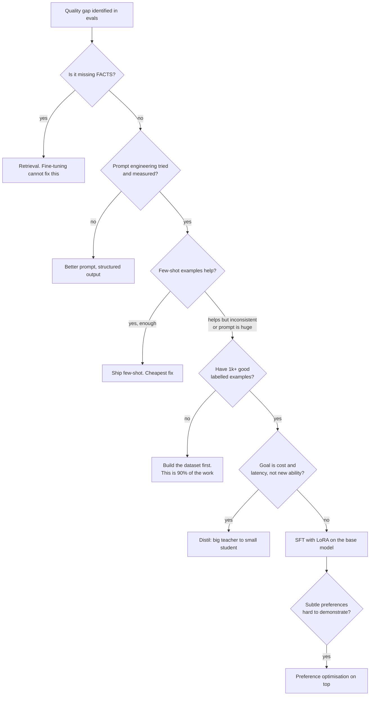

# Fine-Tuning, LoRA & Distillation

> When weights are the right answer, what SFT/DPO actually change, and serving many adapters.

- Track: **AI Engineering** · Level: **staff** · ~19 min
- [Open in the academy](https://deepeshk1204.github.io/staff-engineer-academy/#/topic/ai/finetuning-and-adaptation)

Fine-tuning means continuing to train a model on your own examples so that its weights
change. You start from a model someone else spent millions of dollars pre-training, show it a few
thousand examples of the behaviour you want, and end up with a model that does that behaviour by
default rather than because you asked nicely in a prompt.

The single most useful sentence about it: **fine-tuning teaches form and behaviour; retrieval
supplies facts.** Almost every disappointing fine-tune in production came from someone trying to
push knowledge into weights when they should have put it in a database, and almost every
successful one came from someone teaching a model a style, a schema, a decision boundary or a
domain vocabulary it kept getting subtly wrong.

## Why it exists

Prompting has a ceiling, and you hit it in a specific way. The prompt that reliably
produces your house style is 3,000 tokens of instructions and eight examples. It works, and now
every single request pays for those 3,000 tokens, your latency includes reading them, and the
model still drifts on the tenth edge case because instruction-following degrades as instructions
pile up.

Fine-tuning moves that knowledge from the prompt into the weights. The behaviour becomes the
default, the prompt shrinks to the actual task, and consistency improves precisely because the
model is no longer inferring your intent from a wall of text -- it has seen two thousand examples
of what you want.

The second reason is economic and it is the bigger one in practice. A small fine-tuned model can
match a frontier model on a *narrow* task at a fraction of the cost and latency. Not on general
reasoning -- on your specific classification, extraction, routing or formatting job. That is the
most common real production win, and it is usually delivered through distillation, which we come
to below.

What fine-tuning is *not* good at is teaching facts. Training on your documentation does not make
the model reliably able to quote it -- the facts get blended into a statistical soup, the model
becomes confidently wrong in a new and more plausible-sounding way, and you cannot cite a source
or update a fact without retraining. Use retrieval for that. The distinction is not a nuance; it
is the main thing people get wrong.

## The decision tree



*Work down the tree. Most quality gaps resolve before the fine-tuning branch, and the most common win is the distillation branch.*

Two branches of that tree deserve emphasis because they are where the real decisions
happen.

The **"prompt engineering tried and measured"** gate is not a formality. If you cannot state your
current eval score per slice, you have no baseline, which means you will not be able to tell
whether the fine-tune helped -- and you will probably discover afterwards that a better prompt
would have closed most of the gap for a day's work instead of a month's.

The **cost-and-latency versus new-ability** distinction determines the whole shape of the
project. If a frontier model already does the task well and you want it cheaper and faster,
that is distillation and it has a high success rate, because you have a teacher that can generate
unlimited labelled data. If no model does the task well, fine-tuning is a research project with
an uncertain outcome, and you should size it accordingly.

**What each adaptation method actually changes**

| Method | Changes | Needs | Good for | Weak at |
| --- | --- | --- | --- | --- |
| **Prompting** | Nothing -- inference-time only | An afternoon | Most problems. Always try first. | Consistency under a long instruction set; per-request token cost |
| **Few-shot** | Nothing -- examples in context | 5-50 examples | Format and style with fast iteration | Token cost on every call; limited example capacity |
| **RAG** | Nothing -- facts in context | An index and a retriever | **All factual knowledge**, citations, freshness, per-document ACLs | Style, format, tone, decision boundaries |
| **SFT (full)** | All weights | 1k+ examples, serious GPU | Deep behavioural change | Cost; catastrophic forgetting; one artefact per task |
| **LoRA / QLoRA** | Small added low-rank matrices | ~500-5k examples, one GPU | Style, format, schema adherence, domain vocabulary, task specialisation | Adding genuinely new knowledge |
| **DPO / preference** | Weights, toward preferred outputs | Preference *pairs* | Subtle taste you can rank but not write | Anything a demonstration could teach more cheaply |
| **Distillation** | A small model’s weights | Teacher outputs at volume | **Cost and latency at fixed quality on a narrow task** | Exceeding the teacher; broad generalisation |

## What supervised fine-tuning actually does

Mechanically, SFT is the same next-token prediction objective used in pre-training,
applied to your examples, with the loss usually masked so it is computed only on the *response*
tokens rather than the prompt. You are not teaching the model new language. You are shifting the
probability distribution over next tokens so that, conditioned on prompts shaped like yours, the
continuations it favours look like your responses.

That framing explains both the strengths and the failures. It is excellent at **form**: output
structure, tone, terse-versus-verbose, when to refuse, always emitting valid JSON matching your
schema, using your organisation's vocabulary correctly. Those are all distributional properties
of the response, learnable from a few hundred to a few thousand consistent examples.

It is poor at **facts**, because a fact appearing in a handful of training examples does not
become a retrievable record. It becomes a slightly raised probability, competing with everything
else the model absorbed during pre-training. You get confident, plausible, unciteable, unupdatable
answers -- strictly worse than retrieval on every axis you care about.

It also explains the most common self-inflicted failure. The model learns the statistical
regularities of your dataset, *including the ones you did not intend*. If every example in your
support dataset happens to end with "Let me know if you need anything else!", the model will
append that to a security incident report. If 80% of your examples answer in three bullet
points, it will produce three bullet points for a question with one answer. Dataset consistency
is not tidiness -- it is the specification.

## LoRA and QLoRA

Full fine-tuning updates every weight, so you need optimiser state for all of them --
in practice several times the model size in GPU memory -- and you get back a complete new copy of
the model per task. For a 70B model that is unaffordable for most teams and unmanageable at more
than one or two tasks.

LoRA (low-rank adaptation) starts from the observation that the *update* you need is much simpler
than the model. Freeze the pre-trained weights entirely. For a weight matrix `W` of shape
`d x k`, learn two small matrices `A` (`r x k`) and `B` (`d x r`) where `r` is a small rank
like 8, 16 or 64, and compute the effective weight as `W + (alpha/r) * B*A`. Only `A` and `B`
are trained. `alpha` is a scaling factor controlling how strongly the adapter influences the
result; a common convention is `alpha = r` or `2r`, and what matters is the ratio rather than
either number alone.

The parameter arithmetic is the reason it changed everything:

**LoRA parameter count, worked**

```text
One attention projection in a 70B-class model: d = k = 8192
  Full fine-tune of that matrix:  8192 x 8192            = 67.1M parameters
  LoRA with r = 16:               16 x 8192 + 8192 x 16  =  0.26M parameters
  Ratio: about 0.4% of the parameters for that matrix.

Across a whole 70B model, targeting q/k/v/o and the MLP projections at r = 16,
adapters typically land in the low tens of millions of parameters -- on the order
of 0.05-0.5% of the base model depending on rank and which modules you target.

Practical consequences:
  - Optimiser state is proportional to TRAINED parameters, so memory drops by
    roughly two orders of magnitude. A 70B LoRA fits on a single 80 GB GPU with
    4-bit base weights (QLoRA).
  - The artefact you ship is tens to low hundreds of MB, not ~140 GB.
  - You can store hundreds of adapters and serve them against ONE base model.
  - Adapters can be merged into the base for zero-overhead inference, or kept
    separate so you can swap them per request.

Rank selection, empirically:
  r = 4-8    style, tone, formatting, light schema adherence
  r = 16-32  task specialisation, domain vocabulary -- the common default
  r = 64-128 larger behavioural shifts; diminishing returns and overfitting risk
             rise quickly on small datasets
```

**QLoRA** goes further: quantise the frozen base weights to 4-bit and train the LoRA
adapters on top in higher precision. Since the base is frozen and never updated, quantising it
costs you much less than quantising a model you intend to train fully. This is what makes
fine-tuning a large model on a single accelerator realistic, and it is why the technique spread
so fast outside well-funded labs.

One caveat worth knowing: if you train adapters against a 4-bit base and then serve against a
16-bit base, the numerics differ and quality can shift. Serve against the same quantisation you
trained against, or re-evaluate after the change rather than assuming it transfers.

## Preference optimisation

SFT teaches from demonstrations: "given this input, produce this output." Some things
are much easier to *rank* than to *write*. Which of these two replies sounds less condescending?
Which summary is more useful to an on-call engineer? You can answer instantly and you would
struggle to write a rule.

**RLHF** was the original approach: train a reward model on human comparisons, then optimise the
policy against it with reinforcement learning, typically PPO. It works and it is genuinely
complicated -- three models in play, a notoriously finicky training loop, and reward hacking
where the policy learns to exploit the reward model's blind spots rather than get better.

**DPO** (direct preference optimisation) achieves a similar objective without a separate reward
model or an RL loop. You supply triples of prompt, preferred response, rejected response, and a
closed-form loss increases the relative likelihood of the preferred response while a KL term
anchors the model near its starting point so it does not drift into degeneracy. It is far simpler
to run, needs far less infrastructure, and has become the default starting point. Simpler
variants in the same family -- ORPO, which folds preference learning into the SFT stage, and
others -- reduce the pipeline further.

When is this the right tool? After SFT, not instead of it. The standard shape is SFT to establish
the behaviour, then preference optimisation to tune the aspects of *taste* you could not
demonstrate cleanly. Its natural use is polish: reducing a specific annoying habit, tightening
refusal boundaries, choosing between two acceptable styles. If you can write the desired output,
write it and use SFT -- demonstrations are cheaper to collect and easier to debug than
preferences.

The practical constraint is data. Preference pairs are more expensive per unit of signal than
demonstrations, and they are noisy: annotators disagree, and a pair where both responses are
fine teaches close to nothing. Collect pairs where there is a real, consistent quality gap, and
the best source is usually your own product -- the output the user edited versus the version they
sent, or the response they regenerated versus the one they kept.

## Distillation: the most common real win

Distillation is fine-tuning a small model on the outputs of a large one. You take the
frontier model that already does your task well, run it over a large volume of real inputs,
collect its outputs, filter them for quality, and train a small model to reproduce them.

It is the highest-success-rate adaptation project in production, for a structural reason: **you
have an oracle.** The hard part of fine-tuning is usually the dataset, and here you can generate
as much labelled data as you can afford, on exactly your own traffic distribution, with the
teacher's quality as a measurable target. That removes most of the risk from the project.

The payoff is large and shows up on three axes at once. The small model costs an order of
magnitude less per token, responds substantially faster, and can be self-hosted for data-residency
or latency reasons. On a genuinely narrow task -- classify this ticket, extract these fields,
route this query, rewrite in house style -- a well-distilled small model routinely matches teacher
quality closely enough that users cannot tell.

Three things determine whether it works. **Filter the teacher outputs**: training on
unfiltered teacher output trains the student to reproduce the teacher's mistakes too, so apply
the deterministic checks from your eval suite and drop the failures. **Use real input
distribution**: synthetic inputs you invented will not match production, and the student will be
excellent on your imagined traffic and mediocre on the real thing. **Respect the terms**: many
provider agreements restrict using outputs to train competing models, so check the licence before
building a business on it.

The honest limit is that the student will not exceed the teacher, and it will generalise worse
outside the distilled distribution. Widen the task later and quality falls off in ways the
original teacher would have handled. That is an acceptable trade for a narrow, high-volume task
and a bad one for an open-ended assistant.

## The dataset is the project

Expect roughly 90% of the effort to be data work. Teams consistently budget for GPU
time and are surprised by the labelling.

**Quality beats quantity, decisively.** A thousand carefully reviewed, consistent examples
outperform ten thousand scraped ones. The model learns your dataset's regularities faithfully,
including the inconsistencies -- if two examples answer similar questions in contradictory
formats, you have taught it that either is acceptable, and it will pick unpredictably.

**Formatting consistency is the specification.** Same field order, same casing, same level of
detail, same closing convention, same handling of the "I cannot answer this" case. Inconsistency
here is the most common reason a technically successful fine-tune produces unpredictable output.

**Source from production, and cover the tails.** Real inputs, stratified the same way as your
eval set: by intent, difficulty, language, length. Include the hard and awkward cases, including
examples of correct refusal -- if no training example refuses, you have trained the model that
refusal is not an option.

**Check for contamination.** Your held-out eval set must not overlap the training set, and this
is easy to violate when both are sampled from the same production traces. De-duplicate by
near-match, not exact string equality -- two support tickets differing only in a customer name are
the same example.

**Split before you start, and version everything.** Train, validation and a held-out test set
fixed at the beginning. The test set is the same harness you used to measure the base model,
because the only meaningful question is before-versus-after on identical cases.

**Figures to plan against**

- **~500-1,000** — Minimum useful SFT examples for style or format (Consistency matters more than count)
- **2k-10k** — Typical range for task specialisation (Returns flatten; quality dominates)
- **~0.05-0.5%** — Trainable parameters with LoRA (Depends on rank and targeted modules)
- **16-32** — LoRA rank that covers most cases (4-8 for style, 64+ rarely worth it)
- **1-3** — Epochs before overfitting risk rises (Watch validation loss, not training loss)
- **~90%** — Share of project effort that is data work (Not GPU time. Budget accordingly)
- **order of 10x** — Cost reduction from a good distillation (Plus a large latency improvement)

**A LoRA SFT run, with the settings that matter**

```python
from peft import LoraConfig, get_peft_model
from trl import SFTTrainer, SFTConfig

lora = LoraConfig(
    r=16,                      # rank -- capacity of the adapter
    lora_alpha=32,             # scaling; the alpha/r ratio is what matters
    lora_dropout=0.05,
    bias="none",
    task_type="CAUSAL_LM",
    # Target attention AND MLP projections. Attention-only adapters often
    # underfit on tasks that need vocabulary or domain shifts.
    target_modules=["q_proj", "k_proj", "v_proj", "o_proj",
                    "gate_proj", "up_proj", "down_proj"]
)

cfg = SFTConfig(
    num_train_epochs=2,              # 1-3; validation loss decides, not training loss
    learning_rate=1e-4,              # LoRA tolerates ~10x higher LR than full FT
    lr_scheduler_type="cosine",
    warmup_ratio=0.03,
    per_device_train_batch_size=4,
    gradient_accumulation_steps=8,   # effective batch 32
    bf16=True,
    packing=False,                   # keep examples separate for instruction tuning
    max_seq_length=4096,
    eval_strategy="steps",
    eval_steps=50,                   # watch the validation curve turn up
    save_strategy="steps",
    load_best_model_at_end=True      # not the last checkpoint -- the best one
)

trainer = SFTTrainer(
    model=get_peft_model(base_model, lora),
    train_dataset=train,             # split BEFORE training; never touch test
    eval_dataset=validation,
    args=cfg
)
trainer.train()
trainer.save_model("adapters/support-reply-v3")   # tens of MB, not 140 GB

# Then: run the SAME eval harness used on the base model, per slice,
# including slices the fine-tune was not meant to affect. That second part
# is how you catch capability regression.
```

## Catastrophic forgetting and capability regression

Training on a narrow distribution degrades performance outside it. Fine-tune
aggressively on terse German-language support replies and the model may get worse at English,
worse at long-form explanation, worse at following instructions it was previously good at, and
worse at tool calling.

LoRA reduces this substantially -- the base weights are frozen, so the damage is bounded by how
strongly the adapter can influence the output -- but it does not eliminate it, particularly at
high rank, high learning rate or many epochs.

The defence is measurement, not caution. Run your **full** eval suite after fine-tuning, not
just the slice you were targeting. Keep a specific regression set of general capabilities the
fine-tune was never meant to touch: instruction following, tool-call formatting, refusal
behaviour, a couple of unrelated task types. A fine-tune that improves the target slice 15% and
breaks tool calling is a net loss, and you will only find that out if you looked.

The most frequent cause is over-training. Watch validation loss rather than training loss, load
the best checkpoint rather than the last, and prefer one or two epochs with a lower learning
rate over many epochs -- more training is not more better, and past the validation minimum it is
actively worse.

## Serving many adapters on one base model

The operational superpower of LoRA is that adapters are small and the base is shared.
Multi-LoRA serving -- supported by vLLM, and by frameworks like LoRAX built for the pattern --
loads one copy of the base weights in GPU memory and applies the appropriate adapter per request,
batching requests with *different* adapters together.

This makes a genuinely useful architecture possible: per-tenant adapters. One base model on one
set of GPUs, hundreds of tenant-specific adapters of tens of megabytes each, each request routed
to its tenant's adapter. Compare that to one fully fine-tuned model copy per tenant, which is
economically impossible.

The latency implications are real but modest. Adapter computation adds per-layer overhead on top
of the base forward pass -- typically a single-digit to low-double-digit percentage, depending on
rank and kernel quality. Adapters must be resident in GPU memory to be used, so you need an LRU
cache of hot adapters and you pay a load cost on a cold one. Batching across different adapters
is less efficient than batching a single adapter, so heavily fragmented adapter traffic reduces
throughput.

The alternative is **merging** the adapter into the base weights, producing a standalone model
with exactly zero inference overhead. Merge when one adapter serves the great majority of your
traffic; keep adapters separate when you need many of them or want to swap without redeploying.

One warning that is easy to miss: merging is lossy when the base is quantised, because you are
folding higher-precision updates into lower-precision weights. If you merge into a quantised
base, re-run your evals rather than assuming the merged artefact is equivalent.

## The maintenance cost nobody quotes

A fine-tune is not a deliverable, it is a dependency with an expiry date, and this is
the argument that most often turns out to be decisive.

Base models get deprecated. When the provider or the open-weights project you built on is retired
or superseded, your adapter does not transfer -- LoRA weights are specific to the base
architecture and checkpoint. You re-run the pipeline: re-train, re-evaluate, re-validate every
downstream behaviour, re-qualify anything compliance-sensitive. If your dataset and training
pipeline are not reproducible from a script, that is a multi-week project someone has to
rediscover.

Meanwhile the frontier moves. The uncomfortable pattern of the last few years is that a general
model two generations newer, with a good prompt, frequently matches a fine-tune built on an older
base -- for free, with no maintenance, and with better generalisation. Teams have repeatedly
completed a fine-tuning project and found it obsoleted by a model release during the work.

So the honest total-cost comparison is not GPU hours versus API tokens. It is:

*Fine-tuning*: dataset construction and labelling (the dominant cost), training and
hyperparameter iteration, evaluation infrastructure, serving infrastructure if self-hosted,
ongoing re-training as the base changes, and the engineering attention that keeps it alive.

*Better prompts plus retrieval plus a good model*: prompt iteration measured against evals, an
index you probably need anyway, and per-token cost -- with zero maintenance when a better model
ships, and the ability to adopt it by changing a config value.

Fine-tuning wins clearly in three situations. **Volume**: a high-traffic narrow task where a
10x unit-cost reduction through distillation dwarfs the project cost. **Behaviour you cannot
prompt**: a genuinely consistent house style, a deeply idiosyncratic schema, a domain vocabulary
the model keeps getting wrong. **Constraints**: data residency or air-gapped deployment that
forces self-hosting anyway, so you already own the serving stack.

Outside those three, do the arithmetic honestly, and be willing to conclude that a better prompt
is the better engineering decision.

**Fine-tuning versus prompting plus retrieval**

What you gain:
- Behaviour becomes the default, so prompts shrink and per-request token cost falls.
- Consistency improves -- no instruction drift as the instruction set grows.
- A small fine-tuned or distilled model can match a frontier model on a narrow task at ~10x lower cost.
- Lower latency from both a smaller model and a shorter prompt.
- Multi-LoRA makes per-tenant specialisation economically feasible.
- Enables self-hosting where residency or air-gap requirements demand it.

What it costs you:
- Dataset construction is ~90% of the effort and mostly expert human time.
- Cannot supply facts, citations or freshness -- you still need retrieval.
- Capability regression outside the fine-tuned distribution needs active measurement.
- The artefact expires when the base model does, and adapters do not transfer.
- A newer general model with a good prompt may match it for free.
- Serving many adapters adds per-request overhead and adapter-cache management.
- Iteration is hours-to-days per cycle instead of seconds, which slows learning.

**How fine-tuning projects fail**

| Failure mode | What the user sees | Mitigation |
| --- | --- | --- |
| Fine-tuning to inject knowledge | Model is confidently wrong in a more plausible way, cannot cite sources, and facts cannot be updated without retraining. | Retrieval for facts, fine-tuning for form. If the requirement includes citations or freshness, it is a RAG requirement. |
| Inconsistent dataset formatting | Unpredictable output format in production; the model learned that several formats are acceptable. | Enforce a single schema and a single closing convention with a linter over the dataset; treat formatting as the specification. |
| Capability regression outside the target slice | Target task improves 15% while tool calling or instruction following quietly breaks. | Run the full eval suite plus a dedicated general-capability regression set; lower LR, fewer epochs, load the best checkpoint not the last. |
| Train/test contamination | Eval score looks excellent, production does not improve, and nobody can explain the gap. | Split before training, de-duplicate by near-match rather than exact string, and keep a held-out set that is never used for iteration. |
| Distilling unfiltered teacher output | Student faithfully reproduces the teacher’s errors, including malformed outputs. | Apply your deterministic eval checks to teacher outputs and drop failures before training. |
| Base model deprecated | Adapter is unusable; a re-train and full re-qualification lands as unplanned work. | Keep the dataset and training pipeline reproducible from a script and version-controlled; treat the base model as a dependency with a lifecycle. |
| Over-training | Model memorises the training set, becomes brittle on paraphrases, and refuses to generalise. | Validation-based early stopping, 1-3 epochs, and evaluate on paraphrased variants of training inputs to detect memorisation. |
| No baseline before starting | Cannot demonstrate the fine-tune helped, and a cheaper prompt fix might have closed the gap. | Measure the base model on the identical harness per slice first, and try prompt and few-shot fixes before committing to weights. |
| Merging an adapter into a quantised base unchecked | Quality shifts silently because higher-precision updates were folded into lower-precision weights. | Re-run evals on the merged artefact; serve against the same quantisation you trained against. |

> **Staff-level angle**  
> Fine-tuning is the topic where enthusiasm is most expensive, so interviewers listen for
> whether you can argue *against* it. The strongest answers usually end up not fine-tuning.
> 
> - "First question: is the gap facts or form? Fine-tuning teaches form and behaviour; retrieval
>   supplies facts. If the requirement includes citations, freshness or per-document permissions,
>   weights are the wrong place for it and I would say so before we scope anything."
> - "I would want the baseline eval per slice before we start. If I cannot state the current score
>   I cannot show the fine-tune helped -- and in my experience a better prompt closes a good part
>   of the gap for a day's work rather than a month's."
> - "LoRA freezes the base and trains two low-rank matrices, so for an 8192x8192 projection you go
>   from 67 million parameters to about 260 thousand at rank 16. Optimiser state scales with
>   trained parameters, so memory drops by roughly two orders of magnitude and the artefact is tens
>   of megabytes instead of 140 gigabytes."
> - "That size is what makes the interesting architecture possible: one base model in GPU memory
>   and hundreds of per-tenant adapters, batched together with multi-LoRA. Per-tenant full
>   fine-tunes are economically impossible; per-tenant adapters are routine."
> - "If the goal is cost and latency rather than new capability, this is distillation and it has a
>   high success rate, because the teacher gives me unlimited labelled data on my real input
>   distribution. I would filter teacher outputs through my deterministic eval checks first --
>   otherwise I am training the student to reproduce the teacher's mistakes -- and I would check the
>   provider terms on training from outputs."
> - "Ninety percent of the work is the dataset, and quality beats quantity decisively. A thousand
>   consistent reviewed examples beat ten thousand scraped ones, because the model learns my
>   dataset's regularities faithfully -- including the inconsistencies I did not intend."
> - "After training I run the *full* suite, not the target slice, plus a regression set of
>   capabilities the fine-tune was never meant to touch -- instruction following, tool-call format,
>   refusal behaviour. A 15% gain on the target that breaks tool calling is a net loss."
> - "DPO after SFT, never instead of it, and only for taste I cannot demonstrate. If I can write
>   the output I want, I write it -- demonstrations are cheaper to collect and far easier to debug
>   than preference pairs, and pairs where both answers are fine teach almost nothing."
> - "The cost people forget is maintenance. Adapters do not transfer across base models, so a
>   deprecation means re-train, re-evaluate and re-qualify. And the pattern of the last few years
>   is that a general model two generations newer with a good prompt often matches a fine-tune on
>   an older base, for free. So I would fine-tune when volume makes a 10x unit-cost win dominate,
>   when the behaviour genuinely cannot be prompted, or when residency forces self-hosting anyway
>   -- and otherwise I would recommend not doing it."
> 
> The signal is a candidate who can run the arithmetic in both directions and who volunteers the
> maintenance cost rather than being asked for it.

**Check**

Your assistant does not know your internal product terminology or your API details, and makes up endpoint names. What should you do?
- A. Fine-tune on the API documentation so the model learns the endpoints.
- B. Retrieval over the API docs for the facts, and optionally a small fine-tune for vocabulary and response format. **(answer)**
- C. Full SFT on all internal documentation.
- D. Use DPO to prefer answers that mention real endpoints.

  Endpoint names, parameters and version details are facts, and facts belong in an index: you get citations, you get freshness when the API changes, and you can enforce per-document permissions. Fine-tuning on documentation blends those facts into a probability distribution, producing confidently wrong endpoint names that are harder to detect and impossible to update without retraining. The legitimate fine-tuning contribution here is narrow -- using your vocabulary correctly and formatting responses consistently -- and it sits on top of retrieval, not instead of it.

Which project has the highest probability of success?
- A. Fine-tuning a 7B model to beat a frontier model at general reasoning.
- B. Distilling a frontier model into a small model for a single high-volume classification task, using filtered teacher outputs on real production inputs. **(answer)**
- C. Fine-tuning to make the model know your company’s current org chart.
- D. DPO on 200 preference pairs where annotators disagreed about half the time.

  Distillation is the highest-success-rate adaptation project because the hard part -- the dataset -- is solved by having an oracle: you can generate as much labelled data as you can afford, on your real input distribution, with a measurable quality target. Beating a frontier model at general reasoning with a small model is not a realistic goal. An org chart is mutable facts and belongs in retrieval. And 200 noisy preference pairs is far too little signal, especially where annotators disagree -- that disagreement means there is no consistent preference to learn.

Why does LoRA reduce training memory by roughly two orders of magnitude?
- A. It quantises the base model to 4-bit.
- B. Optimiser state scales with *trainable* parameters, and only the small low-rank matrices are trainable. **(answer)**
- C. It trains on fewer examples.
- D. It uses a smaller base model.

  Optimiser state -- momentum and variance for something like Adam -- plus gradients are allocated per trainable parameter, and they dominate training memory. Freezing the base and training only rank-r matrices cuts trainable parameters to a fraction of a percent, so that dominant term nearly disappears. Four-bit quantisation of the frozen base is QLoRA, a separate and complementary trick that shrinks the *inference* copy of the weights; the two stack, which is why a 70B LoRA fits on one 80 GB GPU.

After a successful fine-tune that improves your target task 18%, what is the most important thing to check before shipping?
- A. Whether the adapter file size is reasonable.
- B. Performance on capabilities the fine-tune was not meant to affect -- instruction following, tool-call formatting, refusal behaviour. **(answer)**
- C. That training loss reached a new minimum.
- D. Inference latency of the merged model.

  Narrow training degrades behaviour outside the trained distribution, and the damage is invisible if you only measure the slice you were targeting. A fine-tune that gains 18% on support replies and breaks tool-call formatting is a net loss for the product. Keep a standing general-capability regression set and run the full suite. Training loss is actively misleading here -- a new minimum can mean memorisation, which is why you watch validation loss and load the best checkpoint rather than the last.

<details><summary>Related topics and how they connect</summary>

The facts-versus-form boundary is the dividing line with **RAG: The Reference
Architecture**. Every before-and-after claim depends on the harness in **Evaluation & Quality
Regression**, including the general-capability regression set. Multi-LoRA serving and the merge
decision are inference concerns from **Inference Serving & Performance**, and the cost comparison
against a better model with a better prompt is **Model Routing, Caching & Cost Control**.
Preference data is best harvested from the implicit signals in **AI Observability & Tracing**.

</details>

## Flashcards

- **The one-line rule for fine-tuning versus retrieval?** — Fine-tuning teaches form and behaviour; retrieval supplies facts. If the requirement involves citations, freshness or per-document permissions, it is a retrieval requirement and weights are the wrong place for it.
- **What does SFT mechanically change?** — Next-token prediction on your examples, with loss usually masked to the response tokens. It shifts the probability distribution over continuations so outputs look like your responses -- excellent for structure, tone and schema, poor for facts.
- **How does LoRA work, and what does the parameter count look like?** — Freeze W, learn A (r x k) and B (d x r), effective weight W + (alpha/r)·BA. For an 8192x8192 projection at r=16 that is about 260k trainable parameters instead of 67M -- roughly 0.4% for that matrix, and 0.05-0.5% across a whole model.
- **What do rank and alpha control?** — Rank r is adapter capacity: 4-8 for style, 16-32 as the common default for task specialisation, 64+ rarely worth the overfitting risk. Alpha scales the adapter contribution; the alpha/r ratio is what matters, not either value alone.
- **Why does QLoRA make large-model fine-tuning affordable?** — The base weights are quantised to 4-bit and frozen, and only the higher-precision adapters are trained. Since the base is never updated, quantising it costs much less than quantising a model you intend to train fully -- a 70B LoRA then fits on one 80 GB GPU.
- **DPO versus RLHF, and when to use either?** — RLHF trains a reward model then optimises with RL -- powerful, complex, prone to reward hacking. DPO gets a similar objective in closed form from preferred/rejected pairs with a KL anchor, and is now the default. Use either *after* SFT, and only for taste you cannot demonstrate.
- **Why is distillation the most common production win?** — You have an oracle. The hard part of fine-tuning is the dataset, and a teacher generates unlimited labelled data on your real input distribution with a measurable quality target -- typically yielding ~10x lower cost and much lower latency on a narrow task.
- **How do you detect capability regression after fine-tuning?** — Run the full eval suite plus a standing regression set of capabilities the fine-tune was never meant to touch -- instruction following, tool-call formatting, refusal behaviour, unrelated task types. Watch validation loss, use 1-3 epochs, load the best checkpoint not the last.
- **What is the maintenance cost of a fine-tune?** — Adapters are specific to a base architecture and checkpoint, so a base deprecation forces re-training, re-evaluation and re-qualification. Meanwhile a general model two generations newer with a good prompt may match your fine-tune for free.

## Drills

### Drill

Your company writes ~4,000 legal contract summaries a month. A frontier model does it well with a 5,000-token prompt containing 12 few-shot examples and detailed style rules, at roughly $0.60 per summary. Legal has approved the output quality. A director asks you to fine-tune a small model to cut cost. Evaluate the proposal.

Probes:

- Is this the right project? Show the arithmetic.
- What data would you use, and what would you filter?
- What could go wrong with a small model on legal text specifically?
- What is the ongoing cost after you ship?
- What would make you recommend against it?

Strong answer contains:

- Recognises this as a distillation problem rather than a from-scratch fine-tune, and names the teacher as the data source.
- Does the arithmetic out loud: ~4,000 x $0.60 is roughly $2.4k/month, so a 10x reduction saves on the order of $26k/year -- and compares that honestly against dataset, training, eval and maintenance effort, likely concluding the volume is marginal.
- Notes prefix caching on the 5,000-token prompt as a much cheaper first lever that may capture a large share of the saving with no project at all.
- Filters teacher outputs through deterministic checks before training, and uses real contracts rather than synthetic ones.
- Raises the specific risk that legal text is long-context and precision-sensitive, where small models degrade most, and insists on per-slice evals plus legal sign-off on the distilled output.
- Plans the held-out set and near-match de-duplication, given contracts are highly templated and contamination is likely.
- Names the maintenance cost: base deprecation means re-train and re-qualification with legal, which is expensive beyond engineering time.
- States a clear recommendation with a threshold -- for example that at 10x the volume the economics clearly flip.

Weak answer tells:

- Accepts the framing and starts planning a fine-tune without doing the cost arithmetic.
- Does not consider prefix caching or prompt compression first.
- Trains on unfiltered teacher output.
- No held-out set, or ignores contamination despite templated source documents.
- Treats legal sign-off as unnecessary because the teacher was already approved.
- No mention of what happens when the base model is deprecated.

### Drill

You serve 300 enterprise tenants and each wants the assistant to match their own tone, terminology and document conventions. Prompt-based personalisation via per-tenant instructions works but is inconsistent, and the tenant preamble now costs about 2,000 tokens per request. Design the adaptation and serving architecture.

Probes:

- Per-tenant fine-tunes, per-tenant adapters, or something else? Justify it.
- Where does the training data for each tenant come from?
- What are the serving implications of 300 adapters?
- What happens for a new tenant on day one?
- How do you evaluate 300 variants without 300 eval suites?

Strong answer contains:

- Chooses per-tenant LoRA adapters over per-tenant full fine-tunes and justifies it by artefact size and the ability to share one base model in GPU memory.
- Notes that per-tenant full fine-tunes are economically impossible and that adapters are tens of megabytes.
- Describes multi-LoRA serving with an LRU adapter cache in GPU memory, honestly naming the per-request overhead, cold-adapter load cost, and reduced batching efficiency across fragmented adapter traffic.
- Separates facts from form: tenant documents stay in per-tenant retrieval with ACL isolation, while the adapter carries tone, terminology and conventions.
- Sources training data from each tenant’s accepted and edited outputs -- edit survival as the signal -- rather than asking them to author examples.
- Has a cold-start plan: new tenants use the prompt-based path until enough accepted examples accumulate, with a defined threshold for promoting them to an adapter.
- Evaluates with a shared harness plus a small per-tenant slice, gating on general-capability regression as well as tenant-specific quality, and automates the pipeline rather than hand-running 300 trainings.
- Keeps a fallback to the base model plus prompt if an adapter regresses, and versions adapters so rollback is possible.

Weak answer tells:

- Proposes 300 full fine-tunes, or one fine-tune averaged across all tenants.
- Puts tenant documents into the adapter weights rather than into retrieval.
- Ignores adapter cache residency, cold-load cost and batching implications.
- No cold-start story for a new tenant.
- No per-tenant evaluation, or proposes 300 independent eval suites with no shared harness.
- No rollback path when a tenant adapter turns out worse than the prompt-based baseline.
