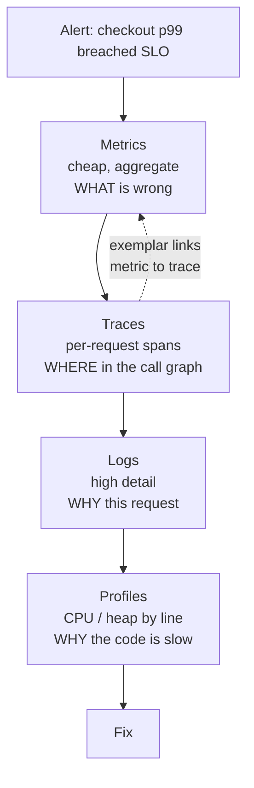

# Observability, SLOs & Error Budgets

> Metrics, traces, logs, cardinality cost, percentiles that do not lie, and on-call you can sustain.

- Track: **Backend & Distributed Systems** · Level: **core** · ~19 min
- [Open in the academy](https://deepeshk1204.github.io/staff-engineer-academy/#/topic/backend/backend-observability)

Monitoring tells you whether the things you predicted would break are broken. Observability is whether you can
answer a question you did not think to ask in advance, using data you already collected -- because the outage you
are in right now is, by definition, one you did not predict.

The practical test is specific: at 3 a.m., with a single user complaining that checkout is slow, can you determine
*which* request, *which* service, and *which* dependency, without deploying new code? If the answer requires adding
a log line and waiting for a release, you have monitoring.

## Why it exists

A monolith on one box could be debugged by attaching a profiler and tailing a log. Twenty services across three
hundred pods cannot, for three reasons that compound. The failure is usually **partial**: 3% of requests fail, all
of them for users whose session landed on one of forty pods, and every aggregate dashboard shows green. It is
usually **emergent**: no single service is broken, but a retry policy in service A amplifies a 200 ms latency
increase in service D into a saturated connection pool in service B. And it is usually **not reproducible**,
depending on a tenant's data shape, a cache state and a concurrency level you cannot recreate locally.

So you instrument for the questions you cannot anticipate. The cost is not zero and it is worth stating up front: a
serious observability stack routinely runs at 5-15% of total infra spend, and at scale the telemetry bill can exceed
the compute bill for the service being observed.

## The pillars, and what each is actually for



*The value is in the arrows. A stack where you cannot jump from a metric spike to an exemplar trace is four disconnected tools.*

| Signal | Cost per unit | Cardinality tolerance | Retention you can afford | Answers |
| --- | --- | --- | --- | --- |
| **Metrics** | Very low -- a time series is a few bytes per scrape | Low. This is the constraint that dominates your bill. | 13+ months | "Is it broken, how broken, since when" |
| **Traces** | Medium, and sampling is mandatory at scale | High -- arbitrary attributes per span | 7-30 days | "Which service and which call in the chain" |
| **Logs** | High -- ingest plus index plus storage | Unlimited | 3-14 days hot, longer in cold object storage | "Why did this specific request behave this way" |
| **Profiles** | Low with modern continuous profilers (~1-2% CPU) | Medium | 7-30 days | "Which function is burning the CPU or leaking" |

Continuous profiling is the fourth pillar and it is the one most teams are missing. eBPF-based profilers (Parca,
Pyroscope, Datadog and GCP's profilers) sample stacks across the fleet at 1-2% overhead, so when a service's CPU
rises 30% after a deploy you can diff flame graphs between versions instead of guessing. It answers the question
traces cannot: a span says `handleCheckout` took 400 ms, a profile says 380 ms of it was JSON serialisation of a
field nobody reads.

## Metric types, and the histogram argument

| Type | Semantics | Use for | Trap |
| --- | --- | --- | --- |
| **Counter** | Monotonically increasing; you query its rate | Requests, errors, bytes, retries | Never reset it; use `rate()` and let the engine handle restarts |
| **Gauge** | A current value that can go up or down | Queue depth, pool size, memory in use, temperature | Sampled every 15-60 s, so it misses everything between scrapes |
| **Histogram** | Pre-defined buckets with cumulative counts | Latency, payload size -- anything where the distribution matters | Bucket boundaries are fixed at instrumentation time; pick badly and you cannot fix it retroactively |
| **Summary** | Client-computed quantiles | Rarely the right choice | **Cannot be aggregated across instances** -- this is the fatal flaw |

A gauge for latency is close to useless and it is a common mistake. If you record "current request duration" as a
gauge scraped every 15 seconds, you observe one request out of perhaps 15,000 and you learn nothing about the tail
-- the slow requests are precisely the ones you are unlikely to sample. A histogram counts *every* request into
buckets, so you can compute any quantile over any time range after the fact, and you can aggregate across instances
because adding bucket counts is a valid operation.

That last property is the whole argument. Buckets are additive; quantiles are not.

## Why you cannot average percentiles

This is the single most common statistical error in production engineering, and explaining it precisely is a
reliable senior signal. A percentile is an *order statistic*: p99 means "the value below which 99% of observations
fall". Averaging two order statistics from two different populations produces a number that is not a percentile of
anything, and has no interpretation.

The concrete failure: instance A serves 10,000 requests with p99 = 50 ms, instance B serves 10 requests with p99 =
4,000 ms because it is thrashing on a full disk. The mean of the two p99s is 2,025 ms, which alarms you about a
problem affecting 0.1% of traffic. Now reverse it: nine healthy instances at 20 ms and one broken one at 5,000 ms
averages to 518 ms, which reads as a moderate general slowdown rather than one dead pod. Both readings are wrong,
in opposite directions, and neither tells you what you need.

**The correct way: aggregate buckets first, then compute the quantile once**

```promql
# WRONG -- averaging pre-computed per-instance quantiles. Meaningless number.
avg(http_request_duration_p99)

# RIGHT -- sum raw bucket counters across instances, interpolate once over the
# whole population. Bucket counts are additive; quantiles are not.
histogram_quantile(0.99,
  sum by (le, route) (rate(http_request_duration_seconds_bucket[5m])))

# Better still for an SLO: ask the ratio directly, with no quantile at all.
# "What fraction was faster than 300 ms?" is exact rather than interpolated,
# and it is what an error budget is computed from.
  sum(rate(http_request_duration_seconds_bucket{le="0.3"}[5m]))
/ sum(rate(http_request_duration_seconds_count[5m]))

# Native histograms (Prometheus 2.40+) replace fixed `le` buckets with
# exponential ones: ~1% relative error at a fraction of the series count.
```

> **The bucket-boundary corollary**  
> `histogram_quantile` interpolates linearly within a bucket, so its accuracy is entirely determined by boundary
> placement. If your buckets jump `0.1, 0.5, 1, 5` and your real p99 is 600 ms, you get a number somewhere between
> 500 and 1000 ms with no better resolution available. Place boundaries densely around your SLO threshold -- if the
> SLO is 300 ms, you want buckets at 0.1, 0.2, 0.25, 0.3, 0.35, 0.5 -- because that is the region where you need to be
> right.

## Cardinality is the bill

A time series is uniquely identified by its metric name plus the full set of label values. The number of series is
the *product* of the distinct values of every label, and it multiplies faster than anyone's intuition. Start with
`http_requests_total{method, status, route}`: 5 methods x 12 statuses x 40 routes = 2,400 series. Reasonable. Add
`pod` with 200 pods and you are at 480,000. Add `customer_id` with 5,000 tenants and you are at 2.4 billion,
which no time-series database survives -- Prometheus OOMs long before, typically between 2 and 10 million active
series on a well-resourced instance.

The unbounded labels that cause real incidents are always the same few: `user_id`, `request_id`, `session_id`,
`trace_id`, raw `url` with path parameters and query strings, `error_message` with stack traces as label
values, and email addresses. Every one is effectively infinite cardinality.

**Label explosion, worked**

- **2,400** — method x status x route (Fine)
- **480k** — + pod (200 pods) (Survivable; use `sum without (pod)` in queries)
- **2.4B** — + customer_id (5,000) (Fatal -- the multiplication, not the addition)
- **~2-10M** — Practical Prometheus ceiling (Active series on one well-resourced instance)
- **~2-4 KB** — RAM per active series (So 5M series is roughly 10-20 GB resident)

The discipline is to keep high-cardinality identity in **traces and logs**, where it belongs and is cheap, and keep
metrics to bounded dimensions. If you need per-tenant latency, emit metrics only for your top 50 tenants by volume
and bucket the rest as `other`, or put tenant-level analysis in a columnar store like ClickHouse rather than in
your metrics backend.

Two mechanical controls are worth having. Normalise route labels so `/users/8891/orders` becomes
`/users/:id/orders` -- otherwise every user id becomes a series. And configure `metric_relabel_configs` to drop
known-bad labels at ingest, so a single bad deploy cannot double your bill before anyone notices.

## OpenTelemetry and context propagation

OpenTelemetry is the vendor-neutral standard for producing telemetry, and its main practical value is that
instrumentation becomes a one-time cost rather than something you redo when you change vendors. Three components:
the **SDK** in your process creates spans and metrics; the **Collector** runs as a sidecar or daemonset and does
batching, filtering, tail sampling and enrichment; **exporters** ship to one or more backends. Route everything
through the Collector rather than exporting directly from applications -- it means you can add a second backend,
change sampling policy, or scrub a leaked PII attribute by editing config rather than redeploying forty services.

**Context propagation** is what makes a trace a trace. Each service receives a `traceparent` header, creates a
child span, and passes it on. The W3C format is compact and worth recognising on sight.

**W3C trace context, and a Collector with tail sampling**

```yaml
# traceparent: version-traceId(16 bytes)-spanId(8 bytes)-flags
# The trailing 01 means "sampled"; 00 means "recorded but not sampled".
traceparent: 00-4bf92f3577b34da6a3ce929d0e0e4736-00f067aa0ba902b7-01
tracestate: mycompany=priority:high

---
processors:
  # Decide AFTER the trace is complete, so you can keep the interesting ones.
  tail_sampling:
    decision_wait: 10s
    policies:
      - { name: keep-errors, type: status_code,
          status_code: { status_codes: [ERROR] } }
      - { name: keep-slow, type: latency, latency: { threshold_ms: 1000 } }
      - { name: always-checkout, type: string_attribute,
          string_attribute: { key: http.route, values: ["/checkout"] } }
      - { name: baseline, type: probabilistic,
          probabilistic: { sampling_percentage: 1 } }

  attributes/scrub:            # cardinality and PII guard
    actions:
      - { key: user.email, action: delete }
      - { key: http.url, action: delete }      # keep http.route instead
```

**Head sampling** decides at the root span, before you know anything: keep 1% of traces, drop the rest. It is
cheap and stateless, and it throws away almost every error and slow request, because those are rare by definition.
**Tail sampling** buffers spans for a few seconds until the trace is complete, then decides -- so you keep 100% of
errors and 100% of requests over a second while keeping 1% of the boring successes. That is what you actually want,
since a 1% sample of a 0.1% error rate leaves you almost no error traces. The cost is memory in the Collector and
the requirement that all spans of a trace reach the *same* Collector instance, which means load-balancing by trace id.

A detail with outsized value: propagate the trace id into your **logs** and into your **message headers**. Logs with
a trace id let you pivot from a span to the exact log lines for that request. Message headers let a trace survive
the async hop through Kafka, without which event-driven debugging is reading timestamps and hoping.

## Structured logging that survives production

Log JSON, one object per event, with a stable field vocabulary. String-interpolated logs are unqueryable at volume
-- you cannot ask "all failures for this tenant in the last hour" of a text blob without a regex that breaks when
someone rewords the message.

Log levels only work if they mean something operationally. `ERROR` should mean "a human should look at this", which
requires it to be rare enough that someone actually does. Most codebases use `ERROR` for expected conditions -- a
validation failure, an upstream 404 -- after which nobody can separate real problems from noise and the level becomes
decorative. A useful rule: `WARN` for what the system recovered from, `ERROR` for what it did not, and neither for
the user's own mistakes.

Two more things matter. **Sample high-volume logs**: keep 100% of errors and 1-5% of successful request logs, because
a 50 KB line at 10,000 requests per second is 500 MB per second and your logging bill will exceed your compute bill.
And **never log secrets or PII** -- Authorization headers, request bodies, card numbers, email addresses -- because
logs are replicated to more places, with weaker access controls and longer retention, than any database you own. A
field deny-list enforced in the logging library and again in the Collector is the control that actually works.

**A log line you can query in six months**

```json
{ "ts": "2026-03-04T11:02:07.412Z", "level": "error",
  "msg": "payment authorisation failed",
  "service": "checkout", "version": "2.14.1", "env": "prod",
  "trace_id": "4bf92f3577b34da6a3ce929d0e0e4736",   // pivot to the trace
  "span_id": "00f067aa0ba902b7",
  "tenant_id": "acme-corp", "route": "POST /checkout",
  "duration_ms": 3021, "upstream": "stripe",
  "error_code": "card_declined", "retry_count": 2 }
```

## RED and USE: what to measure without thinking

Two checklists that cover most of what you need, and they apply to different things. **RED** is for
request-driven services: **R**ate, **E**rrors (as a ratio), **D**uration (the latency distribution). Three metrics
per service, answering "is this service serving its callers". **USE** is for resources -- CPU, disk, connection and
thread pools: **U**tilisation (percent busy), **S**aturation (the queue of work waiting), **E**rrors.

Saturation is the one people omit and it is the most predictive. A connection pool at 100% utilisation with an empty
wait queue is perfectly healthy and fully used; the same pool with 400 requests waiting is the actual cause of your
latency, and utilisation alone cannot distinguish the two. The pairing to remember: **RED tells you the user is
suffering, USE tells you why.** Alert on RED, diagnose with USE.

## SLI, SLO, SLA and error budgets

Precision here matters because the three terms get used interchangeably and they are not the same kind of thing.

An **SLI** is a measurement: a ratio of good events to valid events. "Proportion of `POST /checkout` requests that
returned a non-5xx status in under 300 ms." Note that it is a ratio, that it names the endpoint, and that it defines
both "good" and "valid" -- excluding, for instance, your own load tests. An **SLO** is a target on that SLI over a
window: "99.9% over 28 rolling days." The window is part of the definition, and rolling beats calendar-month because
a bad month should not reset to innocence at midnight on the first. An **SLA** is a contract with a customer carrying
a financial penalty, and your SLO should sit a nine tighter so breaching it is an internal signal, not a refund.

The **error budget** is the arithmetic consequence: `1 - SLO`. It is the amount of failure you have *permission*
to spend, and it reframes reliability from "avoid all errors" to "we have a budget, how do we want to spend it".
Spare budget buys faster deploys and riskier experiments; exhausted budget means the team stops feature work and
fixes reliability. That policy is the point of the whole exercise -- an SLO with no consequence attached is a
dashboard.

**Error budget for 99.9% over 28 days**

- **40 min** — Total budget of bad time (0.1% of 28 days)
- **43,200** — Bad requests allowed (At 500 rps: 0.001 x 43.2M valid requests)
- **14.4x** — Burn rate consuming it in 2 days (The classic fast-burn page threshold)
- **6x** — Burn rate consuming it in ~5 days (One-hour-window fast burn)
- **1x** — Exactly on budget (Sustainable; no action needed)

**Burn rate** is how fast you are spending, expressed as a multiple of the sustainable rate. A burn rate of 1
exhausts the budget exactly at the end of the window. A burn rate of 14.4 exhausts it in 2 days.

Naive alerting fails in both directions: "alert if any errors" pages you constantly, and "alert if the 28-day SLO is
breached" tells you after the damage is irreversible. The standard answer is **multi-window, multi-burn-rate**
alerting, from the Google SRE workbook. Use a fast window to catch severe incidents quickly and a slow window to
catch gradual erosion, and require a short *and* a long window to both be burning before firing -- the long window
provides sensitivity, the short one prevents the alert from staying lit for hours after the incident resolved.

**Multi-window multi-burn-rate policy for a 99.9% / 28-day SLO**

| Burn rate | Long window | Short window | Budget consumed before firing | Action |
| --- | --- | --- | --- | --- |
| 14.4x | 1 hour | 5 min | 2% | **Page.** At this rate the month is gone in 2 days. |
| 6x | 6 hours | 30 min | 5% | **Page.** Severe but slower; still needs someone now. |
| 3x | 1 day | 2 hours | 10% | Ticket. Investigate during business hours. |
| 1x | 3 days | 6 hours | 10% | Ticket. Slow erosion -- usually a regression, not an incident. |

**The fast-burn rule, written out**

```yaml
- alert: CheckoutSLOFastBurn
  # Both windows must be burning: 1h gives sensitivity, 5m makes the alert
  # resolve promptly after recovery. 14.4 * 0.001 is the 14.4x burn threshold.
  expr: |
    (  sum(rate(http_requests_total{route="/checkout",code=~"5.."}[1h]))
     / sum(rate(http_requests_total{route="/checkout"}[1h])) ) > (14.4 * 0.001)
    and
    (  sum(rate(http_requests_total{route="/checkout",code=~"5.."}[5m]))
     / sum(rate(http_requests_total{route="/checkout"}[5m])) ) > (14.4 * 0.001)
  for: 2m
  labels: { severity: page }
  annotations:
    summary: "Checkout burning error budget at 14x -- 28-day budget gone in ~2 days"
    runbook: "https://runbooks/checkout-slo"
```

## Alerting on symptoms, and on-call you can sustain

Alert on what the user experiences, not on what you happen to be able to measure. CPU at 90% is not an incident --
it might be a well-utilised machine. A full disk is not an incident until something fails. But elevated checkout
errors *are* an incident regardless of cause, and they will fire for causes you never anticipated, which is
precisely the property you want.

Cause-based alerts have a specific pathology: each covers one known failure mode, so you accumulate dozens, they
fire in clusters during any real incident (twenty pages for one root cause), and they still miss the novel failure.
Symptom-based alerts are few, they map to SLOs, and one incident produces one page.

Sustainable on-call is mostly two numbers. **Every page must be actionable**: if the responder's correct action is
to acknowledge and go back to sleep, that alert is training them to ignore the next one, so it should be a ticket or
deleted. And **page volume must fit a human**: a widely used benchmark is no more than two pages per shift, with
anything above that treated as a reliability bug and given engineering time. The supporting practices are
unglamorous and they are what actually makes the difference -- a runbook linked from every alert, a blameless
postmortem for every page with owned and dated action items, rotations no heavier than one week in four, and
compensating time off after a genuinely disrupted night.

## Trade-offs

**Trade-offs**

What you gain:
- Mean time to diagnosis drops from hours of guessing to minutes of following a trace.
- SLOs turn "is it reliable enough" from an argument into an arithmetic question with a policy attached.
- Error budgets give you a principled way to say yes to risk when you have room, and no when you do not.
- Traces expose emergent cross-service problems -- retry amplification, N+1 calls -- that no single service's metrics reveal.
- Continuous profiling makes regressions diffable between deploys instead of debatable.
- OpenTelemetry makes instrumentation portable, so a vendor change is a Collector config change.

What it costs you:
- Typically 5-15% of infrastructure spend, and at scale telemetry can cost more than the service it observes.
- Cardinality is a permanent discipline; one careless label can multiply your bill overnight.
- Instrumentation is code that must be maintained, reviewed and kept consistent across services.
- Tail sampling requires stateful Collectors and trace-id-aware load balancing.
- Logs are the highest-risk data you hold for PII, with the weakest access controls and longest reach.
- Dashboards rot: a graph nobody has looked at in six months is negative value during an incident.

**Failure modes**

| Failure mode | What the user sees | Mitigation |
| --- | --- | --- |
| Averaging per-instance p99s | One thrashing pod at p99 = 5 s among nine healthy ones reads as a moderate global slowdown; you chase a fleet-wide theory for an hour. | Export histogram buckets and aggregate with `histogram_quantile(0.99, sum by (le) (rate(..._bucket[5m])))` -- never average quantiles. |
| Unbounded label such as `user_id` or raw URL | Series count explodes, Prometheus OOMs, and you lose all monitoring during the incident that caused it. | Normalise routes to `/users/:id`, enforce a label deny-list in `metric_relabel_configs`, and alert on series growth rate. |
| Head sampling at 1% | Almost no error traces exist, so the one trace you need for a 0.1% failure was discarded before anything was known about it. | Tail sampling in the Collector: 100% of errors and slow requests, 1% baseline. |
| Cause-based alerts instead of symptom-based | Twenty pages for one root cause, plus total silence for the failure mode nobody predicted. | Page on SLO burn rate for user-facing symptoms; demote resource alerts to tickets used for diagnosis. |
| No trace-id propagation across the async boundary | A trace ends at the Kafka publish; debugging the event-driven half is correlating timestamps by hand. | Inject `traceparent` into message headers, extract on consume, and include `trace_id` in every log line. |
| PII in logs | Emails and tokens replicated to a vendor with 30-day retention and broad read access -- a reportable breach with no attacker involved. | Field deny-list in the logging library, a second scrub in the Collector, and a CI check on new log statements. |
| SLO with no error-budget policy, or buckets far from the SLO threshold | The SLO is breached monthly and nothing changes, so it stops being believed; and with buckets at 0.1 and 0.5 a 300 ms target is measured by interpolated guesswork anyway. | Write the consequence down -- budget exhausted means feature freeze -- agreed with the product owner in advance; and place dense bucket boundaries around the threshold, or adopt native histograms. |

> **Staff-level angle**  
> Observability is where interviewers most often find out whether someone has actually carried a pager. The
> statistical point and the cost point are the two strongest signals.
> 
> - "I would not average those p99s -- a percentile is an order statistic and the mean of two
>   percentiles is not a percentile of anything. Nine pods at 20 ms and one at 5 seconds averages
>   to 518 ms, which reads as a general slowdown instead of one dead pod. Export buckets and run
>   `histogram_quantile` over the summed rates."
> - "Before I add `customer_id` as a label, that multiplies my series count by 5,000. Cardinality
>   is the product of label values, not the sum. High-cardinality identity belongs in traces and
>   logs; if we need per-tenant latency I would emit it for the top 50 and bucket the rest."
> - "Head sampling at 1% throws away the traces I actually need, because errors are rare by
>   construction. I want tail sampling in the Collector: everything that errored, everything over
>   a second, and 1% of the boring successes."
> - "I would page on burn rate, not on threshold. 14.4x over a one-hour window with a five-minute
>   short window as confirmation -- the long window gives sensitivity, the short one makes the
>   alert clear once we have recovered."
> - "My SLI is the fraction of `POST /checkout` requests returning non-5xx under 300 ms, over 28
>   rolling days, excluding synthetic load -- a ratio of good events to valid events, and I want to
>   agree what counts as valid before we agree the target. The SLO is only real if a policy is
>   attached: budget exhausted means we stop feature work, agreed with the product owner in writing
>   before the first incident rather than during it."
> - "That alert is not actionable, so it is training the on-call to ignore pages. I would make it a
>   ticket. My target is under two pages per shift, and anything above that gets engineering time
>   like any other bug."
> - "The trace has to survive the Kafka hop, so `traceparent` goes in the message headers and
>   `trace_id` goes in every log line. Otherwise half the system is invisible and we are back to
>   correlating timestamps."
> 
> The meta-signal: a strong candidate talks about telemetry *cost* and *actionability* without prompting, because both
> are things you only learn by owning the bill and the pager.

**Check**

Nine pods report p99 latency of 20 ms; one reports 5,000 ms. Your dashboard shows `avg(p99) = 518 ms`. What is wrong?
- A. Nothing -- 518 ms is the correct fleet p99.
- B. Percentiles cannot be averaged; you must sum histogram buckets across pods and compute the quantile once. **(answer)**
- C. The scrape interval is too long.
- D. You should use `max()` instead of `avg()`.

  A percentile is an order statistic over a population, and averaging two of them yields a number with no interpretation -- it is neither the fleet p99 nor the p99 of anything else. Here it hides the real story (one broken pod) behind a plausible-looking general slowdown. `max()` is better as a diagnostic but it is still not the fleet p99. The correct approach is to export bucket counters, sum them across pods, and call `histogram_quantile` once over the combined distribution, because bucket counts are additive while quantiles are not.

You add a `customer_id` label to `http_requests_total{method, status, route}` with 5 methods, 12 statuses, 40 routes and 5,000 customers. Impact?
- A. About 5,000 new series.
- B. About 7,000 series total -- labels add.
- C. Up to 12 million series, because cardinality is the product of label values. **(answer)**
- D. No impact; Prometheus compresses repeated labels.

  Each unique combination of label values is its own time series, so the count multiplies: 5 x 12 x 40 x 5,000 = 12,000,000. That alone exceeds what a single well-resourced Prometheus instance handles, and at roughly 2-4 KB of RAM per active series it is tens of gigabytes of memory. The consequence is worse than a bill -- your metrics backend OOMs during the incident its own label caused. Put tenant identity in traces and logs, and if you need per-tenant metrics, emit them for your top N tenants and bucket the rest.

Your SLO is 99.9% over 28 days and you are currently burning budget at 14.4x. What does that mean and what should happen?
- A. You have breached the SLO already; declare an outage.
- B. At this rate the entire 28-day budget is consumed in about 2 days, so it should page. **(answer)**
- C. You are within budget, so no action is needed.
- D. The error rate is 14.4%.

  Burn rate is a multiple of the sustainable consumption rate: 1x exactly exhausts the budget at the end of the window, so 14.4x exhausts it in 28/14.4 ≈ 2 days. That is the canonical fast-burn page threshold, and pairing the 1-hour window with a 5-minute short window means the alert is both sensitive and prompt to resolve. Note the error rate is 14.4 x 0.1% = 1.44%, not 14.4%, and waiting for the 28-day SLO to actually breach would mean alerting long after the damage was irreversible.

Which alert best fits the symptom-based principle for a checkout service?
- A. CPU on any checkout pod above 85% for 5 minutes.
- B. Checkout error-budget burn rate above 14.4x over 1 hour, confirmed by a 5-minute window. **(answer)**
- C. Database connection pool utilisation above 90%.
- D. Any pod restart in the checkout deployment.

  The burn-rate alert fires when users are actually being harmed, regardless of cause -- including causes nobody anticipated, which is the property that makes it valuable. The other three are cause-based: high CPU may be a well-utilised machine, a pool at 90% utilisation with an empty wait queue is healthy, and a pod restart during a rolling deploy is normal. They are excellent *diagnostic* signals and belong on the dashboard you open after the page, not on the pager.

<details><summary>Related topics and how they connect</summary>

Consumer lag alerting and per-partition metrics are covered in **Queues & Event Streaming**. Saturation as the
leading indicator of latency collapse connects to **Resilience: Timeouts, Retries & Backpressure** and to the
queueing maths in **Scalability & Capacity Planning**. Replication lag in bytes is the metric that matters in
**Replication & Consistency Models**. Trace propagation across async hops is the same envelope discussion as in
**Event-Driven Architecture, Sagas & CQRS**, and canary analysis driven by SLIs is how safe deploys work in
**Containers, Kubernetes & Safe Deploys**.

</details>

## Flashcards

- **Why can you not average percentiles?** — A percentile is an order statistic over a population, so the mean of two percentiles is not a percentile of anything. Nine pods at 20 ms plus one at 5 s averages to 518 ms, hiding one dead pod behind an apparent general slowdown. Sum histogram buckets across instances, then compute the quantile once.
- **Why is a histogram better than a gauge for latency?** — A gauge samples one request every scrape interval, missing the tail almost entirely. A histogram counts every request into buckets, so any quantile can be computed over any range afterwards -- and bucket counts are additive across instances, which quantiles are not.
- **How does metric cardinality grow with labels?** — Multiplicatively -- series count is the product of distinct values across all labels. 5 methods x 12 statuses x 40 routes x 5,000 customers is 12 million series. Keep identity in traces and logs; metrics get bounded dimensions only.
- **Head sampling vs tail sampling?** — Head sampling decides at the root span before anything is known, so a 1% rate discards nearly all errors. Tail sampling buffers until the trace completes, letting you keep 100% of errors and slow traces plus a 1% baseline -- at the cost of stateful Collectors and trace-id-aware load balancing.
- **Define SLI, SLO, SLA precisely.** — SLI is a measured ratio of good events to valid events. SLO is a target on that SLI over a stated window (99.9% / 28 rolling days). SLA is a customer contract with a financial penalty, and your SLO should be a nine tighter so breaching it is an internal signal, not a refund.
- **What is an error budget and what makes it useful?** — `1 - SLO`, expressed as allowed bad events or bad time -- 99.9% over 28 days is about 40 minutes. It is useful only with a policy attached: spare budget buys faster deploys and riskier experiments, exhausted budget means feature work stops.
- **What is a 14.4x burn rate, and why alert on two windows?** — You are consuming error budget 14.4x faster than sustainable, so a 28-day budget is gone in about 2 days -- the canonical fast-burn page threshold. Pair a long window (sensitive enough to catch real erosion) with a short confirmation window (so the alert clears after recovery); requiring both avoids paging on every blip and avoids noticing only once the SLO has already broken.
- **RED vs USE?** — RED (Rate, Errors, Duration) measures request-driven services and tells you the user is suffering. USE (Utilisation, Saturation, Errors) measures resources and tells you why. Saturation -- the queue of waiting work -- is the most predictive and the most often omitted.
- **What makes on-call sustainable?** — Every page is actionable or it becomes a ticket; under roughly two pages per shift, with excess treated as a reliability bug getting engineering time; a runbook linked from every alert; blameless postmortems with owned action items; and rotations no heavier than one week in four.

## Drills

### Drill

You inherit a 14-service platform with 400 Grafana dashboards, 220 alert rules, and an on-call rotation averaging 11 pages per night. MTTR is around 90 minutes. The observability bill is $180k/month against $600k of compute. Give a 90-day plan.

Probes:

- Where do you start, and what evidence do you use to choose?
- How do you decide which of the 220 alerts to delete?
- What would you cut first to reduce the bill, and what would you refuse to cut?
- How do you get MTTR down when the dashboards already exist?
- How do you know at day 90 whether it worked?

Strong answer contains:

- Starts by auditing pages over the last 30-60 days for actionability -- what fraction led to a human action -- and treats page volume as a reliability bug with engineering time attached.
- Replaces cause-based alerts with a small set of SLO burn-rate alerts per user-facing journey, then deletes the cause-based ones rather than keeping both.
- Defines SLIs concretely as good-events-over-valid-events per critical route, agrees windows, and gets an error-budget policy signed off by the product owner in advance.
- Implements multi-window multi-burn-rate (14.4x/1h with 5m confirmation to page, 6x/6h to page, 3x/1d to ticket) rather than static thresholds.
- Attacks cost by cardinality audit first -- finds the unbounded labels, normalises route labels, adds `metric_relabel_configs` deny-lists -- then log sampling, while refusing to cut error traces or error logs.
- Moves to tail sampling so trace spend buys errors and slow requests rather than a random 1%.
- Attacks MTTR through trace-id propagation into logs and message headers, exemplar links from metrics to traces, and a runbook on every remaining alert -- not more dashboards.
- Names day-90 success metrics: pages per shift, fraction of pages actionable, MTTR, telemetry spend as a percentage of compute, and active series count.

Weak answer tells:

- Proposes building more dashboards or migrating to a different vendor as the primary fix.
- Reduces cost by cutting retention across the board, including error data.
- Adds alerts rather than deleting them, or keeps cause-based alerts alongside new SLO alerts.
- No mention of cardinality as the cost driver, or of an error-budget policy with product-owner agreement.
- Treats 11 pages a night as a staffing problem rather than a signal-quality problem.

### Drill

Checkout p99 has risen from 180 ms to 1.4 s over four hours. There has been no deploy. Aggregate error rate is 0.3%, roughly normal. You have Prometheus, OpenTelemetry traces at 1% head sampling, and structured logs. Walk through your investigation and say what you would change afterwards.

Probes:

- What is the first query you run, and why that one?
- Your 1% head sample has almost no slow traces. What now?
- How do you tell a single bad pod from a fleet-wide regression?
- The p99 is up but errors are not. What class of causes does that suggest?
- What would you change so the next occurrence is faster to diagnose?

Strong answer contains:

- Starts by decomposing the aggregate: `histogram_quantile` grouped by route, then by pod, then by tenant, to find whether the regression is concentrated or uniform.
- Recognises that 1% head sampling is the immediate obstacle and proposes tail sampling as the durable fix, while using logs filtered on `duration_ms` plus their `trace_id` as the workaround right now.
- Reads latency-up-with-errors-flat as saturation or a slow dependency rather than a failure: checks connection-pool wait time, GC pause, replication lag, and downstream p99 via USE.
- Considers non-deploy causes explicitly: data growth crossing an index threshold, a tenant changing behaviour, cache hit rate dropping, replica lag, or a noisy neighbour.
- Uses continuous profiling flame-graph diffs against four hours ago if available, and names it as the gap to close if not.
- Follow-up actions are specific: tail sampling, exemplars linking the latency histogram to traces, per-tenant and per-pod breakdowns pre-built, and pool saturation as a first-class dashboard panel.

Weak answer tells:

- Restarts pods and calls it resolved without identifying a cause.
- Trusts the aggregate p99 and never breaks it down by pod, route or tenant.
- Does not notice that 1% head sampling makes the traces useless for this investigation.
- Assumes a code change despite there being no deploy, or proposes scaling up as the diagnosis rather than a mitigation.
- No follow-up changes, so the next occurrence takes just as long.
