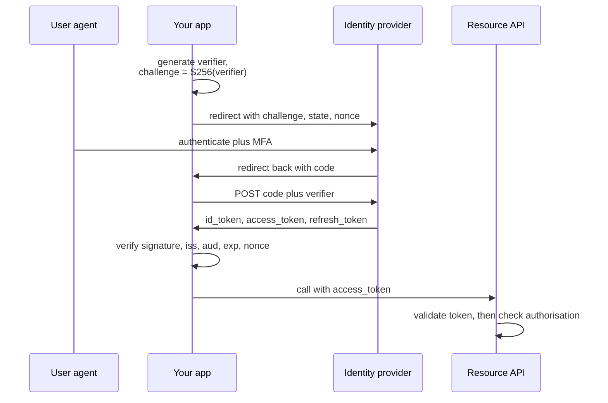

# Backend Security & Identity

> OAuth2/OIDC flows, JWT pitfalls, session design, secrets, and authorisation that scales.

- Track: **Backend & Distributed Systems** · Level: **core** · ~21 min
- [Open in the academy](https://deepeshk1204.github.io/staff-engineer-academy/#/topic/backend/backend-security)

Backend security is three separable questions that get collapsed into one. **Who is this?** is authentication.
**What are they allowed to do?** is authorisation. **What does the system durably know about them?** is identity.

Collapsing them is how real breaches happen. A service that correctly validates a token and then trusts a
`tenant_id` field inside the request body has authenticated perfectly and authorised nothing, and any customer can
read any other customer's data. The token was never the control.

## Why it exists

Three shifts made backend security structurally harder than it was.

Passwords stopped being enough. Users have accounts on hundreds of services, they reuse passwords, and
credential-stuffing lists containing billions of leaked pairs are freely available. So identity moved to dedicated
providers, and your backend's job became *verifying assertions issued by someone else* rather than checking a
password hash.

The perimeter disappeared. "Inside the VPC is trusted" was tenable when there was one datacentre and a firewall.
With hundreds of pods, third-party SaaS, contractors and CI systems holding credentials, one compromised container
inside the network used to mean total access. Zero-trust inverts the default: every call authenticates, network
position proves nothing.

And multi-tenancy put other customers' data one bug away. In a single-tenant deployment, an authorisation bug leaks
your own data to yourself. In a shared database, a missing `WHERE tenant_id = ?` is a cross-customer breach, a
disclosure obligation, and a contract problem.

## OAuth 2.1 and OIDC: which flow, and when

OAuth 2.0 is a *delegated authorisation* framework: it lets an application obtain a token to call an API on a user's
behalf. OIDC is a thin layer on top that adds *authentication* -- it defines an **ID token** that tells your
application who the user is. The distinction matters because using the wrong one of these two is a classic
vulnerability.

OAuth 2.1 is the consolidation of a decade of security guidance into the baseline: PKCE is mandatory for all
authorisation code flows, the implicit flow is removed, the resource owner password credentials grant is removed,
and bearer tokens must not be passed in query strings. Knowing that these were *removed* rather than merely
discouraged is a useful signal.

| Flow | Use for | Mechanism | Why not the others |
| --- | --- | --- | --- |
| **Authorization code + PKCE** | Every user-facing app: SPA, mobile, server-rendered web | Client sends `code_challenge` = SHA-256 of a secret verifier; redeems the code with the verifier | The only flow that is safe for a public client. PKCE means a stolen authorization code is useless without the verifier. |
| **Client credentials** | Service-to-service with no user involved | Client id + secret (or a signed JWT assertion) exchanged for an access token | There is no user to redirect, so no browser flow applies. Prefer mTLS or workload identity over a long-lived secret. |
| **Device authorization** | TVs, CLIs, IoT -- no browser or no keyboard | Device shows a short code; user authorises on a phone; device polls the token endpoint | You cannot run a redirect flow without a browser, and you must never collect the password. |
| **Refresh token** | Extending a session without re-prompting | Exchange a refresh token for a new access token | Not a login flow -- it is the continuation of one, and it is your highest-value credential. |
| **Implicit** (removed) | Nothing | Token returned in the URL fragment | Tokens leak via history, referrers and logs, and there is no way to bind them to the client. PKCE replaced it entirely. |
| **Password grant** (removed) | Nothing | App collects the password and posts it | Trains users to type passwords into third-party apps, and defeats MFA and step-up entirely. |



*Two independent checks at the end. Token validity answers who; the authorisation check answers whether.*

> **What an ID token is NOT for**  
> An ID token is a statement *to your application* that a user authenticated, with an `aud` claim naming your
> client. It is **not** an API credential. Sending an ID token as a bearer token to a resource server is a real and
> common bug: the resource server's audience check should reject it, and if it does not, you have a token that was
> never scoped for that API being accepted as authorisation. Use the ID token to establish a session, then use the
> **access token** -- which carries `scope` and an `aud` naming the API -- for API calls. Check `aud` on both
> sides.

## JWTs: what they are good at, and what they are not

A JWT is a signed, base64url-encoded JSON object. Its one real property is that a verifier holding the public key
can check it *without a network call*. That is genuinely valuable, and it is also the source of every problem,
because a token you can validate offline is a token you cannot revoke.

The pitfalls are well documented and still shipped constantly.

**Algorithm confusion.** The `alg` header is attacker-controlled input. Historically, libraries would read `alg:
none` and accept an unsigned token, or accept `alg: HS256` and verify the signature using your *RSA public key as
an HMAC secret* -- which the attacker also has, since it is public. The fix is to never trust the header: configure
the expected algorithm and key explicitly in your verifier and reject anything else.

**No revocation.** If an access token is valid for 24 hours and you discover at hour two that the user was
compromised or their role was downgraded, there is nothing to invalidate. The token is self-contained and every
service will happily accept it. The only real mitigations are short expiry and an out-of-band denylist -- and a
denylist is a network lookup, which means you have rebuilt the session store you were trying to avoid.

**Long expiry.** People set 24 hours or 7 days to avoid handling refresh, which turns a single token theft into a
week of access. Access tokens should live 5-15 minutes.

**Using them as sessions.** A browser session has requirements a JWT is poor at: immediate logout, permission
changes taking effect now, and server-side state. An opaque session id in an `HttpOnly` cookie meets all three and
requires one fast cache lookup -- typically under a millisecond from Redis.

**JWT vs opaque session token, honestly**

|  | JWT (self-contained) | Opaque token + server store |
| --- | --- | --- |
| Validation | Local signature check, ~10-50 µs, no network | Store lookup, ~0.2-1 ms from Redis |
| Revocation | **Not possible** without a denylist, which reintroduces the lookup | Immediate -- delete the record |
| Permission changes | Take effect only at next token refresh | Take effect on the next request |
| Scale | Stateless; no shared dependency | Needs a shared store, which is a dependency and a failure domain |
| Size on the wire | ~600-2000 bytes on every request | ~32-64 bytes |
| Leaked token blast radius | Valid until `exp` -- unbounded by your actions | Until you delete it |
| Right for | Short-lived service-to-service calls; access tokens with 5-15 min expiry | Browser sessions, anything needing logout, anything needing live permission changes |
| Worst pattern | A 7-day JWT in `localStorage` used as a session | A session store with no expiry and no rotation |

The defensible default for a web product: **opaque session cookie for the browser, short-lived JWT access tokens for
service-to-service and API clients.** The cookie is `HttpOnly; Secure; SameSite=Lax` so JavaScript cannot read it
and XSS cannot exfiltrate it, which is the argument that settles the "where do I store the token" debate --
`localStorage` is readable by any script on the page.

## Refresh token rotation and reuse detection

A refresh token is long-lived and therefore your most valuable credential. **Rotation** means every use returns a
new refresh token and invalidates the old one, so a stolen token is useful only until the legitimate client next
refreshes.

**Reuse detection** is the part that makes rotation powerful. Keep refresh tokens in a family that shares an id. If
a token that has already been rotated is presented again, exactly one of two things happened: either an attacker
stole it and the real client already used it, or the attacker used it first and the real client is now presenting
it. You cannot tell which, and you do not need to -- the correct response either way is to **invalidate the entire
family** and force re-authentication. One theft costs the user one login prompt, which is a very good trade.

**Rotation with family-wide revocation**

```sql
CREATE TABLE refresh_tokens (
  id           uuid PRIMARY KEY,
  family_id    uuid NOT NULL,          -- all descendants of one login
  user_id      text NOT NULL,
  token_hash   bytea NOT NULL,         -- store a hash, never the token
  parent_id    uuid REFERENCES refresh_tokens(id),
  used_at      timestamptz,            -- non-null means already rotated
  expires_at   timestamptz NOT NULL,
  client_ip    inet,
  user_agent   text
);
CREATE UNIQUE INDEX ON refresh_tokens (token_hash);
CREATE INDEX ON refresh_tokens (family_id) WHERE used_at IS NULL;

-- On refresh, atomically claim the token. Zero rows updated means it was
-- already used: that is reuse, and it is treated as compromise.
UPDATE refresh_tokens
   SET used_at = now()
 WHERE token_hash = $1
   AND used_at IS NULL
   AND expires_at > now()
RETURNING id, family_id, user_id;

-- Reuse detected: burn the whole family and force re-authentication.
DELETE FROM refresh_tokens WHERE family_id = $1;
-- Then: audit-log it, and alert if one user trips this repeatedly.
```

## Service-to-service identity: mTLS and SPIFFE

Inside your platform, the question is not "which user" but "which workload". Shared static API keys are the common
answer and they are poor: they are long-lived, they are copied into config and CI, they end up in a Slack message,
and rotating one means a coordinated deploy across every consumer.

**mTLS** solves it by having both sides present certificates. The server verifies the client's certificate chain,
and the identity is the certificate subject -- a cryptographic claim rather than a shared secret. **SPIFFE**
standardises what that identity looks like: a URI such as
`spiffe://prod.example.com/ns/payments/sa/charge-worker`, encoding trust domain, namespace and service account.
SPIRE (or Istio, or Linkerd) issues short-lived certificates -- often one hour -- and rotates them automatically, so
there is no long-lived secret anywhere and no rotation project.

The operational win is that authorisation policy becomes readable and reviewable: "only
`spiffe://prod/ns/payments/*` may call `POST /charges`" is a statement you can put in a pull request and enforce
at the sidecar, before the request reaches your code. The cost is a service mesh, a certificate authority you now
operate, and a genuinely harder debugging experience when a handshake fails.

## Authorisation models

| Model | Decision based on | Expresses well | Fails at | Real systems |
| --- | --- | --- | --- | --- |
| **RBAC** | The user's roles | "Admins can delete users" | Anything per-resource. You end up with `editor_project_8891` roles and a role explosion. | Almost every product's first iteration; Kubernetes RBAC |
| **ABAC** | Attributes of user, resource, action and environment | "Managers can approve expenses under $5,000 in their own cost centre during business hours" | Answering "who can see this document" -- you must evaluate every user against the policy | AWS IAM policies, Open Policy Agent / Rego |
| **ReBAC (Zanzibar)** | Relationships in a graph, with inheritance | "Anyone with edit on the parent folder has edit on this file" | Attribute conditions like time of day or IP range | Google Drive/Docs, GitHub, SpiceDB, OpenFGA, Auth0 FGA |
| **ACL** | An explicit list per resource | Small, flat, arbitrary sharing | Inheritance and scale -- lists grow unbounded and are impossible to audit | Filesystems, S3 object ACLs |

The progression is predictable. You start with RBAC because it is simple and it is right for a while. Then a
customer asks for per-project permissions and you add `role:editor:project:8891`, and six months later you have
40,000 roles and no way to answer "what can this user see". That is the signal you needed relationship-based
authorisation.

Google's **Zanzibar** paper is the reference design, and it is worth knowing the shape: store tuples of
`object#relation@subject` -- `doc:readme#viewer@user:anne`, `doc:readme#parent@folder:eng` -- plus a namespace
config declaring that `viewer` on a doc is implied by `viewer` on its parent. A check then walks the graph.
SpiceDB and OpenFGA are open implementations. The genuinely hard part Zanzibar solves is *consistency*: a permission
check must not use a cached decision from before you revoked access, which is why Zanzibar has zookies -- tokens
that pin a check to a point in time.

> **The multi-tenant enforcement point problem**  
> Authorisation is only as good as its weakest enforcement point, and scattering `if (user.tenantId !==
> row.tenantId)` through your handlers guarantees one will be missing -- usually in the report endpoint added under
> deadline pressure, or in an admin tool, or in a background job that "runs as system".
> 
> Push enforcement down to a layer that cannot be forgotten. Postgres **row-level security** with a per-request `SET
> LOCAL app.tenant_id` makes the database itself reject cross-tenant rows even if your code forgets. A repository
> layer that requires a tenant-scoped context object to construct a query works too, and is easier to adopt
> incrementally. The principle: make the *insecure* thing the one that requires extra effort.

**Row-level security as a backstop your code cannot bypass**

```sql
ALTER TABLE invoices ENABLE ROW LEVEL SECURITY;
ALTER TABLE invoices FORCE ROW LEVEL SECURITY;   -- applies to the table owner too

CREATE POLICY tenant_isolation ON invoices
  USING      (tenant_id = current_setting('app.tenant_id', true)::uuid)
  WITH CHECK (tenant_id = current_setting('app.tenant_id', true)::uuid);
-- USING filters reads; WITH CHECK stops writing a row into another tenant.

-- Per request, inside the transaction, from the verified token -- never from
-- the request body or a header the client controls.
BEGIN;
  SET LOCAL app.tenant_id = '7c9e...';
  SELECT * FROM invoices WHERE status = 'unpaid';   -- scoped whether you like it or not
COMMIT;

-- Caveat worth knowing: with a connection pool you MUST use SET LOCAL inside a
-- transaction, not SET, or the value leaks to the next request on that connection.
```

## Input validation and injection

**SQL injection** is solved, and it is solved by parameterisation, not by escaping. A prepared statement sends the
query text and the values separately, so the value can never be parsed as SQL -- it is not a matter of quoting it
well enough. The remaining gotcha is that identifiers (table and column names) and `ORDER BY` clauses cannot be
parameterised, so a sortable API endpoint that interpolates a column name needs an explicit allowlist. That is where
injection still appears in codebases that "use an ORM".

**SSRF** is the one that bites cloud backends hardest, because it turns a feature into a credential leak. Any
endpoint that fetches a user-supplied URL -- webhook validation, image import, "preview this link" -- can be pointed
inward. The canonical attack targets the cloud metadata endpoint at `169.254.169.254`, which on IMDSv1 returns
temporary IAM credentials to anything that asks with a plain GET. That is how the 2019 Capital One breach worked.

The defences that hold, in order: **enforce IMDSv2**, which requires a PUT to obtain a token and sets a hop limit so
a proxied request cannot reach it. Resolve the hostname yourself and reject private, loopback, link-local and
reserved ranges -- then connect to *that resolved IP*, because otherwise DNS can return a public address for
validation and a private one for the actual fetch (DNS rebinding). Allowlist schemes to `http` and `https`,
forbid redirects to newly-private addresses, and where the risk is high, egress through a dedicated proxy on a
network segment with no route to internal services.

**Deserialisation** of untrusted data into arbitrary object types is remote code execution in several ecosystems --
Java native serialisation, Python `pickle`, PHP `unserialize`, and YAML loaded with a full constructor. The rule
is simple: never deserialise untrusted input into types the payload gets to choose. Use JSON with an explicit
schema, and `yaml.safe_load`.

**The four that recur in real code review**

```python
# 1. SQL: parameterise. Escaping is not a defence.
cur.execute("SELECT * FROM users WHERE email = %s", (email,))          # safe
# ORDER BY cannot be parameterised -- allowlist it.
SORTABLE = {"created_at", "total_cents", "status"}
if sort not in SORTABLE: raise BadRequest()
cur.execute(f"SELECT * FROM orders ORDER BY {sort} DESC")              # safe via allowlist

# 2. SSRF: resolve first, validate the IP, then connect to that IP.
import ipaddress, socket
def safe_fetch(url):
    p = urlparse(url)
    if p.scheme not in ("http", "https"): raise BadRequest()
    ip = ipaddress.ip_address(socket.gethostbyname(p.hostname))
    if ip.is_private or ip.is_loopback or ip.is_link_local or ip.is_reserved:
        raise BadRequest()                 # blocks 169.254.169.254 and 10.0.0.0/8
    return requests.get(url, allow_redirects=False, timeout=5)

# 3. Deserialisation: never let the payload choose the type.
data = json.loads(body); Order.model_validate(data)   # safe: explicit schema
cfg  = yaml.safe_load(body)                           # safe
# pickle.loads(body)  <- remote code execution, no exceptions

# 4. Timing: compare secrets in constant time.
hmac.compare_digest(provided_signature, expected_signature)
```

## Secrets, encryption and audit

**Secrets** should be short-lived and issued to a verified workload identity, not long-lived strings in environment
variables. Vault, AWS Secrets Manager and GCP Secret Manager all support dynamic credentials: the application
authenticates with its workload identity and receives a database password valid for one hour, which the platform
rotates automatically. That converts "rotate the database password" from a coordinated multi-team deploy into a
non-event. If you must hold static secrets, they belong in a manager with audit logging and IAM-scoped access --
never in Git, never in a container image layer (where they persist even if a later layer deletes them), and never in
a CI log.

Rotation only counts if it is *tested*. A secret nobody has ever rotated is a secret you cannot rotate during an
incident, and discovering that at 3 a.m. during a suspected compromise is the worst possible time.

**Encryption in transit** is TLS 1.3 everywhere, including inside the VPC, because zero-trust means the network is
not a trust boundary. **Encryption at rest** via disk or database encryption protects against a stolen disk or a
mispermissioned snapshot -- a real threat, and a narrow one. It does not protect against a compromised application,
because your application has the key by construction. For genuinely sensitive fields, application-level encryption
with per-tenant keys in a KMS is a meaningfully stronger control: a SQL injection then yields ciphertext, and
per-tenant keys give you crypto-shredding for deletion requests.

**Audit logging** is separate from application logging and has different requirements: an append-only record of who
did what to which resource and when, in a store the application cannot rewrite, retained for years rather than days.
The fields that matter are actor (including the real actor behind any impersonation), action, resource, timestamp,
source IP, outcome, and the request id that ties it to your traces. Log authorisation *denials* too -- a burst of
denials is one of the highest-signal indicators of an attack in progress, and most teams only log successes.

## Trade-offs

**Trade-offs**

What you gain:
- Delegating authentication to an OIDC provider gets you MFA, passkeys, device trust and breach detection you would never build.
- Short-lived tokens bound the blast radius of theft to minutes instead of days.
- Refresh rotation with reuse detection converts a silent theft into a detectable, containable event.
- mTLS with SPIFFE removes long-lived service credentials and makes service-to-service policy reviewable in a pull request.
- Row-level security makes cross-tenant leakage a database-enforced impossibility rather than a code-review hope.
- Audit logs of denials give you attack detection, not just compliance paperwork.

What it costs you:
- OAuth/OIDC has many footguns and a correct implementation requires reading the spec, not copying a blog post.
- Short token lifetimes mean refresh logic, clock-skew tolerance and a harder time debugging expiry.
- Opaque sessions need a shared store, which is a new dependency and a new failure domain.
- Service mesh and mTLS add real operational complexity and a certificate authority you now own.
- ReBAC is a graph database on your request path; every check is a network call you must cache carefully.
- Row-level security interacts subtly with connection pooling, and policies are easy to write inefficiently.
- Application-level field encryption breaks search, sorting and indexing on those columns.

**Failure modes**

| Failure mode | What the user sees | Mitigation |
| --- | --- | --- |
| Tenant id taken from the request body instead of the verified token | Any authenticated customer reads any other customer's data by editing one field. Full cross-tenant breach with a disclosure obligation. | Derive tenant from the token only, and enforce with row-level security so a forgotten check cannot leak rows. |
| Algorithm confusion -- verifier trusts the `alg` header | Attacker forges tokens using your public key as an HMAC secret, or sends `alg: none`. Complete authentication bypass. | Pin the expected algorithm and key in the verifier configuration; reject any token whose header disagrees. |
| JWT used as a session with 7-day expiry in `localStorage` | One XSS yields a week of full account access, unrevocable, and logout does nothing. | Opaque session id in an `HttpOnly; Secure; SameSite` cookie, with 5-15 minute access tokens for APIs. |
| SSRF reaching IMDSv1 | Temporary IAM credentials exfiltrated via a webhook-validation feature; attacker now has your role's permissions. This is the Capital One breach. | Enforce IMDSv2 with a hop limit, resolve and validate the IP before connecting, block private ranges, disallow redirects, and egress through a restricted proxy. |
| Refresh token with no rotation | A single stolen token grants indefinite access with no detection and no signal that anything happened. | Rotate on every use, detect reuse, and revoke the entire token family on reuse -- costing the user one login. |
| Static database password in an environment variable, never rotated | One leaked container spec or CI log is permanent database access; rotating requires a coordinated deploy nobody has rehearsed. | Dynamic credentials from a secrets manager against a workload identity, with a one-hour TTL and automatic rotation. |
| `ORDER BY` column interpolated from a query parameter | SQL injection in a codebase that "uses an ORM" and believes it is safe. | Identifiers cannot be parameterised -- allowlist the permitted columns explicitly. |
| Authorisation denials not logged | An attacker enumerating resources is invisible; you learn about the breach from the successful request only. | Audit-log denials with actor, resource and source IP, and alert on denial-rate spikes per principal. |

> **Staff-level angle**  
> Security answers separate candidates fast, because the vocabulary is easy to acquire and the mechanisms are not.
> What a strong candidate says:
> 
> - "Which of authentication and authorisation are we actually discussing? The token tells me who
>   the caller is. It does not tell me they are allowed to touch *this* row, and that second check
>   is where the breaches are."
> - "I would never read `tenant_id` from the request body. It comes from the verified token, and I
>   would back it with Postgres row-level security and `SET LOCAL app.tenant_id` inside the
>   transaction -- so the day someone adds an endpoint and forgets the filter, the database returns
>   nothing instead of everything."
> - "Authorization code with PKCE, for every client including the server-rendered one. Implicit and
>   the password grant were removed in OAuth 2.1, not just discouraged."
> - "The ID token establishes my session; the access token calls the API. Sending an ID token as a
>   bearer token is a real bug, and the resource server's `aud` check is what catches it."
> - "I would not use a JWT as a browser session. The property I need most is immediate logout and
>   immediate permission change, and a self-contained token cannot give me either. Opaque id in an
>   `HttpOnly` cookie, a sub-millisecond Redis lookup, and I can revoke it."
> - "Refresh tokens rotate on every use, and if a rotated token is presented again I burn the whole
>   family. I cannot tell whether the attacker or the user got there first, and I do not need to --
>   the cost of being wrong is one login prompt."
> - "This webhook-validation endpoint is an SSRF. I would enforce IMDSv2 so the metadata endpoint
>   needs a PUT and a hop limit, resolve the hostname myself, reject private and link-local ranges,
>   and connect to the resolved IP so DNS rebinding cannot switch the target after validation."
> - "RBAC will hold for about a year. The moment a customer asks for per-project permissions you
>   get `editor_project_8891` roles, and the honest question becomes whether to adopt a
>   Zanzibar-style relationship model now or pay a migration later."
> - "I want denials in the audit log, not just successes. A spike in denials for one principal is
>   the best early signal of an attack that I get for free."
> 
> The pattern: name the enforcement point, name the failure mode of forgetting it, and name the control that makes
> forgetting harmless. "We validate the JWT" is not a security design.

**Check**

Your API validates the JWT signature, expiry and issuer correctly, then reads `tenant_id` from the JSON request body to scope the query. What is the risk?
- A. None -- the token was verified, so the caller is authenticated.
- B. Any authenticated user can read any tenant's data by changing one field; authentication was correct and authorisation is absent. **(answer)**
- C. Only a risk if the token is stolen.
- D. The body should be signed as well.

  Authentication and authorisation are separate checks, and only the first was performed. A valid token proves who the caller is; it says nothing about which tenant's rows they may touch, so a client-supplied tenant id is simply an unauthenticated parameter. Tenant must be derived from the verified token claims, and it should be enforced at a layer that cannot be forgotten -- row-level security with `SET LOCAL app.tenant_id` inside the transaction means a handler that omits the filter returns zero rows rather than everyone's.

Why is a 7-day JWT stored in `localStorage` a poor session mechanism?
- A. JWTs are too large for `localStorage`.
- B. It cannot be revoked, permission changes do not take effect, and any XSS exfiltrates a week of full access. **(answer)**
- C. JWT signatures expire independently of the token.
- D. `localStorage` is not available in private browsing.

  A self-contained token is validated offline, which is exactly why you cannot invalidate it -- logout becomes a client-side gesture and a role downgrade does not apply until the token expires. `localStorage` is readable by any script on the page, so one XSS yields seven days of unrevocable access. An opaque session id in an `HttpOnly; Secure; SameSite` cookie is unreadable by JavaScript, revocable by deleting one record, and costs a sub-millisecond cache lookup. Keep JWTs for short-lived access tokens, 5-15 minutes.

A rotated refresh token is presented a second time. What is the correct response?
- A. Issue a new access token -- it may be a retry after a network failure.
- B. Reject this request but keep the family valid.
- C. Invalidate the entire token family and force re-authentication. **(answer)**
- D. Rate-limit the client and allow the next attempt.

  Reuse of a rotated token means either an attacker stole it and the real client already rotated, or the attacker rotated first and the real client is now presenting the stale one. You cannot distinguish these, and in both cases a copy exists outside the legitimate client. Revoking the whole family is the only response that closes the attacker's access, and the cost of being wrong is one login prompt -- cheap relative to an undetected session takeover. Log it and alert if one user trips it repeatedly.

Your service fetches user-supplied URLs to validate webhooks. Which control most directly prevents credential theft from cloud metadata?
- A. A regex blocking `169.254.169.254` in the submitted URL.
- B. Enforce IMDSv2 with a hop limit, plus resolve the hostname and reject private/link-local IPs before connecting to the resolved address. **(answer)**
- C. A 5-second request timeout.
- D. Running the fetcher as a non-root user.

  A regex on the URL string is defeated by DNS (a hostname resolving to the link-local address), by decimal or hex IP encodings, and by a redirect. IMDSv2 is the structural fix: it requires a PUT to obtain a token and sets a hop limit so a request proxied through your application cannot reach the metadata service at all. Pair it with resolving the hostname yourself, validating the resulting IP against private and link-local ranges, and connecting to *that IP* -- otherwise DNS rebinding lets the name resolve publicly during validation and privately during the fetch.

<details><summary>Related topics and how they connect</summary>

Per-tenant quotas and noisy-neighbour isolation sit alongside tenant authorisation in **Rate Limiting &
Multi-Tenancy**. Token validation on every request is a latency and caching decision -- see **Anatomy of a Backend
Request** and **Server-Side Caching & Redis Patterns**. Audit logs as an append-only record connect to the event log
in **Event-Driven Architecture, Sagas & CQRS**, and PII in telemetry is covered in **Observability, SLOs & Error
Budgets**. Workload identity, secret injection and mTLS are operationally delivered by the platform in **Containers,
Kubernetes & Safe Deploys**.

</details>

## Flashcards

- **Authentication vs authorisation, and why conflating them breaks things?** — Authentication establishes who the caller is; authorisation decides whether they may perform this action on this resource. A service that validates a token perfectly and then trusts a client-supplied `tenant_id` has authenticated and authorised nothing, which is a cross-tenant breach.
- **Which OAuth flow for a SPA, and why?** — Authorization code with PKCE. The client sends a SHA-256 challenge and redeems the code with the original verifier, so a stolen authorization code is useless. Implicit was removed in OAuth 2.1 because tokens in the URL fragment leak through history, referrers and logs.
- **What is an ID token not for?** — Calling APIs. It is an assertion to *your application* that a user authenticated, with `aud` naming your client. Use it to establish a session, then use the access token -- which carries `scope` and an `aud` for the API -- for API calls. Check `aud` on both sides.
- **What is JWT algorithm confusion?** — The `alg` header is attacker-controlled, so a naive verifier can be tricked into accepting `alg: none`, or into verifying an `HS256` token using your RSA public key as the HMAC secret -- which is public. Pin the expected algorithm and key in the verifier and reject mismatches.
- **When is an opaque session token better than a JWT?** — Whenever you need immediate logout or immediate permission changes -- so, for browser sessions. It costs a sub-millisecond store lookup and buys revocability. Reserve JWTs for short-lived access tokens of 5-15 minutes, where offline validation is the point.
- **How does refresh token rotation with reuse detection work?** — Each use returns a new token and invalidates the old. Presenting an already-rotated token means a copy exists outside the legitimate client, so you revoke the whole token family and force re-authentication. The cost of a false positive is one login prompt.
- **What does SPIFFE give you over static service API keys?** — A cryptographic workload identity (`spiffe://trust-domain/ns/team/sa/service`) backed by short-lived, automatically rotated certificates. No long-lived secret exists to leak, and authorisation policy becomes a reviewable statement enforced at the sidecar before reaching your code.
- **RBAC vs ABAC vs ReBAC?** — RBAC decides from roles and is simple until per-resource permissions cause a role explosion. ABAC evaluates attributes and expresses conditions well but answers "who can see this" poorly. ReBAC stores relationship tuples and handles inheritance -- "edit on the folder implies edit on the file" -- which is the Zanzibar model used by Drive and GitHub.
- **Why use Postgres row-level security in a multi-tenant app?** — Because scattered per-handler tenant checks guarantee one will be missing. RLS with `SET LOCAL app.tenant_id` inside the transaction makes the database reject cross-tenant rows regardless of application code, turning a forgotten filter into zero rows instead of a breach.
- **What actually prevents SSRF reaching cloud metadata?** — IMDSv2 with a hop limit, so the metadata service requires a PUT-obtained token and cannot be reached through a proxied request. Plus resolving the hostname yourself, rejecting private/loopback/link-local IPs, connecting to the resolved IP to defeat DNS rebinding, and disallowing redirects.

## Drills

### Drill

You are designing authentication and authorisation for a multi-tenant B2B analytics product: a React SPA, a mobile app, a public REST API for customer integrations, and background workers. Customers demand SSO, per-project permissions, and an audit trail. Design it.

Probes:

- Which flow for each client type, and what do you store where?
- How does a background worker authenticate, and what is its identity?
- Where exactly is the tenant boundary enforced, and what happens when an engineer forgets?
- A customer demands that a fired employee lose access within seconds. Does your design deliver that?
- What is in your audit log, and what do you do with it?

Strong answer contains:

- Authorization code with PKCE for SPA and mobile; client credentials or a signed JWT assertion for the public API; workload identity rather than a static secret for workers.
- Opaque session cookie (`HttpOnly; Secure; SameSite`) for the browser, with short-lived access tokens for API calls, and justifies the split by revocability and XSS exposure.
- Refresh token rotation with reuse detection and family-wide revocation, stored hashed, with the reuse event audit-logged and alerted.
- Tenant derived exclusively from verified token claims, enforced by Postgres row-level security with `SET LOCAL` inside the transaction, explicitly because a forgotten handler check should return zero rows.
- Recognises that per-project permissions will cause RBAC role explosion and proposes a ReBAC/Zanzibar-style model (SpiceDB or OpenFGA) with a stated migration trigger.
- Answers the immediate-revocation requirement honestly: opaque sessions revoke instantly, access tokens have a 5-15 minute residual window, and states that window as the actual guarantee.
- Audit log is append-only, includes actor (with real actor behind impersonation), action, resource, IP, outcome and request id, retained for years, and includes denials with alerting on denial spikes.
- Secrets are dynamic credentials from a manager against workload identity, with rotation that has actually been rehearsed.

Weak answer tells:

- A single long-lived JWT in `localStorage` for every client type.
- Tenant scoping via a header or body field, or via per-handler checks only.
- RBAC with no consideration of per-resource permissions, or a plan to add `role_project_N`.
- Claims instant revocation while using self-contained tokens, without naming the residual window.
- Audit logging that records only successful actions.
- Static API keys for workers and for the public API, with no rotation story.

### Drill

A security review of your service finds: an endpoint that fetches user-supplied URLs for link previews, a sortable list endpoint that interpolates the `sort` query parameter into `ORDER BY`, a JWT verifier that reads the algorithm from the token header, and database credentials in a Kubernetes ConfigMap. Rank by severity and give the fix for each.

Probes:

- Which one would you fix before the end of the day, and why that one?
- For the SSRF, why is a denylist of IP strings insufficient?
- The team says the ORDER BY is safe because they use an ORM. Are they right?
- What is specifically wrong with a ConfigMap versus a Secret, and is a Secret enough?

Strong answer contains:

- Ranks algorithm confusion and SSRF highest, with a clear rationale: `alg` trust is a full authentication bypass, and SSRF to IMDSv1 yields IAM credentials -- both are complete compromise rather than data exposure.
- Fixes the verifier by pinning algorithm and key in configuration and rejecting mismatched headers, and notes `alg: none` and the RSA-public-key-as-HMAC-secret variant explicitly.
- Explains that a string denylist is defeated by DNS resolution, alternative IP encodings and redirects; prescribes IMDSv2 with a hop limit, resolve-then-validate, connecting to the resolved IP, and no redirects.
- Corrects the ORM claim: identifiers and `ORDER BY` cannot be parameterised, so an allowlist of sortable columns is required regardless of ORM.
- Notes that a ConfigMap is unencrypted and broadly readable, that a Kubernetes Secret is only base64 and needs encryption at rest plus RBAC, and that the real fix is dynamic credentials from a secrets manager with a short TTL.
- Adds detection alongside remediation: audit-log and alert on authorisation denials and on outbound requests to private ranges.

Weak answer tells:

- Ranks by convenience of fixing rather than by blast radius.
- Proposes a regex or string blocklist as the SSRF fix.
- Accepts the ORM argument for the `ORDER BY` issue.
- Moves credentials from ConfigMap to Secret and considers it solved.
- No detection or monitoring component in any of the fixes.
