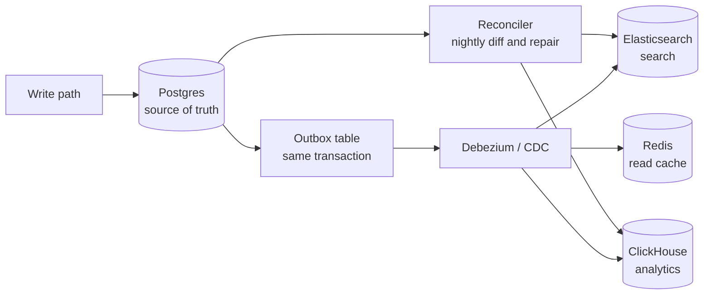

# Data Modelling: SQL, NoSQL & Access Patterns

> Choosing a store from access patterns, not from a conference talk. Normalisation economics.

- Track: **Backend & Distributed Systems** · Level: **core** · ~19 min
- [Open in the academy](https://deepeshk1204.github.io/staff-engineer-academy/#/topic/backend/data-modeling)

Data modelling is the act of deciding what questions your system will be able to answer
cheaply, and accepting that it will answer everything else expensively. The schema is not a
description of your domain -- it is a bet on your access patterns.

Which means the process runs in one direction only: enumerate the reads and writes with their
frequencies and latency requirements first, then pick the shape that serves them, then pick the
store that natively supports that shape. Choosing the store first is how teams end up with
DynamoDB and a requirement to filter on five optional fields.

## Why it exists

Relational modelling gave us one dominant answer for thirty years: normalise to third
normal form, store each fact once, and let the query planner assemble whatever shape the
application needs at read time using joins. That is genuinely excellent when your read patterns
are unknown or changing, because any question is answerable and correctness is centralised in one
copy of each fact.

It breaks on two axes. A join is a data-locality problem, so once the tables live on different
machines the join becomes a distributed operation -- and there is no good distributed join at
scale. And a read path assembled from eight joins costs eight index traversals, which is fine at
1,000 rps and is not fine at 100,000 rps for a feed screen.

Everything labelled "NoSQL" is a different answer to the same question: precompute the shape you
will read, store it together, and accept that you now maintain multiple copies of some facts. You
have traded read cost for write cost and for the risk of those copies disagreeing.

## Derive the store from access patterns

The artefact worth producing before any schema is a table of access patterns. For a
mid-size social product it looks like this, and note that the *ratios* drive every subsequent
decision.

**Access pattern inventory, the input to every modelling decision**

| Pattern | Rate | Latency need | Consistency need | Implication |
| --- | --- | --- | --- | --- |
| Read one user profile by id | 40,000 rps | p99 < 20 ms | Read-your-writes | Key-value lookup; cache-friendly |
| Read a user's timeline, 20 newest | 25,000 rps | p99 < 80 ms | Seconds of staleness fine | Precomputed list, keyset paginated |
| Post a message | 600 rps | p99 < 200 ms | Durable before ack | Write path can afford fan-out work |
| Search posts by text | 400 rps | p99 < 300 ms | Minutes of staleness fine | Inverted index -- a separate store |
| Follower count | 25,000 rps | p99 < 20 ms | Approximate acceptable | Denormalised counter, not `count(*)` |
| Monthly engagement report | 20/day | Minutes acceptable | Point-in-time | Columnar warehouse, never the OLTP primary |
| "Who do we both follow" | 50 rps | p99 < 500 ms | Stale fine | Graph traversal or a recursive CTE |

Read that table and the architecture has largely written itself. Profile reads at 40,000
rps against posts at 600 rps is a 66:1 read/write ratio, which is licence to do substantial work on
the write path -- fan-out-on-write for timelines becomes obviously correct. Follower count at
25,000 rps means `SELECT count(*) FROM follows` is not an option at any index quality, so a
counter column is not a denormalisation you might do, it is the only design. Search and reporting
have different shapes entirely, which is where polyglot persistence stops being fashion and starts
being arithmetic.

## A worked single-table DynamoDB design

DynamoDB gives you exactly one efficient operation: fetch items by partition key,
optionally narrowed and sorted by sort key. There are no joins and no efficient filters on
non-key attributes -- a `FilterExpression` is applied *after* reading and you pay for every item
read. So single-table design is not a trick; it is the consequence of having one access primitive.
You store heterogeneous item types in one table and choose keys such that each access pattern is a
single `Query`.

Take a project-management product. The patterns are: get a project, list a project's tasks by
status, get a task with its comments, list all tasks assigned to a user across projects ordered by
due date, and list a user's projects.

**Key design: one table, five item types, two indexes**

```text
Table: app        PK = partition key,  SK = sort key
GSI1: GSI1PK / GSI1SK      (sparse -- only items with these attrs appear)

PK                SK                       type      attributes
----------------- ------------------------ --------- --------------------------------
PROJ#42           META                     project   name, owner, created_at
PROJ#42           TASK#OPEN#01HQ8Z         task      title, assignee, due, status
PROJ#42           TASK#OPEN#01HQ90         task      ...
PROJ#42           TASK#DONE#01HQ7A         task      ...
PROJ#42           MEMBER#USER#7            member    role
TASK#01HQ8Z       META                     task      title, body, due
TASK#01HQ8Z       CMT#2026-03-01T10:02Z    comment   author, body
TASK#01HQ8Z       CMT#2026-03-01T10:44Z    comment   author, body
USER#7            PROJ#42                  membership role, joined_at

GSI1PK            GSI1SK                   (on task items only)
----------------- ------------------------
USER#7            DUE#2026-03-14#01HQ8Z    -> tasks assigned to user 7, by due date

Access patterns, each one Query:
1. Get project + members + open tasks
     Query PK = PROJ#42                          (one round trip, all item types)
2. List open tasks in a project, oldest first
     Query PK = PROJ#42 AND begins_with(SK, 'TASK#OPEN#')
3. Get a task with its comments
     Query PK = TASK#01HQ8Z                      (META plus CMT# items together)
4. Tasks assigned to a user, by due date
     Query GSI1 where GSI1PK = USER#7 AND GSI1SK BETWEEN 'DUE#2026-03-01' AND 'DUE#2026-03-31'
5. Projects a user belongs to
     Query PK = USER#7 AND begins_with(SK, 'PROJ#')
```

Three things in that design are the actual content. First, **status is encoded in the
sort key** (`TASK#OPEN#...`), which is what makes pattern 2 a range query rather than a filter --
and it also means changing a task's status is a delete-and-insert, not an update, because you
cannot mutate a key. That is the trade you accepted for the cheap read. Second, **GSI1 is sparse**:
only items carrying `GSI1PK` are projected into it, so the index contains tasks and nothing else,
and you pay only for those. Third, the composite sort key `DUE#<date>#<id>` has the date first
because sort keys sort lexicographically -- `2026-03-14` sorts correctly as a string only with
zero-padded ISO-8601, which is why every DynamoDB key design uses it.

What this design cannot do: "all tasks due this week across all projects" (no partition key to
query -- you would need another sparse GSI keyed on something like `DUE#2026-W11`), or any
ad-hoc filter a product manager invents next quarter. Adding a pattern means adding an index or
backfilling a new key attribute across every item, which is a migration job, not a schema change.
That is the honest cost: DynamoDB converts query flexibility into operational predictability.

> **The partition limit that catches people**  
> A single DynamoDB partition sustains about 3,000 read units and 1,000 write units per
> second. If `PROJ#42` is a famously busy project, that partition is your ceiling regardless of
> table-level provisioning -- adaptive capacity helps but does not remove it. The mitigation is
> **write sharding**: make the key `PROJ#42#<n>` for `n` in 0..9 and scatter-gather across ten
> partitions on read, accepting 10 parallel queries instead of one. You are choosing which pain you
> want, and you should choose it before launch rather than during an incident.

**Physical limits that constrain key design**

- **3,000 RCU** — Per DynamoDB partition (1,000 WCU -- a per-key ceiling, not a table one)
- **400 KB** — Max DynamoDB item size (Large blobs go to S3 with a pointer)
- **5-20x** — Columnar compression ratio (Per-column uniformity is why)
- **~1 eng-quarter/yr** — True cost of one extra datastore (Backups, upgrades, on-call, runbooks)

## Normalisation economics

Normalise and each fact lives once, so updates are atomic and cheap and nothing can
disagree. Denormalise and you copy a fact to where it will be read, so reads are cheap and every
update becomes a fan-out with a window of inconsistency.

The decision is arithmetic, not taste. Consider a user's display name embedded in every post
document. If the average user has 200 posts and changes their name once a year, denormalising costs
200 writes per year per user and saves a join on every one of 25,000 timeline reads per second.
That is obviously correct. Now consider embedding a *product price* in every order line: prices
change weekly, orders number in the millions, and a fan-out update would be catastrophic -- but you
also must not update historical orders at all, because the price at purchase time is a different
fact from the current price. Recognising that some duplication is not duplication but **temporal
snapshotting** is a genuinely important modelling insight, and it is why order lines legitimately
carry a price column forever.

**When to denormalise**

| Signal | Denormalise | Keep normalised |
| --- | --- | --- |
| Read:write ratio | High -- 50:1 or more | Near 1:1 or write-heavy |
| Fan-out size of an update | Bounded and small (tens) | Unbounded (a celebrity's followers) |
| Staleness tolerance | Seconds or minutes acceptable | Must be immediately correct everywhere |
| Nature of the copied value | A point-in-time snapshot (price at purchase) | A live shared fact (current account status) |
| Query shape | Always read together as one object | Queried independently and in aggregate |
| Correctness risk | Cosmetic if stale (display name) | Financial or access-control if stale (permissions) |
| Recovery story | Rebuildable from the normalised source | No source of truth to rebuild from |

> **Note**  
> The rule that keeps denormalisation survivable: **there must be exactly one source of
> truth, and every derived copy must be rebuildable from it**. If you can re-derive the timeline
> table from posts and follows with a batch job, a bug in the fan-out is an inconvenience. If the
> denormalised copy *is* the only copy, a bug is permanent data loss.

## JSONB: when it is right, and when it is a schema you will not admit to

Postgres `jsonb` is a genuinely good tool for three shapes. Sparse, caller-defined
attributes where you will never query across tenants -- custom fields on a CRM record. Whole
documents you always read and write as a unit and never filter inside -- a stored webhook payload,
an audit snapshot. And versioned blobs whose structure changes faster than you can migrate --
third-party API responses you cache.

It is the wrong tool the moment a value inside it becomes queryable, because you then need a GIN
index or an expression index per path, you get no type checking, no `NOT NULL`, no foreign keys,
no default, and the planner's selectivity estimates for JSON containment are much weaker than for
a column. The diagnostic question is simple: *does any code branch on this value, or does any query
filter on it?* If yes, it is a column that you are storing in a bag to avoid a migration, and the
cost will be paid by whoever debugs a query plan on it in eighteen months.

**The hybrid that is usually right**

```sql
CREATE TABLE contacts (
  id           uuid PRIMARY KEY,
  tenant_id    uuid        NOT NULL REFERENCES tenants(id),
  email        citext      NOT NULL,          -- queried, constrained: a column
  lifecycle    text        NOT NULL
                 CHECK (lifecycle IN ('lead','active','churned')),
  created_at   timestamptz NOT NULL DEFAULT now(),
  custom       jsonb       NOT NULL DEFAULT '{}'   -- tenant-defined, never cross-queried
);

CREATE UNIQUE INDEX ON contacts (tenant_id, email);

-- If you must query inside the bag, index the path you actually use,
-- not the whole document:
CREATE INDEX idx_contacts_industry
    ON contacts ((custom->>'industry'))
 WHERE custom ? 'industry';

-- Or GIN for arbitrary containment, at ~2-3x the index size and slower writes:
CREATE INDEX idx_contacts_custom_gin ON contacts USING gin (custom jsonb_path_ops);

-- The moment you write this in production code, 'industry' wanted to be a column:
SELECT * FROM contacts
 WHERE custom->>'industry' = 'fintech' AND (custom->>'employees')::int > 500;
```

## Time-series, columnar and graph

Three specialised shapes that are worth reaching for when the pattern matches, and worth
resisting otherwise.

**Time-series** data -- metrics, events, IoT readings -- is append-only, queried by time range plus
a few tags, aggregated rather than read individually, and deleted wholesale by age. Those five
properties enable optimisations a general store cannot make: partition by time so old partitions
are immutable and droppable in O(1) (`DROP TABLE` rather than `DELETE`), compress aggressively
because adjacent values correlate, and precompute rollups. TimescaleDB, ClickHouse and Prometheus
all exploit the same structure. You can do a respectable job in plain Postgres with declarative
partitioning by month plus `BRIN` indexes on the timestamp, and for many teams that is the right
amount of technology.

**Columnar** stores -- ClickHouse, BigQuery, Snowflake, Parquet on object storage -- store each
column contiguously. `SELECT avg(amount) FROM orders` reads only the `amount` column, so a
query touching 3 of 60 columns reads 5% of the bytes, and the uniformity means compression ratios
of 5-20x. That is a 10-100x advantage for analytical scans. The mirror image is that fetching one
whole row requires assembling 60 separate column reads, and single-row updates are expensive or
unsupported. Row stores for OLTP, column stores for OLAP, and the mistake is always running the
monthly report against the OLTP primary until it takes the site down.

**Graph** stores earn their place when the *number of hops is variable and unknown at query time*.
Shortest path, "friends of friends of friends until you find a connection", and permission
inheritance of arbitrary depth are genuinely awkward in SQL. But depth-2 questions -- "people I
follow who follow this person" -- are just two joins, and bounded hierarchies are a recursive CTE
you can write in fifteen minutes. Adopt a graph database when traversal depth is unbounded *and*
traversal is a core product feature, not because your data "is a graph". Most data is a graph.

**The recursive CTE that removes most graph-database requirements**

```sql
-- "All descendants of org unit 12, with depth, cycle-safe, depth-capped."
WITH RECURSIVE subtree AS (
  SELECT id, parent_id, name, 1 AS depth, ARRAY[id] AS path
    FROM org_units
   WHERE id = 12
  UNION ALL
  SELECT c.id, c.parent_id, c.name, s.depth + 1, s.path || c.id
    FROM org_units c
    JOIN subtree s ON c.parent_id = s.id
   WHERE s.depth < 10                 -- bound it, always
     AND NOT c.id = ANY(s.path)       -- survive a cycle in dirty data
)
SELECT id, name, depth FROM subtree ORDER BY depth, name;

-- Needs this to be fast at depth:
CREATE INDEX ON org_units (parent_id);
```

## The real cost of polyglot persistence

"Use the right tool for each job" is true and incomplete, because each additional store
has a fixed cost that is invisible in the design document and unavoidable in operation: a backup
and restore procedure that someone has tested, a monitoring and alerting setup, a version upgrade
path, a failover runbook, capacity planning, an access-control model, a client library with its own
timeout and retry semantics, and at least two engineers who understand it well enough to be woken
up. Call it one engineer-quarter per year per store, permanently.

And then there is the part that is genuinely hard rather than merely expensive: keeping them
consistent. Writing to Postgres and then to Elasticsearch is two writes with no transaction between
them, so a crash in the middle leaves the search index wrong, forever, silently. The only robust
pattern is to write once transactionally and derive everything else from a log -- outbox table or
change data capture -- plus a reconciliation job that compares and repairs. If a team proposes a
second store without proposing that pipeline, they have not costed the proposal.

The pragmatic sequencing for most products: start with Postgres for everything, because it does
JSON, full-text search, geospatial, time-series-with-partitioning, queues via `SKIP LOCKED` and
pub/sub via `LISTEN/NOTIFY` at respectable quality. Add a second store when you have a specific
measured pattern Postgres is genuinely bad at -- and when you do, add the CDC pipeline in the same
project.



*One source of truth, everything else derived from its log, plus a reconciler because CDC pipelines do lose events. Dual writes from application code have no equivalent of that last box.*

## Schema evolution without downtime

Every schema change on a live system is the expand-migrate-contract dance, because at
some moment old code and new code both run against the same database. The sequence for renaming a
column is five deploys and it is genuinely five: add the new column; deploy code that writes both
and reads the old; backfill in batches; deploy code that reads the new and still writes both; then
stop writing the old and drop it. Skipping the fourth step means a rollback puts you on code that
reads a column nobody has been writing.

What makes this operationally dangerous in Postgres is lock behaviour. Many DDL statements take an
`ACCESS EXCLUSIVE` lock, and crucially a blocked DDL statement *also blocks every query queued
behind it*. So `ALTER TABLE` waiting on a slow `SELECT` does not merely wait -- it stalls all
new traffic to that table. The mitigation is always the same: set `lock_timeout` to a couple of
seconds so a failed attempt fails fast, and retry.

**Postgres DDL: what is safe on a live table**

| Operation | Lock and duration | Safe approach |
| --- | --- | --- |
| `ADD COLUMN` nullable, no default | `ACCESS EXCLUSIVE`, instant -- metadata only | Safe with a short `lock_timeout` |
| `ADD COLUMN` with a constant default | Instant since PG 11 -- no table rewrite | Safe; older versions rewrite the whole table |
| `ADD COLUMN` with a volatile default | Full rewrite | Add nullable, backfill in batches, then set the default |
| `CREATE INDEX` | Blocks writes for the whole build | Always `CREATE INDEX CONCURRENTLY`; can leave an invalid index on failure |
| `ADD CONSTRAINT ... CHECK` | Validates the whole table under lock | `ADD CONSTRAINT ... NOT VALID`, then `VALIDATE CONSTRAINT` separately |
| `ADD FOREIGN KEY` | Locks both tables and validates | Same two-step: `NOT VALID` then `VALIDATE` |
| `ALTER COLUMN TYPE` | Full rewrite, exclusive lock | New column, dual-write, backfill, swap -- effectively a rename |
| `DROP COLUMN` | Instant metadata change | Safe, but only after no deployed code references it |
| `SET NOT NULL` | Full scan under lock (pre-PG 12) | PG 12+ can use a validated `CHECK` to skip the scan |

**Backfilling 200 million rows without a lock or a replication storm**

```sql
-- Bad: one statement, one giant transaction, hours of bloat and lag.
-- UPDATE contacts SET tier = 'standard' WHERE tier IS NULL;

-- Good: bounded batches, each its own transaction, with a pause.
DO $$
DECLARE rows_done int;
BEGIN
  LOOP
    UPDATE contacts SET tier = 'standard'
     WHERE id IN (SELECT id FROM contacts
                   WHERE tier IS NULL
                   ORDER BY id
                   LIMIT 5000
                     FOR UPDATE SKIP LOCKED);
    GET DIAGNOSTICS rows_done = ROW_COUNT;
    COMMIT;                       -- keeps transactions short, lets vacuum work
    EXIT WHEN rows_done = 0;
    PERFORM pg_sleep(0.05);       -- give replication and autovacuum room
  END LOOP;
END $$;

-- Then make it enforced, in two steps that never hold a long lock:
ALTER TABLE contacts ADD CONSTRAINT tier_present CHECK (tier IS NOT NULL) NOT VALID;
ALTER TABLE contacts VALIDATE CONSTRAINT tier_present;   -- takes a weaker lock
```

## Trade-offs

**Denormalised, access-pattern-driven modelling**

What you gain:
- Each read is one round trip to one partition, so latency is flat as data grows.
- No distributed joins, so the design survives horizontal partitioning.
- Capacity is predictable per access pattern rather than per query plan.
- Write-path cost is visible and boundable, unlike an unbounded read-time join.

What it costs you:
- A new access pattern is a migration or a new index, not a new query.
- Multiple copies of some facts, with a window where they disagree.
- Ad-hoc analytics become impossible against the operational store.
- Correctness now depends on fan-out code you wrote rather than on a constraint.
- You need a reconciler, because your fan-out will drop events.
- Onboarding cost: nobody can read the schema and infer the domain.

**Failure modes**

| Failure mode | What the user sees | Mitigation |
| --- | --- | --- |
| Hot partition from a skewed key | One tenant or celebrity exceeds the per-partition limit; throttling appears as errors for everyone on that key. | Write-shard the key with a suffix and scatter-gather on read; detect skew before launch with a per-key rate metric. |
| Dual writes to two stores from application code | A crash between them leaves the search index or cache permanently wrong, with no error anywhere. | Write once transactionally plus an outbox or CDC feed, and a reconciliation job that diffs and repairs. |
| JSONB used for a value that queries filter on | No type safety, poor selectivity estimates, a GIN index per access pattern, and plan regressions nobody can explain. | Promote it to a column; keep `jsonb` for genuinely sparse, never-cross-queried attributes. |
| `count(*)` on a large table in a hot read path | Full index or table scan at read rate; latency scales with table size and cannot be cached away. | Maintained counter column or a rollup table; `reltuples` for approximate answers. |
| Analytics queries on the OLTP primary | A single report scan evicts the buffer cache and destroys p99 for transactional traffic. | Replica for reporting, or a columnar store fed by CDC; enforce with separate credentials and `statement_timeout`. |
| Unbounded fan-out on write | A user with 30 million followers turns one post into 30 million writes, saturating the cluster. | Hybrid fan-out: push for normal accounts, pull-at-read for large ones, merged at query time. |
| `ALTER TABLE` blocked behind a slow query | The DDL waits for `ACCESS EXCLUSIVE` and every subsequent query queues behind it -- a full table outage. | `SET lock_timeout = '2s'` and retry; run DDL in low-traffic windows; never during a long report. |
| Access patterns never written down | Schema serves the first three screens and every later feature needs a migration or a full scan. | Access-pattern inventory with rates and latency targets as a required design artefact. |

> **Staff-level angle**  
> The signal here is direction of reasoning. Weak answers start from a technology; strong
> answers start from a table of access patterns and arrive at a technology.
> 
> - "Before I pick a store I want the access patterns with rates. If profile reads are 40,000 rps and
> posts are 600 rps, that is a 66:1 ratio and it licenses fan-out-on-write for timelines -- I can
> afford substantial write-path work to make the read a single key lookup."
> - "`PROJ#42` as a partition key means one busy project is capped at roughly 3,000 RCU. I would
> write-shard it as `PROJ#42#0..9` and scatter-gather, and I would rather take that complexity now
> than discover the ceiling during a launch."
> - "Encoding status in the sort key makes 'list open tasks' a range query instead of a filter, and I
> want to be explicit that the cost is a delete-and-insert on every status change, because keys are
> immutable. That is the trade, and it is a good one at this read ratio."
> - "The price on an order line is not denormalisation, it is a temporal snapshot -- the price at
> purchase is a different fact from the current price, and we must *not* update it. The display name
> on a post is real denormalisation, and it needs a fan-out job and a reconciler."
> - "If `custom->>'industry'` appears in a `WHERE` clause, it wanted to be a column. `jsonb` is
> right for tenant-defined attributes we never query across tenants; it is wrong the moment the
> planner needs a selectivity estimate for it."
> - "I would not add Elasticsearch without the CDC pipeline in the same project. Dual writes from app
> code have a crash window that silently corrupts the index, and there is no monitoring that detects
> it. Outbox plus a nightly reconciler, or we do not add the store."
> - "The migration is five deploys, not one -- add, dual-write, backfill in batches, flip reads, drop.
> And `lock_timeout` of two seconds on the DDL, because an `ALTER TABLE` waiting on a lock blocks
> every query behind it."
> 
> What each signals: quantified reasoning rather than preference, awareness of physical limits,
> honesty about what a design cannot do, and -- most tellingly -- the instinct to cost the
> operational burden of a second store and to insist on a reconciler. Anyone who volunteers "and a
> job that diffs and repairs" has maintained a derived store in production.

**Check**

A DynamoDB table stores tasks with `PK = PROJ#<id>`, `SK = TASK#<ulid>`, and a `status` attribute. "List open tasks" uses a `FilterExpression` on `status`. What is wrong?
- A. Nothing -- filters are evaluated inside the storage engine.
- B. The filter runs after items are read, so you pay read capacity for every task in the project and latency scales with project size. **(answer)**
- C. `FilterExpression` cannot be used with `Query`.
- D. You need a scan instead.

  DynamoDB applies `FilterExpression` after retrieving items, so both cost and latency are proportional to the items read rather than the items returned -- a project with 50,000 tasks bills for 50,000 to return 40. Putting status into the sort key (`TASK#OPEN#<ulid>`) turns it into a `begins_with` range query that reads only matching items. The cost you accept is that a status change becomes a delete plus an insert, because key attributes are immutable.

Your service writes to Postgres and then indexes the same record in Elasticsearch from application code. What failure does this design have no defence against?
- A. Elasticsearch mapping conflicts.
- B. A crash or error between the two writes, leaving the index permanently and silently inconsistent. **(answer)**
- C. Elasticsearch rejecting the document size.
- D. Postgres replication lag.

  There is no transaction spanning the two systems, so any interruption after the commit and before the index call leaves a document missing with no error recorded and no process that will ever notice. Writing an outbox row inside the Postgres transaction and shipping it with a CDC consumer makes the second write retryable and at-least-once; a periodic reconciler that diffs and repairs covers the residual gaps, because CDC pipelines do drop events during failover.

A product manager asks for a monthly report joining orders, users and events over 18 months. Where should it run?
- A. The OLTP primary, with a covering index.
- B. A columnar store or warehouse fed by CDC, because scanning few columns over many rows is its native shape. **(answer)**
- C. A read replica of the OLTP primary, which removes all risk.
- D. A graph database, since it involves three entities.

  Columnar storage reads only the columns referenced, so a query touching 3 of 60 columns reads a small fraction of the bytes, and per-column uniformity yields compression of 5-20x -- typically 10-100x faster for analytical scans. On the primary the same query evicts the buffer cache and wrecks transactional p99. A replica does protect the primary from CPU and cache effects, which makes it a reasonable interim step, but it does not fix the fundamental row-store mismatch for wide scans.

Which of these is a legitimate use of `jsonb` in a Postgres OLTP table?
- A. A `status` field, to avoid a migration when new statuses are added.
- B. Tenant-defined custom attributes that are displayed but never filtered on across tenants. **(answer)**
- C. A `price` field, because currencies vary.
- D. Foreign key references, stored as an array of ids.

  Sparse, caller-defined attributes with no cross-row query requirement are exactly what a document column is for -- there is no fixed set of columns to declare and nothing depends on the planner estimating their selectivity. The other three all have code or queries branching on the value, which means you lose type checking, `NOT NULL`, referential integrity and good cardinality estimates in exchange for skipping one migration. The diagnostic is whether anything filters on it or branches on it.

<details><summary>Related topics and how they connect</summary>

Partition-key skew and write sharding are developed properly in **Sharding &
Partitioning**. The outbox pipeline that keeps derived stores honest is the subject of
**Event-Driven Architecture, Sagas & CQRS**, and the log that carries it is **Queues & Event
Streaming**. Index design for the relational half is **Databases, Indexes & Query Plans**, and the
lock behaviour of DDL connects to **Transactions & Isolation Levels**. The staleness you accept
when reading a derived copy is the same question as **Replication & Consistency Models**.

</details>

## Flashcards

- **What is the first artefact of a data-modelling exercise?** — An access-pattern inventory: each read and write with its rate, latency target and consistency requirement. The ratios in that table determine whether you can afford fan-out-on-write, denormalised counters, or a separate search store.
- **Why does DynamoDB push you toward single-table design?** — It offers one efficient primitive -- fetch items by partition key, narrowed and sorted by sort key. With no joins and no efficient non-key filters, the only way to serve a pattern in one round trip is to co-locate heterogeneous item types under a shared partition key.
- **Why encode status in a DynamoDB sort key rather than as an attribute?** — `FilterExpression` is applied after items are read, so you pay for every item in the partition. `begins_with(SK, 'TASK#OPEN#')` reads only matching items. The cost is that changing status means delete-and-insert, since key attributes are immutable.
- **What is a sparse GSI and why is it useful?** — Only items carrying the index key attributes are projected into it. Adding `GSI1PK` to task items alone gives you an index containing tasks and nothing else, so you pay storage and write cost only for those items.
- **Distinguish denormalisation from temporal snapshotting.** — Denormalisation copies a live shared fact (display name on posts) and needs a fan-out job plus a reconciler. A temporal snapshot records a fact as of an instant (price at purchase) and must *never* be updated -- it is not a duplicate at all.
- **What single rule keeps denormalisation survivable?** — Exactly one source of truth, and every derived copy must be rebuildable from it by a batch job. Then a fan-out bug is an inconvenience rather than permanent data loss.
- **When is `jsonb` the wrong choice?** — As soon as a query filters on a value inside it or code branches on it. You lose type checking, `NOT NULL`, foreign keys and good selectivity estimates, and you need an expression or GIN index per access path.
- **Why are columnar stores 10-100x faster for analytics?** — Each column is stored contiguously, so a query referencing 3 of 60 columns reads only those bytes, and per-column uniformity gives 5-20x compression. The trade is that reconstructing a single whole row requires many separate column reads.
- **When does a graph database beat a recursive CTE?** — When traversal depth is variable and unknown at query time -- shortest path, unbounded permission inheritance -- and traversal is a core product feature. Depth-2 questions are two joins, and bounded hierarchies are a depth-capped, cycle-safe recursive CTE.

## Drills

### Drill

Design the data model for a multi-tenant help-desk product. 8,000 tenants, the largest has 40 million tickets and the median has 3,000. Patterns: open tickets for a tenant sorted by SLA breach time (2,000 rps), one ticket with its 50-comment thread (4,000 rps), full-text search over ticket bodies (200 rps), and a per-tenant weekly SLA report. Choose stores and keys, and say what your design cannot do.

Probes:

- What is the partition or shard key, and what happens to the 40-million-ticket tenant?
- How is "sorted by SLA breach time" served without a sort at read time?
- Where does search live, and how does it stay in sync?
- The report scans 18 months. Where does it run and why not on the primary?
- A PM asks next quarter for "tickets mentioning a keyword across all tenants". What does that cost you?

Strong answer contains:

- Keys on `tenant_id` first for isolation, and explicitly addresses the 4-orders-of-magnitude tenant skew.
- Proposes sub-partitioning or dedicated capacity for the largest tenant rather than one uniform scheme.
- Serves the SLA list from an index or sort key ordered on `(tenant_id, status, sla_due)` so no read-time sort is needed.
- Co-locates ticket and comments under one key so the thread is one round trip.
- Puts search in a separate store fed by outbox/CDC, and names a reconciler.
- Sends reporting to a columnar store or replica, with separate credentials and a `statement_timeout`.
- States the limits plainly: no cross-tenant ad-hoc queries, new patterns need an index or backfill.

Weak answer tells:

- One uniform partitioning scheme with no acknowledgement of tenant skew.
- Dual writes to the search index from application code.
- Serves the SLA list with a read-time `ORDER BY` over millions of rows.
- Runs the weekly report on the OLTP primary.
- Picks DynamoDB or Mongo first and then tries to fit the patterns to it.
- Claims the design supports arbitrary future queries.

### Drill

A 300-million-row Postgres table needs a column renamed from `amount_cents` to `amount_minor` and its type widened from `integer` to `bigint`. The service handles 1,200 writes/s, must not have downtime, and any deploy must be rollback-safe at every step. Write the plan.

Probes:

- What is step one, and what is the lock it takes?
- How do you backfill 300 million rows without blocking or lagging replication?
- At which step is a rollback unsafe, and how do you avoid ever being there?
- How do you add `NOT NULL` at the end without a full-table lock?
- How do you know it is safe to drop the old column?

Strong answer contains:

- Expand-migrate-contract in five deploys, with reads and writes flipped in separate steps.
- Adds a nullable `bigint` column -- instant metadata change -- rather than altering the type in place.
- Batched backfill of a few thousand rows per transaction with `SKIP LOCKED` and a sleep, citing replication lag and vacuum.
- Explains that flipping reads before writes-both is deployed is the unsafe ordering.
- Uses `ADD CONSTRAINT ... NOT VALID` then `VALIDATE CONSTRAINT` to avoid the long lock.
- Sets `lock_timeout` on DDL and notes a blocked `ALTER TABLE` queues all subsequent queries.
- Verifies with a row-level diff query and a period of dual-write telemetry before dropping.

Weak answer tells:

- Runs `ALTER TABLE ... ALTER COLUMN TYPE bigint` and calls it a migration.
- Backfills with a single `UPDATE` over 300 million rows.
- Renames the column and updates code in one deploy.
- No `lock_timeout`, no awareness that DDL blocks the queue behind it.
- Drops the old column in the same release that stops writing it.
