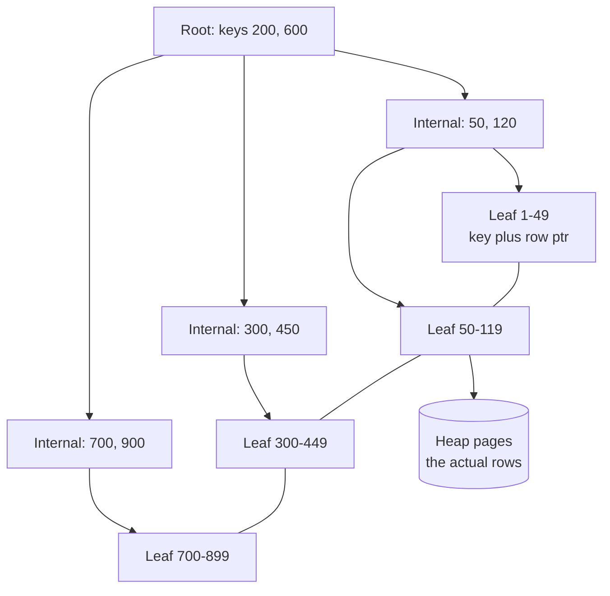

# Databases, Indexes & Query Plans

> B-trees, selectivity, covering indexes, and reading an EXPLAIN before you blame the ORM.

- Track: **Backend & Distributed Systems** · Level: **core** · ~22 min
- [Open in the academy](https://deepeshk1204.github.io/staff-engineer-academy/#/topic/backend/databases-and-indexes)

An index is a second copy of some of your data, sorted, so the database can find rows
without looking at all of them. That is the entire concept. Everything difficult about indexes
comes from the consequences: the copy must be kept up to date on every write, the sort order
determines which questions it can answer, and a cost-based planner -- not you -- decides whether
to use it.

The practical skill this topic builds is reading a query plan. Most "the ORM is slow" incidents
are a plan you have not looked at, and the plan tells you exactly which of a dozen possible
problems you actually have.

## Why it exists

A table is a heap of 8 KB pages on disk. Answering `WHERE email = 'x@y.com'` without
help means reading every page -- for a 50 GB table on an SSD at 500 MB/s, that is roughly 100
seconds. You cannot pay that per request.

Sorting the whole table by email would fix that one query and break every other access pattern,
because a table can only be stored in one order. So you keep the heap as it is and build a
separate sorted structure that maps email to row location. Now the lookup is a handful of page
reads instead of six million. The cost you have accepted is that every insert, and every update
that touches email, must also maintain that structure -- and you will accept it several more times
for several more columns.

## B+trees, and why depth is the whole story

Relational databases use a B+tree: a shallow, wide, balanced tree where internal nodes
hold only keys and pointers, and *all* the actual entries live in the leaves, which are linked
together in sorted order. Two properties follow, and both matter.

Because each 8 KB internal page holds hundreds of keys, the fan-out is huge and the tree is
absurdly shallow. With a fan-out of roughly 300, three levels address 27 million entries and four
levels address 8 billion. So a point lookup in a table of 100 million rows costs four page reads,
not 27 -- and the root and most of the second level are permanently in memory, so realistically
you pay one or two actual disk reads. This is why an indexed lookup is sub-millisecond almost
regardless of table size, and why "the table got bigger so queries got slower" is rarely a true
explanation for an indexed point read.

Because the leaves are linked in sorted order, the same structure answers range queries
(`BETWEEN`, `>`), prefix matches (`LIKE 'abc%'`), `ORDER BY` without a sort step, and
`MIN`/`MAX` in one seek. A hash index would beat a B+tree on pure equality and cannot do any
of those, which is why B+trees are the default and hash indexes are a niche.



*Leaves are doubly linked, which is what makes range scans and ORDER BY free. The hop from leaf to heap is the cost a covering index removes.*

**Why depth beats size**

- **~300** — Entries per 8 KB internal page (For a bigint or short text key)
- **4 levels** — Addresses ~8 billion entries (Depth grows logarithmically)
- **1-2** — Real disk reads per point lookup (Upper levels stay cached)
- **~0.1 ms** — Warm indexed point read (Versus ~100 s for a 50 GB seq scan)

## Clustered versus secondary indexes

In **InnoDB** (MySQL) the primary key *is* the table: rows are stored inside the primary
key's B+tree leaves. A primary key lookup returns the row with no extra hop. But every secondary
index stores the primary key as its pointer, so a secondary lookup is two tree descents -- find
the PK in the secondary index, then descend the clustered index to get the row. This is also why
an InnoDB primary key should be small and monotonically increasing: a UUIDv4 primary key makes
every secondary index 16 bytes wider per entry *and* turns inserts into random writes across the
whole tree, causing page splits and fragmentation. UUIDv7, which is time-ordered, removes the
insert problem but not the width.

In **Postgres** the heap is separate and every index -- including the primary key -- stores a
physical tuple pointer (`ctid`). Nothing is clustered by default. That makes all indexes
symmetric, but it means every index read may need a random heap fetch, and it is the reason
Postgres has a visibility map, index-only scans and the `VACUUM` machinery.

| Property | InnoDB (MySQL) | Postgres heap |
| --- | --- | --- |
| Row storage | Inside the primary key B+tree | Separate heap; indexes point at `ctid` |
| PK lookup | One descent, row included | One descent plus a heap fetch |
| Secondary lookup | Two descents (secondary then clustered) | One descent plus a heap fetch |
| Secondary index size | Grows with PK width | Fixed 6-byte `ctid` |
| Random PK inserts | Page splits, fragmentation, write amplification | Appends to the heap; index still splits |
| Index-only scan | Natural when the index covers the columns | Needs the visibility map to be current -- so `VACUUM` matters |
| Practical advice | Small, monotonic PK (bigint or UUIDv7) | `INCLUDE` columns for covering; keep autovacuum healthy |

## Composite indexes and the leftmost-prefix rule

A composite index on `(a, b, c)` is sorted by `a`, then by `b` within equal `a`,
then by `c`. That is the whole rule, and every usable-or-not question follows from it. The index
can seek when your predicates form a **leftmost prefix**: `a`, or `a` and `b`, or all three.
It cannot seek on `b` alone, because entries for a given `b` are scattered across every value
of `a` -- exactly like looking up a surname in a phone book sorted by first name.

The subtler half is that a **range** predicate consumes the rest of the index. In `WHERE a = 1
AND b > 5 AND c = 9`, the index seeks on `a = 1`, range-scans `b > 5`, and then must filter
`c = 9` row by row, because within `b > 5` the `c` values are not globally ordered. So
equality columns go first and the range column goes last. Reversing that order can change a query
from reading 40 entries to reading 400,000 and filtering.

**Column order is not cosmetic**

```sql
-- Query we must serve:
SELECT * FROM events
 WHERE tenant_id = 42 AND type = 'signup' AND created_at > now() - interval '7 days'
 ORDER BY created_at DESC LIMIT 50;

-- WRONG: range column in the middle kills everything after it.
CREATE INDEX bad ON events (tenant_id, created_at, type);
--> seeks tenant_id=42, range-scans 7 days of ALL types, filters type row by row,
--    and still satisfies the ORDER BY. Reads ~1.2M entries to return 50.

-- RIGHT: equality first, range last -- and the range column also serves ORDER BY.
CREATE INDEX good ON events (tenant_id, type, created_at DESC);
--> one seek to (42, 'signup'), walk 50 leaf entries backwards, stop. No sort node.

-- Which prefixes can 'good' serve?
--   (tenant_id)                            yes
--   (tenant_id, type)                      yes
--   (tenant_id, type, created_at)          yes
--   (type)                                 no  -- not a leftmost prefix
--   (tenant_id, created_at)                partially: seek tenant, then filter

-- Partial index: 95% of queries only want unarchived rows, so do not index the rest.
CREATE INDEX good_active ON events (tenant_id, type, created_at DESC)
  WHERE archived_at IS NULL;
```

## Covering indexes and index-only scans

The expensive part of an index scan is often not the descent -- it is the random heap
fetch afterwards. If every column the query needs is present in the index itself, the database can
answer entirely from the index and skip the heap. Postgres calls this an **Index Only Scan**;
MySQL reports "Using index".

Postgres' `INCLUDE` clause exists so that you can carry payload columns in the leaves without
making them part of the sort key -- they cost leaf space but do not widen the comparison or affect
which prefixes are usable. The catch, specific to Postgres, is that an index-only scan still has
to confirm that each tuple is visible to your snapshot. It can skip the heap only for pages marked
all-visible in the **visibility map**, which autovacuum maintains. On a heavily updated table with
autovacuum falling behind, the same plan degrades from "index only" to "index plus a heap fetch per
row" with no query change at all -- a classic mystery regression.

**Turning three plans into one**

```sql
SELECT order_id, status, total_cents
  FROM orders
 WHERE customer_id = 991 AND placed_at >= '2026-01-01';

-- (a) No index:     Seq Scan, reads the whole table.
-- (b) (customer_id, placed_at):  Index Scan + one heap fetch per matching row.
-- (c) covering:
CREATE INDEX idx_orders_cust_cover
    ON orders (customer_id, placed_at)
 INCLUDE (order_id, status, total_cents);
-- --> Index Only Scan. Heap Fetches: 0  (when the visibility map is current)
```

## Selectivity, cardinality, and why the planner ignores your index

**Cardinality** is how many distinct values a column has; **selectivity** is what
fraction of the table a predicate keeps. An index is only worth using when selectivity is high --
that is, when the predicate eliminates most rows. The planner estimates this from statistics
gathered by `ANALYZE`: per-column most-common-values lists, histograms and `n_distinct`.

The arithmetic is simple and it is why low-cardinality columns are usually a waste. Indexing
`gender` on 10 million rows means each value matches ~3.3 million rows. Using the index costs
3.3 million index entries *plus* 3.3 million random heap fetches at roughly 1 ms each in the worst
case; a sequential scan reads the whole table in large sequential I/Os and is dramatically cheaper.
When the planner chooses a sequential scan here, **it is right** -- the crossover is usually
somewhere around 5-10% of the table, and above that sequential wins because sequential I/O is an
order of magnitude cheaper per page than random I/O.

Where the planner goes *wrong* is when its estimates are wrong: stale statistics after a bulk
load, correlated columns it assumes are independent (`city = 'Chennai' AND country = 'India'`
is not 0.001 × 0.2), functions it cannot see through, or a skewed parameter under a cached generic
plan. The fixes are specific: `ANALYZE` after bulk changes, `CREATE STATISTICS` for correlated
columns, expression indexes for functions, and raising
`default_statistics_target` for columns with long tails.

## Reading an EXPLAIN ANALYZE, line by line

**The query and the plan**

```sql
EXPLAIN (ANALYZE, BUFFERS)
SELECT u.id, u.email, count(o.id) AS orders
  FROM users u
  JOIN orders o ON o.user_id = u.id
 WHERE u.signup_country = 'IN'
   AND o.placed_at >= '2026-01-01'
 GROUP BY u.id, u.email
 ORDER BY orders DESC
 LIMIT 20;

Limit  (cost=48211.90..48211.95 rows=20 width=48)
       (actual time=1893.441..1893.449 rows=20 loops=1)
  ->  Sort  (cost=48211.90..48344.12 rows=52888 width=48)
            (actual time=1893.438..1893.442 rows=20 loops=1)
        Sort Key: (count(o.id)) DESC
        Sort Method: top-N heapsort  Memory: 27kB
        ->  HashAggregate  (cost=46091.22..46620.10 rows=52888 width=48)
                           (actual time=1849.702..1881.559 rows=52104 loops=1)
              Group Key: u.id, u.email
              Batches: 1  Memory Usage: 8209kB
              ->  Hash Join  (cost=9902.11..43447.82 rows=528680 width=44)
                             (actual time=121.883..1502.219 rows=531204 loops=1)
                    Hash Cond: (o.user_id = u.id)
                    ->  Seq Scan on orders o
                          (cost=0.00..31002.00 rows=529113 width=8)
                          (actual time=0.019..742.115 rows=531204 loops=1)
                          Filter: (placed_at >= '2026-01-01'::date)
                          Rows Removed by Filter: 1468796
                          Buffers: shared hit=812 read=19188
                    ->  Hash  (cost=8544.00..8544.00 rows=52889 width=40)
                              (actual time=121.402..121.404 rows=52104 loops=1)
                          Buckets: 65536  Memory Usage: 4608kB
                          ->  Bitmap Heap Scan on users u
                                (cost=612.44..8544.00 rows=52889 width=40)
                                (actual time=8.911..108.220 rows=52104 loops=1)
                                Recheck Cond: (signup_country = 'IN'::text)
                                Heap Blocks: exact=7911
                                ->  Bitmap Index Scan on idx_users_country
                                      (cost=0.00..599.21 rows=52889 width=0)
                                      (actual time=7.664..7.665 rows=52104 loops=1)
Planning Time: 0.412 ms
Execution Time: 1894.006 ms
```

Read it inside out, and read only three things at first: where the time actually
accumulates, where estimates diverge from reality, and where rows are being read and thrown away.

Start at the deepest node. The **Bitmap Index Scan** on `idx_users_country` takes 7.7 ms and
produces 52,104 tuple identifiers. The **Bitmap Heap Scan** above it then fetches 7,911 heap
blocks in physical order and takes 108 ms. That two-step shape is Postgres deciding the match set
is too large for one-row-at-a-time random fetches but too small for a full scan: it collects all
the row pointers, sorts them by physical page, and reads each page once. The `Recheck Cond` line
is normal -- when the bitmap becomes lossy it stores pages rather than rows, so the filter is
re-applied.

The expensive node is the **Seq Scan on orders**: 742 ms, and the damning line is
`Rows Removed by Filter: 1468796`. It read 2 million rows to keep 531,204. `Buffers: read=19188`
means 19,188 blocks (about 150 MB) came from outside shared buffers. Critically, the estimate
(529,113) matches the actual (531,204) almost exactly -- statistics are fine, so this is not an
estimation bug. The planner chose a sequential scan because the filter keeps 27% of the table, and
at 27% selectivity it is correct that a scan beats random heap access. An index on `placed_at`
alone would probably *not* be used. The real fix is to give it a more selective, covering
alternative: `CREATE INDEX ON orders (placed_at, user_id)`, which makes an index-only scan
possible and removes the heap entirely from that branch.

Above, the **Hash Join** builds a 4.6 MB hash table from the users side and probes it with 531,204
order rows -- 1.5 s cumulative, most of it inherited from the scan below. **HashAggregate** groups
52,104 users in memory (`Batches: 1` -- if this said `Batches: 4` it had spilled to disk and
`work_mem` is too small). Finally, **Sort** uses `top-N heapsort` in 27 KB because of the
`LIMIT 20`; it does not sort all 52,888 rows.

The lesson worth internalising: the `LIMIT 20` at the top saved nothing, because the aggregate
had to be complete before the top 20 could be known. Cheap-looking queries with a small `LIMIT`
routinely hide full aggregations underneath.

**Plan nodes and what they are telling you**

| Node | Mechanism | Healthy when | Red flag |
| --- | --- | --- | --- |
| `Seq Scan` | Read every page sequentially | Small table, or selectivity worse than ~10% | High `Rows Removed by Filter` on a large table with a selective predicate |
| `Index Scan` | Descend the tree, fetch each heap row | Few rows, ordered output needed | Thousands of `loops` inside a nested loop -- that is an N+1 in SQL form |
| `Index Only Scan` | Answer from index leaves alone | `Heap Fetches: 0` | Non-zero heap fetches: visibility map stale, autovacuum behind |
| `Bitmap Heap Scan` | Collect pointers, sort by page, fetch each page once | Medium selectivity, 1-10% of rows | `lossy=` with a large recheck cost, or `work_mem` too small for the bitmap |
| `Nested Loop` | For each outer row, probe inner | Outer side is genuinely tiny | Outer `rows=1` estimated but thousands actual -- the classic estimation blow-up |
| `Hash Join` | Build hash of smaller side, probe | One side fits in `work_mem` | `Batches > 1`, meaning it spilled to temp files |
| `Merge Join` | Both inputs sorted, zip them | Inputs already ordered by index | An explicit `Sort` feeding it on a large input |
| `Sort` | Order rows | `top-N heapsort` with a small `LIMIT` | `external merge Disk: 240MB` -- raise `work_mem` or index the sort order |

> **The estimate-versus-actual habit**  
> Scan the plan for the largest ratio between `rows=` (estimate) and `rows=` (actual).
> That single ratio explains most bad plans, because every join-order and join-method decision above
> that node was made on the wrong number. An estimate of 1 row that is actually 8,000 turns a
> reasonable nested loop into 8,000 index probes, and no amount of index tuning fixes a cardinality
> error -- you fix it with `ANALYZE`, extended statistics, or by restructuring the predicate.

## The cost of writes: amplification and over-indexing

Every index is a tax on every write. An `INSERT` into a table with eight indexes is
nine B+tree modifications, each potentially dirtying a page, splitting a node, and generating
write-ahead log records. Postgres makes this worse in a specific way: because an `UPDATE` writes
a new tuple version at a new physical location, it must add an entry to *every* index on the table
even if you only changed one unindexed column. HOT (heap-only tuple) updates avoid this when no
indexed column changed *and* there is free space on the same page -- which is what `fillfactor`
is for on hot tables.

Concretely: a table with 12 indexes where an update writes 400 bytes of row can generate several
kilobytes of WAL. That WAL goes to disk, to replicas, and to backups. So the checklist for a new
index is not "will it help a query" but "which query, how often, and what does it cost the write
path". Look for indexes with `idx_scan = 0` in `pg_stat_user_indexes` and drop them -- most
mature databases carry several that no query has used in months, and each one is slowing every
insert and consuming buffer cache that useful indexes want.

**Finding the indexes you are paying for and not using**

```sql
SELECT relname            AS table,
       indexrelname       AS index,
       idx_scan           AS times_used,
       pg_size_pretty(pg_relation_size(indexrelid)) AS size
  FROM pg_stat_user_indexes
 WHERE idx_scan < 50
   AND NOT indisunique
 ORDER BY pg_relation_size(indexrelid) DESC;

-- Reduce Postgres update amplification on a hot, frequently-updated table:
ALTER TABLE sessions SET (fillfactor = 80);   -- leave room for HOT updates
-- Build without blocking writes (takes longer, can fail and leave an invalid index):
CREATE INDEX CONCURRENTLY idx_sessions_user ON sessions (user_id);
```

## LSM trees versus B-trees

A B+tree updates data **in place**: find the page, modify it, write it back. That is one
random write per change, and it is why B-tree write throughput is bounded by random I/O.

A log-structured merge tree never updates in place. Writes go into an in-memory sorted structure
(the memtable) plus a sequential write-ahead log. When the memtable fills it is flushed as an
immutable sorted file (an SSTable), and background **compaction** merges SSTables into larger
ones, discarding overwritten and deleted keys. Every write is sequential, so ingest throughput is
far higher -- this is RocksDB, Cassandra, ScyllaDB, and the storage under HBase.

The cost is that a read may have to check the memtable plus several SSTables. Bloom filters make
"definitely not here" cheap, so a point read usually touches one or two files, but range scans must
merge across levels. And compaction is real work happening in the background: it re-writes data
several times over its lifetime, so you see latency spikes when a large compaction runs and you can
be I/O-starved at exactly the wrong moment. Deletes are especially awkward -- they are
**tombstones**, so a delete-heavy Cassandra workload can make reads *slower* until compaction
reclaims them.

**Amplification trade-offs**

| Property | B+tree (Postgres, InnoDB) | LSM (RocksDB, Cassandra) |
| --- | --- | --- |
| Write pattern | Random, in-place page updates | Sequential appends plus background merges |
| Write amplification | Lower per write, but WAL plus full-page writes add up | Higher overall -- data rewritten ~10-30x across levels |
| Read amplification | Low and predictable: tree depth | Higher: memtable plus N SSTables, mitigated by bloom filters |
| Space amplification | Fragmentation and bloat from dead tuples | Obsolete versions live until compaction; tunable via strategy |
| Range scans | Excellent -- linked sorted leaves | Good, but merges across levels |
| Deletes | Immediate logically; space reclaimed by vacuum | Tombstones that can slow reads until compaction |
| Tail latency | Stable, with checkpoint spikes | Spikier -- compaction competes for I/O |
| Best for | Mixed read/write, transactions, ad-hoc queries | Write-heavy ingest, time series, known access patterns |

## Connection pooling and the N+1 pattern

Two application-side problems that look like database problems.

Postgres uses one OS process per connection. Each carries its own memory, and every snapshot
computation walks the list of active backends, so throughput *degrades* as idle connections climb
past a few hundred -- you get worse performance with more connections, which is not what anyone
expects. **pgBouncer** in `transaction` pooling mode multiplexes hundreds or thousands of client
connections onto a few dozen server connections, assigning a server connection only for the
duration of a transaction. The constraint you inherit is that session state stops being reliable:
session-level `SET`, advisory locks held across statements, `LISTEN/NOTIFY` and plain prepared
statements all break, because your next statement may land on a different backend. Use
`SET LOCAL` inside transactions and check that your driver's prepared-statement handling is
compatible.

The N+1 pattern is the other one. You fetch 100 orders in one query, then your ORM lazily loads
`order.customer` inside the render loop, producing 100 more queries. Each is 0.8 ms and perfectly
indexed, so nothing looks slow anywhere -- but the request spends 80 ms plus 100 round trips of
overhead, and it scales linearly with page size. It is invisible in `pg_stat_statements`
precisely because the individual query is fast; you find it by counting queries per request in a
trace, and it is worth making that count a tracked metric with an assertion in tests.

**N+1, and the two ways out**

```sql
-- What the ORM does: 1 + 100 queries, ~0.8 ms each.
SELECT * FROM orders WHERE status = 'open' LIMIT 100;
SELECT * FROM customers WHERE id = 17;      -- x100

-- Fix A: batch the second query (dataloader pattern). 2 queries total.
SELECT * FROM customers WHERE id = ANY($1);  -- $1 = array of 100 ids

-- Fix B: one join. 1 query, but duplicates customer columns per row.
SELECT o.*, c.name, c.tier
  FROM orders o JOIN customers c ON c.id = o.customer_id
 WHERE o.status = 'open' LIMIT 100;

-- Batching wins when the child is shared across many parents (100 orders,
-- 12 distinct customers) or when the joined columns are wide. A join wins
-- when the relationship is 1:1 and you need the data in one pass.
```

## Trade-offs

**Adding an index**

What you gain:
- Point and range lookups become sub-millisecond regardless of table size.
- `ORDER BY` and `LIMIT` can be served by a seek with no sort node.
- Covering indexes remove heap access entirely from hot read paths.
- Partial indexes give you the selectivity of a small table on a large one.
- Unique indexes are the cheapest correctness mechanism you have.

What it costs you:
- Every insert and relevant update maintains one more B+tree, plus WAL.
- In Postgres, any non-HOT update touches every index on the table.
- Index pages compete with table pages for shared buffers.
- More plan choices means more opportunities for the planner to pick wrong.
- Backups, replication lag and storage all grow with index size.
- `CREATE INDEX` without `CONCURRENTLY` takes a write lock for the whole build.

**Failure modes**

| Failure mode | What the user sees | Mitigation |
| --- | --- | --- |
| Range column placed before equality columns in a composite index | Query reads a million entries and filters them; looks indexed, performs like a scan. | Equality columns first, range column last; verify with `EXPLAIN` that no `Filter` line follows the index scan. |
| Predicate wrapped in a function (`WHERE lower(email) = ...`) | Index on `email` is unusable; silent full scan. | Expression index `CREATE INDEX ON users (lower(email))`, or store a normalised column. |
| Stale statistics after a bulk load | Planner estimates 1 row, chooses a nested loop, executes 200,000 probes; query goes from 20 ms to 4 minutes. | `ANALYZE` in the load job; extended statistics for correlated columns; alert on estimate/actual skew. |
| Autovacuum falling behind on a hot table | Index-only scans regress to heap fetches, table bloats, plans change with no deploy. | Per-table autovacuum thresholds, monitor `n_dead_tup` and transaction-id age, and remove long-running transactions holding snapshots. |
| Twelve indexes on a write-heavy table | Insert throughput a fraction of expected; WAL volume saturates replication. | Drop indexes with `idx_scan` near zero; consolidate overlapping prefixes; set `fillfactor` for HOT updates. |
| N+1 from ORM lazy loading | Latency grows linearly with page size; no individual query is slow so nothing alerts. | Batch loading or explicit joins; track queries-per-request in traces and assert on it in tests. |
| Thousands of direct Postgres connections | Throughput drops as connections rise; restarts cause connection storms and "too many clients". | pgBouncer transaction mode, small per-instance pools, and `SET LOCAL` instead of session state. |
| UUIDv4 as an InnoDB primary key | Random inserts split pages across the whole tree; every secondary index widened by 16 bytes. | Auto-increment bigint, or UUIDv7/ULID so the key is time-ordered. |

> **Staff-level angle**  
> The tell of a strong candidate here is that they ask for the plan before proposing a
> fix, and that they are willing to say the planner is right.
> 
> - "Before I add an index I want `EXPLAIN (ANALYZE, BUFFERS)`. If `Rows Removed by Filter` is
> 1.4 million on a 2 million row table, the sequential scan is the *correct* choice and an index on
> that column will not be used -- the crossover is around 5-10% selectivity."
> - "The biggest estimate-versus-actual ratio in the plan is where I start. An estimate of 1 row that
> is actually 8,000 turns a nested loop into 8,000 probes, and that is a statistics problem, not an
> index problem -- `ANALYZE`, or `CREATE STATISTICS` if the columns are correlated."
> - "For `tenant_id = ? AND type = ? AND created_at > ?` I want `(tenant_id, type, created_at
> DESC)`. Equality first, range last, and the range column doubles as the `ORDER BY` so we skip
> the sort node. If the range column is in the middle, everything after it degrades to a filter."
> - "`Heap Fetches` being non-zero on an index-only scan means the visibility map is stale, so this
> is an autovacuum problem showing up as a query regression. I'd check `n_dead_tup` and look for a
> long-running transaction pinning the snapshot."
> - "We have twelve indexes on that table and `pg_stat_user_indexes` says four have never been
> scanned. Each one is an extra B+tree write per insert and extra WAL to every replica -- I would
> drop them before I add a thirteenth."
> - "That endpoint is 0.8 ms per query and 100 queries per request. The query is not the problem; the
> round trips are. I'd batch with `id = ANY($1)` and add queries-per-request to the trace so it
> cannot regress silently."
> 
> Each of these does the same three things: names the specific evidence, interprets a number rather
> than an adjective, and states what the fix costs. Volunteering that over-indexing has a write cost,
> or that a seq scan can be optimal, is the clearest signal that someone has owned a database rather
> than queried one.

**Check**

You have `CREATE INDEX ON events (tenant_id, created_at, type)` and run `WHERE tenant_id = 5 AND type = 'click' AND created_at > now() - interval '1 day'`. What does the plan do?
- A. Seeks on all three columns -- the index is fully used.
- B. Seeks `tenant_id`, range-scans a day of all types, then filters `type` row by row. **(answer)**
- C. Ignores the index entirely because `type` is third.
- D. Uses a bitmap index scan to combine all three predicates.

  A range predicate consumes the remainder of the index: within `created_at > X` the `type` values are not globally ordered, so `type` can only be applied as a filter on rows already read. Reordering to `(tenant_id, type, created_at DESC)` turns it into a single seek plus a short leaf walk, and the trailing range column also satisfies `ORDER BY created_at DESC` with no sort node.

A query on a 2 million row table uses a `Seq Scan` and removes 1.4 million rows by filter. Estimated rows match actual almost exactly. What is the right conclusion?
- A. Statistics are stale; run `ANALYZE`.
- B. The planner is correct -- at ~30% selectivity a scan beats random heap access; change the query or add a covering index. **(answer)**
- C. Add an index on the filtered column and the plan will improve.
- D. The table needs partitioning.

  Matching estimates mean the planner had good information and made a defensible choice: sequential I/O is roughly an order of magnitude cheaper per page than random I/O, so retaining 30% of a table is faster to scan than to look up. The productive moves are to make the predicate more selective, or to add an index that covers all the referenced columns so an index-only scan avoids the heap altogether.

Why can raising a Postgres connection pool from 50 to 500 reduce throughput?
- A. Each connection consumes a file descriptor on the client.
- B. Postgres forks a process per connection, and snapshot computation plus memory overhead scale with backend count. **(answer)**
- C. The planner caches fewer plans.
- D. TCP slow start applies per connection.

  Per-connection processes each carry memory and appear in the work every transaction must do to build a snapshot, so past a few hundred connections you add contention rather than capacity. The deeper point is that the database can only execute a few dozen queries concurrently anyway -- a larger pool moves queueing inside the database where it is unbounded and unobservable. A transaction-mode pooler in front is the standard answer.

A write-heavy time-series ingest workload is saturating a Postgres instance on random write I/O. What property of an LSM store would help, and what would you give up?
- A. Lower read amplification; you give up range scans.
- B. Sequential writes and higher ingest throughput; you give up predictable read latency and pay compaction I/O and write amplification. **(answer)**
- C. Stronger transactional guarantees; you give up indexes.
- D. Smaller storage footprint; you give up durability.

  An LSM turns every write into an append to a memtable plus a sequential log, so ingest is bounded by sequential rather than random I/O. The bill arrives later: background compaction rewrites the same data many times over its lifetime, competing for I/O and producing tail-latency spikes, and reads may consult several SSTables. Delete-heavy workloads suffer extra because tombstones must be read through until compaction removes them.

<details><summary>Related topics and how they connect</summary>

MVCC, dead tuples and why `VACUUM` is load-bearing for index-only scans are covered
in **Transactions & Isolation Levels**. Choosing between a B+tree store and an LSM store starts
from access patterns, which is **Data Modelling: SQL, NoSQL & Access Patterns**. Connection pool
sizing maths lives in **Anatomy of a Backend Request**. When a single instance stops being enough,
**Sharding & Partitioning** and **Replication & Consistency Models** are the next moves -- and
read replicas change which queries you can serve consistently.

</details>

## Flashcards

- **Why is a B+tree lookup fast even on a 100 million row table?** — Fan-out of ~300 per 8 KB page means four levels address billions of entries, and the upper levels stay cached. A point lookup is one or two real disk reads regardless of table size.
- **State the leftmost-prefix rule.** — An index on `(a, b, c)` can seek on `a`, `(a, b)`, or `(a, b, c)` -- any leftmost prefix. It cannot seek on `b` alone, because `b` values are scattered across every value of `a`.
- **Where does a range predicate belong in a composite index, and why?** — Last. A range consumes the rest of the index because columns after it are not globally ordered within the range, so they degrade to row-by-row filters.
- **What is an index-only scan, and what can silently break it in Postgres?** — The query is answered from index leaves with no heap access. It requires pages marked all-visible in the visibility map, so when autovacuum falls behind, `Heap Fetches` becomes non-zero and the plan quietly gets slower.
- **When is the planner right to choose a sequential scan?** — When selectivity is poor -- roughly above 5-10% of the table. Sequential I/O is about an order of magnitude cheaper per page than random heap fetches, so scanning beats looking up most of a table.
- **What is a bitmap heap scan and when does Postgres use it?** — It collects matching row pointers from an index, sorts them by physical page, then reads each page once. It is chosen at medium selectivity -- too many rows for per-row random fetches, too few for a full scan.
- **Why is a UUIDv4 primary key bad in InnoDB?** — Rows live inside the clustered PK tree, so random keys cause page splits and fragmentation on insert, and every secondary index stores the 16-byte PK as its pointer. A monotonic bigint or UUIDv7 avoids the insert problem.
- **Give the write cost of an index in Postgres specifically.** — A non-HOT update writes a new tuple version and must add an entry to every index on the table, even for unindexed columns. That multiplies WAL sent to disk, replicas and backups. `fillfactor` enables HOT updates when no indexed column changed.
- **Why is an N+1 query pattern hard to spot in database metrics?** — Each individual query is fast and well indexed, so nothing appears in slow-query logs. It shows up only as queries-per-request in a trace, and its cost scales linearly with page size.

## Drills

### Drill

An endpoint that lists a tenant's recent orders has gone from 30 ms to 2.5 s over three months. The table is 80 million rows, there is an index on `(tenant_id)`, and the query is `WHERE tenant_id = ? AND status = 'open' ORDER BY created_at DESC LIMIT 50`. One large tenant has 4 million orders. Diagnose and fix it.

Probes:

- What does the plan most likely look like today for the large tenant versus a small one?
- Why did it degrade gradually rather than all at once?
- What index would you create, in what column order, and why that order?
- How would you deploy that index on a live 80 million row table?
- What would you add so this cannot regress silently again?

Strong answer contains:

- Predicts index scan on `tenant_id` returning 4M rows, then a filter on `status` and a full sort before `LIMIT`.
- Explains the gradual degradation as growth in one tenant's row count, not a code change.
- Proposes `(tenant_id, status, created_at DESC)` -- equality first, range/sort column last -- and explains the sort node disappearing.
- Considers a partial index `WHERE status = 'open'` if open orders are a small fraction.
- Uses `CREATE INDEX CONCURRENTLY` and notes it can leave an invalid index on failure.
- Mentions dropping the now-redundant `(tenant_id)` index since the new one covers that prefix.
- Adds a per-tenant latency SLO or a plan regression check, noting tenant-size skew hides in averages.

Weak answer tells:

- Adds separate indexes on `status` and `created_at` and expects them to combine.
- Suggests `LIMIT 50` means only 50 rows are read.
- Blames table size without distinguishing the large tenant from the rest.
- Runs `CREATE INDEX` without `CONCURRENTLY` on a production table.
- Reaches for caching or a read replica before looking at the plan.

### Drill

Your Postgres primary is at 85% I/O utilisation. Writes are 4,000 inserts/s into one table that has 11 indexes, WAL generation is 90 MB/s, and a streaming replica is 40 seconds behind. Reads are fine. What do you investigate, and what are your options ranked by risk?

Probes:

- What is the relationship between index count, update pattern and WAL volume here?
- How would you decide which indexes are safe to drop?
- Are these inserts or updates, and why does the answer change your plan?
- What would you change if you could not drop a single index?
- When does this become a sharding or a different-store conversation?

Strong answer contains:

- Connects 11 indexes to per-write B+tree maintenance and WAL amplification.
- Distinguishes inserts from updates, noting Postgres non-HOT updates touch every index.
- Uses `pg_stat_user_indexes.idx_scan` plus a soak period to find unused and overlapping indexes.
- Identifies redundant indexes whose leftmost prefix is covered by a wider one.
- Suggests `fillfactor` tuning and checking `full_page_writes`/checkpoint frequency for WAL volume.
- Considers batching inserts, `COPY`, or partitioning by time so indexes stay small and old partitions are read-only.
- Frames replica lag as a consequence of WAL volume, so reducing WAL is the lever, not faster replica hardware.
- Names an LSM or time-series store as the answer only if the workload is genuinely append-only.

Weak answer tells:

- Proposes bigger disks or a larger instance as the only answer.
- Drops indexes based on name or guesswork with no usage data.
- Treats replica lag as unrelated to write volume.
- Suggests turning off `fsync` or synchronous commit without stating the durability loss.
- Recommends switching to Cassandra without checking whether the workload needs transactions or ad-hoc queries.
