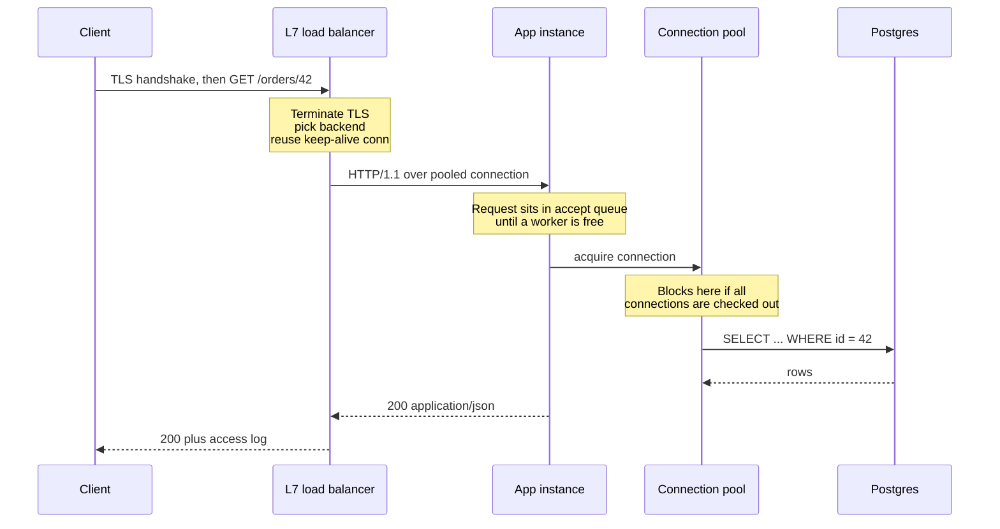

# Anatomy of a Backend Request

> Load balancer, connection pools, threads vs event loops, and where latency actually goes.

- Track: **Backend & Distributed Systems** · Level: **foundation** · ~18 min
- [Open in the academy](https://deepeshk1204.github.io/staff-engineer-academy/#/topic/backend/request-lifecycle)

Between a user pressing a button and your handler function running, the request passes
through DNS, a load balancer, a TLS handshake, a connection pool, a work queue and a thread or
coroutine scheduler. Your handler is usually the *fastest* part of that chain.

This topic is about the other parts. Almost every p99 latency mystery lives in the plumbing --
in a queue you did not know existed, a pool that was one connection too small, or a balancer
sending work to the one machine that was already busy.

## Why it exists

A single process on a single machine needs none of this. You bind a port, accept
sockets, and serve. It breaks for three independent reasons, and each reason adds a layer.

The machine dies, so you need more than one and something in front to pick between them -- that
is the load balancer. The machine is slower than the network, so you need many requests in flight
at once -- that is your concurrency model. And connection setup costs more than the work itself,
so you keep connections open and hand them around -- that is pooling. Each of those layers is a
queue, and queues are where latency is born.

**Costs along the path, order-of-magnitude**

- **~100 ns** — Main-memory read (Free, for our purposes)
- **~0.5 ms** — Same-AZ network round trip (Your service-to-service floor)
- **~1-2 ms** — Cross-AZ round trip (Charged per hop, and per retry)
- **~1 ms** — SSD random read (A cold page in Postgres)
- **2-3 RTT** — TCP + TLS 1.2 handshake (1 RTT with TLS 1.3, 0 on resume)
- **~30 ms** — Cross-continent-US RTT (~200 ms intercontinental)

## How a request actually flows



*Three queues on one request: the LB backend queue, the app accept queue, and the DB pool. Any of them can own your p99.*

## L4 versus L7 load balancing

An **L4** balancer forwards packets or TCP connections. It reads the IP header and the
TCP port, picks a backend, and then every byte of that connection goes to that backend until it
closes. It does not know what HTTP is. AWS NLB and a bare Linux IPVS setup work this way.

An **L7** balancer terminates the connection, parses HTTP, and makes a decision *per request*.
Envoy, NGINX, HAProxy in HTTP mode, and AWS ALB work this way. Because it sees the request it can
route on path or header, retry a failed request on another backend, rewrite headers, enforce
per-route timeouts, and emit real request metrics.

The distinction matters most under HTTP/2 and keep-alive. With an L4 balancer and long-lived
connections, balancing happens *once per connection*, so a client that opens one HTTP/2 connection
and sends 10,000 requests down it pins all 10,000 to one backend. This is the single most common
reason a "load-balanced" service has one node at 90% CPU and the rest at 20%.

**Choosing a layer**

| Dimension | L4 (NLB, IPVS) | L7 (Envoy, ALB, NGINX) |
| --- | --- | --- |
| Decision granularity | Per TCP connection | Per HTTP request |
| Added latency | Tens of microseconds | Sub-millisecond to a few ms |
| Retries on 5xx | Impossible -- it cannot see the response | Yes, with budgets and per-try timeouts |
| Header/path routing | No | Yes, including canary by header |
| TLS | Passthrough, or terminate without parsing HTTP | Terminates, can re-encrypt to backend |
| Throughput ceiling | Very high, kernel or hardware path | Bounded by CPU for parsing and TLS |
| HTTP/2 multiplexing | Pins a whole connection to one backend | Balances each stream independently |
| Best for | Non-HTTP protocols, extreme pps, static hashing | Anything HTTP or gRPC you operate yourself |

> **The gRPC balancing trap**  
> gRPC runs over a single long-lived HTTP/2 connection per channel. Behind an L4 balancer,
> each client channel picks one server and stays there for hours. Adding capacity does nothing,
> because existing clients never rebalance. The fixes are an L7 proxy that balances per stream
> (Envoy), client-side balancing with a resolver that watches endpoints, or forcing periodic
> reconnects with `max_connection_age` on the server -- gRPC Go's
> `keepalive.ServerParameters{MaxConnectionAge: 30 * time.Minute}` exists for exactly this.

## Balancing algorithms, and why round robin is a trap

| Algorithm | How it picks | Where it shines | Where it hurts |
| --- | --- | --- | --- |
| Round robin | Next backend in order | Uniform backends, uniform requests | Sends work to a node already stuck on a slow request |
| Weighted round robin | Order, biased by static weight | Mixed instance sizes, gradual canary | Weights are guesses and go stale |
| Least connections | Fewest in-flight requests | Heterogeneous request cost -- the common case | A node that fails instantly looks idle and attracts traffic |
| Peak EWMA / least request with latency | Fewest in-flight, tie-broken by decayed latency | Hiding a degraded node automatically | Needs per-endpoint state; harder to reason about |
| Power of two choices | Sample 2 at random, take the less loaded | Large fleets -- near-optimal with O(1) state | Slightly worse than full least-conn at small N |
| Consistent hashing on a key | Hash user/tenant/cache key to a ring position | Cache affinity, sticky sessions, sharded state | Hot keys concentrate; rebalancing moves 1/N of keys |
| Random | Uniform random | Baseline, trivially stateless | Variance is high; tail latency worse than least-conn |

The reason least-connections beats round robin is worth working out, because it is a
favourite interview follow-up. Suppose ten backends and a request mix where 95% of requests take
5 ms and 5% take 500 ms. Round robin is blind to what a backend is currently doing, so it will
hand a 5 ms request to a node that is midway through three 500 ms requests. That request now waits
behind them -- head-of-line blocking created by the balancer, not by the work.

Least-connections uses in-flight count as a free proxy for "how busy is this node". The node
stuck on slow requests has a high in-flight count and stops receiving new work until it drains.
With no change to the backends and no change to the request mix, the p99 improves substantially,
because the tail was queueing delay rather than service time.

The failure mode of least-connections is the mirror image: a backend that fails fast -- returning
`500` in 1 ms because its database connection is gone -- has almost zero in-flight requests and
therefore looks like the least loaded node in the fleet. It becomes a black hole that attracts
the maximum share of traffic. This is why production balancers combine in-flight count with
outlier detection: Envoy will eject a host from the pool after N consecutive 5xx responses
(`consecutive_5xx`) for a base ejection time, then let it back gradually.

## TLS termination

TLS 1.3 needs one round trip to establish, plus an asymmetric key operation on the
server. On modern hardware with AES-NI, a 2048-bit RSA signature costs on the order of a
millisecond of CPU, and bulk symmetric encryption after that is nearly free -- single-digit
percent overhead. The handshake is the expensive part, which is why session resumption and
connection reuse matter far more than cipher choice.

You have three places to terminate, and the choice is about trust boundaries, not performance.
Terminating at the edge or load balancer centralises certificate rotation and lets the proxy read
headers, but traffic inside your network is then plaintext. Re-encrypting from the balancer to the
backend costs a second handshake per connection -- amortised to nothing if connections are pooled.
Full passthrough to the app keeps the private key on the app host and forbids L7 routing entirely,
which is why it is rare outside compliance-driven designs.

The practical rule: terminate at the L7 proxy, re-encrypt to backends if you cross a trust
boundary or need mutual TLS for service identity, and make sure keep-alive is on so you pay the
handshake once per connection rather than once per request.

## Keep-alive and pool sizing maths

Without keep-alive, every HTTP request pays a TCP handshake plus a TLS handshake before
the first byte moves. Across a 1 ms same-region RTT that is 2-3 ms of pure setup on a request whose
useful work is 4 ms. You have doubled your latency and tripled your syscall load for nothing.

Pool sizing is the part people guess at, and it is one of the few places in systems work where a
closed-form answer exists. **Little's Law** says the average number of items in a system equals
arrival rate times average time in the system: `L = λ × W`. Applied to a connection pool, the
number of connections you need to keep busy is throughput times average hold time.

**Sizing a Postgres pool with Little's Law**

```text
Target throughput            λ = 1,200 rps for this service
Queries per request              = 2
DB time per query            W   = 4 ms  (p50, including network)

Connections busy on average  L   = 2400 q/s × 0.004 s = 9.6

So ~10 connections keep the database saturated at the p50.
Size for the p95, not the p50: if p95 query time is 20 ms,
  L = 2400 × 0.020 = 48 connections to absorb a bad moment.

Now multiply by instance count, because the pool is per process:
  40 app instances × 10 per-instance pool = 400 server connections.
Postgres default max_connections = 100.  You are 4x over budget
and every instance restart is a connection storm.
```

That last line is the whole argument for a pooler. Postgres forks a backend process per
connection, each with its own work_mem allocation and a slot in every snapshot computation, so
throughput *falls* as idle connections rise -- the well-documented cliff past a few hundred. Put
**pgBouncer** in transaction-pooling mode between the fleet and the database: 400 client
connections multiplex onto 25 server connections, and 25 is roughly right because a machine with
8 cores and an SSD cannot usefully execute more than a few dozen queries at once anyway.

The counter-intuitive consequence is that a *smaller* pool often gives better p99. A pool of 200
lets 200 queries pile into a database that can execute 20 concurrently, so 180 of them are queued
inside the database where you cannot see or prioritise them. A pool of 25 queues the excess in
your application where you own the timeout, can shed load, and can emit a metric.

> **The one pool metric to alert on**  
> Not pool utilisation -- **connection acquisition wait time**. If threads are waiting
> 0 ms to get a connection, the pool is big enough regardless of how full it looks. If they are
> waiting 40 ms, you have found 40 ms of p99 that no database query will ever explain, and no
> amount of `EXPLAIN ANALYZE` will show it to you. HikariCP exposes this as
> `hikaricp_connections_acquire_seconds`; it belongs on your latency dashboard next to the
> database timer.

## Concurrency models

Your server has to hold thousands of half-finished requests, most of which are waiting
on the network. How it holds them determines its memory footprint, its behaviour under overload,
and whether one slow dependency can freeze everything.

**Four ways to hold 10,000 concurrent in-flight requests**

| Model | Examples | Cost per in-flight request | Blocking a request blocks... | Overload behaviour |
| --- | --- | --- | --- | --- |
| Thread per request | Tomcat, Rails+Puma, Gunicorn sync | ~512 KB-1 MB stack, plus a kernel task | Only that thread | Thread pool fills, then requests queue or are rejected |
| Event loop | Node.js, nginx, Netty, asyncio | ~1-10 KB heap per promise chain | Everything -- a CPU-bound handler stalls the loop | Event queue grows silently; latency climbs with no error |
| Goroutines / green threads | Go, Erlang/Elixir | ~2-8 KB growable stack | Only that goroutine | Memory and scheduler pressure rise; needs explicit limits |
| Virtual threads | Java 21+ (Loom), Kotlin coroutines | ~1 KB heap continuation | Only that virtual thread | Unbounded by default -- the limit must move to a semaphore |

A concrete comparison. Ten thousand concurrent requests, each spending 50 ms waiting on
a downstream call and 1 ms on CPU. Thread-per-request needs 10,000 OS threads at roughly 1 MB of
stack, so about 10 GB of virtual memory and a scheduler doing tens of thousands of context
switches per second -- which is why real Tomcat deployments cap the pool near 200 and let the rest
queue. An event loop or a goroutine runtime holds the same 10,000 requests in tens of megabytes,
because a waiting request is a small heap object and not a stack.

But the event loop has a cliff the others do not. Its throughput ceiling is one core's worth of
your handler code, and any synchronous CPU work -- a 20 ms JSON parse of a large payload, a
synchronous bcrypt, a regex that backtracks -- blocks *every* in-flight request, not just its own.
A Node service at 3,000 rps where one endpoint does 15 ms of synchronous crypto does not get slower
on that endpoint; it gets slower on all of them, and the pattern in the metrics is a uniform
latency rise across unrelated routes.

Virtual threads are interesting because they remove the need to choose. You write blocking code,
the runtime unmounts the carrier thread at the blocking point, and you get event-loop memory
economics with thread-per-request code structure. The catch is that the thread pool was also your
concurrency limit, and virtual threads are effectively unlimited -- so you must reintroduce the
bound deliberately with a `Semaphore` or a bulkhead, or the first slow dependency lets a million
requests accumulate and the JVM dies of memory rather than shedding load.

## Where p99 latency actually comes from

Almost never from the code in your handler. The recurring sources, roughly in order of
how often they turn out to be the answer:

- **Queueing.** At 70% utilisation a request waits about as long as it runs; at 90% it waits nine
times as long. Nothing in the code changed. See *Scalability & Capacity* for the curve.
- **Connection pool acquisition.** Invisible to database instrumentation, because the clock starts
when the query is sent.
- **Garbage collection or runtime pauses.** A 200 ms stop-the-world pause on a JVM heap under
pressure hits every in-flight request on that instance at once. With 40 instances and one pausing
every few seconds, roughly 1 in 40 requests is affected -- which is exactly the p97-p99 band.
- **N+1 queries.** 1 ms per query is invisible; 300 sequential queries at 1 ms is 300 ms.
- **Fan-out tail amplification.** A request that calls 20 services in parallel and waits for all of
them experiences the *maximum* of 20 samples. If each service has a 1% chance of being slow, the
request has a 1 - 0.99^20 ≈ 18% chance of being slow.
- **DNS.** A resolver with a 5-second timeout and a default TTL you did not set will eventually
produce a 5-second p99.9 that correlates with nothing.
- **Retries.** A 3x retry on a 1-second timeout is a 3-second request. Your p99.9 is often somebody
else's retry policy.

**Latency budget worked example: GET /checkout/summary, 250 ms p99 target**

```text
Client -> edge (TLS resume, 1 RTT)                 15 ms
Edge -> region (cross-country, pooled)             30 ms
L7 proxy parse + route + access log                 1 ms
App accept queue wait (at 60% utilisation)          4 ms
  Auth: verify JWT locally (no network call)        1 ms
  Cart service call (p99 20 ms, 1 attempt)         20 ms
  Pricing service call (p99 35 ms, parallel)       35 ms   <- max of the two
  Postgres: pool acquire 2 ms + 3 queries 12 ms    14 ms
  Redis: 2 round trips, same AZ                     2 ms
  Serialise 40 KB JSON                              6 ms
Response back through proxy and edge               45 ms
                                                  -------
Committed                                         136 ms
Headroom for one GC pause or one retry            114 ms

Decisions this forces:
  * Cart and pricing MUST be parallel. Sequential = 191 ms committed.
  * Per-call timeout on pricing = 60 ms, not 1 s. A 1 s timeout with
    2 retries spends 3 s of a 250 ms budget and is therefore a lie.
  * No room for a second sequential DB round trip. Batch or denormalise.
  * If p99 target were 120 ms, the region hop must go -- read replica
    or edge cache, because 30 ms of it is physics.
```

## Trade-offs

**Adding an L7 proxy and pooling layer**

What you gain:
- Per-request routing, retries, canaries and timeouts without touching app code.
- One place to terminate TLS and rotate certificates.
- Uniform request metrics and access logs across polyglot services.
- Pooling removes handshake cost and caps concurrency at the database.
- Outlier ejection hides a degraded instance before a human notices.

What it costs you:
- Two more hops of latency and two more things that can be misconfigured.
- The proxy becomes a shared fate boundary -- its config bug is everyone's outage.
- Pool sizing is now a tunable you own, and the default is wrong.
- Timeouts exist in three places and must be ordered consistently.
- Connection reuse makes load imbalance possible where round robin suggested none.

**Failure modes**

| Failure mode | What the user sees | Mitigation |
| --- | --- | --- |
| L4 balancer plus long-lived HTTP/2 or gRPC connections | One instance at 90% CPU while the fleet idles; scaling out changes nothing. | L7 proxy balancing per stream, client-side LB, or server-side `MaxConnectionAge` to force redistribution. |
| Fail-fast instance attracts least-connections traffic | The broken node takes the largest share of requests -- a black hole. | Outlier detection on consecutive 5xx with ejection, plus health checks that test the dependency, not the port. |
| Connection pool smaller than concurrency, no acquire timeout | Requests block indefinitely on acquire; the service hangs rather than erroring. | Bounded acquire timeout under the request deadline, and alert on acquire wait p99. |
| Fleet restart against a bare database | Hundreds of simultaneous connection attempts exhaust `max_connections`; healthy traffic gets "too many clients". | pgBouncer in transaction mode, staggered rollouts, and jittered pool warm-up. |
| CPU-bound handler on an event loop | Latency rises on every unrelated route on that instance; no single slow endpoint to blame. | Move the work to a worker thread or separate service; alert on event-loop lag, not just CPU. |
| Keep-alive timeout on the LB shorter than on the backend | Sporadic connection resets surfacing as 502s at a low, constant rate. | Make the backend idle timeout strictly longer than the proxy's, so the proxy always closes first. |
| Health check hits `/health` returning static 200 | An instance with a dead DB pool stays in rotation and serves errors indefinitely. | Separate liveness from readiness; readiness checks the pool with a cheap `SELECT 1` and a short timeout. |

> **Staff-level angle**  
> Most candidates draw a box labelled "load balancer" and move on. The signal is in the
> sentences that show you have debugged this layer at 3am:
> 
> - "Before I tune any query I want the **connection acquisition wait time**, because if that is
> 40 ms then no amount of index work will move p99 and the database dashboard will look innocent."
> - "We are behind an NLB with gRPC, so balancing happens once per channel and not per request. I
> would expect exactly the imbalance you are describing, and I would fix it with Envoy or with
> `MaxConnectionAge` of 30 minutes on the server side rather than by adding instances."
> - "I would use least-connections over round robin because our request cost is bimodal, but I would
> pair it with outlier ejection -- otherwise the instance failing in 1 ms looks like the idlest node
> in the fleet and receives the most traffic."
> - "Little's Law gives us about 10 busy connections for 1,200 rps at 4 ms, so a per-instance pool of
> 10 and 40 instances is 400 server connections against a `max_connections` of 100. That is an
> argument for pgBouncer, not for raising the limit -- Postgres throughput degrades with connection
> count because it is a process per connection."
> - "A 1-second timeout inside a 250 ms budget is not a timeout, it is a promise to violate the SLO.
> The per-attempt timeout has to be derived from the remaining budget."
> 
> The pattern in all five: name the specific queue, give the number that would confirm it, and name
> the mechanism that fixes it. Saying "we would monitor it" is the weak version of every one of
> these sentences.

**Check**

A gRPC service behind an AWS NLB has one pod at 95% CPU and nine at 15%. Scaling to 20 pods does not help. Why?
- A. NLB does not support gRPC, so requests are being retried.
- B. Balancing happens once per TCP connection, and gRPC keeps one long-lived HTTP/2 connection per channel. **(answer)**
- C. The pods have different CPU limits.
- D. HTTP/2 flow control is throttling the other pods.

  An L4 balancer picks a backend at connection establishment and then forwards every byte of that connection there. gRPC opens one HTTP/2 connection per channel and multiplexes thousands of RPCs onto it, so a client is pinned for the life of the channel and new pods never receive traffic from existing clients. Fix it at L7 (Envoy balances per stream), with client-side load balancing, or by setting `MaxConnectionAge` so channels periodically reconnect and rebalance.

You raise a service's Postgres pool from 20 to 200 connections per instance. Throughput is flat and p99 doubles. What happened?
- A. The pool is now too large to fit in memory.
- B. Queueing moved from your application into the database, where it is unbounded and unprioritised. **(answer)**
- C. Postgres serialises all queries on a single connection.
- D. Connection acquisition became slower because the pool must be scanned.

  The database can only execute a few dozen queries concurrently before it is CPU- or IO-bound. A bigger pool does not create capacity; it just lets more work queue somewhere you do not control, behind locks and buffer contention, with no timeout and no way to shed. Keeping the pool near the database's real concurrency pushes the wait into your app where you own the deadline and can emit acquire-wait metrics.

A request fans out to 20 services in parallel and waits for all of them. Each has a 1% chance of exceeding 100 ms. Roughly what fraction of requests exceed 100 ms?
- A. About 1%
- B. About 5%
- C. About 18% **(answer)**
- D. About 50%

  1 - 0.99^20 = 0.182. Waiting on all of N calls means you experience the maximum of N latency samples, so the tail of the slowest dependency becomes the median-ish behaviour of your request. This is tail amplification, and it is why large fan-outs need hedged requests, per-call deadlines well inside the budget, and the ability to return a partial result rather than waiting for the straggler.

A Node.js service shows latency rising on every route at once, while CPU sits at 60% and no single endpoint looks slow. What is the most likely cause?
- A. Database connection exhaustion.
- B. A synchronous CPU-bound operation on the event loop blocking all in-flight requests. **(answer)**
- C. DNS resolution timeouts.
- D. The load balancer is using round robin.

  On a single-threaded event loop, any synchronous work -- a big JSON.parse, a synchronous crypto call, a backtracking regex -- delays every other pending callback, so the symptom is a uniform rise across unrelated routes rather than one slow endpoint. CPU looks moderate because the loop is blocked, not saturated across cores. Instrument event-loop lag directly; it is the metric that distinguishes this from pool or dependency problems.

<details><summary>Related topics and how they connect</summary>

The queueing behaviour sketched here is derived properly in **Scalability & Capacity
Planning**, including why 70% utilisation is the practical ceiling. The timeout ordering and retry
rules referenced in the latency budget are the subject of **Resilience: Timeouts, Retries &
Backpressure**. Connection pooling against Postgres continues in **Databases, Indexes & Query
Plans**, which also covers the N+1 pattern. Consistent hashing as a balancing strategy becomes a
data-placement strategy in **Sharding & Partitioning**.

</details>

## Flashcards

- **Why does an L4 load balancer create imbalance with HTTP/2 or gRPC?** — It balances once per TCP connection. HTTP/2 multiplexes many requests onto one long-lived connection, so a client is pinned to one backend for the connection's lifetime and new instances never receive its traffic.
- **Why does least-connections beat round robin under variable request cost?** — In-flight count is a free proxy for how busy a backend is. Round robin sends a cheap request to a node already stuck behind slow ones, creating queueing delay at the balancer. Least-connections routes around it.
- **What is the failure mode of least-connections?** — A backend failing fast has near-zero in-flight requests, so it looks idlest and attracts the most traffic. Pair it with outlier detection that ejects hosts on consecutive 5xx.
- **State Little's Law and apply it to a connection pool.** — `L = λ × W`. Busy connections equal query throughput times average query duration. At 2,400 queries/s and 4 ms each you need about 10 busy connections; size for p95 hold time, not p50.
- **Why does Postgres need pgBouncer while MySQL tolerates more connections?** — Postgres forks an OS process per connection, each with its own memory and a slot in snapshot computation, so throughput degrades past a few hundred. A transaction-mode pooler multiplexes hundreds of clients onto tens of server connections.
- **Why can a bigger connection pool make p99 worse?** — It moves queueing from your application into the database, where the wait is unbounded, unprioritised, invisible to your timeouts and not exposed as a metric.
- **What breaks when a CPU-bound handler runs on an event loop?** — It blocks every in-flight request on that instance, so latency rises uniformly across unrelated routes. Watch event-loop lag, not CPU, and move the work off the loop.
- **Why must virtual threads be paired with an explicit concurrency limit?** — The old thread pool was also the admission control. Virtual threads are effectively unbounded, so a slow dependency lets requests accumulate until the process dies of memory instead of shedding load. Reintroduce the bound with a semaphore or bulkhead.
- **Which single metric most often explains p99 that queries cannot?** — Connection acquisition wait time. Database instrumentation starts the clock when the query is sent, so time spent waiting for a pooled connection is invisible to it.

## Drills

### Drill

A checkout API is at 1,800 rps across 30 pods behind an ALB. p50 is 40 ms, p99 is 1.4 s. CPU averages 45%, the slowest query in `pg_stat_statements` is 18 ms, and the p99 spikes do not correlate with traffic. You have one hour before a launch. Where do you look, in order?

Probes:

- What would distinguish queueing from slow work in the data you already have?
- What instrumentation is missing, and how would you add it without a deploy?
- Nothing in the database explains 1.4 s. What else charges time to your request?
- If the spikes are per-pod rather than fleet-wide, what does that rule out?

Strong answer contains:

- Asks for connection acquisition wait time first, and notes DB metrics cannot see it.
- Checks whether p99 spikes cluster per-pod (GC, one bad host) or fleet-wide (shared dependency).
- Computes expected pool need from Little's Law and compares with the configured pool size.
- Looks at downstream per-call timeouts and retry counts -- a 1.4 s p99 with a 500 ms timeout implies retries.
- Distinguishes 18 ms single-query time from 300 ms of N+1 by checking queries-per-request.
- Notes that 45% average CPU is compatible with individual pods near saturation.

Weak answer tells:

- Immediately proposes adding pods or raising the pool size without a hypothesis.
- Blames the slowest query even though 18 ms cannot produce a 1.4 s p99.
- Treats average CPU as evidence there is no saturation anywhere.
- Suggests "add caching" with no statement of what is being cached or what the hit rate would be.
- Never mentions GC pauses, retries or queueing as candidate sources.

### Drill

You are moving an internal API from JSON over HTTP/1.1 to gRPC. Traffic is 400 rps from 12 client services, and ops report that after the cutover one of your eight pods runs hot enough to trip its CPU limit while the rest idle. Explain the mechanism and your fix, including what you would change if the balancer could not be replaced.

Probes:

- Where exactly is the balancing decision made now, and how often?
- How many TCP connections exist in total, and how long do they live?
- What happens to this problem when you scale from 8 pods to 16?
- What is the cost of forcing reconnects, and how would you pick the interval?

Strong answer contains:

- Identifies per-connection rather than per-request balancing as the cause.
- Counts connections: roughly one channel per client process, so tens of connections across eight pods -- small N means bad luck is visible.
- Names three fixes with trade-offs: L7 proxy (Envoy) per-stream balancing, client-side LB with endpoint watch, server `MaxConnectionAge` plus jitter.
- Notes that scaling out cannot fix it because existing channels never rebalance.
- Picks a reconnect interval with jitter to avoid synchronised reconnect storms.

Weak answer tells:

- Concludes gRPC is "not load balanced" without explaining the HTTP/2 mechanism.
- Proposes round robin versus least connections as the fix -- the algorithm is not the issue.
- Suggests raising the CPU limit on the hot pod.
- Forces reconnects every 30 seconds with no jitter and no mention of the handshake cost.
