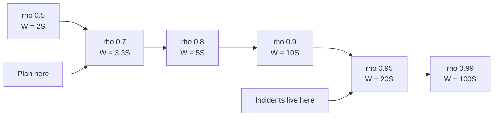

# Scalability & Capacity Planning

> Back-of-envelope maths, Little's Law, queueing intuition, and autoscaling that does not oscillate.

- Track: **Backend & Distributed Systems** · Level: **core** · ~20 min
- [Open in the academy](https://deepeshk1204.github.io/staff-engineer-academy/#/topic/backend/scalability-and-capacity)

Capacity planning is the practice of knowing, before it happens, roughly what your system
will do at ten times the load. It is arithmetic, not intuition, and the arithmetic is deliberately
crude -- you are trying to distinguish "one machine" from "forty machines" from "this design cannot
work", and for that you need one significant figure, not two.

The other half is queueing theory, which supplies the single most useful fact in operations: a
system at 90% utilisation does not behave like a system at 45% utilisation running twice as fast.
It behaves like a system that is about to fall over.

## Why it exists

Two failure modes motivate all of it. Teams build systems that cannot possibly work,
discovering at load-test time that the design implies 900 database writes per user action. And
teams over-provision by an order of magnitude because nobody did the sum, then discover the bill.

Both come from the same gap: nobody translated the product requirement into rates and bytes. An
estimate does not need to be accurate to be decisive. If the sum says 40 TB per month and your
budget assumed 2 TB, you do not need better precision -- you need a different design. That is what
back-of-envelope maths is for, and it is why interviewers ask for it: it is the cheapest way to see
whether someone can reason quantitatively about a system they have just heard of.

## The method

**Six steps, in this order, always**

1. Start from users: total accounts, then daily actives, then actions per active per day.
2. Convert to a rate: divide by 86,400 for average rps, then multiply by a peak factor. Diurnal web traffic is typically **2-4x** average at peak; a launch or a scheduled event can be 10-50x.
3. Split reads from writes. The ratio decides almost everything downstream -- caching, replicas, fan-out direction.
4. Size one item, then multiply. Bytes per row or per object times objects per day times retention gives storage. Include indexes at roughly 20-50% of table size, and replication factor.
5. Bandwidth: response size times rps. This is the step most often skipped, and it is the one that produces surprise egress bills.
6. Convert to machines using a measured or assumed per-instance capacity, then divide by your target utilisation -- not by 100%.

**Latency numbers worth memorising**

- **0.5 ns** — L1 cache reference (The unit everything else is measured in)
- **~25 ns** — L3 / last-level cache
- **~100 ns** — Main memory reference (~200x slower than L1)
- **~1.5 μs** — Compress 1 KB with snappy (Cheap enough to always consider)
- **~10 μs** — Read 1 MB sequentially from memory
- **~16 μs** — NVMe SSD random read (Was 150 μs on SATA SSD, 10 ms on spinning disk)
- **~0.5 ms** — Same-AZ network round trip (Your service-to-service floor)
- **~200 μs** — Read 1 MB sequentially from NVMe (About 5 GB/s)
- **~1 ms** — Read 1 MB over 10 Gbit network
- **~30 ms** — US coast-to-coast round trip (~200 ms intercontinental)
- **~1-5 ms** — Indexed Postgres point read, warm (~0.2 ms for a Redis GET)
- **~10-100 ms** — A visible GC pause (Multi-second on a badly tuned large heap)

## A fully worked example

The requirement: a photo-sharing feed. 60 million registered users, 12 million daily
active, each opening the app 6 times a day and viewing 30 photos per session. 1.5% of daily actives
upload one photo per day. Photos are stored at three resolutions. Retain everything for 5 years.
Feed reads must be p99 under 150 ms.

Everything below follows mechanically.

**Step by step, with the assumptions stated**

```text
--- 1. Rates ---------------------------------------------------------
Feed opens/day   = 12e6 DAU x 6            = 72,000,000
Average rps      = 72e6 / 86,400           = 833 rps
Peak rps         = 833 x 3 (diurnal)       = 2,500 rps   feed requests

Photo views/day  = 72e6 x 30               = 2,160,000,000
Peak image rps   = (2.16e9 / 86,400) x 3   = 75,000 rps  image fetches
  --> Images are 30x the API traffic. They belong on a CDN, not your app.

Uploads/day      = 12e6 x 0.015            = 180,000
Average          = ~2 /s        Peak       = ~6 /s
  --> Write path is trivial in rate. It is not trivial in cost per write.

Read:write ratio = 833 : 2  ~= 400:1
  --> Licence to do heavy work per write. Fan-out-on-write for feeds is
      obviously right at this ratio.

--- 2. Storage -------------------------------------------------------
Per upload: original 3.5 MB + medium 400 KB + thumb 40 KB = ~3.94 MB
Per day     = 180,000 x 3.94 MB            = ~709 GB/day
Per year    = 709 GB x 365                 = ~259 TB/year
5 years     =                                ~1.3 PB
With S3 cross-region replication x2        = ~2.6 PB
  --> Object storage only. Also: 96% of those bytes are the original,
      which is viewed rarely. Lifecycle originals to infrequent-access
      after 30 days and the storage bill drops by roughly half.

Metadata row: id, user, caption, ts, geo, 3 URLs  = ~600 B
  + indexes at ~40%                               = ~840 B
Per year    = 180,000 x 365 x 840 B               = ~55 GB/year
5 years     =                                       ~275 GB
  --> Metadata fits comfortably in one Postgres instance. Do not shard it.

--- 3. Feed fan-out --------------------------------------------------
Average followers = 150. Timeline entry = 40 B (post id, author, ts).
Writes per upload = 150 timeline inserts
Peak timeline writes = 6 uploads/s x 150   = 900 writes/s   -- easy
Timeline storage  = keep newest 800 entries/user
                  = 12e6 x 800 x 40 B      = ~384 GB        -- fits in Redis
                                                              or a KV store
But: one account with 40,000,000 followers turns one upload into
40M writes. At 20,000 writes/s that is ~33 minutes of fan-out.
  --> Hybrid: fan-out-on-write below ~50k followers, pull-at-read for
      the few hundred accounts above it, merged at query time.

--- 4. Bandwidth -----------------------------------------------------
Feed response = 30 items x ~1.2 KB JSON    = ~36 KB
Peak API egress = 2,500 rps x 36 KB        = 90 MB/s  = 720 Mbit/s
Peak image egress = 75,000 rps x 400 KB    = 30 GB/s  = 240 Gbit/s
  --> 240 Gbit/s from your origin is not a thing you build. At a 97% CDN
      hit rate the origin sees ~7 Gbit/s, which is.
Monthly CDN egress = 30 GB/s x 2.6e6 s     = ~78 PB/month
  --> At even $0.02/GB that is ~$1.5M/month. This number changes the
      product: it justifies aggressive resizing, WebP/AVIF, and lazy
      loading as engineering priorities rather than polish.

--- 5. Machines ------------------------------------------------------
Assume 800 rps per app instance (measured, not guessed).
Peak 2,500 rps / 800                       = 3.1 instances
Target 60% utilisation: 3.1 / 0.6          = ~6 instances
Survive one AZ failure of three: x 1.5     = ~9 instances
Round up for deploy headroom               = 10 instances

--- 6. Cache ---------------------------------------------------------
Hot timelines: 20% of DAU = 2.4e6 users x 800 entries x 40 B = ~77 GB
  --> ~3 Redis nodes with 32 GB usable, or fewer with shorter timelines.
At a 90% hit rate the metadata DB sees 250 rps. Comfortable.
```

> **What the estimate bought you**  
> Four design decisions, each falling out of one number rather than out of taste. Images
> are 30x the API traffic, so a CDN is mandatory rather than an optimisation. The 400:1 read/write
> ratio makes fan-out-on-write correct. The celebrity account's 40 million writes forces a hybrid
> model. And 78 PB of monthly egress makes image format and size a *business* decision. None of that
> required precision -- being wrong by a factor of two changes none of the four conclusions.

## Little's Law, and what it is actually for

`L = λ × W`: the average number of items in a system equals the arrival rate times the
average time each spends inside. It holds for any stable system regardless of distribution, which
is what makes it so useful -- no assumptions required.

It is the answer to every "how big should this pool be" question, and it is the answer to "how many
threads do I need", and it is the answer to "how deep will this queue get". Same equation, three
rearrangements.

**Little's Law, three ways**

```text
# 1. Sizing a connection pool.
  λ = 2,400 queries/s,  W = 4 ms
  L = 2400 x 0.004 = 9.6 connections busy on average.
  Size for p95 hold time, not p50: if p95 W = 20 ms, L = 48.

# 2. Sizing a thread pool / concurrency limit.
  λ = 1,200 rps,  W = 45 ms (including all downstream waiting)
  L = 1200 x 0.045 = 54 concurrent requests in flight.
  A 20-thread pool caps you at 20/0.045 = 444 rps. That is your real
  ceiling, and no amount of CPU headroom changes it.

# 3. Inferring queue wait from queue depth -- the one people forget.
  A Kafka consumer group shows 400,000 messages of lag.
  Throughput is 5,000 msg/s.
  W = L / λ = 400,000 / 5,000 = 80 seconds of delay.
  So "lag = 400k" is not an abstract number; it means the newest event
  will be processed 80 seconds late. Alert on seconds, not on count.

# 4. The reverse check that catches bad designs.
  You have 200 threads and W = 2 s (a slow downstream).
  Max λ = 200 / 2 = 100 rps. If you need 800 rps, the design is wrong
  before you deploy it -- either W or L must change by 8x.
```

## Why utilisation above 70% makes latency explode

For a single queue with random arrivals, the average time in the system is
`W = S / (1 - ρ)`, where `S` is the service time and `ρ` is utilisation. That formula is the
most important one in capacity planning, and its shape is a hyperbola -- it does not degrade
gracefully, it has an asymptote.

The mechanism is worth understanding rather than memorising. Requests do not arrive evenly; they
arrive in clumps. At 50% utilisation the server has idle time between clumps to work off the
backlog. At 95% utilisation there is almost no idle time, so a clump's backlog is still draining
when the next clump arrives, and waiting time compounds. Nothing about the server changed; the
*variance* of arrivals is now unabsorbable.

This is why "CPU is only at 85%, we have headroom" is one of the most expensive misconceptions in
operations. At 85% utilisation your latency is already 6.7x the service time, and the next 10% of
traffic costs you another 3x.

**The response-time curve: W = S / (1 - ρ), with S = 10 ms**

| Utilisation ρ | Multiplier 1/(1-ρ) | Total time in system | Of which waiting |
| --- | --- | --- | --- |
| 10% | 1.11x | 11 ms | 1 ms |
| 50% | 2x | 20 ms | 10 ms |
| 70% | 3.3x | 33 ms | 23 ms |
| 80% | 5x | 50 ms | 40 ms |
| 90% | 10x | 100 ms | 90 ms |
| 95% | 20x | 200 ms | 190 ms |
| 99% | 100x | 1,000 ms | 990 ms |



*The knee is around 0.7-0.8. Plan capacity to the left of it, because the cost of the next 10% of traffic is not linear -- and autoscaling takes minutes you will not have.*

Two refinements make this realistic. Multiple parallel servers behind one queue absorb
variance much better, so an M/M/c queue can safely run hotter than a single server -- which is
another argument for many small instances behind a shared queue rather than a few large ones. And
real service times are not exponential; high variance in service time makes the curve *worse* than
this table, which is exactly why one slow endpoint sharing a thread pool with fast ones is so
damaging.

The practical consequence: target 60-70% utilisation on anything latency-sensitive, and remember
that the headroom is not waste -- it is what you are buying to absorb variance, deploys, instance
failures and the time autoscaling takes to react.

## Read scaling, write scaling, and coordination cost

Reads scale almost embarrassingly well. Add replicas, add cache layers, add a CDN --
each is independent, stateless with respect to the others, and the only cost is staleness. If your
workload is 400:1 read-heavy, you have an easy problem and should say so.

Writes are the real constraint, because every write must be ordered against other writes to the
same data, and ordering requires coordination. Your options are to make writes cheaper (batch
them, append instead of update, move them off the transactional path), to partition so that
different writes go to different machines that never need to agree, or to weaken the ordering
guarantee. There is no fourth option, and "add a replica" is not one of them -- replicas multiply
write work rather than dividing it.

**Amdahl's law** says that if a fraction `s` of the work is serial, the maximum speedup is
`1/s` no matter how many machines you add: 5% serial work caps you at 20x. **Gunther's Universal
Scalability Law** adds the term that matters more in practice -- a coordination cost that grows
with the *square* of the node count, because every node may need to agree with every other. The
consequence is that throughput does not plateau, it **peaks and then declines**. Adding the 41st
node can make the system slower than it was with 40.

This is not theoretical. It is why a distributed lock that every request touches turns capacity
into a fixed number, why a chatty consensus group gets worse past five or seven members, and why
the honest answer to "can we scale this by adding machines" is sometimes no.

**Vertical versus horizontal**, honestly. Vertical scaling is dramatically
underrated. A modern single machine goes to 192 cores and 2 TB of RAM, and buying a bigger instance
is one restart with zero new failure modes -- no partitions, no rebalancing, no cross-shard
queries, no distributed transactions. An enormous number of companies never needed to shard their
database and would have moved faster if they had bought a bigger one. The limits are real though: a
hard ceiling you will eventually hit, a single failure domain, an expensive price curve at the top
end, and restart times measured in minutes on a 2 TB heap.

Horizontal scaling has no ceiling and gives you fault isolation, and it costs you the entire
distributed-systems syllabus: partial failure, consistency choices, rebalancing, and an operational
burden that grows with node count. The defensible default is to scale the stateless tier
horizontally from day one -- it is nearly free -- and to scale the stateful tier vertically for as
long as you can get away with, because that is where all the complexity lives.

## Autoscaling on the right signal

CPU utilisation is the default autoscaling metric and it is usually the wrong one. For an
I/O-bound service, CPU stays at 30% while every request waits 4 seconds on a slow dependency:
latency is catastrophic and the autoscaler sees a healthy fleet. Worse, CPU is a *lagging*
indicator -- by the time it rises, your queues are already deep, and you now wait for an instance
to boot.

Scale on a signal that measures **work waiting to be done**, not resources being consumed. For a
queue consumer, that is queue depth or, better, the derived wait time from Little's Law: 400,000
messages at 5,000/s is 80 seconds of delay, and "80 seconds" is a number you can set an SLO
against while "400,000" is not. For a request service, it is in-flight concurrency per instance,
which is what Kubernetes KEDA and Knative use and what AWS calls a target tracking metric on
`ALBRequestCountPerTarget`. Concurrency leads CPU, it captures I/O waiting, and it maps directly
onto the utilisation curve above.

**Scaling on concurrency, with the anti-oscillation settings**

```yaml
apiVersion: autoscaling/v2
kind: HorizontalPodAutoscaler
metadata: { name: orders-api }
spec:
  scaleTargetRef: { apiVersion: apps/v1, kind: Deployment, name: orders-api }
  minReplicas: 6            # survive an AZ loss at min, not just at peak
  maxReplicas: 60           # a bound, so a bug cannot scale you to bankruptcy
  metrics:
    - type: Pods
      pods:
        metric: { name: http_inflight_requests }
        target:
          type: AverageValue
          averageValue: "35"   # from Little's Law: 35 in flight at W=45ms
                               # is ~780 rps/pod, ~65% of measured 1200 capacity
  behavior:
    scaleUp:
      stabilizationWindowSeconds: 0      # react immediately to load
      policies:
        - type: Percent
          value: 100                     # at most double
          periodSeconds: 30
    scaleDown:
      stabilizationWindowSeconds: 600    # 10 min of sustained low load
      policies:
        - type: Percent
          value: 10                      # shed at most 10% per minute
          periodSeconds: 60
```

The asymmetry in that config is the whole point. Scaling up is cheap and the cost of
being slow is user-visible, so react instantly and allow aggressive steps. Scaling down saves
money and the cost of being wrong is an outage, so require ten minutes of sustained evidence and
move in small steps. Symmetric thresholds produce **oscillation**: the fleet scales up, load per
instance drops below the scale-down threshold, instances are removed, load per instance rises above
the scale-up threshold, and you flap on a cycle roughly equal to your boot time -- burning money
and dropping connections on every scale-down.

The deeper limit is that autoscaling is only as fast as a new instance becoming useful, and that is
usually 60-300 seconds: image pull, process start, JIT warm-up, connection pool establishment,
cache fill. A traffic spike that arrives in 10 seconds will not be met by autoscaling, so for
*known* spikes you pre-provision on a schedule, and for unknown ones you need load shedding to
survive the gap. That is also why `minReplicas` should be sized for an AZ failure rather than for
the trough -- a scale-from-two event during an AZ loss is exactly when you cannot afford a
five-minute warm-up.

**Cold start** deserves separate treatment because it interacts badly with everything
else. A JVM service may need 30-90 seconds before its JIT-compiled hot paths and filled connection
pool let it serve at full speed. If your readiness probe passes at 5 seconds, the load balancer
sends it a full share of traffic immediately and it responds slowly or times out -- so a scale-up
event *raises* p99 briefly, which can trigger more scaling. The fixes are gradual traffic ramp-up
(Envoy's slow-start mode, or a readiness gate that opens progressively), a warm pool of
pre-initialised instances for serverless (AWS provisioned concurrency), and making the readiness
probe reflect genuine readiness -- pool established, caches primed, one real query completed.

## Trade-offs

**Planning to 65% utilisation with concurrency-based autoscaling**

What you gain:
- Latency stays on the flat part of the queueing curve, so p99 is stable.
- Headroom absorbs deploys, instance loss, GC pauses and arrival variance.
- Concurrency leads CPU, so scaling reacts before queues deepen.
- Asymmetric scale-down removes oscillation and the connection churn it causes.
- A stated capacity model makes launch readiness a calculation rather than a debate.

What it costs you:
- You pay for roughly 35% idle capacity, permanently and visibly.
- Concurrency metrics require instrumentation the platform does not give you free.
- Conservative scale-down means you hold capacity you are not using.
- Estimates go stale as the product changes; the model needs an owner.
- Per-instance capacity must be measured under realistic load, which costs a load-test environment.

**Failure modes**

| Failure mode | What the user sees | Mitigation |
| --- | --- | --- |
| Planning to 90% utilisation because "CPU has headroom" | Latency is already 10x service time; the next 10% of traffic triples it again. Looks fine on dashboards until it does not. | Target 60-70%; alert on utilisation, not just saturation, and treat headroom as a purchased good. |
| Autoscaling on CPU for an I/O-bound service | CPU sits at 30% while requests wait 4 s downstream; no scaling occurs during the incident. | Scale on in-flight concurrency or queue wait time; keep CPU as a secondary metric. |
| Symmetric scale-up and scale-down thresholds | Fleet oscillates on a period equal to boot time, dropping connections on each scale-down. | Immediate scale-up, 10-minute stabilisation window on scale-down, small percentage steps. |
| Readiness probe passing before the instance is warm | Every scale-up event raises p99 as cold instances receive full traffic and time out, potentially triggering more scaling. | Slow-start traffic ramp, readiness gated on a real dependency check, and pre-warmed pools for spiky workloads. |
| `minReplicas` sized for the traffic trough | An AZ failure at 03:00 leaves one instance serving everything while new ones take five minutes to warm. | Size `minReplicas` to survive the loss of one zone, not to minimise the night-time bill. |
| Ignoring bandwidth in the estimate | Design is sound on compute and storage, then egress costs more than the entire infrastructure budget. | Compute egress explicitly per response; assume a CDN hit rate and state it. |
| Adding nodes to a coordination-bound system | Throughput peaks then declines -- 41 nodes slower than 40, per USL's quadratic coherency term. | Remove the shared serial point (global lock, single counter, cross-shard transaction) before adding capacity. |
| Peak factor taken as 1x average | Capacity is a third of what peak needs; every day has a predictable brown-out at the diurnal maximum. | Use measured peak-to-mean ratio (typically 2-4x for consumer traffic) and plan to peak, not to mean. |

> **Staff-level angle**  
> The estimation itself is table stakes. The Staff signal is which numbers you choose to
> compute, and what conclusion you draw from each.
> 
> - "Before sizing anything I want the read/write ratio. At 400:1 I can afford heavy work on the write
> path, so fan-out-on-write for timelines is clearly right -- and that conclusion is driven by the
> ratio, not by preference."
> - "Image traffic is 75,000 rps at 400 KB, which is 240 Gbit/s. That is not something you serve from
> an origin, so the CDN is a requirement, not an optimisation. And 78 PB a month of egress makes
> image format a business decision rather than a polish task."
> - "I would not plan to 90% CPU. `W = S/(1-ρ)` means 90% utilisation is already 10x service time in
> the system, and the next 10% of traffic triples it. I plan to about 65%, and the 35% idle is what
> buys deploys, an AZ loss and arrival variance."
> - "Lag of 400,000 messages is not a number I can act on. At 5,000 per second that is 80 seconds of
> delay by Little's Law, and 80 seconds is something I can write an SLO against."
> - "We autoscale on CPU and the service is I/O bound, so during the incident CPU was at 30% and the
> autoscaler did nothing. I would scale on in-flight concurrency, with immediate scale-up and a
> ten-minute stabilisation window on scale-down so it cannot oscillate."
> - "One account with 40 million followers is 33 minutes of fan-out at 20,000 writes a second. So the
> design has to be hybrid -- push below about 50,000 followers, pull-at-read above it, merged at
> query time."
> - "Adding shards will not help here, because every request takes the same global lock. USL says the
> coherency term grows quadratically, so past some point more nodes make it slower. The lock has to
> go first."
> - "I would scale the stateless tier out and the database up, for as long as vertical works. A 192-core
> machine is one restart with no new failure modes; sharding is the whole distributed-systems syllabus."
> 
> What these signal: that you reason from ratios to decisions, that you know the queueing curve well
> enough to refuse a plan, that you convert operational metrics into user-facing time, and that you
> are willing to say "adding machines will not help". The last one is the rarest and the most
> valuable.

**Check**

A service has a service time of 10 ms and runs at 90% utilisation. Roughly what is the average total time a request spends in the system?
- A. 11 ms
- B. 20 ms
- C. 100 ms **(answer)**
- D. 900 ms

  `W = S/(1-ρ) = 10/(1-0.9) = 100 ms`, so 90 ms of the 100 is pure queueing delay that did not exist at low load. Nothing about the code changed -- at high utilisation there is no longer idle time between bursts to absorb their backlog. This is why 90% utilisation is not "10% of headroom": the next slice of traffic takes you to 95% and 200 ms.

A Kafka consumer group has 400,000 messages of lag and processes 5,000 messages per second. What should you tell the product team?
- A. There are 400,000 unprocessed messages.
- B. Events are currently being processed about 80 seconds after they are produced. **(answer)**
- C. The consumer needs 400,000 more partitions.
- D. Lag cannot be converted to time.

  Little's Law rearranged gives `W = L/λ = 400,000/5,000 = 80 s`, which is the delay a newly produced event will experience. That is the number a product owner can reason about and the number an SLO can be written against, whereas a raw count means nothing without throughput. It also tells you what to do: to halve the delay you must roughly double consumer throughput or halve arrivals.

Your I/O-bound API scales on CPU at a 70% target. During an incident requests take 4 s waiting on a downstream service, but no scaling happens. Why, and what would you scale on?
- A. The HPA was misconfigured; raise the CPU target.
- B. Waiting on I/O consumes no CPU, so the autoscaler sees a healthy fleet. Scale on in-flight concurrency or queue wait instead. **(answer)**
- C. Kubernetes cannot scale during high latency.
- D. The metric server was down.

  CPU measures resource consumption, not work waiting to be done, so a fleet of threads blocked on a slow dependency looks idle. In-flight concurrency captures exactly that state, leads CPU as a signal, and maps directly onto the queueing curve. Worth noting that scaling out may not even be the right response to a slow dependency -- adding instances can increase pressure on it -- which is why concurrency limits and load shedding belong alongside autoscaling.

You add a 41st node to a system and total throughput drops slightly. Which model explains this?
- A. Amdahl's law -- the serial fraction caps speedup at 1/s.
- B. The Universal Scalability Law -- a coherency cost growing with the square of node count, so throughput peaks then declines. **(answer)**
- C. Little's Law.
- D. The CAP theorem.

  Amdahl predicts a plateau at `1/s`, never a decline. USL adds a term for the cost of nodes coordinating with each other, which grows quadratically with node count, so the curve has a maximum and falls beyond it -- cache-coherency traffic, lock contention, gossip and cross-shard chatter all behave this way. The actionable reading is that the fix is to remove the shared serial point rather than to add capacity to it.

<details><summary>Related topics and how they connect</summary>

The queueing curve here is what makes load shedding and concurrency limits necessary
rather than optional -- see **Resilience: Timeouts, Retries & Backpressure**, which also covers
metastable failure. Pool sizing from Little's Law is applied in **Anatomy of a Backend Request**.
Removing the shared serial point usually means partitioning, which is **Sharding & Partitioning**,
and the coordination cost that caps scaling is quantified in **Consensus, Leases & Distributed
Locks**. Lag-as-time is a core operational metric in **Queues & Event Streaming** and an SLO
question in **Observability, SLOs & Error Budgets**.

</details>

## Flashcards

- **State the six steps of a back-of-envelope estimate.** — Users to daily actives to actions per day; convert to average rps and apply a peak factor of 2-4x; split reads from writes; size one item and multiply for storage including indexes and replication; compute bandwidth; convert to machines at a target utilisation, not at 100%.
- **What is `W = S / (1 - ρ)` and why does it matter?** — Average time in a single-server queue given service time `S` and utilisation `ρ`. It is a hyperbola, so at 70% utilisation you are at 3.3x service time, at 90% 10x, at 99% 100x. It is why planning to 90% CPU is planning an incident.
- **Why is arrival variance the underlying cause of the utilisation curve?** — Requests arrive in clumps. At low utilisation there is idle time between clumps to drain the backlog; near saturation there is not, so waits compound. High variance in service time makes it worse than the formula predicts.
- **Give three uses of Little's Law.** — Pool sizing (`L = λW`: 2,400 q/s at 4 ms needs ~10 connections); concurrency ceiling (20 threads at 45 ms caps you at 444 rps); and converting queue depth to delay (400k lag at 5k/s is 80 seconds).
- **Why is CPU the wrong autoscaling signal for an I/O-bound service?** — Threads blocked on a slow dependency consume no CPU, so a badly degraded fleet looks idle. CPU also lags -- by the time it rises, queues are deep. Scale on in-flight concurrency or derived queue wait time.
- **What causes autoscaling oscillation and how do you stop it?** — Symmetric up and down thresholds: scaling up drops per-instance load below the scale-down threshold, and so on, flapping at roughly the boot interval. Fix with immediate scale-up, a long stabilisation window on scale-down, and small percentage steps.
- **Why can a scale-up event temporarily raise p99?** — Cold instances pass readiness before JIT warm-up, connection pools and caches are ready, then receive a full traffic share and respond slowly. Use slow-start ramping, a readiness probe that reflects real readiness, and warm pools for spiky load.
- **Difference between Amdahl's law and the Universal Scalability Law?** — Amdahl says a serial fraction `s` caps speedup at `1/s` -- throughput plateaus. USL adds a coherency cost growing with the square of node count, so throughput peaks and then *declines*: adding a node can make the system slower.
- **Honest case for vertical scaling?** — A single machine reaches ~192 cores and 2 TB of RAM, and resizing is one restart with no partitions, rebalancing or cross-shard queries. Scale the stateless tier horizontally from day one and the stateful tier vertically for as long as you can; sharding imports the whole distributed-systems syllabus.

## Drills

### Drill

Estimate the infrastructure for a live-events chat product. Peak concurrent viewers 2 million during a match, 3% of viewers send a message per minute, every message is delivered to every viewer in the same room, rooms average 50,000 viewers with one room holding 800,000. Messages are retained 30 days. Give rates, fan-out volume, machine counts and the design decisions your numbers force.

Probes:

- What is the message ingest rate versus the delivery rate, and which one is the problem?
- What happens in the 800,000-viewer room specifically?
- How many connections per machine can you hold, and what limits it?
- What is the bandwidth, and where does it egress from?
- Which numbers would make you change the product requirement rather than the architecture?

Strong answer contains:

- Computes ingest: 2e6 x 0.03 / 60 = 1,000 messages/s -- trivial.
- Computes delivery: 1,000 x 50,000 average room size gives tens of millions of deliveries/s -- identifies fan-out, not ingest, as the problem.
- Handles the 800k room separately: 800k x its own message rate, and proposes hierarchical fan-out or a pub/sub tree rather than per-connection loops.
- Sizes connection-holding machines by memory and file descriptors (tens of thousands of WebSockets per instance), not by CPU.
- Computes egress: ~200 B per message x delivery rate, and notes it dwarfs ingest bandwidth by a factor of the room size.
- Proposes batching multiple messages per frame per client, which cuts syscall and header overhead by an order of magnitude.
- Says plainly which requirement to renegotiate -- e.g. sampling or rate-limiting visible messages in huge rooms -- because the arithmetic makes full fidelity uneconomic.

Weak answer tells:

- Computes only the ingest rate and concludes the system is small.
- Treats the 800,000-viewer room as an average room.
- Sizes WebSocket servers on CPU alone.
- Ignores egress bandwidth entirely.
- Proposes Kafka or Redis without connecting either to a computed number.

### Drill

An API runs 40 pods, autoscaled on 70% CPU, min 4 and max 120. Every weekday at 09:00 there is a 4-minute period of elevated p99 and some 503s, after which it stabilises. Average CPU during the event peaks at 62%. Fix it, and say how you would verify the fix before next Monday.

Probes:

- Why does CPU peak below the scaling threshold during a latency incident?
- What is happening in the first 60 seconds of the spike?
- Is autoscaling capable of solving this at all? Why or why not?
- What would you change that does not involve autoscaling?
- How would you test it without waiting for Monday?

Strong answer contains:

- Recognises a predictable diurnal spike arriving faster than instances can warm.
- Points out that CPU at 62% is already past the queueing knee once request variance is considered, and that CPU lags.
- Proposes scheduled pre-scaling before 09:00 as the primary fix, since the spike is predictable.
- Switches the scaling metric to in-flight concurrency and makes scale-down conservative.
- Adds a concurrency limit plus load shedding so the first 60 seconds degrades rather than collapses.
- Investigates cold-start: whether new pods pass readiness before pools and caches are warm, and adds slow-start ramping.
- Verifies with a load test replaying the Monday arrival curve, and with a chaos-style scale-from-min exercise.

Weak answer tells:

- Raises `maxReplicas` and considers it solved.
- Lowers the CPU target without addressing the reaction-time gap.
- Blames the database with no evidence.
- Never mentions that the spike is predictable and therefore schedulable.
- Plans to observe next Monday rather than reproducing it.
