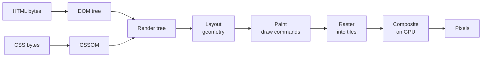
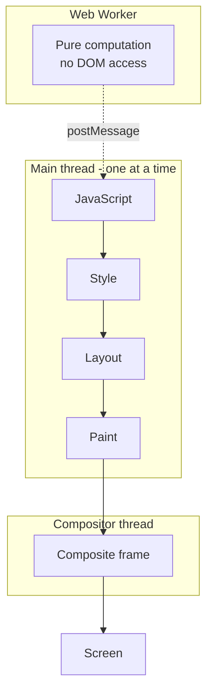

# Browser & Rendering Pipeline

> DOM, CSSOM, layout, paint, composite -- and the main thread you keep blocking.

- Track: **Frontend Systems** · Level: **foundation** · ~18 min
- [Open in the academy](https://deepeshk1204.github.io/staff-engineer-academy/#/topic/frontend/browser-rendering)

A browser turns a stream of HTML bytes into coloured pixels through a fixed pipeline:
build a tree of elements, build a tree of styles, combine them, work out where everything goes,
draw it, and hand the result to the GPU. Every frame of every animation runs some subset of that
pipeline.

The reason this matters is that the pipeline runs on **one thread** -- the same thread as your
JavaScript. Nothing else about frontend performance makes sense until you internalise that a
`for` loop and a scroll animation are competing for the same CPU.

## Why it exists

HTML and CSS are declarative: you describe what you want, not how to draw it. That is
enormously convenient and it means something has to translate intent into geometry. The pipeline
is that translator, and its stages exist because each answers a question the previous one cannot.

Layout has to be a separate stage because CSS is *relational* -- a percentage width depends on a
parent, `flex: 1` depends on siblings, and a float depends on what came before it. You cannot
know an element's size without having resolved the boxes around it. Paint has to be separate
because the same geometry can be filled many ways, and order matters -- z-index, overlaps,
stacking contexts. Compositing exists because redrawing everything at 60 fps was impossible on
2008 hardware, so the browser learned to carve the page into layers, upload them to the GPU once,
and then move and fade them without re-drawing anything.

That last stage is the whole secret of smooth web animation: **transform and opacity can be
changed by the compositor without consulting the main thread at all.** Everything else cannot.

## How it works



*The full pipeline. Changing a geometric property re-runs from Layout; changing a colour re-runs from Paint; changing transform or opacity re-runs only Composite.*

**The stages, and what each actually produces**

1. **Parse to DOM.** Tokenise HTML into a tree of nodes. The parser is incremental -- it works on partial bytes -- but a synchronous `<script>` blocks it dead, because that script could call `document.write`.
2. **Parse to CSSOM.** Stylesheets are **render-blocking**: the browser will not paint until it has them, because painting with the wrong styles then correcting would flash. A stylesheet in the head is also a blocker for any script after it, since scripts can read computed style.
3. **Build the render tree.** DOM plus CSSOM, minus anything not rendered. Note the distinction: `display: none` removes a node from the render tree entirely, while `visibility: hidden` keeps it -- it still occupies layout space.
4. **Layout (reflow).** Compute the exact box geometry for every node in the render tree. This is the expensive stage and its cost scales with node count.
5. **Paint.** Turn boxes into ordered draw commands -- fill this rect, draw this text, apply this shadow -- grouped into paint records per layer.
6. **Raster and composite.** Rasterise layers into tiles, upload as GPU textures, and have the compositor thread assemble the final frame. The compositor can re-assemble with new transforms without any main-thread work.

## Reflow vs repaint vs compositor-only

This is the single most practically useful distinction in frontend performance, and it
is a property of the CSS property you chose to animate.

Changing `width`, `height`, `top`, `margin`, `font-size` or anything that affects geometry
invalidates **layout**, so the browser re-runs layout, paint, raster and composite. Changing
`background-color`, `color`, `box-shadow` or `border-radius` does not move anything, so layout
is skipped but **paint** and everything after still runs. Changing `transform` or `opacity` on
an element that already has its own compositor layer skips straight to **composite** -- no main
thread work at all, which is why it can stay smooth while JavaScript is busy.

`filter` is a useful edge case worth knowing: it is compositor-accelerated in modern engines,
which is why `filter: blur()` animates acceptably but animating `box-shadow` does not.

**What your CSS change actually costs**

| Property you change | Layout | Paint | Composite | Safe to animate at 60 fps? |
| --- | --- | --- | --- | --- |
| `transform`, `opacity` | No | No | Yes | Yes -- this is the only reliably cheap pair. |
| `filter`, `backdrop-filter` | No | No | Yes (GPU) | Usually, but it is fill-rate heavy on large areas. |
| `color`, `background-color` | No | Yes | Yes | Tolerable for small areas; avoid on full-page elements. |
| `box-shadow`, `border-radius` | No | Yes (costly) | Yes | No -- shadow rasterisation is expensive per frame. |
| `width`, `height`, `padding` | Yes | Yes | Yes | No -- use `transform: scale()` instead. |
| `top`, `left`, `margin` | Yes | Yes | Yes | No -- use `transform: translate()` instead. |
| `font-size`, text content | Yes (often whole subtree) | Yes | Yes | No -- text layout is the most expensive reflow. |

## Layout thrashing, concretely

The browser batches style changes and defers layout until it is actually needed. That
optimisation collapses the moment you *read* a geometric property, because the browser must then
give you a correct answer, which means flushing all pending changes and running layout
synchronously. That is a **forced synchronous layout**. Do it in a loop with writes interleaved
and you get **layout thrashing**: one full layout per iteration.

The properties that force it are the ones that report geometry: `offsetTop`, `offsetWidth`,
`clientHeight`, `scrollTop`, `getBoundingClientRect()`, `getComputedStyle()`, and
`scrollWidth`. Reading them is not itself slow -- reading them *after a write* is.

**The same work, 100x apart**

```js
// SLOW: read-write-read-write. Each offsetWidth read forces layout
// because the previous iteration's style write invalidated it.
// 500 cards => 500 synchronous layouts => ~400 ms of blocked main thread.
for (const card of cards) {
  card.style.width = card.offsetWidth + 10 + 'px'; // write invalidates
}                                                  // next read flushes

// FAST: batch all reads, then batch all writes. One layout total.
const widths = cards.map(c => c.offsetWidth);      // read phase
for (let i = 0; i < cards.length; i++) {           // write phase
  cards[i].style.width = widths[i] + 10 + 'px';
}

// How you catch it: layout thrash shows up in the Performance panel
// as a stack of purple "Layout" bars with a red "Forced reflow" warning.
// Programmatically, ResizeObserver and IntersectionObserver give you
// geometry asynchronously and never force a sync layout:
new ResizeObserver(entries => {
  for (const e of entries) {
    // e.contentRect is already-computed geometry, free to read
    e.target.dataset.w = String(e.contentRect.width);
  }
}).observe(container);
```

> **It hides inside libraries**  
> You rarely write the slow loop yourself. You write a React component whose `useLayoutEffect`
> measures itself with `getBoundingClientRect()` and sets a style, and then render 200 of them.
> Every instance forces a layout because the previous instance's effect wrote to the DOM. The
> symptom is a single 300 ms long task on mount that profiling attributes to "Recalculate Style",
> and the fix is to hoist measurement to the parent -- measure once, distribute down -- or move to
> `ResizeObserver`.

## The frame budget

A 60 Hz display gives you 16.7 ms per frame, and the browser needs a few of those
milliseconds for its own compositing and raster work. The practical budget for your JavaScript
plus style, layout and paint is roughly **10-12 ms**. On a 120 Hz phone the frame is 8.3 ms and
the budget is around 5 ms.

Miss the budget and the frame is not late, it is *dropped* -- the previous frame is shown again.
Drop one and nobody notices. Drop several in a row during a scroll and the user experiences it
as jank, which is perceptually much worse than uniformly slower animation.

A **long task** is any main-thread task over 50 ms. The threshold is not arbitrary: it comes from
the research behind the RAIL model, where 100 ms is the ceiling for an interaction to feel
instantaneous, so a task must stay under 50 ms to leave room for the browser to actually respond.
A single long task blocks everything -- input dispatch, layout, requestAnimationFrame callbacks --
because there is no preemption. This is why **INP** (Interaction to Next Paint), which measures
from user input to the next rendered frame, is largely a long-task metric in disguise.

**Budgets and thresholds**

- **16.7 ms** — One frame at 60 Hz (~10-12 ms usable by you)
- **8.3 ms** — One frame at 120 Hz (Modern flagship phones)
- **50 ms** — Long-task threshold (Anything above blocks input)
- **200 ms** — INP "good" at p75 (500 ms is "poor")
- **~5x** — Mid-tier Android vs laptop CPU (Your 10 ms task is their 50 ms)



*Only the compositor thread can produce a frame while the main thread is blocked -- and only for transform and opacity changes.*

## Yielding, and the tools that help

Since tasks cannot be preempted, the only way to stay responsive during heavy work is to
**yield voluntarily**: break the work into chunks and give the browser a chance to handle input
between them. `scheduler.yield()` is the modern primitive for this and it is prioritised ahead of
other pending tasks, unlike `setTimeout(0)` which puts you at the back of the queue.
`requestIdleCallback` is for genuinely non-urgent work and may never run on a busy page.

A few specific mechanisms are worth naming precisely because interviewers probe them.

**Passive event listeners.** A `touchstart` or `wheel` listener can call `preventDefault()`, so
the browser must wait for your handler to finish before it knows whether to scroll. That makes
your handler part of the scroll critical path. Declaring `{ passive: true }` promises you will
not cancel, letting the browser scroll immediately on the compositor. Chrome now defaults
document-level `touchstart`/`touchmove` to passive for this reason, but element-level listeners
are still yours to annotate.

**`content-visibility: auto`.** Tells the browser to skip layout, paint and even style
computation for an element that is off-screen, deferring it until the element approaches the
viewport. On a long page of heavy sections this can cut initial rendering work dramatically. The
catch: skipped content has no intrinsic size, so scroll height jumps as things render. You pair
it with `contain-intrinsic-size` to give a placeholder estimate, and you accept that in-page
search (Ctrl+F) behaviour and `scrollIntoView` accuracy get more complicated.

**`will-change`.** Promotes an element to its own compositor layer *ahead* of an animation, so
the first frame is not spent doing the promotion. It is widely misused: a layer costs GPU memory
proportional to its pixel area, and `will-change: transform` left permanently in a stylesheet on
a common class means hundreds of live layers. The rule is to set it just before the animation and
remove it after, or not at all -- the browser is already good at promoting elements that are
actually animating.

**Yielding, and correct will-change usage**

```js
// Break a 400 ms parse into input-responsive chunks.
async function processAll(rows) {
  for (let i = 0; i < rows.length; i++) {
    transform(rows[i]);
    if (i % 50 === 0) {
      // Prioritised continuation; falls back to a macrotask.
      await (scheduler.yield?.() ?? new Promise(r => setTimeout(r, 0)));
    }
  }
}

// will-change belongs in JS around the animation, not in CSS forever.
el.style.willChange = 'transform';
el.animate([{ transform: 'translateX(0)' },
            { transform: 'translateX(300px)' }],
           { duration: 250, easing: 'ease-out' })
  .finished.then(() => { el.style.willChange = 'auto'; });

// Skip off-screen rendering work on a long feed.
// CSS: .section { content-visibility: auto;
//                 contain-intrinsic-size: auto 480px; }

// Do not block scroll on your own handler.
list.addEventListener('touchstart', onTouch, { passive: true });
```

## Trade-offs

**Trade-offs**

What you gain:
- Compositor-only animation stays at 60 fps even while the main thread is busy.
- `content-visibility` removes off-screen layout and paint from initial render entirely.
- Batching reads and writes turns N layouts into one.
- Workers move pure computation off the thread that owns responsiveness.
- Yielding keeps INP acceptable without making the total work any faster.

What it costs you:
- Every compositor layer costs GPU memory equal to its area; too many is its own jank.
- `content-visibility` breaks intrinsic sizing, so scrollbars and anchor links get unreliable.
- Worker communication is structured-clone serialisation, which is not free for large payloads.
- Yielding adds wall-clock time to the total job even as it improves responsiveness.
- Reasoning about this requires profiling on real low-end hardware, not your laptop.

**Failure modes**

| Failure mode | What the user sees | Mitigation |
| --- | --- | --- |
| Animating `top`/`left` or `width` in a `requestAnimationFrame` loop | Full layout+paint every frame; scroll drops to 20 fps on mid-tier Android. | Animate `transform` and `opacity` only. Verify in the Performance panel that frames show no purple Layout bars. |
| Layout thrashing in a component effect | One 200-400 ms long task on mount; INP breaches 500 ms on the first interaction. | Separate read and write phases, hoist measurement to a parent, or replace with `ResizeObserver`/`IntersectionObserver`. |
| `will-change: transform` on a shared utility class | Hundreds of layers, GPU memory exhaustion, and *worse* jank than not using it; can crash tabs on low-memory devices. | Set `will-change` imperatively before the animation and clear it on completion. Audit stylesheets for blanket declarations. |
| Non-passive `touchmove` on a scroll container | Scroll waits on the handler every frame; users report the page feeling "stuck to the finger". | `{ passive: true }` on any listener that never calls `preventDefault()`; use CSS `touch-action` to express intent declaratively. |
| One 900 ms hydration or parse task | Clicks during that window are queued, not dropped -- the UI responds a second later to a tap the user already repeated. | Split by route, defer below-the-fold hydration, and chunk with `scheduler.yield()` so input can be serviced. |
| Third-party script doing synchronous layout reads on every scroll | Jank you cannot fix in your own code, attributed to your app in RUM. | Load in a sandboxed iframe or worker where possible, budget third parties explicitly, and alert on long tasks attributed by script URL. |

> **Staff-level angle**  
> The signal here is mechanical precision -- naming the stage, not the symptom. Sentences
> that read as operated experience:
> 
> - "That is not slow, it is *janky*. We are dropping frames, and the trace shows a purple Layout
>   bar in every frame, which means we are animating a geometric property. Moving it to
>   `transform` takes it off the main thread entirely."
> - "The 320 ms long task on mount is a forced synchronous layout -- each card's effect calls
>   `getBoundingClientRect()` after the previous one wrote a style, so we run one layout per card.
>   I would measure once in the parent and pass the result down."
> - "Our budget is about 10 ms of the 16.7 ms frame, and on the Moto G we are targeting the CPU is
>   roughly five times slower than this laptop. So a 4 ms task here is over budget there. I do not
>   accept a profile taken on a MacBook as evidence."
> - "I would not add `will-change` to the card class. A layer costs GPU memory proportional to its
>   area and we render two hundred cards. The browser already promotes elements that are actually
>   animating; `will-change` is for the first frame of a known-imminent animation, set in JS and
>   cleared afterwards."
> - "`content-visibility: auto` on the feed sections would remove most of the initial layout cost,
>   but it breaks intrinsic height, so we need `contain-intrinsic-size` and we need to check that
>   deep links to a section still scroll correctly."
> - "INP is a long-task metric. Before we micro-optimise the handler we should look at what else is
>   occupying the main thread in the 200 ms after the click -- usually it is a re-render or an
>   analytics flush, not the handler itself."
> 
> What these signal: you read traces rather than guess, you know which stage each property
> invalidates, and you treat an optimisation's cost (GPU memory, broken scroll height) as part of
> the proposal rather than a detail.

**Check**

A modal fades in using `opacity`, and simultaneously a background list animates its `height`. The fade stays smooth while the list stutters. Why?
- A. The fade is shorter, so fewer frames can be dropped.
- B. `opacity` on a promoted layer is handled by the compositor thread, while `height` invalidates layout and must run on the blocked main thread each frame. **(answer)**
- C. `height` animations are not GPU-accelerated because they use integers.
- D. The modal is in a separate stacking context, which bypasses paint.

  These animations run on different threads. Once an element has its own compositor layer, `opacity` and `transform` changes are applied during compositing with no main-thread involvement, so they survive a busy main thread. `height` changes box geometry, so every frame re-runs style, layout, paint and raster on the main thread -- and if anything else is competing for it, frames get dropped. The fix for the list is to animate `transform: scaleY()` or animate a fixed-height wrapper, accepting the visual difference.

Which sequence forces the fewest synchronous layouts for 300 elements?
- A. For each element: read `offsetHeight`, then write `style.height`.
- B. For each element: write `style.height`, then read `offsetHeight`.
- C. Read all `offsetHeight` values into an array, then write all heights. **(answer)**
- D. Wrap each read/write pair in `requestAnimationFrame`.

  Reads are only expensive when pending writes must be flushed to answer them. Batching all reads first means one layout serves all 300 measurements; the subsequent writes are queued and resolved in a single later layout. Both interleaved orders force roughly 300 layouts. Wrapping each pair in `requestAnimationFrame` spreads the thrash across 300 frames -- it stops one giant long task but takes five seconds to finish and still does the same total layout work.

Why does a 600 ms long task hurt INP even when the user clicks *before* the task starts?
- A. Input events are discarded while a task runs.
- B. The click is queued until the task completes, so the time from input to the next painted frame includes the remainder of the task. **(answer)**
- C. INP measures the longest task on the page, not interactions.
- D. Long tasks reset the interaction timer.

  The main thread has no preemption, so the browser cannot dispatch the click handler until the running task yields. The event is queued, not dropped, and INP measures input to next paint -- which now includes queuing delay, handler time, and the rendering that follows. This is why the highest-leverage INP work is usually removing or chunking unrelated long tasks rather than optimising the handler. It also explains the "ghost click" pattern: a user taps, nothing happens, they tap again, and both taps fire when the thread frees up.

<details><summary>Related topics and how they connect</summary>

Long tasks and INP are measured and budgeted in **Performance Engineering**. The
single largest long task in most React apps is hydration, covered in **CSR, SSR, SSG, ISR &
Streaming** and **React at Scale**. Which bytes reach the parser and in what order is
**Web Foundations: URL to Pixels** and **CDN & Edge Delivery**.

</details>

## Flashcards

- **Which two CSS properties can be animated without main-thread work?** — `transform` and `opacity`, on an element that has its own compositor layer. The compositor thread applies them while assembling the frame, so they stay smooth even when JavaScript is blocking. `filter` is also GPU-accelerated but is fill-rate heavy.
- **What is a forced synchronous layout?** — Reading a geometric property (`offsetWidth`, `getBoundingClientRect()`, `getComputedStyle()`, `scrollTop`) after a style write. The browser must flush pending changes and run layout immediately to give a correct answer. In a loop it becomes layout thrashing -- one layout per iteration.
- **Difference between `display: none` and `visibility: hidden` in the pipeline?** — `display: none` removes the node from the render tree, so it costs no layout or paint and occupies no space. `visibility: hidden` keeps it in the render tree -- it is laid out and takes up space, it is just not painted.
- **Why is 50 ms the long-task threshold?** — The RAIL model puts 100 ms as the ceiling for an interaction to feel instantaneous. A task must stay under 50 ms so that even if input arrives just as it starts, the browser has ~50 ms left to dispatch and respond within budget.
- **What does `{ passive: true }` actually promise?** — That your handler will not call `preventDefault()`. Without it the browser must run your `touchstart`/`wheel` handler before it knows whether to scroll, putting your JavaScript on the scroll critical path. With it, scrolling proceeds on the compositor immediately.
- **What does `content-visibility: auto` do and what does it break?** — Skips style, layout and paint for off-screen elements until they approach the viewport. It breaks intrinsic sizing -- the element reports zero height -- so scroll height jumps and anchor links misfire unless you supply `contain-intrinsic-size`.
- **Why is `will-change: transform` in a stylesheet usually a mistake?** — It permanently promotes every matching element to its own compositor layer, and each layer costs GPU memory proportional to its pixel area. On a list of hundreds of items this causes worse jank than it prevents. Set it in JS immediately before the animation and clear it on completion.
- **Why does `setTimeout(fn, 0)` yield worse than `scheduler.yield()`?** — `setTimeout` queues a new macrotask behind everything already pending, so your continuation can be starved. `scheduler.yield()` returns a prioritised continuation that resumes ahead of other pending tasks, giving you responsiveness without losing throughput.
- **What can a Web Worker not do, and what is the cost of using one?** — No DOM access and no layout APIs -- it is for pure computation. The cost is structured-clone serialisation on `postMessage`, which is significant for large objects; transferable `ArrayBuffer`s avoid the copy where the data format allows.

## Drills

### Drill

Users report that your infinite-scroll feed "sticks to the finger" on mid-range Android but is fine on iPhone 15 and on desktop. Scrolling is smooth when the feed is empty. Each card has a drop shadow, a rounded avatar, and a lazily-loaded image. Diagnose it and tell me what you would change.

Probes:

- What do you look at first, and on what device?
- How do you distinguish a scroll-handler problem from a paint problem from a layout problem?
- What in that card description is suspicious?
- How would you stop this regressing next quarter?

Strong answer contains:

- Profiles on the actual low-end device or with a 4-6x CPU throttle, and states explicitly that a desktop profile is not evidence.
- Reads the trace by stage: purple Layout bars point to geometry work, large green Paint bars point to shadow/raster cost, and a blocked main thread during scroll points to a non-passive listener or a JS handler.
- Names the non-passive `touchmove`/`scroll` listener as a likely cause of the "stuck to finger" symptom specifically, and fixes it with `{ passive: true }` plus CSS `touch-action`.
- Identifies `box-shadow` on hundreds of cards as raster-expensive and proposes a cheaper approximation, and identifies missing `width`/`height` on lazy images as a layout-shift and re-layout source.
- Proposes virtualisation or `content-visibility: auto` with `contain-intrinsic-size` to remove off-screen layout and paint, and acknowledges the scroll-height and deep-link caveats.
- Adds a CI or RUM guard: long-task count and INP at p75 segmented by device class, with a budget that fails the build.

Weak answer tells:

- Suggests "add `will-change: transform` to the cards" as a general fix.
- Blames React re-renders without opening a trace.
- Proposes a debounce on the scroll handler without asking whether the handler is on the critical path at all.
- Measures on a MacBook and declares it fixed.
- Cannot say which pipeline stage `box-shadow` invalidates.

### Drill

A data-grid component takes 850 ms to mount with 500 rows, showing as a single long task. Each row measures its own content width in a layout effect to decide whether to truncate text. Product wants the truncation behaviour kept. What do you do?

Probes:

- Mechanically, why is it 850 ms and not 50 ms?
- Can you keep the behaviour without the measurement?
- If you must measure, how do you make it cheap?
- What is the user-visible consequence of the current design beyond the 850 ms?

Strong answer contains:

- Names it as layout thrashing: each row writes a style then the next row reads geometry, forcing ~500 synchronous layouts.
- Proposes the CSS-only route first -- `text-overflow: ellipsis` with `min-width: 0` on the flex child -- removing measurement entirely.
- If measurement is unavoidable, hoists it: render once, read all widths in a single pass in the parent, then apply truncation in one write phase.
- Offers `ResizeObserver` as the async alternative that never forces a sync layout, and notes it also handles later container resizes correctly.
- Connects the long task to INP: clicks during mount are queued, so the grid appears unresponsive rather than merely slow.
- Adds virtualisation so the cost scales with viewport rows rather than dataset size.

Weak answer tells:

- Wraps the effect in `setTimeout` and calls it fixed, having only moved the long task later.
- Reaches for `useMemo` on the row component as the remedy.
- Does not distinguish `useLayoutEffect` from `useEffect` or explain why the former is on the critical path.
- Proposes a worker for work that requires DOM geometry.
