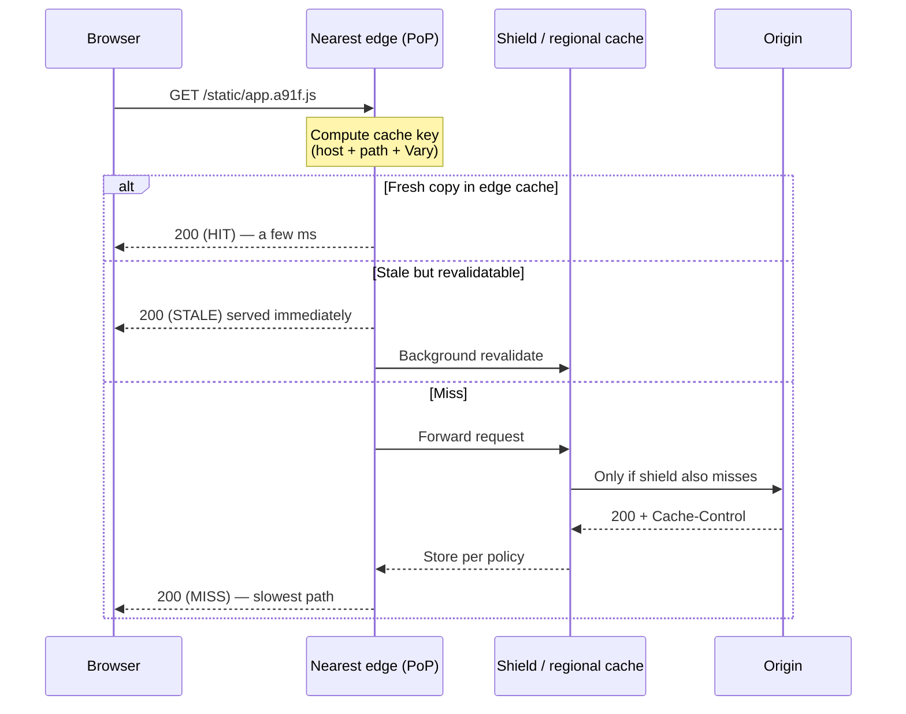
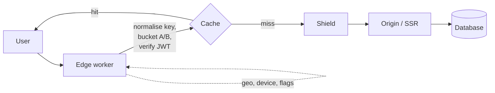

# CDN & Edge Delivery

> Cache keys, TTL policy, invalidation, shields, edge compute -- and the leak that ends careers.

- Track: **Frontend Systems** · Level: **core** · ~20 min
- [Open in the academy](https://deepeshk1204.github.io/staff-engineer-academy/#/topic/frontend/cdn-and-edge)

A CDN is a fleet of servers in many physical locations that keep copies of your
content close to your users. You point your domain at the CDN instead of at your own
servers, and the CDN answers most requests itself.

That is the whole idea. Everything difficult about a CDN comes from one question:
**how does an edge server decide that two requests can share one cached response?**

## Why it exists

Light travels about 200 km per millisecond through fibre, and a TCP+TLS handshake
needs several round trips before a single byte of your content moves. A user in Chennai
talking to a server in Virginia pays roughly 200 ms per round trip, so the handshake alone
costs most of a second before the first byte arrives.

You cannot make light faster, so you move the content. A CDN turns a 200 ms round trip into
a 5-15 ms one, and as a side effect it absorbs the traffic that would otherwise hit your
origin.

**Numbers worth memorising**

- **~1 ms** — Same-city round trip (Edge hit territory)
- **~30 ms** — Cross-country round trip (Regional origin)
- **~200 ms** — Intercontinental round trip (×3 for TLS setup)
- **95%+** — Realistic static-asset hit rate (With good cache keys)

## How a request actually flows



*The shield layer is why a viral link does not turn into a thundering herd on your origin.*

**What the edge does on each request**

1. Anycast routing or DNS sends the request to a nearby point of presence.
2. The edge builds a **cache key** — normally host + path + query + whatever `Vary` names.
3. On a hit within TTL it responds immediately and never contacts your origin.
4. On a stale hit it may serve the old copy and refresh in the background (`stale-while-revalidate`).
5. On a miss it forwards toward a shield, then origin, stores the response per `Cache-Control`, and responds.
6. Requests for the same key that arrive during a miss are usually collapsed into one origin fetch.

## The headers that actually control it

| Header / directive | What it does | Where people get it wrong |
| --- | --- | --- |
| `max-age=N` | How long **browsers** may reuse the response without asking. | Setting it high on HTML, so users are stuck on an old app for hours. |
| `s-maxage=N` | How long **shared caches** (the CDN) may reuse it. Overrides `max-age` for them. | Forgetting it, so CDN and browser TTLs are coupled when they should differ. |
| `stale-while-revalidate=N` | Serve stale for N seconds while refreshing in background. | Not using it — every TTL expiry becomes a latency spike for a real user. |
| `stale-if-error=N` | Serve stale if origin returns 5xx. | Skipping it, so an origin blip becomes a user-visible outage. |
| `immutable` | Promise the body will never change at this URL. | Using it without a content hash in the filename. |
| `private` | Only the browser may cache. CDNs must not. | Omitting it on personalised HTML — the classic leak. |
| `ETag` / `If-None-Match` | Enables a cheap `304 Not Modified` revalidation. | Weak ETags that change on every deploy, defeating the purpose. |
| `Vary: Accept-Encoding` | Cache brotli and gzip variants separately. | `Vary: User-Agent` or `Vary: Cookie` — shatters the hit rate. |

**The two-policy pattern that covers 90% of web apps**

```http
# Hashed build output — the filename changes when the bytes change,
# so it can be cached effectively forever at every layer.
GET /assets/app.a91f3c.js
Cache-Control: public, max-age=31536000, immutable

# The HTML shell — must be re-checked constantly because it names the
# hashed assets above. Cache it at the edge, not in the browser.
GET /index.html
Cache-Control: public, max-age=0, s-maxage=60, stale-while-revalidate=600
ETag: "build-2f91c"

# Anything user-specific. If you get one header wrong on this page,
# you ship user A's data to user B.
GET /api/me
Cache-Control: private, no-store
```

> **The incident that ends careers**  
> A logged-in dashboard is served with `Cache-Control: public, max-age=300` because
> someone wanted it faster. The first user's personalised HTML -- name, email, account balance --
> is now stored at the edge and served to every other user hitting that PoP for five minutes.
> 
> Two defences, and you want both: default to `private, no-store` and make caching opt-in per
> route, plus an automated check that no response carrying a `Set-Cookie` or `Authorization`
> context is also `public`.

## Invalidation

You have three ways to change what users get, and you should reach for them in this order.

- **1. New URL (best)** — Content-hashed filenames. Nothing to invalidate, because new bytes live at a new key. Instant and free.
- **2. Short TTL + revalidate** — For HTML and config. `s-maxage` of 30-60s plus `stale-while-revalidate` gives fast propagation without origin load.
- **3. Explicit purge (last resort)** — Purge by URL, or by surrogate/cache tag for a group. Propagation takes seconds to minutes and is rate-limited.

> **Warning**  
> Purge is not a deploy strategy. It is a rate-limited, eventually-consistent API that
> you are calling during an incident under pressure. If your rollback plan is "purge everything",
> your real plan is "take an origin traffic spike while every edge is cold".

## Beyond caching: the edge as compute

Modern CDNs run your code at the PoP, which changes what belongs where. Useful at the
edge: A/B bucketing and cookie assignment, geo and device routing, auth token validation,
redirects, request normalisation, and HTML injection for personalisation. Bad at the edge:
anything needing a database in one region, anything with meaningful CPU cost, and anything
where a bug takes down all 300 locations at once.



## Trade-offs

**Trade-offs**

What you gain:
- Latency drops to single-digit ms for cacheable content, everywhere.
- Origin load falls by one to two orders of magnitude.
- Free DDoS absorption and TLS termination at the edge.
- Origin capacity planning decouples from traffic spikes.

What it costs you:
- A second source of truth you cannot inspect directly.
- "Works for me" bugs that depend on which PoP a user hit.
- Cache-key design becomes a security-relevant decision.
- Vendor-specific behaviour that is hard to test locally or in CI.
- Egress and request pricing that can surprise you at scale.

**Failure modes**

| Failure mode | What the user sees | Mitigation |
| --- | --- | --- |
| Cache key too broad | Users see each other's data. | Default `private`; allowlist cacheable routes; automated header audit in CI. |
| Cache key too narrow | Hit rate collapses, origin melts. | Strip tracking query params; never `Vary` on `User-Agent` or `Cookie`. |
| Thundering herd on TTL expiry | Periodic origin latency spikes. | Request collapsing, origin shield, jittered TTLs, `stale-while-revalidate`. |
| Origin down with cold caches | Full outage. | `stale-if-error`, long `stale-while-revalidate`, static fallback page at the edge. |
| Stale HTML referencing purged assets | White screen, chunk-load errors. | Keep N-1 and N-2 asset versions live; never delete old hashed chunks on deploy. |
| Single PoP degraded | One region slow, dashboards look fine. | Alert on per-PoP RUM percentiles, not global averages. |

> **Staff-level angle**  
> A senior candidate says "put a CDN in front of it". A Staff candidate is expected to
> own the *policy*, and that means saying things like:
> 
> - "Static assets are content-hashed and immutable. HTML gets `s-maxage=60` with
>   `stale-while-revalidate`, so a bad deploy is 60 seconds of exposure, not 24 hours."
> - "Anything authenticated is `private, no-store` by default, and caching is opt-in per route
>   with a header check in CI, because the failure mode here is a data leak, not slowness."
> - "We keep the previous two asset versions live, because during a rollout a user can hold old
>   HTML that references chunks the new deploy no longer has."
> - "I would not put the personalised dashboard at the edge. I would cache the shell and fetch
>   the personalised strip client-side, so the cacheable and non-cacheable parts have different
>   policies."
> 
> The pattern: name the policy, name the blast radius of getting it wrong, and name the
> automated control that stops it. Mentioning `stale-if-error` and origin shields unprompted
> is a strong signal you have operated a CDN rather than read about one.

**Check**

Your SPA's `index.html` is served with `Cache-Control: public, max-age=86400`. What breaks?
- A. Nothing — HTML is static, so a long TTL is correct.
- B. Users keep a day-old HTML shell, so deploys and hotfixes do not reach them. **(answer)**
- C. The CDN refuses to cache HTML without an `ETag`.
- D. Asset requests bypass the CDN entirely.

  The HTML names your hashed asset bundles, so it is the pointer that makes a deploy visible. With a 24h browser TTL you cannot ship a fix — you have no way to reach a browser that will not re-ask. Use `max-age=0, s-maxage=60, stale-while-revalidate=600`: cached at the edge for speed, re-checked constantly for control.

A marketing campaign appends `?utm_source=...` to every link and your origin load suddenly triples. Why?
- A. The CDN rate-limits query-string requests.
- B. Each distinct query string is a distinct cache key, so every visitor is a miss. **(answer)**
- C. `utm_source` forces `no-store` behaviour.
- D. Tracking params break TLS session resumption.

  Query strings are part of the cache key by default, so one page fragmented into thousands of keys with a hit rate near zero. Fix it by normalising the key at the edge: strip tracking parameters before lookup, keeping them available to analytics.

Which pairing is the most defensible default for an authenticated dashboard?
- A. `public, max-age=60` — short enough to be safe.
- B. `private, no-store` for the personalised response, with a separately cached static shell. **(answer)**
- C. `public, s-maxage=300, Vary: Cookie`.
- D. `no-cache` on everything including static assets.

  Splitting the response is the key move: the shell is identical for everyone and cacheable forever, while the personalised payload is never stored in a shared cache. `Vary: Cookie` technically works but destroys the hit rate and leaves you one header bug away from a leak — it is a correctness fig leaf, not a design.

<details><summary>Related topics and how they connect</summary>

CDN policy is the outermost layer of the caching stack -- see **Caching layers** for
what sits behind it. Cache keys and personalisation collide directly with **SSR and rendering
strategy**. The stale-asset failure mode is a **deployment and rollout** problem. And at the
edge, cache-key correctness becomes an authorisation question, which links to
**Frontend security**.

</details>

## Flashcards

- **Difference between `max-age` and `s-maxage`?** — `max-age` governs private caches (the browser). `s-maxage` governs shared caches (the CDN) and overrides `max-age` for them. Splitting them lets you cache HTML at the edge for speed while keeping browser TTL at zero for control.
- **What does `stale-while-revalidate` buy you?** — The user gets an instant response from the stale copy while the edge refreshes in the background. TTL expiry stops being a latency spike paid for by a real user.
- **What is an origin shield?** — A designated mid-tier cache that all edge PoPs fetch through. Without it, a miss can mean hundreds of PoPs hitting origin for the same object at once.
- **Why is `Vary: User-Agent` an anti-pattern?** — There are effectively unbounded UA strings, so each one becomes its own cache key. Your hit rate approaches zero and the origin sees near-full traffic.
- **Why should you never delete old hashed chunks on deploy?** — During a rollout users hold cached HTML referencing the previous build. Deleting those chunks gives them a white screen. Keep N-1 and N-2 live.
- **Preferred order of cache invalidation strategies?** — 1) Change the URL (content hashing) — instant and free. 2) Short `s-maxage` plus revalidation. 3) Explicit purge, which is rate-limited and eventually consistent, so never your rollback plan.

## Drills

### Drill

You run a news site. The homepage must reflect breaking news within 30 seconds, is read 50,000 times a second during major events, and shows a personalised "for you" strip to logged-in readers. Design the caching policy.

Probes:

- What exactly is personalised, and can it be separated from what is not?
- What happens at the moment the TTL expires during a 50k rps event?
- What do readers see if the origin dies mid-event?
- How does an editor verify their correction actually went live?

Strong answer contains:

- Splits the response: cacheable shell with `s-maxage=30`, personalised strip fetched client-side or injected at the edge.
- Names request collapsing and an origin shield for the herd at expiry, and jitters TTLs.
- Uses `stale-if-error` so an origin failure degrades to slightly-old news rather than an outage.
- Gives editors a tag-based purge for corrections and a way to observe propagation.

Weak answer tells:

- One TTL for the whole page and no discussion of what is personalised.
- "We would purge the cache" as the answer to every freshness requirement.
- Reaches for `Vary: Cookie` and does not notice the hit rate implication.
- No answer for what users see when origin is down.
