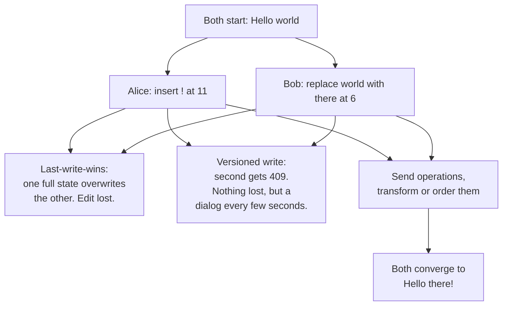
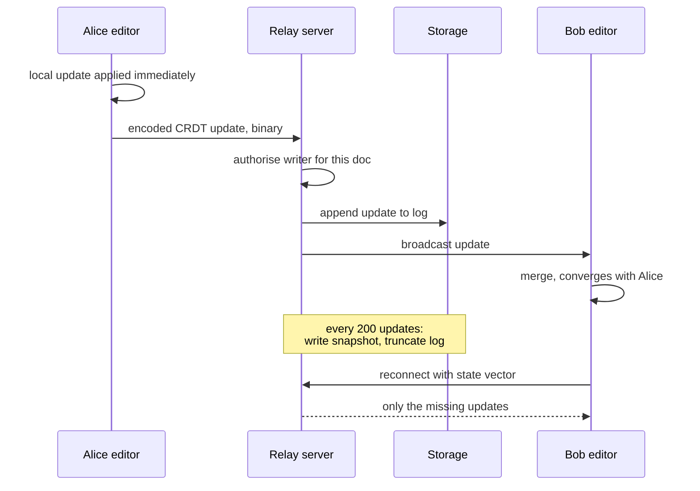

# Collaborative Editing: OT & CRDT

> Why last-write-wins loses edits, and what CRDTs genuinely do and do not solve.

- Track: **Frontend Systems** · Level: **staff** · ~18 min
- [Open in the academy](https://deepeshk1204.github.io/staff-engineer-academy/#/topic/frontend/collaborative-editing)

Collaborative editing is what happens when two people change the same document at the
same time and both expect to keep their change. The user-visible requirement sounds modest: every
participant ends up looking at the same document, nobody's typing disappears, and the cursor does
not jump around while someone else types.

Meeting it is hard because edits are described relative to positions that other edits move. "Insert
`X` at index 5" is meaningful only against a specific version of the text, and by the time your
edit reaches me, my index 5 is somewhere else. Every technique in this topic is a different answer
to that one problem.

## Why last-write-wins loses edits

Start with the design most teams ship first: the editor sends the full document text on a
debounce, and the server stores whatever arrived last.

Alice and Bob both open a document containing `Hello world`. Alice appends `!` and her client
sends `Hello world!`. Bob simultaneously changes `world` to `there` and sends `Hello there`.
Both writes succeed. The document is now `Hello there` or `Hello world!` depending on arrival
order, and one person's edit is gone with no error and no indication. Alice keeps typing into a
document that no longer contains her sentence.

Adding version checks improves the failure but does not fix the feature. With `If-Match`, the
second write gets a 409 -- so instead of losing Alice's edit silently, you interrupt Bob with a
conflict dialog. That is correct behaviour for a wiki page edited once an hour. For a document two
people are typing in simultaneously, a conflict prompt every few seconds is not a product.

The insight that unlocks everything: stop sending document *states* and start sending *operations*.
`insert("!", 11)` and `replace("world", "there", 6)` are both preservable if you can work out how
to apply them in either order and get the same result. Formally, you want the operations to commute,
and there are two families of technique for arranging that.



*Sending state forces a choice between losing an edit and interrupting a user. Sending operations makes both avoidable.*

## Operational Transformation

Operational Transformation, which is what Google Docs and Etherpad are built on, keeps a
central server as the ordering authority and *rewrites* incoming operations so they make sense
against the version the server actually holds.

Each client tags its operations with the server revision it was based on. When an operation arrives
based on an older revision, the server transforms it against every operation committed since --
adjusting indices so the intent survives -- and then applies it. Clients do the mirror-image
transform locally when they receive remote operations that were concurrent with their own pending
ones.

Here is the transform concretely. Both clients start from `Hello world` at revision 4.

**Two operations, transformed**

```text
Base (rev 4):  "Hello world"
                 0123456789A          A = index 10

Alice: insert("!", 11)   based on rev 4   -> "Hello world!"
Bob:   delete(6, 5)      based on rev 4   -> "Hello "      (removes "world")

Alice arrives first. Server commits it as rev 5. Document: "Hello world!"

Now Bob's delete(6, 5) arrives, still based on rev 4. Applied naively it
would remove 5 chars from index 6 of the CURRENT text -> "Hello !"  ... which
is right here by luck. Reverse the arrival order and the luck runs out:

  If Bob commits first (rev 5 = "Hello "), Alice's insert("!", 11) is
  now beyond the end of a 6-character string. Naive application either
  throws or pads.

transform(insert("!", 11), delete(6, 5)):
  the delete removed 5 characters before index 11
  -> insert("!", 11 - 5) = insert("!", 6)

Result either way: "Hello !"   — both clients converge, both intents kept.

Now n concurrent op types: you owe a transform function for every ordered
pair. insert/insert, insert/delete, delete/insert, delete/delete, and for a
rich-text editor also mark/insert, mark/delete, mark/mark, and so on. The
insert/insert case needs a deterministic tie-break — usually site id — or
two clients that both inserted at index 6 diverge permanently.
```

That last paragraph is why OT has the reputation it has. The transform matrix grows
quadratically in the number of operation types, every entry must satisfy an algebraic property
called transformation property 1 (transforming in either order yields the same document), and a
single wrong entry produces divergence that appears only under specific concurrent timing. The
published history here is unkind: several widely-cited OT algorithms were later shown to be
incorrect for particular interleavings. OT is entirely viable -- Google Docs has run on it for
years -- but it is not something to implement from a blog post over a weekend.

OT also requires the central server. The transform depends on a single authoritative order of
operations, which makes peer-to-peer OT impractical and makes the server a hard dependency for
correctness rather than just for persistence.

## CRDTs

A Conflict-free Replicated Data Type takes the opposite approach: instead of rewriting
operations so they fit an order, design the data structure so that order does not matter. Merging is
commutative, associative and idempotent, so replicas that have seen the same set of operations are
identical regardless of the sequence or the duplicates in which they arrived. No central authority
is needed for convergence.

For text, the trick is to stop using indices. Every inserted character gets a globally unique,
immutable identifier -- typically a pair of client id and a per-client counter -- and an insertion
is expressed as "this character goes immediately after character `(alice, 17)`". That reference
stays valid no matter what else is inserted or deleted, because it names an identity rather than a
position. Deletion does not remove anything; it marks the character as a **tombstone**, because
removing it outright would invalidate other operations that reference it.

**The CRDT families you should be able to name**

| Family | Mechanism | Converges to | Used for |
| --- | --- | --- | --- |
| **LWW-Register** | A single value plus a logical timestamp; highest timestamp wins, with a tie-break on replica id. | One of the concurrent values, deterministically. | Scalar fields where one value must win: a title, a due date, a status. |
| **G-Counter / PN-Counter** | Per-replica increment counters; the value is the sum. PN adds a decrement counter. | The sum of all increments, so no update is lost. | Likes, view counts, inventory deltas. Notably not enforceable bounds -- you cannot prevent going below zero. |
| **G-Set / 2P-Set / OR-Set** | Grow-only set, or add plus remove with unique tags so re-adding after a concurrent remove works. | Union of adds, minus tagged removes. | Tags, labels, collaborator lists, multi-select. |
| **Sequence CRDTs: RGA, YATA, Logoot, Treedoc** | Unique ids per element with an ordering rule between them; deletes leave tombstones. | One total order of all inserted elements. | Text and list editing. Yjs uses YATA; Automerge uses an RGA variant. |
| **Map / nested documents** | Composition of the above, keyed, with per-key merge semantics. | Per-key resolution by that key's type. | The whole document model in Yjs and Automerge -- maps of text, arrays and registers. |

The practical properties matter more than the taxonomy. Sequence CRDT metadata is
substantial: early implementations carried a large multiple of the text size, and the well-known
2020 benchmarking work on this drove a generation of optimisations -- run-length encoding of
consecutive characters by the same author, columnar binary encodings, and tombstone compaction.
Modern Yjs on a realistic document is in the same order of magnitude as the text itself rather than
10-100 times larger, but the cost never goes to zero. A paste-heavy document with years of editing
history and no compaction strategy will surprise you.

**OT versus CRDT, without the tribalism**

| Dimension | OT | CRDT |
| --- | --- | --- |
| Central server | Required for correctness -- it defines the operation order. | Not required. Converges peer-to-peer or with a server as a relay. |
| Metadata overhead | Low. Operations are small and the document is just text. | Real: unique ids per element plus tombstones. Manageable with run-length and columnar encoding, never zero. |
| Implementation risk | High. A quadratic transform matrix, and published algorithms have shipped with concurrency bugs. | Lower to reason about, but a correct and *fast* sequence CRDT is still a serious engineering effort. |
| Offline for hours or days | Painful -- the server must retain history back to your base revision to transform against. | Natural. Merge whenever, in any order, and it converges. |
| Garbage collection | Simpler -- once all clients pass a revision, older history can be dropped. | Genuinely hard. Tombstones cannot be removed until you can prove no replica will ever reference them. |
| Ecosystem in 2026 | Mostly in-house at large companies, plus ShareDB. | Yjs and Automerge are mature, well-benchmarked, and have editor bindings for ProseMirror, Slate, CodeMirror and Monaco. |

## What CRDTs genuinely do not solve

This is the part that separates a real answer from a repeated marketing claim. CRDTs
guarantee **convergence** -- every replica ends up with the same bytes. They guarantee nothing about
whether those bytes mean what anyone wanted.

**Intent.** Alice rewrites a paragraph while Bob deletes it. A sequence CRDT converges perfectly:
Bob's deletions apply to the characters that existed, Alice's insertions survive because their
anchors survive, and you get a coherent-looking fragment of Alice's new sentence inside a paragraph
that was supposed to be gone. Nothing is lost and nothing is corrupt, and the result is not what
either person intended. No merge function can recover intent, because the intent was never in the
operations.

**Authorisation.** A CRDT merge function accepts any well-formed operation. It has no concept of
"this user may not edit this section" or "this field is read-only after approval". Permission
enforcement has to happen somewhere that can reject an update, which in practice means a
server-authoritative relay that validates before persisting and rebroadcasting -- exactly the
component peer-to-peer CRDT architectures are supposed to make optional.

**Garbage collection.** Tombstones and operation history grow monotonically. You cannot safely
remove a tombstone until you know no replica will ever send an operation referencing it, and in a
web app with a client that might reconnect after six months, you cannot know that. Real systems
bound it by policy rather than by proof: snapshot periodically, declare a horizon, and force any
client older than the horizon to discard its state and reload from the snapshot.

**Rich-text semantics.** Character convergence is not document convergence. Concurrent edits can
produce overlapping or nested formatting marks that are individually valid and jointly nonsense,
and structural operations -- one user turning a paragraph into a list item while another splits
it -- have no natural CRDT representation. This is why the editor binding layer (`y-prosemirror`,
`y-codemirror`) is a substantial piece of engineering in its own right, and why formatting bugs are
the most common complaint in CRDT-based editors.

**Undo.** Users expect ctrl-Z to undo *their* last change, not the most recent change in the
document. That requires per-origin tracking of which operations were yours and the ability to invert
them -- and inverting an operation whose effects other people have since built on is not
well-defined. Yjs provides an `UndoManager` scoped by origin because this does not fall out of the
CRDT for free.

> **Convergence is a floor, not a ceiling**  
> "CRDTs solve collaborative editing" is true only for the narrow meaning of *solve* --
> every replica reaching the same state without coordination. That was the hard mathematical problem
> and it is genuinely solved. The remaining work -- intent preservation, permissions, formatting
> semantics, undo, tombstone growth, and a snapshot and horizon policy -- is most of the engineering,
> and none of it is in the algorithm.

## Architecture: server-authoritative or peer-to-peer

CRDTs make peer-to-peer *possible*, which leads people to conclude it is preferable. For
almost every product it is not, and the reasons are operational rather than theoretical.

With **server-authoritative relay**, all clients connect to a server over WebSocket. It validates
and persists every update, rebroadcasts to the room, and serves the current state to joiners. You
get authorisation at a single enforceable point, durable storage, a document that exists when
nobody is online, an audit trail, and one place to debug. The document is still a CRDT, so offline
merges and reconnects work -- you have simply declined the optional part of the promise. This is
what `y-websocket` does, and it is the right default.

With **peer-to-peer**, typically WebRTC with a signalling server, you get lower latency between
clients in the same region and no per-document server cost. You also get: NAT traversal requiring
TURN relays for a meaningful fraction of users, no persistence unless someone is online or you add
a server anyway, mesh connection count growing as N², every peer's operations trusted because there
is nobody to validate them, and near-zero debuggability. Sensible uses are ephemeral awareness data
-- cursors and selections, which nobody needs persisted -- and latency-critical demos.

A pragmatic hybrid works well: server-authoritative for the document, peer-to-peer or a lightweight
separate channel for awareness. Awareness is high-frequency, worthless after 200 ms, and should
never touch your persistence layer.



*The state vector on reconnect is the CRDT equivalent of a resume token -- it is why a client offline for a day does not need a full document transfer.*

## Awareness, persistence and snapshots

**Awareness** is who is here, where their cursor is, and what they have selected. It is
not document data and must not be stored as such: it is ephemeral, expires on disconnect, and
arrives far more often than edits. Two rules make it cheap. Throttle cursor updates to roughly one
per animation frame or every 50-100 ms -- a raw `selectionchange` stream is an easy 60 messages a
second per user for information nobody can perceive that fast. And expire awareness on a lease,
because a crashed tab never says goodbye, so a 30-second TTL renewed by heartbeat is what keeps
ghost cursors out of the document.

**Persistence** for a CRDT is append-only by nature. You store the stream of binary updates, and
loading a document means replaying them. That is fine for a hundred updates and unacceptable for a
hundred thousand, so you **snapshot**: periodically merge the accumulated updates into one encoded
document state, store it, and truncate the log behind it. Yjs supports this directly --
`Y.encodeStateAsUpdate` produces a single update representing the whole document, and loading a
snapshot plus the tail of the log is dramatically faster than replaying history.

Snapshots also give you the **horizon** you need for garbage collection. Declare that clients must
be no more than one snapshot behind; a client presenting a state vector older than that is told to
discard and reload rather than being merged. That converts "we can never remove a tombstone" into a
bounded policy decision, which is how real systems handle it.

Keep version history separate from the CRDT. Users asking for "restore to yesterday" want named,
human-meaningful checkpoints, not a replay of 40,000 character operations. Store periodic
serialised snapshots with timestamps and authors as a first-class product feature.

**What using Yjs actually looks like**

```js
import * as Y from 'yjs';
import { WebsocketProvider } from 'y-websocket';
import { IndexeddbPersistence } from 'y-indexeddb';

const doc = new Y.Doc();

// Local durability first: the doc opens instantly and works offline.
const local = new IndexeddbPersistence('doc:9f2', doc);

// Server-authoritative relay. The token is checked on connect, and the
// server refuses updates from clients without write access.
const provider = new WebsocketProvider('wss://collab.acme.com', 'doc:9f2', doc, {
  params: { ticket: socketTicket }
});

const text = doc.getText('body');
text.observe(e => renderDelta(e.delta));   // apply to the editor

// Awareness is a separate, ephemeral channel — never persisted.
provider.awareness.setLocalStateField('user', { name: 'Alice', color: '#2563EB' });

// Undo must be scoped to this client's own operations, or ctrl-Z
// reverts whatever your collaborator just typed.
const undo = new Y.UndoManager(text, { trackedOrigins: new Set([provider.doc.clientID]) });

// Snapshot: one binary blob representing the whole document.
// Write it every N updates and truncate the update log behind it.
const snapshot = Y.encodeStateAsUpdate(doc);
```

> **The recommendation, stated plainly**  
> Use Yjs or Automerge. Do not write your own.
> 
> A correct sequence CRDT is hard; a correct sequence CRDT that is *fast enough* for a 200-page
> document, with a binary encoding, run-length compaction, an editor binding that preserves formatting
> across concurrent structural edits, and an origin-scoped undo manager, is multiple engineer-years.
> Yjs has a mature binary protocol and bindings for ProseMirror, Slate, CodeMirror and Monaco.
> Automerge trades some performance for a friendlier document API and stronger history support.
> 
> The Staff-level contribution is not the algorithm. It is choosing the right library, designing the
> relay and its authorisation, setting the snapshot and horizon policy, defining what happens to a
> client that has been offline past the horizon, and deciding which concurrent edits should be
> prevented by product design rather than merged by mathematics.

## Trade-offs

**Trade-offs**

What you gain:
- Concurrent edits both survive; no user ever sees their typing overwritten.
- No conflict dialogs during normal editing, which is what makes the feature usable at all.
- Local edits apply instantly, so typing latency is independent of network round trips.
- With a CRDT, offline editing and reconnection merge without special handling.
- Awareness -- cursors and presence -- falls out of the same channel and makes collaboration legible.

What it costs you:
- Document state is now a binary CRDT blob, so you cannot debug it with a text diff or query it in SQL.
- Metadata and tombstones grow monotonically without a snapshot and horizon policy.
- Intent conflicts still exist and are invisible to the algorithm.
- Authorisation needs a server that can reject updates, which removes most of the peer-to-peer appeal.
- Rich-text formatting across concurrent structural edits remains a genuine source of bugs.
- Undo, version history and "restore to yesterday" all need explicit, separate design.
- Testing requires property-based concurrency testing; example-based tests miss the interleavings that break convergence.

**Failure modes**

| Failure mode | What the user sees | Mitigation |
| --- | --- | --- |
| Full-document last-write-wins sync | Concurrent edits silently overwrite each other; users lose paragraphs with no error. | Send operations, not states. OT with a central transform, or a CRDT. |
| No deterministic tie-break on concurrent inserts at the same position | Permanent divergence -- clients show different text and never reconcile. | Total order by client id plus counter; property-test random interleavings and assert byte-identical convergence. |
| No snapshotting of the update log | Document load time grows linearly with lifetime edits; a two-year document takes 30 s to open. | Snapshot every N updates or T minutes, truncate the log, and load snapshot plus tail. |
| Unbounded tombstone growth | A heavily-edited document's state dwarfs its text and memory use climbs on every client. | Snapshot-based horizon: clients more than one snapshot behind reload rather than merge, enabling compaction. |
| Awareness persisted with the document | Ghost cursors from users who left, and write amplification of 60 messages per second per user. | Separate ephemeral channel, throttle to one update per frame, lease-based expiry after ~30 s. |
| Undo not scoped by origin | Ctrl-Z reverts a collaborator's sentence -- reported as data loss, and correctly so. | Track operation origin and restrict undo to the local client's own operations. |
| No authorisation on the relay | Any client with the document id can write, since the merge function validates nothing. | Server-authoritative relay that authenticates the connection and authorises writes before persisting and rebroadcasting. |
| Client reconnects with a state vector older than the retained history | Merge fails or silently drops updates; that client's offline work is lost. | Detect a pre-horizon state vector, refuse the merge, and reload from snapshot -- with an explicit warning if unsynced local work exists. |

> **Staff-level angle**  
> The trap in this question is enthusiasm. Candidates who have read about CRDTs describe
> them as a solved problem; the strong answer is more precise about what is solved.
> 
> - "I would use Yjs behind a server-authoritative WebSocket relay. I would not implement a sequence
>   CRDT -- a correct one is hard, and a correct one that is fast on a 200-page document with a
>   ProseMirror binding is engineer-years."
> - "CRDTs guarantee convergence, not intent. If Alice rewrites a paragraph while Bob deletes it, the
>   merge is mathematically perfect and the result is a fragment of Alice's new sentence in a
>   paragraph that was meant to be gone. No merge function recovers that, so some conflicts belong in
>   product design -- section locking, or a review step -- rather than in the algorithm."
> - "Peer-to-peer is technically possible and operationally worse. I need a point that can reject an
>   unauthorised update, durable storage when nobody is online, and something debuggable. I would use
>   peer-to-peer only for awareness, which nobody needs persisted."
> - "Tombstones and history grow monotonically, so I need a snapshot every few hundred updates and an
>   explicit horizon. A client more than one snapshot behind gets told to discard and reload rather
>   than merged. That turns an unsolvable garbage-collection problem into a bounded policy."
> - "Awareness is a separate ephemeral channel, throttled to one update per frame and expired on a
>   30-second lease, because a crashed tab never says goodbye."
> - "Undo has to be scoped by origin. Ctrl-Z reverting a collaborator's sentence gets reported as data
>   loss, and the user is right."
> - "I would test convergence with property-based tests over random interleavings, asserting both
>   replicas end byte-identical. Example-based tests pass while a broken tie-break diverges under
>   specific timing."
> 
> The signal is knowing the boundary of the guarantee. Anyone can say "use a CRDT". Being specific
> about intent, authorisation, tombstone growth, rich-text semantics and undo is what shows you have
> shipped one.

**Check**

Alice rewrites a paragraph while Bob deletes the same paragraph. Both are offline, then both sync. Using Yjs, what is the outcome?
- A. The deletion wins, since deletions take precedence.
- B. The replicas converge to the same state -- Bob's deletions plus Alice's surviving insertions -- which is coherent but is not what either person intended. **(answer)**
- C. A conflict is raised for the user to resolve.
- D. The replicas diverge permanently.

  Convergence is guaranteed: Bob's tombstones apply to the characters that existed and Alice's insertions survive because their anchor characters do. The result is Alice's new text embedded in a paragraph Bob deleted -- valid, identical everywhere, and nobody's intent. This is exactly the limit of what a merge function can do, and the mitigations are product-level: presence so they see each other, section locking, or a review step.

Why does OT require a central server while a CRDT does not?
- A. OT operations are larger and need server compression.
- B. OT transforms an operation against the specific sequence of operations committed since its base revision, so correctness depends on one authoritative order. **(answer)**
- C. CRDTs cannot be persisted on a server.
- D. OT cannot work offline at all.

  The transform function is defined relative to a concrete history, so every participant must agree on that history -- which is what the server provides. CRDT merge is commutative, associative and idempotent, so any arrival order in any grouping yields the same state and no authority is needed for convergence. Note this says nothing about authorisation or durability, which is why production CRDT systems still run a server.

A collaborative document has been edited for two years. Load time has crept to 28 seconds. Most likely cause and fix?
- A. Too many awareness updates; throttle cursors.
- B. The full update log is replayed on load; snapshot periodically, truncate behind it, and load snapshot plus tail. **(answer)**
- C. The CRDT algorithm is incorrect; switch to OT.
- D. IndexedDB is too slow; move to OPFS.

  CRDT persistence is append-only, so a naive implementation replays every historical update at load and cost grows with document lifetime rather than document size. Snapshotting merges accumulated updates into one encoded state you can load in one step. It also gives you the horizon needed to compact tombstones, since you can declare that clients more than one snapshot behind must reload rather than merge.

Which of these does a CRDT give you for free?
- A. Enforcement that only editors, not viewers, can change the document.
- B. Convergence of all replicas to the same state regardless of message order or duplication. **(answer)**
- C. Per-user undo.
- D. Bounded memory growth over the document's lifetime.

  Convergence is the guarantee, and it is the one that was mathematically hard. Authorisation requires a component that can reject an update, which the merge function never does. Undo needs origin tracking layered on top -- Yjs ships an `UndoManager` precisely because it is not free. And memory growth is unbounded by construction, since tombstones cannot be removed without proving no replica will reference them; you bound it by snapshot-and-horizon policy instead.

<details><summary>Related topics and how they connect</summary>

This builds directly on the socket lifecycle, resume and backpressure work in
**Realtime: Polling, SSE & WebSockets** -- awareness throttling is client-side backpressure by
another name. The offline merge story is the hard end of **Offline-First & Sync**, where the
answer was per-field merging and this is what you reach for when the field is a document.
Authorising a long-lived collaborative connection, and revoking it mid-session, is
**Frontend Security**. Snapshot format changes shipped to clients holding old state are a
**Deployment, Rollout & Migration** problem.

</details>

## Flashcards

- **Why does full-document last-write-wins lose edits?** — Each client sends a complete state built from what it last saw, so the later write asserts values for text the other user changed. One person's edit is overwritten with no error. Sending operations rather than states is what makes both preservable.
- **What does Operational Transformation do?** — A central server rewrites an incoming operation against every operation committed since its base revision -- adjusting indices so intent survives -- then applies it. Clients mirror the transform for concurrent remote operations.
- **Why is OT risky to implement yourself?** — You need a transform function for every ordered pair of operation types, so the matrix grows quadratically, each entry must satisfy transformation property 1, and a single wrong entry diverges only under specific concurrent timing. Several published algorithms shipped incorrect.
- **How does a sequence CRDT avoid index-based positions?** — Every element gets a globally unique immutable id -- client id plus counter -- and inserts are expressed relative to a neighbour's id. Deletes leave tombstones, because removing an element would invalidate operations referencing it.
- **Name four CRDT families and their use.** — LWW-Register for scalar fields where one value must win; PN-Counter for increments that must all count; OR-Set for tags and collaborator lists; sequence CRDTs such as RGA or YATA for text and lists.
- **What do CRDTs not solve?** — Intent -- convergence is not meaning; authorisation -- the merge function rejects nothing; garbage collection -- tombstones grow monotonically; rich-text semantics across concurrent structural edits; and per-user undo.
- **Why server-authoritative rather than peer-to-peer for a CRDT document?** — You need one enforceable authorisation point, durable storage when nobody is online, an audit trail, and debuggability. Peer-to-peer additionally brings NAT traversal, TURN relays and N² mesh growth. Use peer-to-peer for awareness only.
- **What problem do snapshots solve?** — Two. Load time, since append-only update logs otherwise replay the document's entire history. And garbage collection, since a snapshot defines a horizon past which clients must reload rather than merge, which makes tombstone compaction safe.
- **Why must undo be scoped by origin?** — Users expect ctrl-Z to revert their own last change, not the document's. Without origin tracking you undo whatever a collaborator just typed, which users correctly report as data loss.

## Drills

### Drill

You are adding realtime collaboration to an existing rich-text document editor. Documents average 4,000 words, up to 12 people edit concurrently, and some users work offline on flights for six hours. Documents also have per-section permissions: legal can edit the terms section, sales cannot. Design it.

Probes:

- Library and architecture, and why not the other one?
- How do per-section permissions work when the merge function accepts everything?
- A user returns after six hours offline. What happens to their edits?
- How do you offer "restore to yesterday"?
- How do you test that clients never diverge?

Strong answer contains:

- Picks Yjs with a server-authoritative WebSocket relay and an explicit reason for not writing a CRDT and not going peer-to-peer.
- Enforces permissions at the relay by rejecting updates whose affected ranges fall outside the writer's permitted sections, and notes that the client-side guard is UX only, not security.
- Handles the six-hour case with state-vector-based reconnection, and defines a horizon plus what happens when a client is older than it.
- Separates awareness onto an ephemeral channel with per-frame throttling and lease expiry.
- Separates product version history -- periodic named snapshots with author and timestamp -- from the CRDT update log.
- Names property-based testing over random interleavings asserting byte-identical convergence, plus a fuzz test of concurrent structural edits such as a list conversion racing a paragraph split.
- Acknowledges the intent limit and proposes a product mitigation such as presence indicators and a review step rather than claiming the algorithm handles it.

Weak answer tells:

- Proposes implementing OT or a CRDT from scratch.
- Chooses peer-to-peer because CRDTs allow it, with no answer for persistence or authorisation.
- Enforces section permissions only in the client.
- No snapshot strategy, so load time grows with document lifetime.
- Claims CRDTs make all conflicts disappear.
- Persists cursor and selection data with the document.
