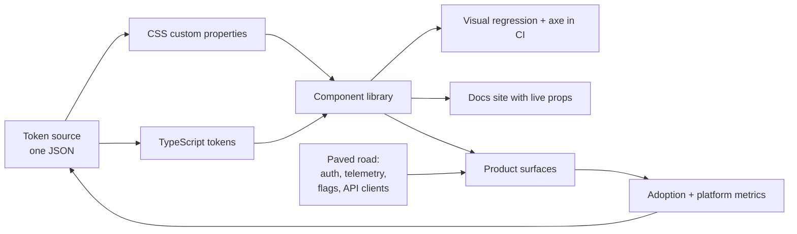

# Design Systems & Frontend Platform

> Tokens, API stability, codemods, adoption metrics, and avoiding the "platform says no" org.

- Track: **Frontend Systems** · Level: **staff** · ~20 min
- [Open in the academy](https://deepeshk1204.github.io/staff-engineer-academy/#/topic/frontend/design-systems)

A design system is a shared set of visual decisions and reusable components that many
product teams build with instead of building their own. A frontend platform is the same idea
applied to everything that is not visual: how you authenticate, how you call an API, how you emit
telemetry, how you build, and how you deploy.

Both are judged by exactly one thing -- **what fraction of product code actually uses them** -- and
almost every design-system failure is a failure of adoption rather than a failure of craft. A
beautiful component library that 40% of surfaces ignore has made the product *less* consistent than
having no library at all, because now there are two conventions and nobody knows which is current.

## Why it exists

Put eight product teams on one application with no shared foundation and count what you
get. In a real audit of a mid-size SaaS app you will typically find eleven button implementations,
seven modal implementations with three different focus-trap behaviours, and around 60 distinct
hex values where design intended nine. Two of those modals will not be keyboard-dismissable and
one will not return focus on close.

The cost is not aesthetic. It is that a single cross-cutting change -- raise the contrast ratio of
disabled text to pass WCAG AA, or add a loading state to every submit button -- becomes eleven
separate pull requests across eight teams' backlogs, sequenced by eight different sets of
priorities. Some of them will never happen.

A design system converts that from N changes across N teams into one change in one place. That is
the entire economic argument, and it is also why *adoption* is the only metric that matters: the
leverage is proportional to coverage.

## Tokens: the three-layer model

Tokens are named design values. The mistake is having one flat layer of them, which is
how you end up with `color-blue-500` referenced directly in 400 product files and no ability to
ship a dark theme.

Three layers, each with a different rate of change and a different owner:

**Primitives** are the raw palette and scales -- `blue-500`, `space-4`, `font-size-3`. They are
mostly immutable and product code must never reference them directly.

**Semantic tokens** describe intent -- `color-text-danger`, `color-surface-raised`,
`space-inset-md`. They *point at* primitives, and the pointer is where theming happens. Dark mode
is one alternate mapping of semantic tokens onto primitives, with zero component changes.

**Component tokens** are the narrow set a specific component needs --
`button-primary-background-rest`. They exist so a designer can retune one component without
touching the semantic layer everyone else depends on.

The rule that makes this pay off: product code and component internals reference *semantic* tokens
only. A lint rule that fails a build on a primitive token used outside the token package is worth
more than any amount of documentation about the convention.

**Tokens in a real source format, with the pointer indirection visible**

```json
{
  "color": {
    "primitive": {
      "blue":  { "500": { "$value": "#2563EB", "$type": "color" },
                 "600": { "$value": "#1D4ED8", "$type": "color" } },
      "red":   { "600": { "$value": "#DC2626", "$type": "color" } },
      "slate": { "50":  { "$value": "#F8FAFC", "$type": "color" },
                 "900": { "$value": "#0F172A", "$type": "color" } }
    },
    "semantic": {
      "text-danger":     { "$value": "{color.primitive.red.600}" },
      "surface-default": { "$value": "{color.primitive.slate.50}" },
      "action-primary":  { "$value": "{color.primitive.blue.600}" }
    }
  },
  "space": {
    "primitive": { "4": { "$value": "16px", "$type": "dimension" } },
    "semantic":  { "inset-md": { "$value": "{space.primitive.4}" } }
  },
  "component": {
    "button": {
      "primary-background-rest":  { "$value": "{color.semantic.action-primary}" },
      "primary-background-hover": { "$value": "{color.primitive.blue.500}" }
    }
  }
}
```

One token source compiles to every consumer: CSS custom properties for the web, a
TypeScript object for logic that genuinely needs a value in JS, and whatever the native apps
consume. Emitting CSS custom properties matters more than it sounds -- a component that renders
`var(--color-semantic-text-danger)` picks up a token change whenever the stylesheet is updated,
even if that component was bundled months ago by another team's build. Tokens leave the JavaScript
dependency graph, and version skew stops being visible to users.

## Component API stability and breaking changes

A component's props are a public API consumed by code you do not control and cannot
grep in one place. The discipline is the same as for any published API, and the hardest part is
that "breaking" is broader than the type signature.

Renaming `type` to `variant` is breaking. Changing the default `size` from `md` to `sm` is
breaking even though every call site still compiles. Changing a modal's default from
`closeOnOverlayClick: true` to `false` is breaking in the worst way, because nothing fails --
behaviour just changes under 200 surfaces at once. And spreading `...rest` onto the root element,
or accepting a `className`, quietly makes your internal DOM structure part of the contract: the
moment someone writes `.ds-button > svg { margin-left: 4px }`, your next refactor breaks them.

The practical policy is narrow surfaces and honest majors.

**What counts as breaking, and how to ship it**

| Change | Breaking? | How to ship it |
| --- | --- | --- |
| Add a new optional prop | No | Minor. Default must preserve existing behaviour exactly. |
| Rename a prop | Yes | Accept both for one major, warn once per prop per session in dev, ship a codemod, then remove. |
| Change a default value | Yes, and silent | Treat as a major. Nothing type-checks, so behaviour changes under every call site at once -- the most under-estimated break there is. |
| Tighten a prop type, e.g. `string` to a union | Yes at build time | Major. Publish the list of invalid values found in a codebase scan so teams know their exposure before upgrading. |
| Change internal DOM structure | Yes, if you allow `className` or `...rest` | Either freeze the DOM as contract or stop accepting arbitrary styling. Slot-based APIs make this explicit. |
| Change visual output within a token | No | Patch, via the token layer. This is exactly the change a design system exists to make cheap. |
| Remove a component | Yes | Deprecate with a console warning and a telemetry counter, wait until usage reaches zero, *then* remove. Never on a schedule. |

**A codemod is the difference between a migration and a request**

```js
// codemods/button-type-to-variant.js — jscodeshift
// Run: npx jscodeshift -t button-type-to-variant.js src/ --parser=tsx
module.exports = function (file, api) {
  const j = api.jscodeshift;
  const root = j(file.source);
  let touched = 0;

  root.find(j.JSXOpeningElement, { name: { name: 'Button' } }).forEach(path => {
    path.node.attributes.forEach(attr => {
      if (attr.type === 'JSXAttribute' && attr.name.name === 'type') {
        // Only rename the design-system meaning, not the HTML submit/button meaning.
        const v = attr.value && attr.value.value;
        if (v === 'primary' || v === 'secondary' || v === 'ghost') {
          attr.name.name = 'variant';
          touched++;
        }
      }
    });
  });
  // Report, do not silently skip: ambiguous cases need a human.
  if (touched) console.error(file.path + ': renamed ' + touched);
  return touched ? root.toSource({ quote: 'single' }) : null;
};
```

> **The rule that decides whether v5 ever lands**  
> **The team that makes a breaking change owns the migration of every consumer.** Not a
> migration guide -- the actual pull requests, opened by your CI against every consuming repository,
> with the codemod already applied and the diff reviewable.
> 
> The version of this that fails is publishing v5 with release notes and a Slack message. Eight
> product teams now each have an unplanned, unscoped, zero-user-value task competing with their
> roadmap. Six quarters later you are supporting v4 and v5 simultaneously, which costs more than the
> change saved.

## Testing what actually breaks

Unit tests on a design system catch almost none of its real regressions, because the
regressions are visual and behavioural.

**Visual regression** is the load-bearing test type. Render every component in every meaningful
state -- rest, hover, focus-visible, disabled, error, loading, long content, right-to-left, both
themes -- and diff the screenshots. A button with five variants times four states times two themes
is 40 snapshots, and that is the point: no human reviews 40 renderings, and a CI job does it in
seconds. Run it in a container with pinned fonts, or you will spend your first month triaging
antialiasing diffs. Budget real time for triage tooling; a visual suite that cries wolf gets
skipped within a quarter.

**Accessibility automation** is necessary and badly over-sold. `axe-core` reliably catches
contrast failures, missing accessible names, invalid ARIA attribute values and bad roles. Published
analyses put automated coverage at roughly a third of WCAG success criteria. What it cannot tell you
is whether the focus order is logical, whether a screen-reader announcement makes sense, whether
your custom combobox behaves like a combobox, or whether a modal returns focus to its trigger. Run
`axe` on every component in CI *and* keep a keyboard-only and screen-reader checklist for every
interactive component, plus a real audit before any major release. The automation raises the floor;
it does not certify the ceiling.

## Governance: who is allowed to add a component

**Three governance models**

| Model | How it works | Works when | Fails as |
| --- | --- | --- | --- |
| **Central** | A dedicated team designs, builds and owns everything. Product teams request. | Early on, or where brand and accuracy are regulated. | A queue. Product teams route around you, and the "platform says no" reputation becomes permanent. |
| **Federated** | Product engineers contribute; the platform team owns review, API standards and release. | The steady state for most orgs above roughly 40 frontend engineers. | Inconsistency, if review standards are not written down and enforced by the same people every time. |
| **Open / inner-source** | Anyone contributes, docs and lint enforce standards, maintainers are distributed. | Strong engineering culture with genuine ownership rotation. | Drift and abandonment, because everyone owns it and nobody owns it. |

Federated is the answer for most organisations, but only if you make contribution
genuinely cheap. That means a scaffold command that generates the component, stories, tests,
accessibility harness and docs page in one step; a published API checklist so review is about
whether the rules were met rather than the reviewer's taste; and an explicit service-level
expectation on review time. If a product engineer's contribution sits for two weeks, they will
copy the component into their own folder, and you have lost that surface permanently.

Also write down the **rejection criteria**, because a good design system says no often. One
consumer and no second use case in sight is not a shared component. It is a product component that
belongs in the product. Promote it later when a second team needs it.

> **The gatekeeper anti-pattern**  
> The failure mode of a platform team is becoming the org's bottleneck while believing it
> is the org's quality bar.
> 
> The symptoms are recognisable: product teams have local `components/` folders that reimplement
> library components, your roadmap is mostly other teams' requests, adoption has been flat for two
> quarters, and design-system review appears on incident timelines as a delay. The generative
> question is not "how do we enforce this?" but "why is using our thing more expensive than not
> using it?" Usually the honest answer is a missing escape hatch, a slow review, or a component that
> does not fit a real use case -- and the right response is to make your path faster rather than to
> close the alternatives.

## The paved road: everything that is not visual

The visual layer is the visible half. The other half is the set of decisions a product
engineer should never have to make twice, and it is where most of the leverage actually is.

- **Auth** — One client that owns token acquisition, silent refresh, and 401 retry. Product code calls `getAccessToken()`. No team should ever implement refresh-on-401 twice -- it is subtle, security-relevant, and easy to get wrong.
- **API clients** — Generated from OpenAPI or GraphQL schemas, so a breaking backend change fails your build rather than a user request. Hand-written types are stale the moment they are written.
- **Telemetry** — One SDK emitting errors, Core Web Vitals, and custom events with a consistent schema including team, surface and release. Instrumentation nobody has to remember is instrumentation you actually have.
- **Build and deploy** — A shared config plus a pipeline template that gives content-hashed assets, correct cache headers, sourcemap upload and canary rollout by default.
- **Feature flags** — One typed client with server-side evaluation and a flag registry that shows owner and age. Make flag creation easy and flag *removal* tracked.
- **Migration tooling** — A codemod runner, a cross-repository usage scanner, and bot-authored upgrade pull requests. This is the capability that determines whether your platform can evolve at all.



*The feedback edge from metrics back to the token source is the part most teams never build, and it is what turns a library into a platform.*

## Metrics that survive a leadership review

"Teams like it" does not survive a budget conversation. Instrument the platform the way
you would instrument a product, and prefer metrics you can compute automatically from code and
telemetry rather than from a survey.

**What to measure, with defensible targets**

- **>80%** — Component adoption rate (Library component instances ÷ all rendered interactive elements, from a static scan)
- **<5%** — Local reimplementation rate (Product-local components duplicating a library component. Rising means your path is too slow)
- **<2 days** — Contribution lead time (Proposal to merged. Past a week, teams fork instead)
- **<1 quarter** — Time to fully migrate a major (Measured to 99% of consumers, not to release day)
- **>90%** — Consumers on the current major (Supporting two majors indefinitely is the real cost of a bad migration)
- **<0.1%** — Sessions with an axe-detectable violation (Sampled in RUM, not just in CI)

Documentation is a product surface, not a byproduct, and the single highest-value thing
in it is a live props table generated from the types -- because hand-written prop docs are wrong
within two releases and being wrong once teaches engineers to read your source instead. Beyond
that, the pages that get used are the ones answering *"which component do I use for this, and what
do I do when it does not fit?"* An explicit, blessed escape hatch documented next to each component
prevents the fork, and a fork is permanent in a way a slightly-awkward prop is not.

## Trade-offs

**Trade-offs**

What you gain:
- Cross-cutting changes cost one pull request instead of N teams' backlogs.
- Accessibility and theming are solved once at the component layer rather than per surface.
- New product surfaces start days ahead, with correct telemetry and caching for free.
- Visual regression plus axe in CI catches a class of defect no reviewer reliably catches.
- Tokens as CSS custom properties keep a multi-deployable frontend visually coherent.

What it costs you:
- A funded team that ships no user-visible features, permanently.
- Every component API is a contract you must support long after you regret it.
- Migrations are your recurring tax, and you own the pull requests, not just the guide.
- A real risk of becoming a bottleneck the org routes around.
- Visual regression suites need ongoing triage investment or they get muted.
- Product teams lose local speed on genuinely one-off, unusual UI.

**Failure modes**

| Failure mode | What the user sees | Mitigation |
| --- | --- | --- |
| Product code references primitive tokens directly | Theming and dark mode become impossible without touching hundreds of files. | Lint rule failing any primitive token outside the token package; codemod existing usages to semantic equivalents. |
| Breaking change shipped with only release notes | Two majors supported for six-plus quarters; every consumer pays an unplanned tax. | Codemod plus bot-authored pull requests per repository; track migration to 99% before deleting the old path. |
| Default prop value changed in a minor | Silent behaviour change across every call site with nothing failing in CI. | Treat default changes as major; snapshot resolved defaults in tests; require a visual diff on the whole gallery. |
| Two-week component review queue | Teams fork locally; adoption plateaus and consistency degrades permanently. | Federated model, published review service-level expectation, scaffold command, written API checklist. |
| Visual regression suite too noisy | Team mutes it; genuine regressions ship unnoticed. | Pin fonts and run in a fixed container, set per-pixel thresholds, and invest in a review UI for approving intended diffs. |
| Relying on axe alone for accessibility | Keyboard traps and nonsensical screen-reader flows ship as "accessible" components. | Keyboard and screen-reader checklist per interactive component, plus a human audit before every major. |
| No escape hatch documented | A team forks the component; the fork never returns and diverges forever. | Blessed extension points, a slot-based API, and a documented path for proposing a variant. |

> **Staff-level angle**  
> Most candidates describe a component library. The Staff-level answer treats the design
> system as an adoption and migration problem and comes with numbers.
> 
> - "The metric I would put on a dashboard is adoption -- library component instances over all
>   rendered interactive elements, computed from a static scan -- plus the local reimplementation
>   rate. If reimplementation is climbing, our path is more expensive than going around us, and that
>   is our bug, not theirs."
> - "Product code references semantic tokens only, never primitives, and a lint rule fails the build
>   otherwise. That indirection is what makes dark mode a token remapping instead of a 400-file
>   refactor."
> - "We ship tokens as CSS custom properties, not just a JS object, so a token fix reaches a surface
>   that bundled our components six months ago. That is what keeps independently deployed frontends
>   visually coherent."
> - "If I make a breaking change, my team writes the codemod and opens the pull requests against every
>   consuming repository. Publishing v5 with release notes just distributes unplanned work to eight
>   teams and guarantees we support v4 for six more quarters."
> - "Changing a default value is a major even though nothing type-checks. That is the most
>   under-estimated break in a component library -- behaviour changes under every call site at once."
> - "Axe covers roughly a third of WCAG criteria. I run it on every component in CI, and I also keep
>   a keyboard and screen-reader checklist per interactive component, because axe cannot tell me
>   whether focus returns to the trigger when a modal closes."
> - "I would say no to a component with one consumer and no second use case. It is a product
>   component. We can promote it when a second team needs it."
> 
> The signal is that you understand the platform team's product is other engineers' velocity, that
> you measure it, and that you treat your own migrations as work you own rather than work you
> announce.

**Check**

You need dark mode. Product code currently uses `color-blue-500` directly in about 400 places. What is the correct first move?
- A. Add a dark palette and a `[data-theme]` override for every primitive.
- B. Introduce semantic tokens, codemod the 400 usages to them, and lint-ban primitives in product code. **(answer)**
- C. Ship a second component library themed for dark mode.
- D. Use CSS `filter: invert()` at the root.

  Primitives are raw values, so overriding `blue-500` in dark mode makes it no longer blue-500 -- every consumer that wanted literal blue is now broken, and you have no way to distinguish intent. Semantic tokens add the pointer layer where theming belongs: `color-text-danger` maps to different primitives per theme and components never change. The lint rule is what keeps the indirection from eroding.

Which is the most dangerous release to ship as a minor version?
- A. Adding an optional `loading` prop to Button.
- B. Changing Modal's default `closeOnOverlayClick` from `true` to `false`. **(answer)**
- C. Adding a new Tooltip component.
- D. Fixing the disabled-text contrast ratio via a token.

  Nothing fails to compile and no test necessarily breaks, yet the behaviour of every modal in the product changes simultaneously. Type-visible breaks are self-announcing; silent default changes are discovered by users. Treat default values as part of the public API, snapshot resolved defaults, and require a visual diff of the full gallery before release.

Adoption has been flat at 55% for two quarters and teams keep local component folders. Best response?
- A. Add a lint rule banning local components.
- B. Interview those teams to find why the library is more expensive than a fork, and fix that. **(answer)**
- C. Require design-system review for every frontend pull request.
- D. Rewrite the library on a newer stack.

  Flat adoption with local forks is a signal that the paved road is slower or worse than the alternative -- usually a slow review queue, a missing escape hatch, or a component that genuinely does not fit. Banning the alternative without fixing the cause converts avoidance into resentment and produces wrappers that defeat the library anyway. Platform adoption is won by making your path cheapest, not by closing the others.

<details><summary>Related topics and how they connect</summary>

Token drift across independently deployed features is one of the sharpest costs in
**Microfrontends**, and shipping tokens as CSS custom properties is the mitigation. Component
version skew across remotes is negotiated in **Module Federation & Runtime Integration**. The
codemod-plus-expand-migrate-contract pattern generalises to APIs and data in **Deployment, Rollout
& Migration**. And adoption metrics only exist if the paved road emits them, which is
**Frontend Observability**.

</details>

## Flashcards

- **What are the three token layers and who references which?** — Primitives are raw values and are referenced only by the token package. Semantic tokens express intent and are the only layer product code and components may use. Component tokens let one component be retuned without touching the semantic layer.
- **Why ship tokens as CSS custom properties rather than only a JS object?** — Because a component reading `var(--color-semantic-action-primary)` picks up a token change from a stylesheet update even if it was bundled months ago by another team. Tokens leave the JS dependency graph, so version skew stops being visible.
- **Why is changing a default prop value a major version?** — Nothing fails to compile, so behaviour changes silently across every call site at once. Type-visible breaks announce themselves; silent default changes are found by users.
- **Who owns the migration for a design-system breaking change?** — The team that made the change. That means writing the codemod and opening pull requests against every consuming repository -- not publishing a migration guide and a Slack message.
- **What does `axe-core` catch and what does it miss?** — It catches contrast failures, missing accessible names, invalid ARIA and bad roles -- roughly a third of WCAG criteria. It misses focus order, whether announcements make sense, custom widget semantics, and focus return on modal close.
- **Which governance model is the usual steady state, and what does it require?** — Federated: product engineers contribute, the platform team owns review, API standards and release. It requires a scaffold command, a written API checklist, and a real review-time commitment, or teams fork.
- **Two adoption metrics worth a dashboard?** — Component adoption rate -- library instances over all rendered interactive elements from a static scan -- and local reimplementation rate. A rising reimplementation rate means your path costs more than going around you.
- **When should a design system say no to a component?** — When there is one consumer and no visible second use case. That is a product component; promote it to the library when a second team needs it.
- **What belongs on the non-visual paved road?** — Auth with token refresh, generated API clients, one telemetry SDK, shared build and deploy pipelines, a typed feature-flag client, and migration tooling: codemods, usage scanners and bot-authored upgrade pull requests.

## Drills

### Drill

You own a design system used by nine product teams. You need to ship v5, which renames three props, tightens one prop type, and changes Modal's default overlay-click behaviour. Adoption of v4 is 85%. Design the release so that nine months from now you are not still supporting v4.

Probes:

- How do you know your actual exposure before you ship?
- What do you do about the default-value change specifically?
- How do teams with heavy customisation upgrade?
- What is your stop condition for deleting v4?

Strong answer contains:

- Scans every consuming repository first to quantify affected call sites per team, and publishes that list with the release.
- Writes codemods for the renames and the type tightening, and opens bot-authored pull requests per repository with the diff already applied.
- Treats the default change as the riskiest item: flags call sites that relied on the old default and sets it explicitly in the codemod rather than letting it change silently.
- Ships deprecation warnings in v4 first, one per prop per session, with a telemetry counter so usage is observable rather than guessed.
- Defines the stop condition as telemetry showing zero v4 usage, not a calendar date.
- Names a migration-completion metric with a target, such as 99% of consumers within one quarter.

Weak answer tells:

- Publishes v5 with release notes and a migration guide and calls it done.
- No usage data, so exposure is unknown and estimates are guesses.
- Ships the default change as a minor because "the types did not change".
- Deletes v4 on a fixed date regardless of remaining usage.
- No plan for teams who customised via `className` against internal DOM.

### Drill

You are hired as the first platform engineer at a 70-engineer frontend org. There is no design system, three build configs, two auth implementations, and each team does its own error tracking. You have two engineers and one year. What do you build first?

Probes:

- Why that order rather than starting with components?
- How do you avoid becoming the team everyone routes around?
- What do you deliberately not build?
- What do you show leadership at six months?

Strong answer contains:

- Starts with observability and auth rather than components, because you cannot prioritise what you cannot measure and duplicated auth is the highest-risk duplication.
- Delivers tokens as CSS custom properties early, since it is cheap and produces visible consistency across all three build setups.
- Picks the federated model from the start, with a scaffold command and a published review-time commitment.
- Names concrete six-month evidence: adoption rate, contribution lead time, and a cross-cutting change shipped once instead of nine times.
- Explicitly declines to build a component for every design, and writes down rejection criteria.
- Builds the codemod runner and cross-repository usage scanner early, treating migration capacity as a prerequisite for evolution.

Weak answer tells:

- Begins with a large component library and no adoption mechanism.
- No metrics, so the platform's value rests on assertion.
- Central governance with two engineers for 70 consumers -- a guaranteed queue.
- Plans a big-bang migration of all three build configs at once.
- No migration tooling, so the first breaking change stalls indefinitely.
