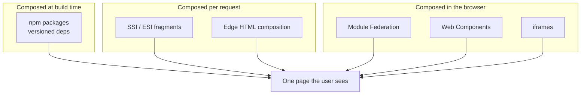

# Microfrontends

> An organisational scaling technique with technical consequences. When to say no.

- Track: **Frontend Systems** · Level: **staff** · ~22 min
- [Open in the academy](https://deepeshk1204.github.io/staff-engineer-academy/#/topic/frontend/microfrontends)

A microfrontend architecture splits one website into several independently built and
independently deployed pieces, each owned by a different team, and stitches them back together
in the user's browser or on a server.

The important word in that sentence is **independently**. Microfrontends do not make your site
faster, smaller, or simpler. They buy exactly one thing: a team can ship to production without
waiting for anyone else's build, test suite, or release train. Every other consequence is a cost
you pay for that.

## Why it exists

Take a single frontend repository with 120 engineers committing to it. The symptoms are
predictable and they are all about queueing, not code.

The CI pipeline grows to 25 minutes because it runs everyone's tests on every change. Trunk goes
red twice a day, and each time it does, 40 people are blocked. Releases get batched into a weekly
train because nobody can verify 200 merged commits in an afternoon, so the cost of a one-line
copy fix is a week of latency. When something breaks in production you bisect across changes from
nine teams. And because reverting the deploy reverts everyone, the incident response becomes a
negotiation.

None of those problems are solved by better code. They are solved by making the unit of deployment
smaller than the unit of the product. That is what microfrontends are for -- and it is why the
decision belongs to whoever owns the org chart, not whoever owns the webpack config.

> **Conway's Law, stated usefully**  
> Conway observed that a system's structure mirrors the communication structure of the
> organisation that built it. The practical version for this topic: *if two teams must coordinate to
> ship a change, you will end up with a coordination mechanism whether you designed one or not.*
> 
> So the real question is never "should we do microfrontends". It is "what are our deployment
> boundaries, and do they match our team boundaries?" If four teams all own parts of one checkout
> flow, splitting that flow into four deployables does not remove the coordination -- it moves the
> coordination from a pull request, where it is cheap and reviewable, into a runtime contract, where
> it is expensive and invisible.

## The integration taxonomy

"Microfrontend" is not one technique. There are six meaningfully different ways to
compose independently-owned frontend code, and they differ in *when* composition happens: at build
time, at request time on a server, at the edge, or at runtime in the browser. That timing decides
your isolation, your bundle cost, and whether a broken deploy from one team can white-screen the
whole page.



*Move down the diagram and you gain deploy independence while losing shared-runtime efficiency.*

**Choosing an integration style**

| Style | How it composes | Deploy independence | Bundle cost | Isolation | Best fit |
| --- | --- | --- | --- | --- | --- |
| **Build-time packages** | Team publishes `@acme/checkout@2.3.1`; shell installs and bundles it. | None -- shell must rebuild and redeploy. | Optimal. One React, full tree-shaking, one critical path. | None. A bad render loop in one package janks the page. | The correct default for most orgs. Independent *ownership* without independent deploys. |
| **Runtime federation** | Shell fetches `remoteEntry.js` at runtime and resolves shared modules against a negotiated scope. | Full. Remote deploys without touching the shell. | Moderate. Shared deps mostly dedupe; mismatches duplicate. | Weak. Same JS realm, same globals, same main thread. | Many teams, one SPA, and you genuinely need per-team deploys. |
| **Web Components** | Each team ships a custom element; the shell places a `team-widget` element in the DOM. | Full, if the element is loaded from its own URL. | Poor. Each element usually carries its own framework runtime. | Good for CSS via shadow DOM. None for JS. | A shell that must host genuinely heterogeneous frameworks. |
| **iframes** | Separate document, separate origin, `postMessage` for communication. | Full and absolute. | Worst. Separate document, separate everything. | Strongest available -- separate JS realm and origin. | Untrusted or third-party code, or legacy apps you will not touch. |
| **Server-side composition** | Server assembles fragments per request via SSI/ESI or a template. | Good -- fragments deploy separately. | Good. HTML arrives assembled, so first paint is fast. | Good at request time, none after hydration. | Content-heavy, SEO-critical, low-interactivity pages. |
| **Edge HTML composition** | An edge worker streams a shell and splices fragment HTML in. | Good. | Good, plus edge caching per fragment. | Same as server composition. | Global sites where you want per-fragment TTLs. |

> **Warning**  
> Notice that iframes -- the option every architecture document dismisses in a sentence --
> are the only one that gives you real fault isolation. If a remote's JavaScript throws during module
> evaluation in a federated setup, you get a white page. In an iframe you get a broken rectangle.
> When the constraint is "a third party's code runs on our billing page", the ugly option is the
> correct one.

## The shell / feature contract

Everything that makes a microfrontend system survivable lives in one artefact: the
contract between the shell and the features. Write it down, version it, and test it. If it exists
only as tribal knowledge, you will discover its clauses during incidents.

A usable contract answers these questions explicitly.

- **Mount and unmount** — The shell calls `mount(el, props)` and expects a `unmount()` back. Leaked timers, listeners and subscriptions on unmount are the single most common MFE memory bug.
- **What the shell provides** — Auth token accessor, current user, locale, feature-flag client, telemetry client, router, theme tokens. Features must never construct these themselves.
- **Routing ownership** — Shell owns the top-level path segment; the feature owns everything under it. The shell must not know that `/billing/invoices/:id` exists.
- **Error and loading behaviour** — Every remote is wrapped in an error boundary with a named fallback. A feature failing to load degrades to a message in its own region, never a blank page.
- **Shared dependency policy** — Which packages are singletons, which version ranges are acceptable, and who is allowed to bump them. Usually React, the router and the design system.
- **Telemetry identity** — Every error, metric and trace carries the owning team and the feature version, so a page-level regression is attributable in one query.

**A contract worth publishing as a versioned package**

```ts
// @acme/mfe-contract — the only thing both sides depend on.
export interface ShellServices {
  // Never hand over the raw token string; hand over an accessor that
  // can refresh, so a feature cannot cache an expired credential.
  getAccessToken(): Promise<string>;
  user: { id: string; locale: string; tenantId: string };
  flags: { isEnabled(key: string): boolean };
  telemetry: {
    error(e: Error, ctx?: Record<string, unknown>): void;
    metric(name: string, value: number): void;
  };
  navigate(to: string, opts?: { replace?: boolean }): void;
}

export interface FeatureModule {
  // Semver of the contract this feature was built against.
  contractVersion: '2.x';
  mount(el: HTMLElement, services: ShellServices): void;
  unmount(el: HTMLElement): void;   // must remove every listener it added
}
```

## The duplicate-React problem

This is the failure that turns a microfrontend demo into a support ticket, so it is worth
understanding precisely.

React keeps module-level mutable state -- most visibly the current dispatcher used by hooks. If two
copies of React are evaluated in one JS realm, a component rendered by copy A but calling a hook
resolved from copy B throws *"Cannot read properties of null, reading useContext"* or *"Invalid hook
call"*. Context is worse and quieter: a provider from copy A is a different object identity from the
consumer's context in copy B, so the consumer silently receives the default value. Your theme falls
back to light mode and nothing errors.

Mitigation is a policy, not a flag. React, `react-dom`, the router, and any library that uses
context or module-level registries must be declared singletons in the shared scope. Everything else
can duplicate safely, and duplication of small leaf libraries is usually cheaper than forcing
lock-step upgrades across ten teams.

**What duplication actually costs, minified + brotli**

- **~45 kB** — react + react-dom 18 (Per duplicated copy)
- **~11 kB** — react-router v6 (Breaks routing if duplicated, not just size)
- **~14 kB** — A typical emotion/styled runtime (Duplicate class-name registries)
- **~180 kB** — Realistic overhead, 4 remotes duplicating a shared set (≈400 ms extra parse+exec on a mid-tier Android device)

> **Note**  
> The performance argument for microfrontends is usually stated backwards. People say "each
> team only ships its own code, so bundles are smaller". In practice the shell must boot a framework,
> a router, a design system and a telemetry client *before* any feature renders, and then each remote
> adds its own non-shared dependencies on top. A federated four-team SPA is almost always larger on
> the critical path than the modular monolith it replaced. Choose microfrontends for deploy autonomy
> and then defend performance actively -- do not expect performance as a side effect.

## Routing, deep links and cross-feature communication

Routing is where the org chart leaks into the URL. The stable arrangement is that the
shell owns a route *prefix* table -- `/billing/*` belongs to the payments team, `/settings/*` to
platform -- and delegates the remaining path to the feature's own router. The shell never enumerates
sub-routes, because the moment it does, shipping a new page requires a shell deploy and you have
rebuilt the release train you were trying to escape.

Two consequences people miss. First, a deep link to `/billing/invoices/9f2` must work on a cold
load, which means the shell needs to resolve *which* remote owns `/billing` before that remote's
code is fetched -- from a static manifest, not from the remotes themselves. Second, unknown-route
handling gets ambiguous: if the shell 404s before loading the remote, a newly-added page inside an
already-deployed remote is unreachable, so the feature must own its own 404 below the prefix.

For communication between features, the ranking is not close.

**Cross-microfrontend communication, best to worst**

| Mechanism | Coupling | When it is right | The trap |
| --- | --- | --- | --- |
| **URL and query state** | Lowest -- the contract is a documented URL. | Anything a user could bookmark, share or reload: selected tenant, filters, open entity. | Only encodes what belongs in a URL. Do not stuff a cart in there. |
| **Server as the bus** | Low -- both features talk to an API, and one invalidates the other's query cache. | The default for real data. A write in one feature should make the other refetch. | Needs a shared cache-invalidation key convention, which is itself a contract. |
| **Shell-provided store or service** | Medium -- both depend on a versioned shell API. | Genuinely cross-cutting state: auth session, theme, notification tray, locale. | Grows into a god object. Keep it to things the shell actually owns. |
| **Custom DOM events** | Medium, and untyped by default. | Fire-and-forget notifications where no reply is needed: `acme:cart-updated`. | No schema, no discoverability, no back-pressure. Namespace and version the `detail` payload or it rots in a quarter. |
| **Direct imports between features** | Highest. | Effectively never -- it reintroduces build-time coupling with none of the benefits. | You now have independent deploys *and* a shared dependency graph. Worst of both. |

## Design-token drift

Independently deployed features will look different, and the divergence is usually invisible
in review because each feature looks fine in isolation.

The mechanism: the design system is a versioned npm package, and each remote bundles the version it
happened to install. Three months after a spacing-scale change you have `@acme/ds@4.1` in the shell,
`4.0` in billing and `3.8` in settings, so buttons are 2 px different in height across a single
page. Nobody notices until a designer screenshots the whole flow.

The fix is to move visual primitives out of the JavaScript dependency graph. Ship tokens as CSS
custom properties on `:root` from the shell, and have components consume `var(--ds-space-3)`
rather than importing a number. Now a token change propagates on shell deploy regardless of which
component version a remote bundled. Component *behaviour* still drifts by version -- that is
unavoidable -- but colour, spacing and typography stay coherent, which is what people actually see.

## Trade-offs

**Trade-offs**

What you gain:
- Teams deploy on their own cadence; one team's red build stops blocking nine others.
- CI time per change drops from the whole monorepo to one feature's test suite.
- Blast radius of a bad deploy is one region of one page, if error boundaries are real.
- Rollback becomes per-team: revert one remote pointer, not the whole app.
- A legacy stack can be strangled route by route instead of in one rewrite.

What it costs you:
- Larger critical path -- duplicated dependencies and a shell that boots before anything renders.
- A runtime contract replaces a compile-time one, so breakage moves from CI to production.
- End-to-end testing needs a version matrix; "it worked in staging" stops meaning much.
- Debugging spans repositories, sourcemap sets, and deploy timelines.
- Visual and behavioural drift becomes a permanent, funded maintenance activity.
- A whole platform team exists to own the shell, the manifest and the tooling.

**Failure modes**

| Failure mode | What the user sees | Mitigation |
| --- | --- | --- |
| Duplicate React in the shared scope | Invalid hook call, or silent context fallback across a whole feature. | Declare `react`/`react-dom`/router as `singleton: true`; assert at boot that the realm holds one copy and log loudly if not. |
| Remote `remoteEntry.js` 404s or times out | Shell hangs or white-screens if the import is on the critical path. | Error boundary plus timeout per remote, a named fallback UI, and a pinned last-known-good manifest. |
| Shell ships a breaking contract change | Every remote built against the old contract breaks at once -- the opposite of the promised isolation. | Semver the contract, support N-1 for at least one deploy cycle, and run remotes against contract fixtures in CI. |
| Remote leaks listeners on unmount | Memory growth and duplicated network calls as users navigate between features. | Contract-test `unmount`: mount and unmount 50 times and assert listener and timer counts return to baseline. |
| Design-token version skew | One page with three spacing scales and two brand blues. | Tokens as CSS custom properties from the shell; a CI check that fails a remote pinning a major behind. |
| CSS global leakage between features | One team's `.button` restyles another team's page. | Hashed class names or scoped-by-default styling; ban unscoped element selectors; forbid global resets outside the shell. |
| Two remotes each fetch `/api/me` | Duplicated requests and inconsistent user state on the same screen. | Shell owns session and passes it through the contract; a shared query client keyed by a documented convention. |

> **Staff-level angle**  
> The interviewer is usually testing whether you will reach for microfrontends because they
> are interesting. The highest-signal answer starts by declining.
> 
> - "Before I split anything, I want to know what is actually slowing you down. If the complaint is a
>   25-minute CI run and a weekly release train, I can often fix that with affected-project builds
>   and per-directory code ownership for a fraction of the cost of a runtime split."
> - "Microfrontends buy deploy independence. They do not buy performance -- four remotes duplicating
>   React and a styling runtime is roughly 180 kB brotli and about 400 ms of extra parse and execute
>   on a mid-tier Android device. I want to be honest that we are spending performance to buy
>   autonomy."
> - "I would default to a modular monolith: one deployable, strict module boundaries, code owners per
>   directory, and affected-only CI. That gets most of the ownership benefit and keeps a compile-time
>   contract, which is the cheapest place to catch breakage."
> - "I would change that recommendation under specific conditions: more than roughly eight teams
>   shipping to one URL, or a genuinely heterogeneous stack we are strangling incrementally, or a
>   compliance boundary where one team's code must not share a runtime with another's."
> - "If we do split, the split follows the org chart, not the component tree. Two teams co-owning
>   checkout stays one deployable, because splitting it moves their coordination from a reviewable
>   pull request into an invisible runtime contract."
> - "The shell contract is the product. Versioned, semver'd, N-1 compatible, with contract fixtures in
>   every remote's CI. Without that, 'independent deploys' means 'nobody can deploy safely'."
> 
> What each of those signals: that you optimise for organisational throughput rather than novelty,
> that you can quantify a cost instead of gesturing at one, and that you have felt the difference
> between a contract enforced by a compiler and a contract enforced by hope.

**Check**

A 12-engineer team wants microfrontends because their bundle is 2.1 MB and LCP is 4 s. What is the best response?
- A. Split by route so each team ships less code.
- B. Microfrontends will likely make it worse; fix it with route-level code splitting and a bundle budget. **(answer)**
- C. Adopt Module Federation with everything marked as shared.
- D. Move to iframes for isolation.

  Bundle size is a code-splitting problem, and route-level lazy chunks solve it inside one deployable with no runtime contract. Microfrontends add a shell boot cost plus duplicated shared dependencies, so the critical path usually grows. At 12 engineers there is also no queueing problem to solve -- one team does not block itself.

Two remotes each bundle their own React 18 copy. A shared ThemeProvider in the shell appears to work, but one remote always renders the light theme. Why?
- A. The remote loaded before the provider mounted.
- B. Context identity is per React copy, so the consumer resolves a different context object and gets its default value. **(answer)**
- C. CSS custom properties do not cross remote boundaries.
- D. The theme provider needs `singleton: true` on itself.

  A React context is an object identity created by a specific React instance. Consumer and provider from different copies never match, so the consumer falls back to the `createContext` default -- silently, with no error. This is why React, the router and any context-based library must be singletons in the shared scope, and why a boot-time assertion that only one React exists in the realm is worth the twenty lines.

Which routing arrangement preserves deploy independence?
- A. The shell enumerates every route and maps each to a remote component.
- B. The shell owns path prefixes from a static manifest and delegates the rest to each remote's router. **(answer)**
- C. Each remote registers its routes with the shell at runtime after loading.
- D. A shared routes package imported by shell and remotes.

  Prefix delegation means adding a page inside a remote needs no shell change. Enumerating routes centrally or sharing a routes package reintroduces the coordinated deploy. Runtime registration sounds elegant but breaks cold deep links: the shell must know which remote owns `/billing/invoices/9f2` *before* fetching any remote code, which is exactly what a static prefix manifest gives you.

<details><summary>Related topics and how they connect</summary>

The mechanics of runtime composition -- shared scope, version negotiation, manifests and
rollback -- are in **Module Federation & Runtime Integration**. Token drift and the paved-road
tooling that makes a shell survivable are in **Design Systems & Frontend Platform**. Version skew
between shell and remotes during a rollout is the hardest case in **Deployment, Rollout &
Migration**, and attributing a page-level regression to one team is why **Frontend Observability**
needs a feature-and-version dimension on every event.

</details>

## Flashcards

- **What do microfrontends actually buy you?** — Independent deployment. A team ships without waiting on another team's build, tests or release train. Not performance, not smaller bundles, not simplicity -- those are costs you pay for the autonomy.
- **Why does duplicate React break context silently?** — A context is an object identity created by one React instance. A provider from copy A and a consumer from copy B never match, so the consumer gets the `createContext` default value with no error thrown.
- **Which packages must be singletons in a shared scope?** — Anything holding module-level mutable state or relying on identity: `react`, `react-dom`, the router, the styling runtime, and the query client. Pure leaf utilities can duplicate cheaply.
- **Best-to-worst cross-microfrontend communication?** — URL/query state, then the server plus cache invalidation, then a shell-provided service, then namespaced custom DOM events. Direct imports between features are effectively never right.
- **How do you stop design-token drift across remotes?** — Ship tokens as CSS custom properties from the shell so components read `var(--ds-space-3)` instead of importing a number. Token changes then propagate on shell deploy regardless of bundled component versions.
- **What is the honest default instead of microfrontends?** — A modular monolith: one deployable, enforced module boundaries, code owners per directory, affected-only CI. You get ownership clarity while keeping a compile-time contract.
- **What conditions justify a real runtime split?** — Roughly eight or more teams shipping to one URL, a heterogeneous stack being strangled incrementally, or a compliance/trust boundary that forbids sharing a runtime.
- **Why are iframes sometimes the right microfrontend?** — They are the only option with a separate JS realm and origin, so a crash or a hostile script is contained. When you host untrusted or third-party code, that isolation beats bundle efficiency.

## Drills

### Drill

You join a company with 140 frontend engineers across 11 teams shipping one logged-in SaaS app. CI takes 28 minutes, trunk is red about twice a day, and releases go out weekly on Thursdays. The CTO has already announced microfrontends. Walk me through what you would do in your first quarter.

Probes:

- What would you measure before splitting anything?
- Where exactly do the seams go, and why those seams?
- What breaks the first time the shell changes its contract?
- How does a team roll back at 2 a.m. without paging the shell owners?

Strong answer contains:

- Measures the actual queueing cost first -- PR wait time, deploy frequency per team, mean time to revert -- and checks whether affected-only CI plus code owners fixes most of it.
- Draws seams along team ownership and route prefixes, and explicitly keeps a multi-team flow such as checkout as one deployable.
- Names a versioned shell contract with N-1 support and contract fixtures running in every remote's CI.
- Specifies a static route-prefix manifest plus pinned remote versions, so rollback is flipping a manifest entry rather than rebuilding.
- Quantifies the shared-dependency cost -- around 45 kB brotli per duplicated React -- and names singletons explicitly.
- Plans incremental adoption: one low-risk route first, with error boundaries and per-remote fallback UI before the second team moves.

Weak answer tells:

- Starts drawing the shell architecture without asking what is actually slow.
- Splits by technical layer or component tree instead of by team ownership.
- Claims microfrontends will improve load performance.
- No answer for shell contract versioning, or assumes the shell never changes.
- Treats end-to-end testing as unchanged when the deployed combination of versions is now variable.

### Drill

A federated remote owned by another team starts throwing during module evaluation after their deploy. Your shell white-screens for every user, including on routes that remote does not own. Post-incident, what do you change?

Probes:

- Why did a failure in one remote take down unrelated routes?
- What is the fastest possible mitigation while the other team investigates?
- How do you prevent this class of failure rather than this instance?

Strong answer contains:

- Identifies eager or top-level remote imports pulling the failing module into the shell's critical path, and makes every remote import lazy and boundary-wrapped.
- Names a pinned manifest so the immediate mitigation is repointing that remote to its last-known-good version -- no rebuild, no other team involved.
- Adds a per-remote load timeout and a named fallback region so a dead remote degrades to a message in its own rectangle.
- Adds a synthetic check per remote plus an alert on remote-load failure rate broken out by remote and version.

Weak answer tells:

- Answers "add an error boundary" without noticing boundaries do not catch failures during module import or chunk load.
- Proposes reverting the whole shell, reintroducing the coupling microfrontends were meant to remove.
- No mechanism for pinning or rolling back an individual remote version.
- Treats it as a one-off bug in the other team's code rather than a missing isolation boundary.
