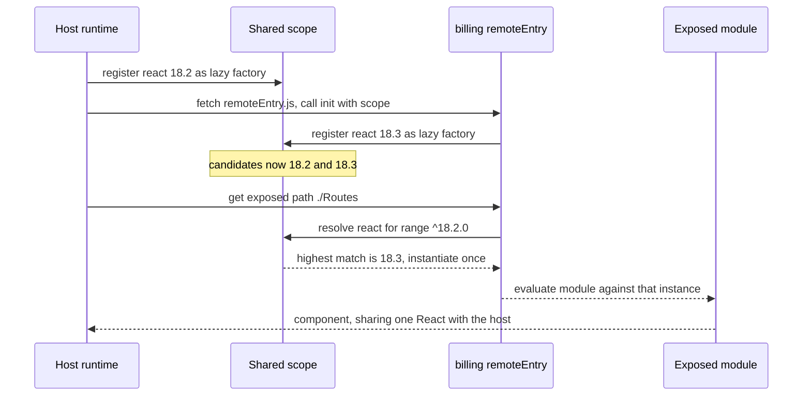

# Module Federation & Runtime Integration

> Hosts, remotes, shared scope negotiation, and the N-1/N/N+1 compatibility problem.

- Track: **Frontend Systems** · Level: **staff** · ~19 min
- [Open in the academy](https://deepeshk1204.github.io/staff-engineer-academy/#/topic/frontend/module-federation)

Module Federation lets one JavaScript application import a module from another
application that was built separately, deployed separately, and is fetched over the network at the
moment it is needed.

Ordinary code splitting also loads JavaScript on demand, but every chunk came out of one build, so
the bundler knew the whole dependency graph. Federation breaks that assumption: the code being
loaded was compiled by a different webpack run, possibly against different versions of React and
your design system, and it still has to end up sharing one React instance with its host at runtime.
Everything interesting about Module Federation is how that reconciliation works.

## Why it exists

Before federation, sharing code between independently deployed frontends meant one of two
bad options.

You could publish npm packages, which works well but couples deploys: for the host to get a new
version of a feature, someone must bump a dependency, rebuild the host, and redeploy it. A one-line
copy change in a remote team's feature becomes a pull request against your repository.

Or you could load a separately-built script tag and hope, which gives you independent deploys but
means every remote carries its own copy of React, its own router, and its own styling runtime.
Three remotes and you have shipped React three times -- roughly 135 kB brotli of pure duplication --
and your context providers do not work across the boundary.

Federation's contribution is the **shared scope**: a runtime registry where host and remotes
publish the shared dependencies they carry along with version metadata, and then negotiate which
single copy everyone will use. That is the whole trick, and it is why understanding the negotiation
matters more than memorising config keys.

## The five concepts

- **Host (a.k.a. consumer)** — The build that imports federated modules. Usually your shell. A build can be both a host and a remote at once.
- **Remote (a.k.a. producer)** — The build that exposes modules for others to import. Identified by a name and the URL of its entry file.
- **`remoteEntry.js`** — A tiny manifest-plus-loader the remote emits. It declares what the remote exposes and what it can contribute to the shared scope. Must never be cached immutably.
- **`exposes`** — The public API of a remote: a map from a public path such as `./Checkout` to an internal source file. This is a contract -- semver it mentally.
- **`shared`** — The packages this build is willing to provide to, or consume from, the shared scope, with version constraints and flags like `singleton`.

**A real host config — webpack 5 with Module Federation 2**

```js
// shell/webpack.config.js
const { ModuleFederationPlugin } = require('@module-federation/enhanced/webpack');

module.exports = {
  output: { publicPath: 'auto' },   // so chunks resolve relative to remoteEntry, not the host
  plugins: [
    new ModuleFederationPlugin({
      name: 'shell',
      // Manifest-driven: the actual URLs are resolved at runtime, not baked in.
      // This is what makes rolling back one remote a config change.
      remotes: {
        billing: 'billing@[window.__MFE__.billing]/remoteEntry.js',
        settings: 'settings@[window.__MFE__.settings]/remoteEntry.js'
      },
      shared: {
        react: { singleton: true, requiredVersion: '^18.2.0', strictVersion: true },
        'react-dom': { singleton: true, requiredVersion: '^18.2.0', strictVersion: true },
        'react-router-dom': { singleton: true, requiredVersion: '^6.20.0' },
        '@acme/design-system': { singleton: true, requiredVersion: '^4.0.0' },
        // Stateless leaf library: let each side keep its own copy if versions differ.
        // Deduping saves ~24 kB; forcing lock-step upgrades across 8 teams costs more.
        'date-fns': { singleton: false, requiredVersion: '^3.0.0' }
      },
      dts: { generateTypes: true, consumeTypes: true }  // MF2 type sharing
    })
  ]
};
```

**The matching remote**

```js
// billing/webpack.config.js
new ModuleFederationPlugin({
  name: 'billing',
  filename: 'remoteEntry.js',
  exposes: {
    './Routes': './src/routes.tsx',       // the whole feature subtree
    './InvoiceBadge': './src/InvoiceBadge.tsx'  // a small widget the shell embeds
  },
  shared: {
    react: { singleton: true, requiredVersion: '^18.2.0' },
    'react-dom': { singleton: true, requiredVersion: '^18.2.0' },
    '@acme/design-system': { singleton: true, requiredVersion: '^4.0.0' }
  }
})

// Every asset except remoteEntry.js is content-hashed and immutable.
//   /billing/v/2026-09-13-a91f/remoteEntry.js   -> max-age=30, must-revalidate
//   /billing/v/2026-09-13-a91f/chunk.7c1e.js    -> max-age=31536000, immutable
```

## How shared-scope negotiation actually works

This is the part people cannot explain in interviews, and it is not complicated once you
see the sequence. In plain English:

1. The host boots. For each package in its `shared` map, it registers an entry in a global shared
   scope object -- effectively a map from package name to a list of candidate versions, each with a
   factory function that can instantiate that copy, plus a flag for whether it has already been
   loaded.
2. The host fetches a remote's `remoteEntry.js` and calls its `init` function, handing over the
   shared scope. The remote adds its own candidates to the same lists. Nothing has been loaded yet
   -- these are lazy factories, which is why this step is cheap.
3. When any module actually imports a shared package, the runtime resolves it: among all candidates
   that satisfy the requesting side's `requiredVersion` range, it picks the **highest semver
   version**. If a copy was already instantiated, that instance is reused rather than a new one
   created.
4. If no candidate satisfies the range, behaviour depends on `strictVersion`. With it off you get a
   console warning and the runtime falls back to the highest available version anyway. With it on
   the resolution throws, and you find out at load time rather than through a subtle bug.

Two consequences follow. First, the *host* does not necessarily win -- if a remote carries React
18.3 and the host has 18.2 and both accept `^18.2.0`, everyone runs 18.3, including your host.
Second, because loading is lazy, a version conflict often surfaces not at boot but on the first
navigation into the feature that triggers it.



*The host does not automatically win the negotiation. Highest satisfying semver wins, and the instance is created once.*

**The flags that decide your failure mode**

| Option | What it does | Use it when | What goes wrong without it |
| --- | --- | --- | --- |
| `singleton: true` | Guarantees exactly one instance in the realm, even if versions differ. Logs a warning on mismatch. | React, `react-dom`, the router, the styling runtime, the query client -- anything with module-level state or identity-based APIs. | Two copies coexist: invalid hook calls, or a context consumer silently receiving the default value. |
| `strictVersion: true` | Turns an unsatisfiable range from a warning into a hard error at resolution time. | Paired with `singleton` on your framework, once your version policy is real. | A remote built against React 19 silently runs on the host's React 18 and crashes somewhere unrelated. |
| `requiredVersion` | The semver range this side will accept. Defaults to the version in your `package.json`. | Always set it explicitly -- the implicit default drifts silently with every `npm update`. | Ranges widen or narrow without anyone deciding to, and negotiation outcomes change between deploys. |
| `eager: true` | Bundles the shared copy into the initial chunk instead of loading it asynchronously. | Only for the host's framework, when you cannot tolerate an async boundary before first render. | Without it you generally need an async boundary at the top of the app; with it you lose the ability to dedupe that package. |
| `version` | Overrides the version this side claims to provide. | Rare -- vendored forks, or patched packages where the real version is misleading. | Negotiation picks a copy whose behaviour does not match its declared version. |
| `shareScope` | Names the scope, so you can run isolated scopes side by side. | Hosting two mutually incompatible framework generations during a migration. | Everything shares one scope and the migration becomes all-or-nothing. |

> **Eager vs lazy, concretely**  
> Lazy shared modules are loaded through an async boundary, which is why the standard host
> pattern is a `bootstrap.tsx` that the entry point dynamically imports. Without that boundary
> webpack raises *"Shared module is not available for eager consumption"*, because the host's
> synchronous entry code wants React before the shared scope has finished resolving it.
> 
> Marking React `eager: true` in the host makes the error go away and is tempting. The cost is that
> the eager copy is inlined into the host's initial chunk, so it is no longer a negotiable candidate
> in the normal sense, and you lose the flexibility that made federation worth it. The async
> bootstrap is roughly one extra round trip on an already-cached file -- pay it.

## The mixed-fleet problem: N-1, N, N+1

In a monolith there is one version of the app in production. With federation, the thing
running in a user's browser is a *combination*: shell version 41 with billing 12 and settings 7.
Because each side deploys independently, the set of live combinations is a product, not a list.
Three remotes each keeping two live versions is eight combinations you have shipped without
testing.

Then add the browser. A user who opened a tab this morning holds shell 40 in memory. Your deploy
ships shell 41 and billing 13, where billing 13 depends on a helper the shell 41 contract added.
That user navigates into billing at lunchtime, fetches the new `remoteEntry.js`, and the remote
calls a shell method that does not exist in the version they are running. The error is a
`TypeError` deep in someone else's code, and it reproduces for nobody.

The discipline that makes this tractable is straightforward, just unglamorous.

**The mixed-fleet contract**

1. **Additive-only contract changes within a major.** The shell may add services; it may not change or remove one until every remote has moved. Deprecate for at least one release cycle, and measure usage before removing.
2. **Remotes declare the contract version they were built against.** The shell reads it at mount and refuses to mount an incompatible major, rendering a fallback rather than crashing.
3. **Keep N-1 and N-2 remote builds live.** Never delete old hashed chunks. A user on old HTML must still be able to fetch the chunks that HTML references.
4. **Contract fixtures in every remote's CI.** Each remote tests against a published mock of shell contract N-1 and N, so incompatibility fails a build instead of a user session.
5. **Pin remote versions in a manifest the shell reads at runtime**, so the combination in production is a deliberate, recorded choice you can revert.
6. **A staleness signal for long-lived tabs.** When the shell detects its build is more than a release behind, prompt a reload at a safe moment rather than letting the tab drift for days.

## Runtime resolution and rollback

If remote URLs are string literals in your webpack config, a remote rollback requires a
host rebuild and redeploy -- which destroys the one property you bought federation for. Resolve
remotes from a manifest instead.

The manifest is a small JSON document, served with a short TTL, mapping remote name to a
fully-versioned base URL. Changing it is an atomic pointer flip with no build involved, which means
the on-call mitigation for "billing 13 is broken" is editing one line and waiting for a 30-second
TTL. Module Federation 2 formalises this with its own manifest format and a runtime API, and you
can achieve the same thing by hand with the promise-based remote syntax.

**Manifest-driven remotes with a fallback and a timeout**

```js
// Served as /mfe-manifest.json with Cache-Control: max-age=30, stale-if-error=3600
// {
//   "billing":  { "url": "https://cdn.acme.com/billing/v/2026-09-13-a91f",  "contract": "2" },
//   "settings": { "url": "https://cdn.acme.com/settings/v/2026-09-11-7c1e", "contract": "2" }
// }

import { init, loadRemote } from '@module-federation/enhanced/runtime';

const manifest = await fetch('/mfe-manifest.json', { cache: 'no-store' })
  .then(r => r.json())
  .catch(() => LAST_KNOWN_GOOD);   // inlined into the host build at deploy time

init({
  name: 'shell',
  remotes: Object.entries(manifest).map(([name, m]) => ({
    name,
    entry: m.url + '/remoteEntry.js'
  })),
  shared: { /* same shared config as the webpack plugin */ }
});

export async function loadFeature(name) {
  const timeout = new Promise((_, rej) =>
    setTimeout(() => rej(new Error('remote_timeout')), 8000));
  try {
    const mod = await Promise.race([loadRemote(name + '/Routes'), timeout]);
    if (mod.contractVersion !== '2') throw new Error('contract_mismatch');
    return mod;
  } catch (err) {
    telemetry.error(err, { remote: name, version: manifest[name].url });
    return FeatureUnavailable;   // a named fallback, scoped to this region
  }
}
```

> **Error boundaries do not catch what you think**  
> A React error boundary catches errors thrown *during render* of its subtree. It does not
> catch a failed network request for `remoteEntry.js`, a chunk-load failure, a rejected dynamic
> import, or an error thrown while a module body is being evaluated at import time.
> 
> So you need both layers: a `try/catch` around the dynamic import with an explicit timeout, *and* an
> error boundary around the mounted subtree. Miss the first and a 404 on one remote hangs or
> white-screens your shell. And because chunk-load failures spike immediately after a deploy that
> removed old chunks, make `ChunkLoadError` a distinct, alertable error class rather than noise in
> your generic error bucket.

## Types, local development, and the ESM alternatives

A federated import is a network call, so TypeScript has nothing to check by default and
your `./Routes` import is implicitly `any`. Module Federation 2 addresses this by having each
remote emit `.d.ts` bundles alongside `remoteEntry.js` and having hosts download them at build
time. It works, but the types you check against are whatever the remote published *when you built*,
which is not necessarily what is deployed now -- so treat it as a strong linting aid, not a
guarantee, and keep the runtime contract-version check.

Local development has a similar shape of problem. Running eight remotes locally is slow and
brittle. The practical setup is to point your dev manifest at deployed staging remotes by default
and override individual entries to `localhost` for the ones you are actively changing. That gives
a one-remote dev loop against a realistic fleet, and it doubles as a way to reproduce a specific
production combination.

Federation is not the only runtime-composition mechanism, and webpack is no longer a given.

**Runtime integration options in 2026**

| Approach | Mechanism | Dependency sharing | Honest assessment |
| --- | --- | --- | --- |
| **webpack + Module Federation 2** | Shared scope negotiated at runtime via `remoteEntry.js`. | Automatic semver negotiation with singleton support. | The most capable and the most battle-tested. You inherit webpack, and the failure modes need real operational literacy. |
| **Vite + `@module-federation/vite`** | Same runtime model, Rollup-based build. | Same negotiation, with sharper edges around dev-mode dependency pre-bundling. | Viable and improving. Expect to debug dev/prod behaviour differences that webpack users do not hit. |
| **Native ESM + Import Maps** | The browser resolves bare specifiers via an import map in the HTML. | Manual. One URL per package, so you dedupe by URL identity, not semver. | Simple, standard, no bundler runtime. The cost is that you own version policy by hand, and one map serves the whole page -- no per-remote overrides. |
| **Bare dynamic `import()` of a URL** | Load a self-contained bundle from another origin. | None -- every remote ships its own everything. | Fine for one large isolated widget. Do not build a fleet on it; the duplication compounds per remote. |
| **Build-time npm packages** | Ordinary dependency resolution. | Optimal, resolved by your package manager. | Still the right answer for most teams. Choose federation only when you actually need the remote to deploy without you. |

Import maps deserve a fair hearing because they are a platform feature rather than a
bundler feature. You serve HTML containing a map from `"react"` to a specific URL, and every
federated module that does `import React from 'react'` resolves to that one URL, so the browser
loads and evaluates it once. Deduplication comes free from URL identity. What you give up is
negotiation: there is exactly one entry per specifier for the whole document, so a remote that
needs a different major version has no path other than a scoped map entry, and you are back to
managing versions by hand. For a fleet with a strict single-version policy that is a feature. For a
fleet mid-migration it is a wall.

## Trade-offs

**Trade-offs**

What you gain:
- A remote team deploys a feature without your build, your tests, or your release window.
- Shared dependencies dedupe, so you avoid paying ~45 kB brotli per duplicated React.
- Per-remote rollback is a manifest pointer flip -- seconds, no rebuild.
- A legacy app can be strangled route by route behind one shell.
- Remotes can be swapped, dark-launched, or A/B tested by version at runtime.

What it costs you:
- Version compatibility becomes a runtime concern, so breakage lands in production instead of CI.
- The live matrix of shell × remote versions is larger than anything you test.
- Debugging spans multiple sourcemap sets, repositories and deploy timelines.
- Types across the boundary are best-effort; the runtime check is the real contract.
- Local development needs dedicated tooling to be tolerable.
- You take on webpack-runtime failure modes -- shared-scope warnings, chunk-load errors, eager-consumption errors -- that need someone who understands them.

**Failure modes**

| Failure mode | What the user sees | Mitigation |
| --- | --- | --- |
| Two Reacts survive negotiation | Invalid hook call, or a context consumer silently getting the default value across a whole feature. | `singleton: true` plus `strictVersion: true` on `react` and `react-dom`; assert one instance at boot and log the resolved version. |
| `remoteEntry.js` cached immutably | Remote deploys stop reaching users; they load a stale manifest pointing at deleted chunks. | `max-age=30, must-revalidate` on `remoteEntry.js` only; everything else content-hashed and `immutable`. |
| Old chunks deleted on deploy | `ChunkLoadError` for every user holding previous HTML -- often thousands of sessions. | Keep N-1 and N-2 builds live under versioned paths; retain for at least 30 days; alert on `ChunkLoadError` rate. |
| Shell makes a breaking contract change | Every remote built against the old contract fails at once, defeating the isolation premise. | Additive-only within a major, contract fixtures in each remote's CI, and a mount-time version check that renders a fallback. |
| Remote host is slow, not down | The shell hangs with no error, so no boundary fires and no alert triggers. | Explicit timeout on every remote load, usually 5-8 s, then fall back and emit a `remote_timeout` metric per remote. |
| Implicit `requiredVersion` drifts | A routine `npm update` in one remote changes negotiation and a different React wins in production. | Declare `requiredVersion` explicitly, and snapshot-test the resolved shared versions in CI. |
| Manifest fetch fails at boot | No remotes resolve; the whole app is a shell with empty regions. | Inline a last-known-good manifest into the host build, serve the live one with `stale-if-error`, and alert on manifest fetch failures. |

> **Staff-level angle**  
> Senior candidates describe the config. Staff candidates describe the *operational* model
> and are specific about what goes wrong. Sentences that land:
> 
> - "The negotiation picks the highest version that satisfies the requesting side's range, so the host
>   does not automatically win. If a remote carries React 18.3 and we accept caret 18.2, our shell
>   ends up running the remote's React. That is why I want `requiredVersion` declared explicitly and
>   snapshot-tested rather than inherited from `package.json`."
> - "React, `react-dom`, the router and the styling runtime are `singleton: true` and
>   `strictVersion: true`. I would rather fail loudly at load than debug a context consumer that
>   silently returned its default value."
> - "Remote URLs come from a runtime manifest with a 30-second TTL, not from the webpack config. That
>   makes rollback a pointer flip an on-call engineer can do in a minute without a build."
> - "Error boundaries do not catch chunk-load failures or rejected dynamic imports, so every remote
>   load is a `try/catch` with an 8-second timeout *and* a boundary around the mounted tree.
>   `ChunkLoadError` gets its own alert, because it spikes right after a deploy that pruned old
>   chunks."
> - "Production runs a combination, not a version. Shell 41 with billing 12 and settings 7 is a
>   configuration I have never tested, so the shell contract is additive-only within a major, remotes
>   declare the contract version they built against, and I keep N-1 and N-2 chunks live."
> - "If a single-version policy is acceptable across teams, I would seriously consider import maps
>   instead. Deduping by URL identity and no bundler runtime is a real simplification -- I just lose
>   per-remote version negotiation, so it only works if we enforce one React org-wide."
> 
> The signal in all of these is the same: you have debugged a shared-scope mismatch in production at
> least once, and you design so the next one is loud, attributable, and revertible without a build.

**Check**

Host declares `react: { requiredVersion: "^18.2.0" }` and carries 18.2.0. A remote declares the same range but carries 18.3.1. Both are `singleton: true`. Which React runs?
- A. The host's 18.2.0 — hosts take priority.
- B. 18.3.1, for both host and remote, because the highest satisfying version wins. **(answer)**
- C. Both load; `singleton` only warns.
- D. Resolution fails because the versions differ.

  Shared-scope resolution selects the highest version among candidates satisfying the requesting range, regardless of which side provided it. So your host silently upgrades to the remote's React. This is a real deploy risk: a remote team bumping a patch version changes the framework your shell executes on. Log the resolved version at boot and snapshot-test it in CI.

You build with `output.publicPath: "/"` in a remote. Its exposed component renders, then its lazy sub-chunks 404. Why?
- A. `remoteEntry.js` was cached too long.
- B. Chunk URLs resolve against the host's origin and path instead of the remote's. **(answer)**
- C. The shared scope did not include the chunk.
- D. The host needs `eager: true` for that dependency.

  A hardcoded `publicPath` makes the remote's runtime request `/chunk.7c1e.js` from wherever the page is served -- the host's origin -- where that file does not exist. `publicPath: "auto"` makes webpack derive the base URL from the location of the executing `remoteEntry.js`, so chunks resolve back to the remote's CDN path. It is the single most common first-day federation bug.

Which caching policy is correct for a federated remote?
- A. Everything `immutable, max-age=31536000`, including `remoteEntry.js`.
- B. `remoteEntry.js` short-TTL and revalidated; all hashed chunks immutable and retained across releases. **(answer)**
- C. Everything `no-store` so users always get the newest code.
- D. `remoteEntry.js` immutable, chunks `no-store`.

  `remoteEntry.js` is the pointer that makes a deploy visible, so caching it immutably means deploys never reach users. Hashed chunks are content-addressed and safe to cache forever -- and must be *retained*, because a user holding the previous `remoteEntry` still references them. Deleting them turns a normal deploy into a wave of `ChunkLoadError`.

A remote built against shell contract v3 is loaded by a shell still running v2. What is the best-designed outcome?
- A. It throws a TypeError deep inside the remote when it calls a missing service.
- B. The shell reads the remote's declared contract version at mount, refuses, and renders a scoped fallback with a telemetry event. **(answer)**
- C. The shared scope rejects the remote automatically.
- D. TypeScript catches it at build time.

  The shared scope only negotiates package versions -- it knows nothing about your shell API. Types are checked against whatever the remote published at *your* build time, not what is deployed. So the only reliable control is an explicit runtime handshake: the remote declares the contract major it was built for, the shell compares, and on mismatch you degrade one region and emit an attributable event instead of crashing a page.

<details><summary>Related topics and how they connect</summary>

Whether to do any of this belongs to **Microfrontends** -- federation is the mechanism,
not the reason. Caching `remoteEntry.js` correctly and retaining old chunks is a **CDN & Edge
Delivery** policy decision. Version skew between shell and remotes, and the manifest flip that
fixes it, is the hardest scenario in **Deployment, Rollout & Migration**. Tagging every error with
remote name and version so a regression is attributable in one query is **Frontend Observability**.

</details>

## Flashcards

- **What does `remoteEntry.js` contain?** — A small manifest-plus-loader: what the remote exposes, what it can contribute to the shared scope, and an `init` function the host calls with the scope. It is the deploy pointer, so it must be short-TTL and revalidated, never immutable.
- **How does shared-scope version resolution choose a copy?** — Among all registered candidates satisfying the requesting side's `requiredVersion` range, the highest semver version wins, and an already-instantiated copy is reused. The host has no inherent priority.
- **Difference between `singleton` and `strictVersion`?** — `singleton: true` guarantees one instance in the realm and only warns on a version mismatch. `strictVersion: true` makes an unsatisfiable range throw at resolution time instead of silently falling back.
- **Why does `eager: true` exist, and what does it cost?** — It inlines a shared copy into the initial chunk so synchronous entry code can use it, avoiding the "not available for eager consumption" error. The cost is losing that package's negotiability -- prefer an async `bootstrap` import instead.
- **Why must remote URLs come from a runtime manifest?** — Hardcoded URLs in webpack config mean rolling back a remote requires rebuilding and redeploying the host, destroying deploy independence. A short-TTL manifest makes rollback an atomic pointer flip.
- **What does a React error boundary fail to catch here?** — Failed `remoteEntry.js` requests, chunk-load errors, rejected dynamic imports, and errors thrown while a module body evaluates. You need a `try/catch` with a timeout around the import as well as the boundary.
- **What is the N-1/N/N+1 problem?** — Production runs a combination of independently deployed versions, including browsers holding old shell HTML. The tested set is a list; the live set is a product. Survive it with additive-only contract changes, retained old chunks, and a mount-time contract check.
- **How do Import Maps dedupe dependencies?** — By URL identity -- every module importing the bare specifier `react` resolves to the same URL, so the browser evaluates it once. Simple and standards-based, but there is one entry per specifier per document, so no semver negotiation.
- **Why is `publicPath: "auto"` required in a remote?** — Without it, the remote's lazy chunk URLs resolve against the host's origin and path and 404. `auto` derives the base URL from the location of the running `remoteEntry.js`.

## Drills

### Drill

Your shell hosts four federated remotes. After the billing team deploys, about 15% of sessions see a blank page and your error tracker fills with "Invalid hook call". The billing team insists their app works standalone. You are on call. Walk me through the next 30 minutes and then the fix.

Probes:

- Why only 15% of sessions, and what distinguishes them?
- What is your mitigation before you understand the root cause?
- Which config change makes this class of bug loud instead of silent?
- What would have caught it in CI?

Strong answer contains:

- Recognises "Invalid hook call" as two React instances in one realm, and checks the resolved shared versions rather than reading application code.
- Mitigates first by flipping the manifest entry for billing back to the last-known-good version -- seconds, no rebuild, no other team.
- Explains the likely cause precisely: billing bumped React outside the shell's accepted range, or dropped `singleton`, so a second copy was instantiated.
- Attributes the 15% to users whose route actually loaded billing, plus tabs holding an older shell build.
- Adds `strictVersion: true` alongside `singleton`, logs the resolved shared versions at boot, and snapshot-tests them in CI.
- Notes that standalone testing cannot catch it, because the conflict only exists when both builds register in one shared scope.

Weak answer tells:

- Debugs application code before inspecting the shared scope.
- Proposes reverting the entire shell, coupling all four teams to one team's bug.
- No per-remote rollback mechanism available at all.
- Says "add an error boundary", which does not address a duplicated framework instance.
- Cannot explain what `singleton` guarantees versus what it merely warns about.

### Drill

You are adding federation to a five-year-old webpack 4 SPA with 90 engineers, and leadership wants the first remote in production within six weeks. Design the rollout so the first remote cannot take down the app.

Probes:

- Which route or surface do you choose first, and why that one?
- What is the caching and retention policy for remote assets?
- How do you develop against eight remotes on a laptop?
- What would make you stop and recommend staying on npm packages?

Strong answer contains:

- Picks a low-traffic, non-revenue, self-contained surface so a failure is survivable and measurable.
- Specifies `remoteEntry.js` short-TTL and revalidated, hashed chunks immutable with 30-day-plus retention, and a manifest with `stale-if-error` plus an inlined last-known-good fallback.
- Wraps the remote in a lazy import with an 8-second timeout, a scoped fallback UI, and a mount-time contract-version check.
- Names singletons explicitly and asserts a single React instance at boot.
- Proposes a dev manifest pointing at staging remotes with per-remote localhost overrides.
- States a real stopping condition: if teams cannot commit to an additive-only shell contract or N-1 chunk retention, npm packages remain the safer choice.

Weak answer tells:

- Starts with the most business-critical route because it is the most visible.
- Marks everything `shared` with no singleton or version policy.
- No asset retention plan, so the first deploy produces a `ChunkLoadError` wave.
- Assumes types across the boundary provide a safety guarantee.
- No answer for local development, guaranteeing the platform is abandoned by quarter two.
