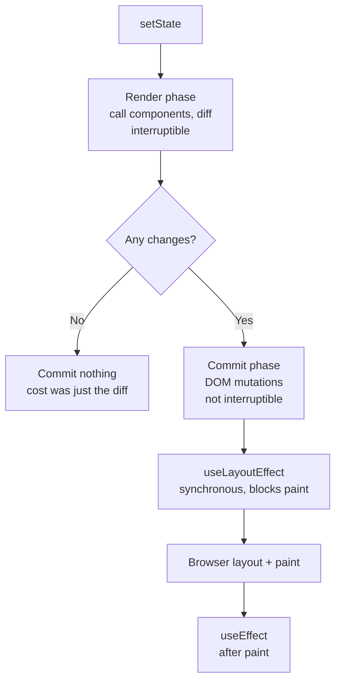

# React at Scale

> Boundaries, render cost, memoisation economics, and the failure patterns of large apps.

- Track: **Frontend Systems** · Level: **core** · ~19 min
- [Open in the academy](https://deepeshk1204.github.io/staff-engineer-academy/#/topic/frontend/react-at-scale)

React at small scale is a library. React at large scale is an architecture problem, and
the problems are not the ones the documentation prepares you for. Nobody's 400-engineer codebase
is slow because someone forgot `useCallback`. It is slow because a context at the root of the
tree holds a value that changes on every keystroke, because a 900 KB bundle must parse before
anything renders, and because a shared component grew nineteen boolean props over four years and
no team can change it.

This topic is about the decisions that determine whether a React codebase stays workable at a
hundred engineers: where the boundaries go, what a render actually costs, when memoisation is
worth its price, and the specific failure patterns large apps converge on.

## Why it exists

React's core promise is that you describe the UI as a function of state and it works out
the DOM operations. That is a genuinely good deal, and the cost is that **you no longer control
when your code runs.** A parent re-renders and your component function executes again, whether or
not anything it depends on changed.

At small scale this is free. Rendering a few dozen components takes under a millisecond and the
mental model stays simple. At large scale two things break. First, the tree gets deep and wide
enough that an unnecessary render at the top costs tens of milliseconds of work at the bottom, on
a device four times slower than yours. Second -- and this is the one that actually slows teams
down -- the *code* scales worse than the runtime. A component imported by 200 files cannot be
changed. A prop added for one use case is now part of a contract nobody documented.

So the work divides into two halves that need separating: making the runtime fast, and making the
codebase changeable. Most performance advice addresses the first and most large-codebase pain
comes from the second.

## Render vs commit, and what reconciliation really does

A React update has two phases and conflating them causes most wrong conclusions about
performance.

The **render phase** calls your component functions to produce element trees, then diffs the new
tree against the previous one. This is pure computation -- no DOM is touched -- and in concurrent
React it is interruptible. The **commit phase** applies the computed mutations to the DOM, runs
layout effects synchronously, and then browser layout and paint follow. This phase cannot be
interrupted.

Reconciliation is the diff, and it follows three rules worth knowing precisely because each one
has a practical consequence. If the element type at a position changes -- `<div>` becomes
`<span>`, or `ListView` becomes `GridView` -- React **unmounts the entire subtree and remounts
it**, destroying all its state. If the type is the same, it keeps the instance and updates props.
And among siblings, `key` identifies which element is which; without stable keys, React matches
by index, so inserting at the front makes every subsequent item appear changed.

Two consequences fall straight out of those rules. Using an array index as a key in a reorderable
list means state attaches to the wrong row -- a checked checkbox follows position, not item.
And conditionally rendering a different wrapper component around the same children resets all of
their state, which is the real cause of the "my input clears when I toggle the layout" bug.

The important correction to the common mental model: **a re-render is not a DOM update.** If your
component returns the same output, reconciliation finds no changes and commits nothing. Rendering
200 components that all produce identical trees costs the function calls and the diff -- often
under a millisecond -- and zero DOM work. That is why "prevent every re-render" is the wrong
goal; the goal is to prevent *expensive* renders.



*Work in useLayoutEffect delays the pixels. Work in useEffect does not. This is why measurement effects are the usual cause of a slow commit.*

## The economics of memoisation

`useMemo`, `useCallback` and `React.memo` are not free, and reasoning about them as
"optimisations" leads people to apply them everywhere and make things slower. Each one has a
cost paid on **every render**: allocating the dependency array, comparing each dependency,
retaining the previous value in memory, and -- for `React.memo` -- a shallow prop comparison at
every render of the parent.

So the arithmetic is simple. A memo is worth it when *the cost it avoids, times how often it
avoids it, exceeds the bookkeeping cost times every render*. Concretely:

`useMemo` on `items.filter(...)` over 20 items is a net loss. The filter takes microseconds; the
dependency comparison and retention cost roughly the same, and you added a line of code and a
dependency array that will eventually be wrong. `useMemo` over a 10,000-row sort, a large date
computation, or anything that builds a Map is clearly worth it.

`useCallback` on a handler passed to a plain `<button>` is pure overhead -- the DOM does not care
about function identity. `useCallback` on a handler passed to a `React.memo` child, or used in
another hook's dependency array, is load-bearing: without it, the memo never hits and you have
paid for the comparison while getting none of the benefit.

`React.memo` on a component whose props include a fresh object or array literal is worse than
useless -- the shallow comparison runs every time and always fails, so you pay the comparison and
still re-render. `React.memo` on a leaf that renders a heavy subtree and receives stable
primitives is genuinely valuable.

The honest summary: the highest-leverage fix is almost never adding a memo. It is **changing the
shape of the tree so the expensive work is not downstream of the frequently-changing state**.
Move state down to the component that uses it; lift expensive static subtrees up so they are not
children of a frequently-rendering parent; pass elements as `children` so they keep their
identity. A memo is what you reach for when restructuring is not possible.

React Compiler changes this calculus by inserting memoisation automatically, which is a genuinely
good reason to stop hand-tuning. It does not change the structural advice, because a compiler
cannot restructure your tree or split your context.

**When memoisation pays, concretely**

| Situation | Worth it? | Why |
| --- | --- | --- |
| `useMemo` over a `.filter()` on 20 items | No | Microseconds of work; the dependency check costs comparable, plus a dependency array to get wrong. |
| `useMemo` over a 10k-row sort or building a lookup `Map` | Yes | Milliseconds avoided per render; the comparison is negligible against it. |
| `useCallback` for a handler on a plain `<button>` | No | The DOM ignores function identity; this is pure bookkeeping. |
| `useCallback` for a handler passed to a `React.memo` child | Yes | Without it the memo can never hit -- you pay the comparison and get nothing. |
| `useCallback` for a function in another hook's dependency array | Yes | Otherwise the dependent effect re-runs every render, which is a correctness issue, not just cost. |
| `React.memo` with an inline object or array prop | No -- actively harmful | Shallow comparison always fails, so you pay it and re-render anyway. |
| `React.memo` on a heavy leaf with stable primitive props | Yes | Skips a real subtree render for a cheap comparison. |
| Moving state down instead of memoising | Usually best | Removes the render from the tree rather than making it cheaper. No bookkeeping cost at all. |

## Context fan-out

Context is the most common self-inflicted performance problem in large React apps,
because its failure mode is invisible until the tree is big.

The mechanism: when a context's value changes, **every consumer re-renders**, regardless of which
part of the value it reads. React compares the context value by reference, and it has no idea
that your component only uses `value.theme` while the thing that changed was `value.cursor`.
`React.memo` on a consumer does not help -- context propagation bypasses the memo comparison
entirely, which surprises people.

Two things make this catastrophic rather than merely wasteful. First, **an object literal as the
provider value** means a new reference on every provider render, so every consumer re-renders
even when nothing actually changed. Second, **putting unrelated concerns in one context**: if
`AppContext` holds the theme, the current user, the modal stack and a live websocket status, then
a websocket heartbeat every two seconds re-renders every component that merely wanted to know the
theme.

The fix is to **split contexts by change frequency, not by domain**. Theme changes once a
session, so it gets its own provider and nobody pays for it. Websocket status changes every few
seconds, so it gets a separate provider consumed only by the two components that display it. A
useful intermediate pattern is splitting one context into a *state* context and a *dispatch*
context, since dispatch functions are stable and the many components that only dispatch then
never re-render on state changes at all. Where the value is genuinely fine-grained, an external
store with selector subscriptions -- Zustand, Jotai, or `useSyncExternalStore` directly -- lets a
component subscribe to one field and re-render only when that field changes.

**Context split by change frequency**

```jsx
// BAD: one context, four unrelated concerns, new object every render.
// A websocket heartbeat re-renders every component that reads the theme.
<AppContext.Provider value={{ theme, user, modals, socketStatus }}>

// GOOD: separate providers, memoised values, split by how often each changes.
const ThemeCtx  = createContext(null);  // changes ~once a session
const UserCtx   = createContext(null);  // changes on login/logout
const SocketCtx = createContext(null);  // changes every few seconds

function Providers({ children }) {
  const theme = useMemo(() => ({ mode, tokens }), [mode, tokens]);
  return (
    <ThemeCtx.Provider value={theme}>
      <UserCtx.Provider value={user}>
        {/* Only the two status indicators consume this one. */}
        <SocketCtx.Provider value={socketStatus}>{children}</SocketCtx.Provider>
      </UserCtx.Provider>
    </ThemeCtx.Provider>
  );
}

// State/dispatch split: dispatch is stable, so dispatch-only
// consumers never re-render when state changes.
const StateCtx    = createContext(null);
const DispatchCtx = createContext(null);

// Fine-grained alternative: subscribe to one field, not the whole object.
const count = useStore(s => s.cart.items.length);   // Zustand selector
```

## Boundaries: from domain and change frequency

Most codebases are organised by technical type -- `components/`, `hooks/`, `utils/`,
`reducers/` -- and that structure actively fights you at scale. A change to checkout touches
four directories, two teams review it because ownership is per-directory, and nothing tells you
which parts of `utils/` are safe to modify.

Organise by **domain** instead: `checkout/`, `catalogue/`, `account/`, each owning its
components, hooks, API calls and types, and each exposing a deliberately small public surface
through an index module. Then the ownership boundary and the code boundary are the same thing,
CODEOWNERS is meaningful, and "can I change this" has an answer.

The second axis is **change frequency**. Code that changes weekly and code that changes yearly
should not live in the same module, because the stable code becomes hostage to the churn around
it. This is also the right way to decide what belongs in a shared design system: a component
belongs there when it is used by three or more domains *and* its API has stopped changing. Moving
a still-evolving component into the shared library means every future change is a coordinated
migration across the whole app.

The most reliable warning sign that a boundary is wrong is a component with a growing set of
boolean props -- `isCompact`, `hideHeader`, `variant`, `showFooterActions`, `legacyLayout`. Each
one was added for one caller, and together they encode nineteen configurations of which four are
tested. That component is doing several different jobs and should be several components, or it
should accept composition (`children`, slots) instead of configuration.

## Rendering long lists, and concurrent features

**Virtualisation** renders only the rows in the viewport plus a small overscan buffer,
so the DOM node count -- and the layout and paint cost -- stops scaling with the dataset. A 5,000
row table is roughly 60,000 DOM nodes if rendered naively, which is hundreds of milliseconds of
layout on a mid-tier device and a memory problem besides. Virtualised, it is 30 rows.

The costs are real and you should raise them unprompted: in-page search (Ctrl+F) cannot find
unrendered rows, accessibility requires correct `aria-rowcount` and `aria-rowindex` since the DOM
no longer reflects the true list, variable-height rows need measurement and a cache which is
where most virtualisation bugs live, and `scrollIntoView` to an arbitrary row needs explicit
support. The threshold: below about 100 rows do not bother, above about 500 you almost certainly
should, and in between it depends on row complexity.

**Concurrent features** in React 18+ change what you can do about blocking renders. `useTransition`
marks an update as non-urgent, so React will keep the interface responsive to urgent input while
rendering it, and will interrupt and restart that render if a more urgent update arrives. The
canonical use is a search input filtering a large list: the keystroke updates the input
immediately at urgent priority while the expensive filtered result renders at transition
priority. `useDeferredValue` is the same idea with less ceremony -- it hands you a lagging copy
of a value and re-renders with the current one when there is time.

Be precise about the limit, because this is a common over-claim: concurrency makes rendering
**interruptible**, not faster or parallel. There is still one thread. If a single component's
render takes 200 ms of synchronous work, a transition does not help -- React cannot interrupt
*inside* your component function. It helps when the total work is spread across many components
that React can yield between. And React 18 made hydration interruptible too, which is why
hydration hurts INP less there than in React 17.

**Figures worth carrying**

- **~1 ms/KB** — JS parse + compile, mid-tier mobile (Before your code runs)
- **4-6x** — Mid-tier Android vs dev laptop (Single-threaded JS)
- **~10-12 ms** — Usable budget in a 60 Hz frame (~5 ms at 120 Hz)
- **~500** — Rows above which virtualisation clearly pays (Below ~100, do not bother)
- **~170 KB** — Sensible gzipped initial JS budget (Route-split beyond that)

## Bundle graph hygiene

Route-level code splitting is the highest-leverage bundle work and the easiest to get
wrong, because the split is only as good as your import graph. A single module that imports a
heavy dependency at the top level pulls it into every chunk that touches that module, and the
usual culprits are a barrel file and an unintentionally shared utility.

**Barrel files** are the most common cause. `export * from './everything'` means importing one
icon can pull the entire icon set into the graph, and whether tree-shaking saves you depends on
side-effect analysis you are not checking. The blunt fix is deep imports plus `"sideEffects": false`
in `package.json` where it is honestly true, and the reliable check is inspecting the bundle
rather than reasoning about it.

The recurring specific offenders are worth memorising because they appear in nearly every audit:
`moment` pulling every locale (around 230 KB; `date-fns` or `Temporal` are the replacements), a
full `lodash` default import instead of named function imports, a charting library loaded on a
route with no charts, an entire icon package for six icons, and multiple copies of the same
library at different versions because two dependencies pinned differently.

The practical discipline is not a one-off audit, it is **a budget enforced in CI**. Put a
gzipped-size limit per entry chunk in the build, fail the pull request that exceeds it, and
require the bundle report as part of review. A regression caught in a pull request costs ten
minutes; the same regression found next quarter costs a week of archaeology.

## Trade-offs

**Trade-offs**

What you gain:
- Domain boundaries make ownership, review and safe deletion tractable at a hundred engineers.
- Context split by change frequency removes whole classes of invisible rerender fan-out.
- Moving state down eliminates renders rather than making them cheaper, with no bookkeeping cost.
- Virtualisation decouples render cost from dataset size.
- Concurrent features keep input responsive during expensive renders without reducing total work.
- A bundle budget in CI turns a recurring audit into a build failure.

What it costs you:
- Every memo has a per-render cost and a dependency array that will eventually be stale or wrong.
- Split contexts and scoped stores mean more places to look when tracing a value.
- Virtualisation breaks Ctrl+F, complicates accessibility, and variable heights are genuinely fiddly.
- Concurrency makes render order less predictable and can show a stale UI during a transition.
- Aggressive route splitting adds network requests and can hurt navigation latency without preloading.
- Domain boundaries require enforcement; without lint rules and CODEOWNERS they erode within a year.

**Failure modes**

| Failure mode | What the user sees | Mitigation |
| --- | --- | --- |
| One root context holding theme, user, modals and socket status | A websocket heartbeat every 2 s re-renders the entire consumer tree; profiles show constant background work with no user action. | Split providers by change frequency, memoise each value, and use selector subscriptions for fine-grained reads. `React.memo` will not save you -- context bypasses it. |
| Array index used as `key` in a reorderable list | State attaches to the wrong row -- a checked box or a focused input follows position, not item -- and data corruption follows if the user acts on it. | Stable domain IDs as keys. Lint rule banning index keys on anything that can reorder or filter. |
| `React.memo` with an inline object or array prop | Comparison runs and always fails, so you pay the cost and re-render anyway; the team believes the component is memoised. | Memoise the prop or pass primitives. Verify with the Profiler that the memo actually prevents renders instead of assuming it does. |
| 5,000-row table rendered in full | ~60,000 DOM nodes, hundreds of milliseconds of layout, unusable scrolling on mid-tier Android, and high memory. | Virtualise with overscan, plus correct `aria-rowcount`/`aria-rowindex`, a measurement cache for variable heights, and a plan for in-page search. |
| Wrapper component swapped conditionally around the same children | React sees a different element type at that position, unmounts the subtree, and all form state and scroll position is lost. | Keep the element type stable and vary styling or layout via props, or hoist the children so they are not re-parented. |
| Barrel file importing a heavy dependency transitively | A 230 KB date library ends up in every route chunk; route splitting delivers almost no benefit. | Deep imports, accurate `sideEffects` declaration, per-chunk size budget failing CI, and a bundle report required in review. |
| Measurement work in `useLayoutEffect` across many instances | Layout thrashing plus a blocked commit; paint is delayed by hundreds of milliseconds on mount. | Hoist measurement to the parent and measure once, or move to `ResizeObserver`. Reserve `useLayoutEffect` for cases where a visual flash is otherwise unavoidable. |
| Shared component accumulating nineteen boolean props | Effectively untestable; every team is blocked on changes to it, and each change risks a caller nobody knew about. | Split into distinct components by job, or convert configuration into composition via `children` and slots. Treat prop-count growth as a boundary smell in review. |

> **Staff-level angle**  
> The differentiator at this level is measuring before optimising, and preferring
> structural changes to memoisation. Also: being willing to say that a popular optimisation is
> making things worse. Sentences that land:
> 
> - "Before adding memos I would open the React Profiler and find what is actually expensive. A
>   re-render that produces identical output commits nothing -- it costs the function call and the
>   diff. The goal is to stop *expensive* renders, not all renders."
> - "That context holds the theme and the websocket status. A heartbeat every two seconds
>   re-renders every consumer, including everything that only wanted the theme. And `React.memo`
>   will not help, because context propagation bypasses the memo comparison. Split the providers by
>   how often each value changes."
> - "I would move the state down rather than memoise up. If only the filter input needs the draft
>   text, put it there and the 300 rows are not downstream of it at all. That removes the render
>   instead of making it cheaper, and there is no dependency array to get wrong later."
> - "`useMemo` on a filter over twenty items costs more than it saves. The comparison and retention
>   are roughly the work of the filter, and we have added a dependency array that will be wrong
>   after the next refactor."
> - "Index keys in a sortable list are a correctness bug, not a performance one. React matches
>   siblings by key, so state follows position -- the checked row changes when you sort."
> - "`useTransition` makes the render interruptible, not faster. There is still one thread, and it
>   cannot interrupt inside a single component's render. If one component does 200 ms of
>   synchronous work, the fix is in that component."
> - "Our route splitting is not working because a barrel file pulls the date library into every
>   chunk. I want a per-chunk gzipped budget failing CI, not a quarterly audit -- a regression
>   caught in the pull request costs ten minutes and the same one found later costs a week."
> - "This component has nineteen boolean props, which means nineteen callers each added one and no
>   team can change it safely now. That is a boundary problem. I would split it by job and replace
>   configuration with composition."
> - "We should profile with a 4x CPU throttle, because p75 of our users are on hardware roughly
>   four to six times slower than this laptop. A 4 ms render here is over the frame budget there."
> 
> The pattern: name the mechanism, cite the measurement you would take, prefer restructuring to
> memoising, and state the cost of your own proposal.

**Check**

A single `AppContext` provides `{ theme, user, socketStatus }`. `socketStatus` updates every 2 seconds. Components reading only `theme` are wrapped in `React.memo` but still re-render. Why?
- A. The `React.memo` comparison is shallow, so it fails on the context object.
- B. Context propagation bypasses `React.memo` entirely -- any consumer re-renders when the context value changes by reference, regardless of which field it reads. **(answer)**
- C. `theme` is being recreated on every render.
- D. React batches context updates, which invalidates memo boundaries.

  `React.memo` compares the props a parent passes down. A context value does not arrive as a prop -- `useContext` subscribes the component directly to the provider, and React notifies every subscriber when the provider value changes by reference. The memo boundary is simply not on that path. React also has no field-level granularity: it compares the whole value by reference and cannot know that you only read `theme`. The fix is structural -- separate providers split by change frequency, so the two-second heartbeat only notifies the components that display connection status -- or a selector-based external store where a component subscribes to one field.

A list renders 40 rows with `key={index}`. The user checks row 3, then sorts the list so that row moves to position 12. What happens?
- A. The checkbox correctly follows the item to position 12.
- B. The checked state stays at position 3, now applied to a different item, because React matches siblings by key and the keys did not move. **(answer)**
- C. React throws a duplicate-key warning and clears all checkboxes.
- D. Nothing visible changes until the next render.

  Keys are React's identity for siblings. With index keys, the element at position 3 has key `3` before and after the sort, so React concludes it is the same element and keeps its component instance and state -- while the props now describe a completely different item. Local state such as a checkbox, an input value or focus stays with the *position* rather than the data. This is a correctness bug with no warning: the user checks one row and a different one is submitted. Any list that can be sorted, filtered, reordered or have items inserted needs a stable domain ID as its key, and a lint rule is the cheapest enforcement.

Typing in a search box that filters a 3,000-item list drops input characters. You wrap the filtered-list update in `useTransition`. Input is now smooth, but the results take noticeably longer to appear. Is this the right trade, and what would *not* be fixed by it?
- A. Wrong trade -- transitions should make both faster.
- B. Right trade for responsiveness, but it would not help if a single component in the list did one large block of synchronous work, since React cannot interrupt inside a component render. **(answer)**
- C. Wrong trade -- `useDeferredValue` would have made both faster.
- D. Right trade, and it also reduces the total rendering work performed.

  A transition reprioritises rather than accelerates: the keystroke renders at urgent priority so the input stays responsive, while the expensive list render is marked non-urgent and can be interrupted and restarted when new input arrives. Total work goes up slightly, and results lag deliberately -- that is the trade, and it is usually the right one because a laggy input feels broken while slightly late results do not. The limit worth stating is that interruption happens *between* units of work React controls. If one component performs a 200 ms synchronous sort inside its render, React cannot yield partway through it, and no concurrent feature helps; you must memoise that computation, move it off the render path, or move it to a worker.

<details><summary>Related topics and how they connect</summary>

Long tasks, the frame budget and forced synchronous layout are **Browser & Rendering
Pipeline**. Hydration cost and the RSC boundary are **CSR, SSR, SSG, ISR & Streaming**. What
belongs in a store versus a query cache versus the URL is **State: What Belongs Where**. Domain
boundaries taken to the organisational extreme become **Microfrontends**, and bundle budgets in
CI are **Performance Engineering**.

</details>

## Flashcards

- **Is a re-render the same as a DOM update?** — No. The render phase calls your components and diffs the result; if the output is unchanged, the commit phase does nothing. Rendering 200 components that produce identical trees costs the function calls and the diff -- often under a millisecond -- and zero DOM work. Target expensive renders, not all renders.
- **What happens when the element type at a position changes?** — React unmounts the entire subtree and remounts it, destroying all state within it. This is why conditionally swapping a wrapper component around the same children clears form inputs, focus and scroll position.
- **Why does `React.memo` fail to stop rerenders from context?** — Because `useContext` subscribes the component directly to the provider rather than receiving a prop, so the memo comparison is not on that path. React also compares the whole context value by reference and has no field-level granularity.
- **When is `useCallback` load-bearing, and when is `React.memo` worse than nothing?** — `useCallback` earns its cost when the function goes to a `React.memo` child (otherwise the memo can never hit) or into another hook's dependency array (otherwise the effect re-runs every render, a correctness issue). `React.memo` is actively harmful with an inline object or array prop: the shallow comparison runs every parent render and always fails, so you pay it and re-render anyway while believing the component is memoised.
- **What does `useTransition` actually change?** — It marks an update non-urgent so React keeps urgent input responsive and can interrupt and restart the expensive render. It makes rendering interruptible, not faster or parallel -- and it cannot interrupt inside a single component's render, so one large synchronous computation is unaffected.
- **What are the real costs of virtualisation?** — In-page search cannot find unrendered rows; accessibility needs correct `aria-rowcount`/`aria-rowindex` since the DOM no longer reflects the list; variable-height rows need a measurement cache, which is where most bugs live; and `scrollIntoView` to an arbitrary row needs explicit support.
- **Why do index keys cause bugs rather than just slowness?** — React matches siblings by key, so with index keys the instance and its local state stay with the *position* while the props describe a different item. A checked checkbox, an input value or focus follows position through a sort -- a silent correctness bug with no warning.
- **What is the test for whether a component belongs in the shared design system?** — Used by three or more domains *and* its API has stopped changing. Promoting a still-evolving component makes every future change a coordinated migration across the whole application.
- **Why do barrel files undermine code splitting?** — `export * from ...` pulls the whole module graph into anything that imports one symbol, so a heavy dependency lands in every chunk and route splitting delivers little. Whether tree-shaking rescues you depends on side-effect analysis you are not checking -- so use deep imports and verify against the actual bundle report.

## Drills

### Drill

A React admin app has grown to 140 engineers and 900 KB of gzipped initial JavaScript. p75 LCP is 4.2 s, p75 INP is 640 ms, and the team reports that any change to the shared `<DataTable>` component -- which has 23 props -- requires sign-off from four teams. You have a quarter. Sequence the work and justify the order.

Probes:

- Which of those two problems -- the metrics or the 23-prop component -- do you attack first, and why?
- How do you find where the 900 KB goes, rather than guessing?
- What is your INP hypothesis before you profile?
- How do you stop it regressing after you leave?
- What would you explicitly choose not to do?

Strong answer contains:

- Measures before acting: bundle analyser output per entry chunk, React Profiler with a 4-6x CPU throttle, and RUM segmented by device class -- and refuses to propose fixes before seeing them.
- Separates the runtime problem from the changeability problem and sequences deliberately, with a reason (usually: quick bundle wins first because they are measurable and cheap, then structural boundaries, since those take a quarter).
- Names the specific bundle offenders to look for -- barrel files, `moment` with all locales, full `lodash` imports, an icon set, duplicated library versions -- and verifies against the report rather than assuming.
- States an INP hypothesis (hydration or mount long tasks, plus context fan-out) and tests it, rather than immediately adding memos.
- Treats the 23-prop `DataTable` as a boundary problem: splits it by job or converts configuration into composition, and migrates callers incrementally with codemods rather than a flag day.
- Reorganises by domain so that ownership and code boundaries coincide, making CODEOWNERS meaningful and the four-team sign-off unnecessary.
- Installs enforcement that survives their departure: per-chunk gzipped budget failing CI, INP and LCP budgets in RUM with alerts, and a lint rule against index keys and root-context growth.
- Names explicit non-goals -- for example, no blanket memoisation pass and no full SSR migration this quarter -- and says why.

Weak answer tells:

- Starts by adding `useMemo` and `React.memo` broadly.
- Proposes an SSR migration as the fix for INP.
- Guesses at bundle contents without running an analyser.
- Plans a rewrite of `DataTable` with a flag day migration for 140 engineers.
- Profiles only on a development laptop.
- Leaves no CI enforcement, so everything regresses in two quarters.

### Drill

A dashboard shows 12 widgets. One widget subscribes to a websocket pushing a price tick roughly every 300 ms. The whole page re-renders on every tick and the browser sits at 40% CPU while idle. Walk me through the diagnosis and the fix, and tell me what you would reject.

Probes:

- What is the most likely mechanism, before you profile?
- How do you confirm it rather than assume it?
- Why would memoising the widgets not fix it?
- What if the ticks genuinely need to reach three of the twelve widgets?
- How do you keep the chart itself from being the bottleneck?

Strong answer contains:

- Hypothesises immediately that the tick is being written into a value high in the tree -- a root context or a store consumed without a selector -- and that every consumer is therefore notified.
- Confirms with the React Profiler, identifying which component triggered the render rather than which ones are slow, and notes that "why did this render" is the question the Profiler answers directly.
- Explains precisely why `React.memo` on the widgets does not help if the value arrives via context, since context propagation bypasses the memo comparison.
- Fixes it structurally: move the subscription into the widget that needs it, or use a separate provider, or subscribe via a selector so only components reading the price re-render.
- Handles the three-consumer case with selector subscriptions or `useSyncExternalStore` so each consumer re-renders only on the field it reads.
- Addresses the render rate separately from the fan-out: at 300 ms a tick React can keep up, but if the rate rises, throttle to the frame budget and coalesce ticks rather than rendering each one.
- Keeps the chart off the React render path where appropriate -- imperative canvas updates or a ref-driven update -- so a high-frequency series does not reconcile a tree per tick.
- Rejects the wrong fixes explicitly: a global debounce that makes all twelve widgets lag, and blanket memoisation that adds cost without addressing the notification path.

Weak answer tells:

- Adds `React.memo` to all twelve widgets and considers it solved.
- Debounces the websocket globally, degrading the one widget that needs real-time data.
- Cannot explain why context bypasses `React.memo`.
- Does not open the Profiler to establish what triggered the render.
- Proposes moving the whole dashboard to a worker.
