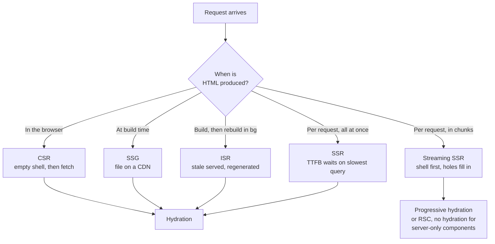

# CSR, SSR, SSG, ISR & Streaming

> Where HTML is produced, what it costs, and how to choose per route rather than per app.

- Track: **Frontend Systems** · Level: **core** · ~20 min
- [Open in the academy](https://deepeshk1204.github.io/staff-engineer-academy/#/topic/frontend/rendering-strategies)

Every page of HTML is produced somewhere. It can be built in the user's browser from
JavaScript, built on a server when the request arrives, built once at deploy time, or built
once and then rebuilt quietly in the background. That choice is what "rendering strategy" means.

The mistake almost everyone makes is treating it as a framework-level decision -- "we are an SSR
app" -- when it is properly a **per-route** decision. A marketing page, a search results page, a
logged-in dashboard and a settings form have completely different freshness, SEO and
personalisation requirements, and there is no single strategy that is correct for all four.

## Why it exists

The web started server-rendered because there was nothing else -- HTML came from a
server, and every interaction was a full page reload. That was slow and it threw away all client
state on every click.

The single-page application solved that by shipping the application to the browser once and then
exchanging only data. Navigation became instant, interactions became rich, and the cost got
deferred: the first visit now had to download and execute a megabyte of JavaScript before showing
anything. Crawlers saw an empty `<div id="root">`, and on a mid-tier Android phone the first
paint arrived four seconds late.

Server rendering came back to fix the first visit, and immediately created a new problem:
**hydration**. The server produces HTML, the browser paints it, and then the same component tree
must be re-executed on the client to attach event handlers and rebuild component state. Until
that finishes, the page looks ready and does nothing -- the "uncanny valley" where a user taps a
button and is ignored. Every strategy invented since -- streaming, islands, partial hydration,
React Server Components -- is an attempt to reduce or eliminate that hydration bill while keeping
the fast first paint.

## The five strategies



*The branch point is when HTML is produced. Everything after it is about how much JavaScript must run before the page responds to input.*

**CSR** ships an empty HTML shell plus JavaScript. The browser boots the framework,
fetches data, and renders. TTFB is excellent because the shell is a static file, but FCP and LCP
wait on the full chain: download JS, parse and execute JS, fetch data, render. That is a
serial waterfall and it is why CSR dashboards feel slow on first load even when the API is fast.

**SSR** renders on the server per request. The user receives real HTML, so FCP and LCP can be
fast, but TTFB now includes your server's data fetching -- and with a non-streaming renderer, the
whole document waits on the *slowest* query. You also pay compute per request, so traffic spikes
become a capacity problem instead of a CDN problem.

**SSG** renders at build time to static files served from a CDN. It is the fastest and cheapest
possible thing, with the obvious limits: content can only be as fresh as your last build, and
build time grows with page count. A 50,000-page site at 40 ms per page is a 33-minute build, and
that is the number that kills SSG for large catalogues.

**ISR** (incremental static regeneration, or the equivalent in other frameworks) keeps SSG's
delivery model and adds background rebuilds. A request after the revalidation window is served
the *stale* page immediately while a regeneration runs, so the next visitor gets the fresh one.
It is `stale-while-revalidate` applied to page generation, and it is the right default for
large, mostly-static, occasionally-updated content.

**Streaming SSR** sends the HTML in chunks as it becomes available. The shell -- header, nav,
layout, skeletons -- flushes immediately, so TTFB stops depending on your data layer, and each
slow section fills in as its query resolves. Combined with **React Server Components**, some
components never ship JavaScript at all, which attacks the hydration bill directly rather than
just rescheduling it.

## The hydration bill, with real numbers

Hydration cost is dominated by two things: how much JavaScript you execute, and how
fast the CPU is. Neither is about your network.

A useful rule of thumb from the Chrome team's guidance is roughly **1 ms of parse and compile per
KB of JavaScript on a mid-tier mobile device**, and then execution on top. So a 500 KB (minified,
pre-gzip) bundle is around 500 ms of parse/compile before a single component renders. Add React's
own reconciliation over a few thousand server-rendered nodes and you are comfortably into a
700-1,200 ms task -- which is a single, unbreakable long task, because hydration in React 17 and
earlier cannot yield.

The number that should reframe this for you: a mid-tier Android device is roughly **4-6x slower**
than a developer laptop on single-threaded JavaScript. Your 180 ms hydration is their 900 ms. And
p75 of the global Android market is not a flagship.

The uncomfortable implication for SSR: if hydration takes 900 ms, then SSR improved your LCP and
**made your INP worse** than CSR would have, because CSR at least shows a skeleton that honestly
looks unready. SSR paints something that looks interactive and is not. TTI and Total Blocking
Time capture this; LCP alone does not, which is why an SSR migration can show green Core Web
Vitals on LCP and a wave of "the button does nothing" complaints.

**Hydration arithmetic on a mid-tier Android**

- **~1 ms/KB** — JS parse + compile (Before any of your code runs)
- **4-6x** — Mid-tier Android vs laptop (Single-threaded JS)
- **~700-1200 ms** — Hydrating a 500 KB app, few thousand nodes (One unyieldable long task pre-React-18)
- **0 KB** — JS shipped by a server-only RSC (The only strategy that removes rather than defers)
- **~14 KB** — First TCP flight (What the streamed shell should fit in)

> **Partial hydration is not the same as lazy hydration**  
> **Lazy** or progressive hydration defers the work -- the component hydrates when it
> scrolls into view or when the browser is idle. Total JavaScript shipped is unchanged; you have
> rescheduled the bill, which genuinely helps INP at load but still costs the user the bytes and
> eventually the CPU.
> 
> **Partial hydration** (islands, as in Astro or Qwik, or RSC's server components) means some
> components *never hydrate* because their JavaScript is never sent. A static article body, a
> rendered markdown block, a product description -- these have no interactivity, so the only correct
> amount of client JavaScript for them is zero. This is the structurally different move, and it is
> worth being precise about the distinction in an interview because the two get used
> interchangeably.

## Streaming: what it actually looks like on the wire

Non-streaming SSR calls `renderToString`, waits for every data dependency, and sends
one complete document. If your slowest query is 600 ms, every user waits 600 ms for the first
byte, and during that time the browser has nothing to do -- it cannot even start fetching your
CSS or fonts.

Streaming SSR flushes the shell first. The `<head>` and layout go out in the first few
kilobytes, so the browser starts fetching stylesheets and fonts immediately while your server is
still waiting on the database. Then each `Suspense` boundary that resolves is sent as a chunk,
with a small inline script that swaps it into place. TTFB drops to roughly your server's
time-to-first-flush -- tens of milliseconds -- independent of your data layer.

The contract this creates is the part people underestimate. **Every streamed hole needs a
fallback and an error boundary**, because once you have flushed a `200 OK` and the shell, you
cannot retract it. A query that fails after the flush cannot become a 500 page. It has to render
an error state *inside* the hole. That is a better user experience -- the rest of the page still
works -- but it means your error handling has to be designed per boundary rather than per route,
and "the page returned 200 but the main content is an error message" is now a state your
monitoring must recognise.

Two more caveats worth stating unprompted. **Status codes and headers are locked after the first
flush**, so anything that could produce a redirect, a 404 or a `Set-Cookie` must be resolved
*before* the shell goes out. And **SEO**: Googlebot does render JavaScript and generally handles
streamed content, but other crawlers and social-preview scrapers -- Slack, Twitter, LinkedIn,
many regional search engines -- frequently take only the initial HTML. So anything that must be
in a crawler's view (title, meta description, Open Graph tags, canonical URL, primary copy, and
JSON-LD) belongs in the shell, not behind a `Suspense` boundary.

**Streaming boundaries, and what each one commits you to**

```jsx
// Anything that can change the status code or headers must resolve
// BEFORE the shell flushes. Auth check, redirects, 404s.
const user = await requireUser();        // may redirect -- pre-flush
if (!product) notFound();                // may 404 -- pre-flush

return (
  <Layout>
    {/* In the shell: paints instantly, and crawlers/scrapers see it. */}
    <ProductHeader product={product} />
    <SeoTags title={product.title} og={product.og} />

    {/* Slow and non-critical: streamed. Needs BOTH a fallback
        (what the user sees while waiting) and an error boundary
        (because after the flush this can no longer become a 500). */}
    <ErrorBoundary fallback={<ReviewsUnavailable />}>
      <Suspense fallback={<ReviewsSkeleton count={3} />}>
        <Reviews productId={product.id} />   {/* ~600 ms */}
      </Suspense>
    </ErrorBoundary>

    <ErrorBoundary fallback={null}>
      <Suspense fallback={<RecsSkeleton />}>
        <Recommendations userId={user.id} /> {/* ~900 ms, ML service */}
      </Suspense>
    </ErrorBoundary>
  </Layout>
);

// Each skeleton must reserve the final height, or every resolved
// boundary becomes a layout shift and CLS goes red.
```

## Choosing per route

**Decision table by route type**

| Route | Freshness need | Needs SEO? | Personalised? | Strategy | Why |
| --- | --- | --- | --- | --- | --- |
| Marketing / landing page | Per deploy | Critically | No | **SSG** | A file on a CDN. Nothing is faster or cheaper, and content changes with deploys anyway. |
| Docs, blog, changelog | Minutes | Critically | No | **SSG or ISR** | ISR once page count makes full builds too slow. |
| Product detail page (large catalogue) | Minutes | Critically | Slightly (price, stock) | **ISR + client-side price/stock** | The body is static and cacheable; the volatile bits are fetched so one policy does not have to serve both. |
| Search / filtered listing | Per request | Sometimes | Via query params | **Streaming SSR** | Result set is unique per query, so nothing is cacheable, but the shell and facets can flush immediately. |
| Logged-in dashboard | Per request | No | Entirely | **CSR shell + streaming SSR if LCP matters** | No SEO value, no shareable cache. Often the correct answer is genuinely CSR. |
| Settings / forms | Per request | No | Entirely | **CSR** | Interaction-heavy, zero crawler value; SSR buys a faster paint of a form the user must still wait to hydrate. |
| Checkout | Per request | No | Entirely | **SSR or CSR, never cached** | Correctness dominates; the whole route must be `private, no-store`. |
| Admin tooling | Per request | No | Entirely | **CSR** | Small internal audience on good hardware. Paying SSR complexity here is waste. |

Read the personalisation column again, because it is where the real design work is. The
routes that are awkward are the ones that are *mostly* shareable with a small personal
component -- a product page with a "your price" badge, or an article with a "continue reading"
banner. The instinct is to make the whole page per-request, which throws away cacheability for
2% of the pixels. The better move is almost always to **split the response**: cache the shareable
majority aggressively, and fetch or edge-inject the personalised fragment separately so the two
halves can have different cache policies.

## What SSR costs you as an operator

SSG is a file on a CDN, which means capacity planning is someone else's problem and a
traffic spike costs you bandwidth. SSR is compute in the request path, and that changes your
operational posture in ways frontend teams routinely under-plan.

React's `renderToString` is **synchronous and blocking** on the Node event loop, so a single
render occupies the process -- there is no concurrency within a request. Throughput is therefore
roughly `instances × cores / render_time`. At 60 ms per render, one core sustains about 16
renders per second, so 5,000 rps needs on the order of 300 cores before you account for headroom,
garbage collection pauses, or the fact that your p99 render is far worse than your mean.

You also inherit a whole class of problems that CSR does not have: memory leaks in the render
path now take down a server rather than one tab, every upstream API becomes a availability
dependency of your HTML, and a slow third-party call in a server component blocks a page instead
of one widget. The standard mitigations are the boring ones -- aggressive per-dependency timeouts
with a rendered fallback, a circuit breaker per upstream, edge caching of anything shareable,
and `stale-if-error` so an origin failure degrades to slightly-old HTML rather than a 500.

**Metric implications, honestly**

| Strategy | TTFB | FCP / LCP | INP after load | Server cost | Cacheable at edge? |
| --- | --- | --- | --- | --- | --- |
| CSR | Best -- static shell | Worst -- JS then data then render | Good once warm | Near zero | Yes, fully |
| SSG | Best | Best | Hydration-bound | Near zero at serve time | Yes, fully |
| ISR | Best (stale served instantly) | Best | Hydration-bound | Low, amortised over the window | Yes |
| SSR (non-streaming) | Worst -- waits on slowest query | Good | Hydration-bound, often worse than CSR | High, per request | Only if not personalised |
| Streaming SSR | Good -- shell flush only | Good | Hydration-bound | High, but concurrent | Partially, shell only |
| Streaming + RSC | Good | Good | **Best** -- less JS exists to run | High | Partially |

## Trade-offs

**Trade-offs**

What you gain:
- SSG and ISR make delivery a CDN problem, so traffic spikes cost bandwidth rather than capacity.
- Server rendering gives crawlers and social scrapers real HTML with no JavaScript execution.
- Streaming decouples TTFB from your slowest data dependency.
- Per-boundary error handling means one failed query degrades a section, not the page.
- RSC and islands remove client JavaScript rather than merely deferring it.

What it costs you:
- Hydration is a single long task that makes a page look ready before it is -- often a worse INP than CSR.
- SSR puts compute in the request path, so every upstream API becomes an availability dependency of your HTML.
- Streaming locks the status code and headers at the first flush, so auth, redirects and 404s must resolve earlier.
- Code now runs in two environments, so `window` guards, dual dependency trees and hydration mismatches become routine.
- Non-Google crawlers and preview scrapers often see only the shell, so streamed SEO content is a real risk.
- Per-route strategy means more configurations to reason about and test than one global choice.

**Failure modes**

| Failure mode | What the user sees | Mitigation |
| --- | --- | --- |
| Hydration mismatch from non-deterministic render | React discards the server HTML and re-renders client-side; you paid for SSR and shipped a CSR experience, often with a visible flash. | No `Date.now()`, `Math.random()`, locale or timezone formatting, or `window` checks during render. Render such values in an effect after mount, and fail CI on hydration warnings. |
| SSR migration ships green LCP and a wave of unresponsive-button reports | Page paints in 1.2 s and accepts input at 2.4 s; INP breaches 500 ms at p75 on Android. | Track TBT and INP alongside LCP, budget hydration explicitly, and move non-interactive subtrees to server components or islands. |
| One slow upstream inside a non-streaming SSR render | TTFB tracks the slowest dependency; a 3 s recommendations API makes every page 3 s. | Per-dependency timeouts with a rendered fallback, a circuit breaker per upstream, and move the slow section behind a `Suspense` boundary so it streams. |
| Personalised SSR HTML cached at the edge | One user's name, email or balance served to everyone hitting that PoP for the TTL -- a reportable data incident. | Default `private, no-store` on authenticated routes; split shareable shell from personalised fragment; automated CI check that no `Set-Cookie` response is `public`. |
| SEO content behind a `Suspense` boundary | Title, meta description and primary copy missing from the initial HTML; social previews blank and non-Google crawlers index nothing. | Keep metadata, canonical URL, Open Graph tags and primary copy in the shell. Verify with a raw `curl` of the first flush, not with a rendered browser view. |
| Streamed boundaries with zero-height skeletons | Every resolved chunk pushes content down; CLS goes red even though each individual shift is small. | Skeletons must reserve the final dimensions. Use `aspect-ratio` and explicit `width`/`height` on media, and monitor CLS attributed to the specific boundary. |
| Redirect or 404 decided after the first flush | A `200 OK` was already sent, so the framework cannot redirect; users land on a broken page and crawlers index a soft 404. | Resolve auth, existence and redirect logic before the shell renders. Treat "what can change the status code" as an explicit pre-flush checklist. |
| SSG build time growing past the deploy window | A 50,000-page build takes 33 minutes at 40 ms/page; hotfixes become hour-long events. | Move to ISR with on-demand revalidation, pre-build only the high-traffic long tail, and generate the rest on first request. |

> **Staff-level angle**  
> The differentiator is refusing to answer "which rendering strategy?" as a single
> question, and being honest that SSR has costs rather than treating it as strictly better.
> Sentences that land:
> 
> - "There is no app-level answer. Marketing is SSG, the product catalogue is ISR because the
>   build would take half an hour, search is streaming SSR because nothing is cacheable, and the
>   dashboard is CSR because there is no crawler and no shareable cache. Four routes, four
>   strategies."
> - "SSR would improve our LCP and probably make our INP worse. Right now a skeleton tells the
>   user honestly that the page is not ready; with SSR we paint something that looks interactive
>   and ignores taps for 900 ms. I want TBT and INP in the success criteria before we start, not
>   just LCP."
> - "Our bundle is 480 KB, so on the mid-tier Android that is p75 of our traffic we are looking at
>   roughly half a second of parse and compile before React does anything, and hydration on top. I
>   would rather delete JavaScript with server components than reschedule it with lazy hydration."
> - "Streaming means the status code is committed at the first flush. So auth, the 404 check and
>   any `Set-Cookie` have to resolve before the shell goes out, and everything after that needs an
>   error boundary because a failed query can no longer become a 500."
> - "Keep the meta tags and the primary copy in the shell. Googlebot renders JavaScript, but Slack
>   and LinkedIn scrapers take the first HTML they get, and I am not willing to test that in
>   production."
> - "`renderToString` blocks the event loop, so throughput is cores divided by render time. At 60 ms
>   a core does about sixteen renders a second, which means our 5,000 rps needs roughly 300 cores.
>   That is a real infrastructure line item and it belongs in this decision."
> - "The product page is 98% shareable and 2% personalised. I would cache the shareable part at the
>   edge with `s-maxage` and fetch the price and stock badge client-side, rather than making the
>   whole page per-request for one component."
> 
> The pattern: per-route reasoning, an explicit admission of what the strategy costs, and a metric
> that would catch it going wrong.

**Check**

You migrate a CSR dashboard to non-streaming SSR. LCP improves from 3.1 s to 1.4 s, but support tickets about unresponsive buttons triple. What happened?
- A. SSR broke event delegation, so handlers never attached.
- B. The page now paints complete-looking content before hydration attaches handlers, so there is a long window where it looks interactive and is not. **(answer)**
- C. LCP and INP measure the same thing, so one of the numbers is wrong.
- D. Server-rendered HTML disables React event handling until the CSS loads.

  This is the hydration uncanny valley. CSR showed a skeleton -- ugly, but an honest signal that the page was not ready, so users waited. SSR paints the finished UI at 1.4 s while the 500 KB bundle still needs downloading, parsing and hydrating, which on a mid-tier Android is easily another second of unbreakable main-thread work. Taps in that window are queued, not dropped, so the user taps twice and both fire later. LCP improved and TBT/INP regressed; measuring only LCP hid the trade. The fixes are to reduce the JavaScript that must run (server components, islands) rather than to reschedule it.

A product page streams its reviews section behind `Suspense`. The reviews service starts failing. What does the user get, and what does your monitoring see?
- A. A 500 error page, because the render threw.
- B. A 200 response with a working page and an error state inside the reviews section -- so error-rate dashboards based on status codes see nothing wrong. **(answer)**
- C. The request hangs until the stream times out.
- D. React automatically retries the boundary until it succeeds.

  Once the shell has flushed with a `200`, the status code is committed and cannot be retracted, so a post-flush failure has to be rendered inside its boundary. That is the desired user experience -- the rest of the page is fine -- but it creates a monitoring gap: HTTP status is now a poor proxy for correctness, and "the page returned 200 with its main content replaced by an error" is a state you must instrument deliberately, via per-boundary error events in RUM. It also means every streamed hole needs an explicit error boundary; without one the failure propagates to the nearest ancestor and can blank a much larger region than intended.

A 50,000-SKU catalogue currently uses SSG. Prices change several times a day and the build takes 34 minutes. What is the most appropriate change?
- A. Switch the whole site to SSR so prices are always current.
- B. Keep static generation but move to ISR with on-demand revalidation, and fetch the volatile price and stock client-side or at the edge. **(answer)**
- C. Reduce the build time by parallelising it across more CI runners.
- D. Cache the built pages at the edge with a 60-second TTL.

  Two separate problems are bundled here. The build duration is solved by generating on demand and revalidating incrementally, so a price change triggers a single page regeneration rather than a full build. The freshness problem is solved by *splitting the response*: the description, images and specifications are stable and belong in the cacheable page, while price and stock are volatile and belong in a small client fetch or an edge-injected fragment. Moving everything to SSR throws away CDN delivery for 2% of the pixels and turns a bandwidth cost into a compute cost. Parallelising the build treats the symptom and still leaves you unable to publish a price change in under half an hour.

<details><summary>Related topics and how they connect</summary>

Hydration is the largest long task in most apps, which is **Browser & Rendering
Pipeline** and **React at Scale**. Which parts of the response may be shared is the cache-key
question from **CDN & Edge Delivery** and **The Caching Stack**. The data-fetching layer that
streaming boundaries depend on is **API Contracts & the BFF** and **State: What Belongs Where**.
Budgeting TBT and INP for a strategy change is **Performance Engineering**.

</details>

## Flashcards

- **Why can SSR make INP worse than CSR?** — SSR paints a complete-looking page before the bundle has hydrated, so for hundreds of milliseconds it looks interactive and queues input instead of responding. CSR shows a skeleton that honestly signals "not ready". LCP improves while TBT and INP regress, which is invisible if you only track LCP.
- **Roughly what does JavaScript cost to parse and compile on a mid-tier phone?** — About 1 ms per KB before any of your code executes, plus execution and reconciliation on top. A 500 KB bundle is therefore ~500 ms of parse/compile alone, and a mid-tier Android is 4-6x slower than a developer laptop on single-threaded JS.
- **Lazy hydration vs partial hydration -- what is the difference?** — Lazy (progressive) hydration defers when the work happens; the same JavaScript is still shipped and eventually executed. Partial hydration (islands, RSC server components) means some components never ship JavaScript at all. Only the second one reduces the total bill.
- **What does streaming SSR decouple TTFB from?** — Your slowest data dependency. The shell flushes in tens of milliseconds so the browser can start fetching CSS and fonts, and each `Suspense` boundary streams in as its query resolves, rather than the whole document waiting on the slowest query.
- **What is locked once the first chunk of a streamed response flushes?** — The status code and all response headers. Auth checks, 404 decisions, redirects and `Set-Cookie` must be resolved before the shell goes out; anything failing after the flush must render an error inside its boundary instead of returning a 500.
- **Why is streamed content an SEO risk despite Googlebot rendering JavaScript?** — Googlebot generally handles it, but social-preview scrapers (Slack, LinkedIn, Twitter) and many non-Google crawlers take only the initial HTML. Title, meta description, Open Graph tags, canonical URL, JSON-LD and primary copy must therefore live in the shell.
- **How do you estimate SSR capacity?** — `renderToString` blocks the Node event loop, so throughput is roughly cores divided by render time. At 60 ms per render a core sustains ~16 renders/second, meaning 5,000 rps needs on the order of 300 cores before headroom, GC pauses and p99 render time.
- **What causes a hydration mismatch and what does it cost?** — Any non-deterministic render -- `Date.now()`, `Math.random()`, locale or timezone formatting, `typeof window` branches. React discards the server HTML and re-renders on the client, so you paid the SSR compute and delivered a CSR experience, often with a visible flash.
- **What is the right strategy for a page that is 98% shareable and 2% personalised?** — Split the response. Cache the shareable majority aggressively (SSG/ISR with `s-maxage`), and fetch or edge-inject the personalised fragment separately, so one cache policy does not have to serve both. Making the whole page per-request sacrifices cacheability for 2% of the pixels.

## Drills

### Drill

You own an e-commerce site: marketing pages, 120,000 product pages, a search page, a logged-in account area, and checkout. Prices update several times daily, stock updates every few minutes, and organic search is the primary acquisition channel. Design the rendering strategy and justify each choice.

Probes:

- Which routes genuinely need SEO, and which do not?
- What do you do about the product page being mostly static with two volatile fields?
- Why not just SSR everything for freshness?
- What breaks first as traffic grows 10x?
- How would you verify the crawler actually sees what you think it sees?

Strong answer contains:

- Gives a per-route answer rather than one global strategy, and names the deciding factor for each (crawler value, personalisation, cacheability, freshness).
- Rejects SSG for 120,000 pages on build-time arithmetic, and moves to ISR with on-demand revalidation triggered by the catalogue write path.
- Splits the product page: stable body cached at the edge, price and stock fetched client-side or edge-injected, so one policy does not serve both.
- Chooses streaming SSR for search because the result set is unique per query and therefore uncacheable, while the shell and facets can flush immediately.
- Chooses CSR for account and states plainly that there is no crawler and no shareable cache, so SSR complexity buys nothing there.
- Marks checkout `private, no-store` and treats correctness over latency.
- Estimates SSR capacity for the search route in cores and flags it as a cost line item.
- Verifies SEO with a raw `curl` of the first flush and a social-scraper check, not a rendered browser view.

Weak answer tells:

- Answers with one strategy for the whole application.
- Chooses SSG for 120,000 pages without considering build duration.
- Makes the product page fully SSR to get fresh prices, discarding CDN cacheability for two fields.
- Puts SEO-critical content behind a `Suspense` boundary.
- SSRs the logged-in dashboard for "performance" with no crawler or caching justification.
- Never mentions hydration cost or INP.

### Drill

A team proposes migrating a large CSR React app (620 KB of JS, p75 LCP 3.4 s, p75 INP 180 ms) to streaming SSR with React Server Components, estimating one quarter of work. You are the reviewing Staff engineer. What do you require before approving, and what would make you say no?

Probes:

- What metrics must be in the success criteria, and which single metric would be misleading alone?
- What new operational burden does this create?
- What is the smallest version of this that proves the hypothesis?
- What would make you recommend a cheaper alternative instead?

Strong answer contains:

- Insists on TBT and INP at p75 segmented by device class alongside LCP, and explains that LCP alone can improve while responsiveness regresses.
- Requires an explicit hydration budget derived from bundle size and mid-tier CPU multiplier, not a hope that SSR helps.
- Names the new operational surface: SSR compute capacity, every upstream API becoming an availability dependency of HTML, per-dependency timeouts and circuit breakers, `stale-if-error` at the edge, and dual-environment code hazards.
- Requires the pre-flush checklist -- auth, 404, redirects, `Set-Cookie` -- and an error boundary per streamed hole, plus RUM events for boundary-level failures since status codes stop being a correctness proxy.
- Proposes a scoped pilot on one or two high-traffic routes with a holdback, rather than a whole-app migration, so the hypothesis is testable in weeks.
- Offers the cheaper alternative honestly: route-level code splitting and deleting dependencies may recover much of the LCP gap at a fraction of the cost, and should be tried first or in parallel.
- Notes that 180 ms INP is already in the good band, so the migration risks trading a healthy metric for an unhealthy one.

Weak answer tells:

- Approves on the basis that SSR is faster than CSR.
- Accepts LCP as the sole success metric.
- Does not raise SSR capacity or upstream availability coupling.
- Approves a whole-app migration with no pilot, holdback or rollback plan.
- Fails to notice the existing INP is already good and could regress.
