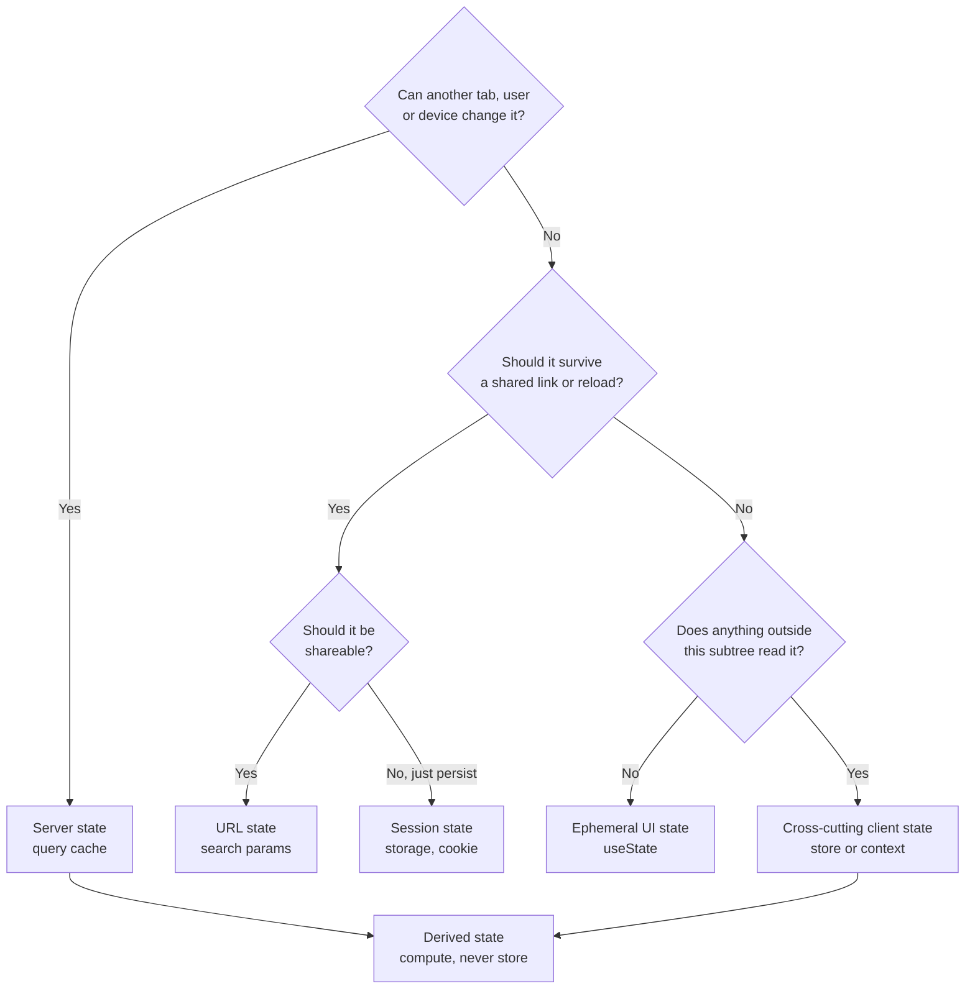

# State: What Belongs Where

> Server, URL, session, ephemeral and cross-cutting state -- and the cost of confusing them.

- Track: **Frontend Systems** · Level: **core** · ~17 min
- [Open in the academy](https://deepeshk1204.github.io/staff-engineer-academy/#/topic/frontend/state-management)

Most arguments about state management are arguments about the wrong thing. The question
is not Redux versus Zustand versus Context. The question is: for each piece of data in your
application, **where does it live, who is allowed to change it, and what happens when it is
wrong?**

Answer that per category and the library choice becomes almost incidental. Skip it and no library
saves you -- you end up with server data copied into a global store, hand-written loading flags,
and a bug where two components show different values for the same order because they fetched it
at different times.

## Why it exists

Early client apps had one kind of state and it was simple: some variables in a closure.
Then applications got big enough that a value set in one corner of the tree needed to be read in
another, and prop-drilling through nine components became untenable. Flux and Redux answered that
with a single global store and a strict update discipline, which was the right answer to the
question being asked in 2015.

What happened next is the interesting part. Teams discovered that the majority of what they had
put in that global store was not application state at all -- it was a **local copy of server
data**. And a local copy of remote data is a cache, which means it has all of a cache's problems:
it goes stale, it needs invalidation, it can be inconsistent with other copies, and it needs a
loading and error lifecycle. Redux gave you none of that; you hand-wrote it, per endpoint,
forever.

That realisation is what produced React Query, SWR, RTK Query and Apollo's normalised store. They
are not alternative global stores. They are **caches with an invalidation model**, and adopting
one typically empties 70-80% of a legacy Redux store, because most of what was in there was never
client state to begin with.

## The six categories



*Two questions resolve most of it. "Can something else change this?" separates server state from client state; "should a shared link reproduce it?" separates URL state from everything else.*

The first question is the load-bearing one, and it is worth stating as a test you can
apply in a code review: **can another tab, another user, or another device change this value?**

If yes, you do not own it. You own a *copy*, and every copy is stale the moment it is made. That
means you need a staleness policy, a refetch trigger, and a way to reconcile a mutation -- which
is exactly what a server-state library provides and exactly what you would otherwise hand-write
badly. The tell that a team has got this wrong is a Redux store containing `orders`,
`ordersLoading`, `ordersError` and a `REFRESH_ORDERS` action.

If no, it is client state, and then the second question applies: would a user reasonably expect
to send someone a link that reproduces this view? Filters, tabs, search terms, sort order, page
number, and an open detail panel all fail the "keep it in `useState`" test on those grounds. They
belong in the URL.

**The taxonomy, with the actual decision**

| Category | Examples | Lives in | Invalidated by | The failure if you misplace it |
| --- | --- | --- | --- | --- |
| **Server state** | Orders, user profile, product catalogue, permissions | Query cache (React Query, SWR, RTK Query, Apollo) | Mutation, TTL, refocus, reconnect | Hand-written loading flags everywhere; two components showing different values for the same entity. |
| **URL state** | Filters, search text, sort, page, active tab, selected row | `searchParams`, route params | Navigation | Shared links do not reproduce the view; back button does the wrong thing; refresh loses the user's work. |
| **Session state** | Auth token, feature-flag overrides, dismissed banners, theme, draft form content | `HttpOnly` cookie (tokens), `localStorage`/`sessionStorage` (preferences), IndexedDB (drafts) | Explicit action, expiry | Token in `localStorage` is XSS-readable; a dismissed banner returns on every reload. |
| **Ephemeral UI state** | Hover, focus, an open dropdown, an uncommitted input value | `useState` in the component | Unmount | Global store churn causing app-wide rerenders for a tooltip. |
| **Cross-cutting client state** | Toasts, modal stack, a multi-step wizard, a canvas selection, websocket connection status | Small scoped store (Zustand/Jotai) or a narrow context | Explicit action | Prop-drilling through ten layers, or a single god-store that rerenders everything. |
| **Derived state** | Filtered list, total price, validity, "is anything selected" | Nowhere -- computed at render | n/a | The worst category to store: two sources of truth that silently disagree. |

> **Derived state is the bug factory**  
> Storing `filteredItems` next to `items` and `filter` means you now have two facts that
> can disagree, and there is no mechanism that guarantees they agree. Every code path that touches
> `items` or `filter` must remember to recompute, and the one that forgets produces a UI showing
> stale results with no error.
> 
> Compute it. `const visible = items.filter(matches(filter))` runs in microseconds for realistic
> list sizes, and if profiling shows otherwise, `useMemo` caches the computation *without*
> creating a second source of truth. The same applies to totals, counts, validity and any "is X
> selected" boolean. If you can calculate it, do not store it.

## Server-state libraries are caches, so treat them like caches

Once you accept that React Query is a cache, its API stops being a list of options and
becomes a cache policy, which is a much easier thing to reason about.

`staleTime` is how long a cached value is considered fresh. While fresh, a new component
mounting with the same key gets the cached value with **no network request at all**. The default
is zero, which means every mount refetches -- correct for a chat message list, wasteful for a
country dropdown that changes once a year. `gcTime` (formerly `cacheTime`) is separate: it is how
long an *unused* value is retained before eviction, which is what makes a back navigation
instant. Conflating the two is the single most common misconfiguration.

The refetch triggers are the freshness mechanism: on mount, on window refocus, on network
reconnect, and on an interval. Refocus refetching is the one that feels magical and occasionally
harmful -- it is exactly right for a dashboard the user left open for an hour, and wrong for a
half-completed form, because it can replace data underneath an in-progress edit.

**Invalidation on mutation** is where correctness lives. After a successful mutation you tell the
cache which keys are now wrong. Getting the key granularity right is the skill: invalidating
`['orders']` after editing one order refetches every order list, while invalidating only
`['orders', id]` leaves the list showing the old title. Prefix-based invalidation with a
deliberate key hierarchy -- `['orders']`, `['orders', 'list', filters]`, `['orders', 'detail', id]` --
lets you invalidate at the right level rather than choosing between too much and too little.

**Optimistic update with a correct rollback**

```js
const qc = useQueryClient();

useMutation({
  mutationFn: ({ id, title }) => api.patch('/orders/' + id, { title }),

  onMutate: async ({ id, title }) => {
    // Stop in-flight refetches from clobbering our optimistic write.
    await qc.cancelQueries({ queryKey: ['orders', 'detail', id] });

    // Snapshot for rollback. This is the part people omit, and it is
    // the reason a failed mutation leaves the UI permanently wrong.
    const previous = qc.getQueryData(['orders', 'detail', id]);

    qc.setQueryData(['orders', 'detail', id], o => ({ ...o, title }));
    return { previous, id };
  },

  onError: (_err, _vars, ctx) => {
    // Restore exactly what was there. Do not "undo" by re-deriving.
    qc.setQueryData(['orders', 'detail', ctx.id], ctx.previous);
    toast.error('Could not rename the order. Your change was undone.');
  },

  onSettled: (_d, _e, { id }) => {
    // Reconcile with the server either way. The optimistic value was
    // a guess; the server may have normalised or rejected part of it.
    qc.invalidateQueries({ queryKey: ['orders', 'detail', id] });
    qc.invalidateQueries({ queryKey: ['orders', 'list'] });
  }
});

// Key hierarchy makes granular invalidation possible:
//   ['orders']                      -> everything orders
//   ['orders', 'list', { status }]  -> one filtered list
//   ['orders', 'detail', id]        -> one entity
```

Three things about optimistic updates that separate a real implementation from a demo.

First, **you must snapshot before writing**, because rollback has to restore the exact previous
value. Reconstructing the old state by inverting your change is wrong the moment two mutations
overlap.

Second, **the optimistic value is a guess and the server is the authority**. It may normalise
whitespace, apply a length limit, or attach a computed field. So you reconcile on settle
regardless of success, rather than trusting your local write.

Third, **be honest with the user when you roll back**. A silent revert is worse than a slow
mutation: the user saw their change succeed and then saw it disappear with no explanation, so
they cannot tell whether it applied. The toast is part of the feature, not polish.

Optimistic updates are the right call when the mutation almost always succeeds and the user's
next action depends on it -- a like button, a checkbox, reordering a list. They are the wrong call
when failure is plausible or consequential: a payment, a destructive delete, or anything where
the user would make a different decision if they knew it failed.

## URL as state

The URL is a state container with properties no store can match. It survives a refresh,
it is shareable, the browser gives you undo and redo for free via back and forward, it is
bookmarkable, and it is the only state container that search engines and analytics can see.

The practical test is one question: **if a user copies this URL and sends it to a colleague,
should the colleague see the same thing?** For a filtered report, a search result, an active tab,
or an open detail panel, the answer is obviously yes -- and if that state is in `useState`, you
have shipped a product bug, not a technical one. The most common real-world version is a user who
filters a table, clicks into a row, hits back, and finds their filters gone.

The costs are real and worth naming. URLs get long, so you keep parameter names short and omit
defaults rather than serialising every value. Every parameter change is a history entry unless
you use `replaceState`, which matters for a text input where you do not want thirty back-button
presses per search. And URL parameters are user-editable input, so they need validation and
sensible fallbacks -- `?page=-1` or `?sort=DROP TABLE` will arrive eventually, and a crash on a
malformed URL is a bad look in a shared link.

## Why global stores rot, and normalisation

A global store degrades for a reason that is structural rather than cultural. It is the
path of least resistance: any component can read any value and any component can write it, so
the cost of adding one more key is zero and the cost is paid later by whoever must determine who
writes `user.preferences.sidebar.collapsed`. After two years there is no answer to "what happens
if I delete this key", and you cannot safely delete anything -- so it only grows.

Three habits keep it from happening. **Keep stores small and domain-scoped** rather than one
application store, so a store's surface is reviewable by the team that owns the domain. **Keep
server data out** -- it belongs in the query cache, and this alone removes most of the volume.
And **expose actions rather than raw setters**: if the only way to change `cart` is
`addItem(sku, qty)`, then the set of possible writes is enumerable and greppable.

**Normalisation** is the related structural fix. If the same order appears inside a list
response, a detail response and a search response, and you store each response as-is, you have
three copies that drift -- update the title via the detail view and the list still shows the old
one. Normalising means storing entities once, keyed by ID, with other structures holding
references. Apollo and Relay do this automatically, which is genuinely their strongest argument;
React Query does not, so you either invalidate the affected keys carefully or you accept brief
divergence.

Normalise when the same entity genuinely appears in many places and must agree -- a messaging
app, a project tracker, a collaborative tool. Do not normalise a dashboard of independent
read-only widgets; you will pay real complexity for a consistency problem you do not have.

**Form state: three approaches**

| Approach | Rerenders on keystroke | Best for | Watch out for |
| --- | --- | --- | --- |
| Controlled `useState` per field | The whole form component | Small forms, 5-10 fields, immediate cross-field logic | A 60-field form janks on every keystroke on low-end devices. |
| Uncontrolled + refs (React Hook Form) | None until validation or submit | Large forms; the sensible default | Cross-field derived UI needs an explicit `watch` subscription. |
| Field-level subscription (Formik `<Field>`, Final Form) | Only the field | Very large dynamic forms | More machinery; harder to reason about render order. |
| Draft persisted to storage | n/a -- orthogonal | Long forms where losing work is unacceptable | Must be namespaced per user and cleared on submit, or user A sees user B's draft. |

> **Server data in a form is a merge problem, not a fetch problem**  
> An edit form initialised from server data is a fork. The moment the user types, the
> form holds a divergent version, and a refetch on window refocus can now overwrite it -- the user
> returns to the tab and their half-typed description reverts.
> 
> Decide the policy explicitly rather than discovering it: disable refocus refetching while the
> form is dirty, and on submit send `If-Match` with the ETag you loaded so the server rejects the
> write with a `412` if the record changed underneath. Otherwise you have built a silent
> last-write-wins system on top of a form, and the user who loses their edit gets no error at all.

## Trade-offs

**Trade-offs**

What you gain:
- Categorising state first makes the library choice nearly irrelevant and the code reviewable.
- A server-state library deletes hand-written loading and error plumbing from every endpoint.
- URL state gives you sharing, refresh survival and back/forward undo for free.
- Small domain-scoped stores keep the set of possible writes enumerable.
- Computing derived values removes an entire class of silent-disagreement bugs.

What it costs you:
- A query cache is still a cache -- staleness, key design and invalidation are now your problem.
- Optimistic updates require snapshot-and-rollback plus honest user feedback, which is real work.
- URL state means validating user-editable input and managing history entries deliberately.
- Normalisation adds machinery and is overkill for independent read-only views.
- Multiple small stores means more places to look when tracing where a value came from.
- The categorisation itself is a judgement call, and two engineers will disagree about the middle cases.

**Failure modes**

| Failure mode | What the user sees | Mitigation |
| --- | --- | --- |
| Server data mirrored into a global store | Hand-written loading flags per endpoint, stale data after mutations, and two components disagreeing about the same entity. | Move it to a query cache with explicit `staleTime` and invalidation on mutation. Apply the "can another tab change this?" test in code review. |
| Filters and tabs in `useState` | Shared links do not reproduce the view; back after clicking a row loses the filters; refresh discards the user's work. | Move to `searchParams` with short keys, omitted defaults, `replaceState` for high-frequency changes, and validation with fallbacks. |
| Optimistic update with no snapshot | A failed mutation leaves the UI showing a change that never happened, permanently, with no error. | Snapshot in `onMutate`, restore in `onError`, invalidate in `onSettled`, and tell the user the change was undone. |
| Auth token in `localStorage` | Any XSS -- including from a compromised transitive dependency -- exfiltrates a valid session token; logout does not revoke it. | `HttpOnly`, `Secure`, `SameSite` cookie set by the BFF; keep the refresh token server-side entirely. |
| Refetch on window refocus while a form is dirty | The user returns to the tab and their half-typed input silently reverts to server values. | Disable refocus refetching while dirty, and use `If-Match` on submit so a concurrent change returns `412` instead of a silent overwrite. |
| Same entity stored under three unnormalised keys | Editing from the detail view leaves the list and search results showing the old value; users report the app "not saving". | Normalise by entity ID, or design a query-key hierarchy and invalidate at the right prefix on every mutation. |
| Derived value stored alongside its inputs | Filtered list disagrees with the filter; a total disagrees with the line items. No error, just wrong numbers. | Compute at render. Use `useMemo` only for measured cost, since it caches without creating a second source of truth. |
| Form draft in `localStorage` without a user namespace | On a shared device, user B opens the form and sees user A's draft content. | Namespace the key by user ID, clear on submit and on logout, and set an expiry. |

> **Staff-level angle**  
> The signal is answering a state question by categorising before naming a tool, and being
> able to describe what breaks in each wrong placement. Sentences that land:
> 
> - "Before we pick a library, let us sort what we have. My test is: can another tab, user or
>   device change this value? If yes it is server state and it belongs in a query cache with a
>   staleness policy, not in a store. I would expect that to empty most of the Redux store we
>   have."
> - "React Query is a cache, so let us talk about it as a cache policy. What is `staleTime` for
>   this key, what invalidates it, and what is the worst-case staleness a user can observe? For the
>   country list that is a day; for the order status it is five seconds."
> - "Those filters are in component state, which means a user cannot share a filtered report and
>   loses their filters on back navigation. That is a product bug. They go in `searchParams`, with
>   `replaceState` on the search input so we do not create thirty history entries."
> - "Optimistic update is right for the like button and wrong for the payment. The test is whether
>   the user would make a different decision if they knew it failed -- and if we do it optimistically
>   we snapshot in `onMutate`, restore in `onError`, and tell them it was undone. A silent revert is
>   worse than a spinner."
> - "Do not store `filteredItems`. That is a second source of truth that can disagree with the
>   filter, and nothing enforces that it agrees. Compute it; add `useMemo` only if a profile says
>   to."
> - "The same order lives under three query keys, which is why editing the title does not update
>   the list. Either we normalise by entity ID, or we design the key hierarchy so one mutation can
>   invalidate the right prefix. I would pick based on whether this entity really appears
>   everywhere."
> - "The token should not be in `localStorage`. One XSS from any transitive dependency reads it and
>   we cannot revoke it. An `HttpOnly` cookie from the BFF means a script cannot read the token at
>   all, and we accept the CSRF work that comes with it."
> - "Refetch on refocus is going to eat in-progress edits on this form. We disable it while dirty,
>   and we send `If-Match` on save so a concurrent edit is a `412` the user can act on rather than
>   a silent overwrite."
> 
> The pattern: categorise, name the invalidation or staleness policy explicitly, and name the
> user-visible failure that the wrong placement produces.

**Check**

A table's filters, sort and page number are held in `useState`. A user filters to "overdue", opens a row, presses back, and the table is unfiltered. What is the correct fix?
- A. Persist the filter state to `localStorage` on change and restore it on mount.
- B. Move filter, sort and page into URL search params so navigation, sharing and refresh all reproduce the view. **(answer)**
- C. Lift the state to a global store so it survives the route change.
- D. Render the detail view in a modal so the table never unmounts.

  The browser already has a state container with exactly the semantics needed: history integration, shareability and refresh survival. Putting the filters in `searchParams` makes back restore them for free and makes the URL sendable to a colleague, which is almost always a real product requirement for a filtered report. `localStorage` restores state but breaks sharing and produces the surprising behaviour of a filter persisting across sessions with no visible cause. A global store survives the route change but still loses everything on refresh and is not shareable. The modal avoids the symptom while leaving the URL unable to describe the view.

A `useMutation` writes optimistically in `onMutate` but does not snapshot. The request fails with a `500`. What does the user see?
- A. React Query automatically reverts the cache to its previous value.
- B. The optimistic change stays in the cache indefinitely, so the UI shows a change that never happened. **(answer)**
- C. The query refetches automatically and corrects itself.
- D. The component throws and the error boundary catches it.

  The cache holds whatever you last wrote to it. Without a snapshot in `onMutate` there is nothing to restore in `onError`, so the optimistic value persists until something else invalidates that key -- which may be a refocus, a remount, or never within the session. The user believes their edit saved. The complete pattern is three-part: snapshot and return it from `onMutate`, restore it in `onError`, and invalidate in `onSettled` so the server reconciles the value regardless of outcome. And the rollback must be user-visible, because a change that silently vanishes is indistinguishable from one that applied.

Your app stores a JWT in `localStorage` and attaches it as a bearer token. A dependency three levels deep in the tree is compromised. What is the impact, and what changes it?
- A. Nothing -- the token is scoped to your origin, so other code cannot read it.
- B. Any script on the page can read the token and exfiltrate it; moving to an `HttpOnly` cookie makes it unreadable to JavaScript. **(answer)**
- C. The token is safe as long as it expires within an hour.
- D. Content Security Policy prevents any script from reading `localStorage`.

  `localStorage` is origin-scoped, not script-scoped: every script running on your origin -- including every transitive dependency and every injected analytics tag -- has full read access. Exfiltration is one `fetch` call, and because a bearer token is valid until expiry there is often no revocation path. An `HttpOnly` cookie set by your BFF is attached by the browser automatically and is unreadable from JavaScript, so the same XSS can still act *as* the user in-page but cannot steal a credential to replay elsewhere. The cost is that you now need CSRF protection, which `SameSite=Lax` plus a token pattern covers, and that is a much better trade. A short expiry narrows the window but does not change the exposure.

<details><summary>Related topics and how they connect</summary>

The query cache is layers 1 and 2 of **The Caching Stack**, and every lesson about
keys and invalidation transfers directly. Context fan-out and rerender cost are **React at
Scale**. Optimistic mutation and rollback become far harder without network guarantees, which is
**Offline-First & Sync** and the idempotency discussion in **HTTP, HTTP/2 & HTTP/3**. Token
storage is **Frontend Security**.

</details>

## Flashcards

- **What is the one test that separates server state from client state?** — "Can another tab, another user, or another device change this value?" If yes, you hold a copy of someone else's truth -- that is a cache, and it needs a staleness policy, refetch triggers and invalidation on mutation, not a slot in a global store.
- **Why did server-state libraries replace most of Redux?** — Because most of what teams put in a global store was a local copy of server data -- a cache. Redux gave no staleness, invalidation or request lifecycle, so every endpoint grew hand-written loading and error flags. React Query and friends are caches with an invalidation model, and adopting one typically empties 70-80% of a legacy store.
- **`staleTime` vs `gcTime` -- what is the difference?** — `staleTime` is how long a value is considered fresh, during which a new mount serves from cache with no request. `gcTime` is how long an *unused* value is retained before eviction, which is what makes back navigation instant. Conflating them is the most common misconfiguration.
- **What are the three parts of a correct optimistic update?** — Snapshot the previous value in `onMutate` (and cancel in-flight refetches), restore that exact snapshot in `onError`, and invalidate in `onSettled` so the server reconciles regardless of outcome. Plus a user-visible message on rollback -- a silent revert is indistinguishable from success.
- **When should state live in the URL?** — When a user could reasonably expect a copied link to reproduce the view: filters, search text, sort, page, active tab, open detail panel. You get sharing, refresh survival, and back/forward undo for free. The costs are validating user-editable input and using `replaceState` for high-frequency changes.
- **Why is storing derived state a bug factory?** — It creates two facts that can disagree with nothing enforcing that they agree, so any code path that forgets to recompute produces a silently wrong UI. Compute at render; `useMemo` caches the computation without creating a second source of truth.
- **What problem does normalisation solve, and when is it not worth it?** — The same entity appearing in a list, a detail and a search response means three copies that drift, so editing one leaves the others stale. Normalising stores entities once by ID with references elsewhere. Not worth it for dashboards of independent read-only widgets -- real complexity for a consistency problem you do not have.
- **Why do global stores rot?** — Adding a key costs nothing and any component can read or write any value, so the store only grows and eventually nobody can answer "who writes this" or "what breaks if I delete it". Counter with small domain-scoped stores, server data kept out, and exposed actions instead of raw setters.
- **What goes wrong when a form is initialised from server data?** — The form forks the data, so a refetch on window refocus can overwrite in-progress edits and the user's typing silently reverts. Disable refocus refetching while dirty, and send `If-Match` with the loaded ETag on submit so a concurrent change returns `412` rather than a silent last-write-wins overwrite.

## Drills

### Drill

You inherit a React app with a 4,000-line Redux store. It contains users, orders, products, the current modal, a `sidebarCollapsed` boolean, `ordersLoading`, `ordersError`, `filteredOrders`, and the auth token. The team reports that mutations frequently leave stale data on screen. Plan the refactor and sequence it.

Probes:

- How do you decide what moves where, in a way the team can apply without you?
- Why are mutations leaving stale data, specifically?
- What order do you do this in, and how do you avoid a six-month rewrite?
- What do you do about the auth token?
- How do you prevent the store regrowing next year?

Strong answer contains:

- Categorises explicitly and gives the team a reusable test: "can another tab, user or device change it?" for server state, "should a shared link reproduce it?" for URL state.
- Moves users, orders and products to a query cache with per-key `staleTime` justified by how fast each actually changes; deletes the `loading`/`error` flags as a consequence rather than as a separate task.
- Diagnoses the stale-data complaint as missing or over-broad invalidation, and designs a key hierarchy -- all-orders, one filtered list, one entity detail -- so mutations invalidate at the right prefix instead of choosing between too much and too little.
- Deletes `filteredOrders` outright as derived state and explains the two-sources-of-truth failure.
- Moves `sidebarCollapsed` to session storage, the modal to a small scoped UI store, and any filters to URL params.
- Moves the token out of JavaScript-readable storage to an `HttpOnly` cookie issued by the BFF, and acknowledges the CSRF work that follows.
- Sequences incrementally -- one domain at a time, shipping each -- with the query library and Redux coexisting, rather than a big-bang rewrite.
- Adds a guard against regrowth: a written rule in review about what may enter the store, plus lint or CODEOWNERS on the store directory.

Weak answer tells:

- Proposes replacing Redux with Zustand and treats that as the fix.
- Cannot explain why the mutations leave stale data.
- Keeps `filteredOrders` and adds a `useEffect` to keep it in sync.
- Plans a complete rewrite behind a flag with no incremental shipping.
- Leaves the token in `localStorage` because "it works".
- Has no mechanism to stop the store regrowing.

### Drill

Design the state model for a Kanban board: 8 columns, up to 400 cards, drag and drop between columns, multiple users editing concurrently with live updates over a websocket, filters by assignee and label, and a card detail panel. Be specific about where each piece lives.

Probes:

- Where does the card data live, and what happens when a websocket event arrives mid-drag?
- Is the drag position optimistic, and what happens if the move is rejected?
- What is in the URL?
- How do you keep 400 cards from rerendering on every keystroke in the filter box?
- Two users move the same card simultaneously -- what does each see?

Strong answer contains:

- Puts cards in a normalised query cache keyed by ID, with columns holding ordered ID references, and explains that normalisation is justified here because the same card appears in the board, the detail panel and search.
- Makes drag position optimistic with an explicit snapshot and rollback, plus a visible message if the server rejects the move, since a card silently springing back is a confusing failure.
- Handles the mid-drag websocket case deliberately: buffer or ignore remote updates for the dragged card until the drag settles, then reconcile -- and says so rather than leaving it to chance.
- Puts filters, the active board and the selected card ID in the URL so a link reproduces the view and back closes the panel, using `replaceState` for the filter text input.
- Keeps drag-in-progress coordinates in local component state, not in a shared store, so the board does not rerender per pointer move.
- Controls rerender fan-out: debounced filter value, per-card subscription to its own entity rather than a board-wide selector, and virtualisation if the column height warrants it.
- Answers the concurrent-move case concretely -- server-assigned ordering keys or a version check returning `409`/`412`, with the losing client reconciling from the authoritative event -- rather than last-write-wins.
- Notes that the websocket stream and the query cache must share one write path, so live events update the same normalised entities the queries read.

Weak answer tells:

- Puts the entire board in one global store object and mutates it in place.
- Stores cards per column unnormalised, so the detail panel and board disagree after an edit.
- Keeps drag coordinates in a shared store, rerendering 400 cards per pointer move.
- Has no answer for a websocket update arriving during a drag.
- Leaves concurrent moves as last-write-wins without acknowledging the lost update.
- Keeps filters and the selected card out of the URL.
